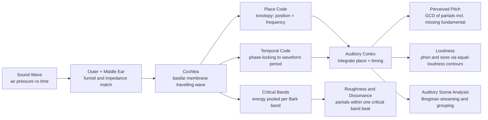

# 🧠 Psychoacoustics and Pitch Perception

> [!abstract] TL;DR
> **Psychoacoustics** studies the gap between the *physics* of a sound wave and the *experience* of hearing it. The cochlea is a mechanical frequency analyzer: it spreads the spectrum out along the **basilar membrane** so that position encodes frequency (**place theory / tonotopy**), while auditory nerve fibres also fire in step with the waveform (**temporal / phase-locking theory**). From these codes the brain constructs **pitch** — and it does so by pattern, not by physics: play only the upper harmonics of a note with **no fundamental** and you still hear the fundamental's pitch (the **missing fundamental** / residue pitch), because the auditory system reads the *spacing* of the partials. The same machinery explains **critical bands** (the roughness basis of dissonance), **loudness** as a logarithmic, frequency-dependent quantity (the **phon** and **sone**, mapped by the **equal-loudness contours**), and **masking** — the fact that a loud tone hides nearby quiet tones, which is exactly what MP3 throws away to compress audio.

## Intuition — analogy FIRST

Think of the inner ear as a **row of tuning forks of graded length** laid out along a corridor. A low rumble sets the long forks at the far end trembling; a bright whistle rattles the short forks near the door. Nobody labels the sound "300 Hz" — instead, *which forks move* and *how hard* becomes a spatial picture of the sound, and the brain reads that picture the way you read a bar chart.

Now the twist that makes pitch *psychological* rather than physical: suppose the forks for 400, 600, 800 and 1000 Hz all rattle, but the 200 Hz fork stays perfectly still. Physically there is no 200 Hz. Yet your brain notices the forks are **evenly spaced 200 Hz apart**, concludes "this is the comb of a 200 Hz note with its bottom rung sawn off," and confidently reports the pitch of 200 Hz anyway. That inference — building the note your ears never received — is the heart of pitch perception, and it is why a tiny phone speaker that cannot move enough air for real bass can still make you hear a bass line.

---

## How It Works

### Core mechanics

1. **Frequency analysis in the cochlea (place code / tonotopy).** The **basilar membrane** is stiff and narrow at the base, floppy and wide at the apex. A pure tone produces a **travelling wave** that peaks at one position — high frequencies near the base, low near the apex. Position along the membrane therefore *is* a frequency axis, preserved all the way to cortex. This is the physiological root of **place theory**: pitch from *where* the peak lands. See [[Auditory_System_and_Sound_Processing]].
2. **Temporal code (phase-locking).** Auditory-nerve fibres fire in a fixed phase of the stimulus waveform. Up to about 4–5 kHz the *timing* of spikes carries a copy of the waveform's periodicity, so the brain can also read pitch from *when* neurons fire, not just *where*. This is **temporal / periodicity theory**; the modern view is a **duplex** model — place dominates high, timing dominates low, and they overlap in the musically important middle.
3. **Pitch is inferred, not measured (missing fundamental / residue pitch).** Present harmonics $2f_0, 3f_0, 4f_0, 5f_0$ with **zero energy at $f_0$**, and the perceived pitch is still $f_0$. Two complementary models explain it: a **spectral / pattern-matching** model (the brain finds the $f_0$ whose harmonic template best fits the partials) and a **temporal / autocorrelation** model (the summed neural firing repeats at period $1/f_0$ because $f_0$ is the greatest common divisor of the partials). Both predict $f_0 = \gcd(2f_0, 3f_0, 4f_0, 5f_0)$.
4. **Critical bands (roughness and dissonance).** The cochlea integrates energy within a **critical band** — a frequency window (roughly 1/3 octave, or the **Bark** unit) around each place. Two partials falling **within one critical band** cannot be resolved; they beat and produce sensory **roughness**. This is the physiological basis of the **Plomp-Levelt** dissonance curve — see [[Intervals_and_Consonance]].
5. **Loudness is logarithmic and frequency-dependent.** Perceived loudness grows roughly with the logarithm of intensity, and the ear is far more sensitive around 2–5 kHz than at the extremes. The **phon** measures loudness *level* (phons = dB SPL of an equally loud 1 kHz tone); the **sone** measures loudness *magnitude* (doubling sones = "twice as loud", where 1 sone ≡ 40 phon). The **equal-loudness contours** (historically **Fletcher-Munson**, now ISO 226) map "how many dB at each frequency sound equally loud."
6. **Masking → data compression.** A loud tone raises the hearing threshold for nearby quieter tones (**simultaneous / frequency masking**) and for tones just before or after it (**temporal masking**). Perceptual codecs (**MP3, AAC, Opus**) compute this masking threshold and simply discard whatever falls below it — inaudible bits you never had to store. See [[Digital_Audio_Fundamentals]].

### Auditory pathway and pitch construction



---

## Key Concepts

### Secondary

- **Pitch** is *how high or low* a sound seems; **loudness** is *how strong*; **timbre** is *tone colour*. All three are perceptions, not knobs on the sound wave — the wave only has frequency, amplitude, and spectrum.
- **The ear is not a ruler.** Equal *musical* steps are equal *ratios*, not equal Hz. Going 100→200 Hz and 200→400 Hz both sound like one octave. Pitch is **logarithmic**; we measure it in **cents** (1200 cents per octave, 100 cents per semitone).
- **Octave equivalence and chroma.** Notes an octave apart (110, 220, 440 Hz — all "A") share a **pitch class** or **chroma**; they sound "the same but higher/lower." Pitch has two dimensions: **height** (which octave) and **chroma** (which note within the octave).
- **We are most sensitive in the mid-range** (about 2–5 kHz — the range of a crying baby and of speech consonants). Very low and very high tones need far more energy to sound equally loud. That is why turning music down makes the bass and treble seem to disappear first.

### Undergraduate

- **Place vs temporal theory.** *Place*: pitch from the location of the basilar-membrane peak (works well for high frequencies where phase-locking fails). *Temporal*: pitch from the periodicity of neural firing (works well below ~5 kHz). The **duplex** view combines them; the **musical pitch ceiling** (~4–5 kHz, roughly the top of a piano) coincides with the loss of phase-locking, strong evidence that timing matters for musical pitch.
- **Missing fundamental / residue pitch.** For a harmonic complex $\{2f_0, 3f_0, 4f_0, \dots\}$, the perceived pitch equals $f_0$, the **greatest common divisor** of the partials — even with $f_0$ absent. Shift *all* partials up by a constant $\Delta$ (making them **inharmonic**) and the perceived pitch shifts slightly (the **pitch shift of the residue** / de Boer's rule), which the pure place theory cannot explain but temporal/pattern models can.
- **Critical bandwidth and the Bark scale.** The cochlea's resolving power is roughly constant on the **Bark** scale (~24 critical bands span hearing). Two tones **more than a critical band apart** are heard as smooth and separate; **within** a band they clash and roughen. This directly predicts why thirds sound rough in the bass (partials crowd into one band) but sweet in the treble.
- **Loudness units.** **Sound pressure level (SPL)** in dB is physical. **Phon** is perceptual loudness *level*: an $X$-phon tone is as loud as an $X$-dB tone at 1 kHz. **Sone** is perceptual loudness *magnitude*, with Stevens' power law $\text{sones} \approx 2^{(\text{phon}-40)/10}$ — every +10 phon roughly doubles perceived loudness.
- **Just-noticeable difference (JND) in pitch.** Trained listeners resolve pitch changes as small as **~5 cents (roughly 0.3%)** in the mid-range — far finer than the 100-cent semitone, which is why fine intonation matters. The JND for *level* is about **1 dB**.
- **The mel scale.** An empirical **perceptual pitch** scale (500 mel ≡ 1000 Hz reference); equal mel steps sound equally spaced. It is near-linear below ~1 kHz and logarithmic above — the basis of the **mel filterbank** in speech features (see [[Mel_Filterbank_MFCCs]]).

### Graduate

- **Autocorrelation and the summary autocorrelogram.** Licklider's **duplex** and Meddis-Hewitt models compute a running **autocorrelation** of each cochlear channel and sum across channels; the lag of the dominant peak gives pitch. This unifies resolved-harmonic (spectral) and unresolved-harmonic (temporal envelope) pitch, and predicts the missing fundamental, the pitch of amplitude-modulated noise, and the existence-region limits.
- **Resolved vs unresolved harmonics and dominance.** Low harmonics (roughly 1–5) are **resolved** by the cochlea into separate places and give a clear, "strong" pitch; high harmonics fall **unresolved** into a single band and give a weaker pitch from the envelope periodicity. The **dominance region** (~500 Hz to 5×$f_0$, harmonics 3–5) contributes most to the perceived pitch of a complex tone.
- **Masking and the excitation pattern.** Frequency masking is modelled as a **spreading function** convolved with the signal's excitation pattern on the Bark axis; the masking skirt is **asymmetric** — a masker masks *upward* in frequency far more than downward (**upward spread of masking**). Perceptual audio coders (MP3/AAC) allocate bits by computing the **global masking threshold** and the **signal-to-mask ratio** per band. See [[Digital_Audio_Fundamentals]].
- **Absolute vs relative pitch.** **Relative pitch** — naming *intervals* — is learnable and near-universal in musicians. **Absolute (perfect) pitch** — naming an isolated note with no reference — is rare, tied to early musical training and to tone-language exposure, and appears to rely on stable long-term *chroma* templates rather than superior peripheral resolution.
- **Auditory scene analysis (Bregman).** The brain segregates the mixture into **streams** using cues: common onset/offset, harmonicity (partials sharing an $f_0$ fuse), common frequency/amplitude modulation, spatial location, and good continuation. This is why you hear a *melody* and an *accompaniment* rather than a single wall of partials, and why a mistuned harmonic "pops out" of a vowel. See [[Auditory_and_Speech_Perception]].
- **Pitch as $\log$ frequency and the cent.** Formally $\text{cents} = 1200\log_2(f_2/f_1)$. The logarithmic map is why the **chroma circle** (a helix of height × angular chroma) is the natural geometry of musical pitch, and why transposition is a *shift* in log-frequency, invariant across register.
- **Nonlinearity of the cochlea.** The healthy cochlea is an **active, nonlinear amplifier** (outer hair cells / cochlear amplifier), giving compressive gain, sharp tuning, **otoacoustic emissions**, and **combination tones** (e.g. the cubic difference tone $2f_1 - f_2$) — audible frequencies the ear itself generates that were never in the stimulus.

---

## Python Demo

```python
# Two psychoacoustic phenomena with numpy + matplotlib only:
#   (a) Equal-loudness contours: a schematic Fletcher-Munson-style family
#       showing that the ear needs MORE dB at low/high frequencies to sound
#       equally loud (peak sensitivity near 3-4 kHz).
#   (b) The missing fundamental: build a tone from harmonics 2,3,4,5 of
#       f0 = 200 Hz (NO energy at 200 Hz). The FFT confirms 200 Hz is absent,
#       yet the autocorrelation peaks at the 5 ms period = 200 Hz, which is
#       exactly the GCD of the partials -> the perceived pitch.

import numpy as np
import matplotlib.pyplot as plt

# -------------------------------------------------------------------
# (a) Schematic equal-loudness contours
# -------------------------------------------------------------------
# Absolute Threshold of Hearing (Terhardt approximation), dB SPL vs kHz.
# This real formula gives the characteristic dip near 3-4 kHz.
def threshold_dB(f_hz):
    k = f_hz / 1000.0
    return (3.64 * k**-0.8
            - 6.5 * np.exp(-0.6 * (k - 3.3)**2)
            + 1e-3 * k**4)

f = np.logspace(np.log10(20), np.log10(16000), 500)   # 20 Hz .. 16 kHz
ath = threshold_dB(f)
ath_1k = threshold_dB(np.array([1000.0]))[0]           # anchor at 1 kHz

# Family of contours: at 1 kHz each contour sits at its phon value (by
# definition); the curve shape flattens as level rises (schematic).
phon_levels = [0, 20, 40, 60, 80]

# -------------------------------------------------------------------
# (b) Missing-fundamental tone
# -------------------------------------------------------------------
f0 = 200.0            # implied (absent) fundamental in Hz
fs = 44100            # sample rate
dur = 0.2             # seconds
t = np.arange(int(fs * dur)) / fs

partials = [2, 3, 4, 5]                 # harmonics present -> 400,600,800,1000 Hz
tone = np.zeros_like(t)
for n in partials:
    tone += np.sin(2 * np.pi * n * f0 * t)
tone /= np.max(np.abs(tone))            # normalise

# Magnitude spectrum via FFT
N = len(tone)
spec = np.abs(np.fft.rfft(tone)) / N
freq = np.fft.rfftfreq(N, 1 / fs)

# FFT-based autocorrelation (fast, O(N log N))
Xf = np.fft.rfft(tone, 2 * N)
acf = np.fft.irfft(Xf * np.conj(Xf))[:N]
acf /= acf[0]                           # normalise so lag 0 == 1
lags_ms = np.arange(N) / fs * 1000.0

# Detect the pitch period: first strong peak after a small dead-zone
search_from = int(fs * 0.001)           # ignore lags < 1 ms
peak_lag = search_from + np.argmax(acf[search_from:int(fs * 0.02)])
detected_hz = fs / peak_lag
gcd_hz = np.gcd.reduce([n * int(f0) for n in partials])

# -------------------------------------------------------------------
# Plot everything
# -------------------------------------------------------------------
fig, ax = plt.subplots(3, 1, figsize=(11, 12))

# (a) Equal-loudness contours
for L in phon_levels:
    flatten = max(0.25, 1 - L / 150.0)          # higher levels are flatter
    spl = L + (ath - ath_1k) * flatten
    ax[0].semilogx(f, spl, label=f"{L} phon")
ax[0].set_title("Schematic Equal-Loudness Contours (Fletcher-Munson style)")
ax[0].set_xlabel("Frequency in Hz  (log scale)")
ax[0].set_ylabel("Sound Pressure Level in dB")
ax[0].axvspan(2000, 5000, color="gold", alpha=0.15,
              label="peak sensitivity 2-5 kHz")
ax[0].legend(loc="upper right", fontsize=8)
ax[0].grid(True, which="both", alpha=0.3)

# (b1) Spectrum of the missing-fundamental tone
ax[1].plot(freq, spec, color="crimson")
ax[1].set_xlim(0, 1300)
ax[1].set_title("Spectrum: harmonics 2,3,4,5 present, fundamental 200 Hz ABSENT")
ax[1].set_xlabel("Frequency in Hz")
ax[1].set_ylabel("Magnitude")
ax[1].axvline(200, color="black", ls="--", lw=1.5)
ax[1].annotate("no energy here\n(200 Hz fundamental missing)",
               xy=(200, 0), xytext=(240, 0.25),
               arrowprops=dict(arrowstyle="->"))
for n in partials:
    ax[1].annotate(f"{n}x = {n*200} Hz", (n * 200, 0.5),
                   textcoords="offset points", xytext=(0, 4),
                   ha="center", fontsize=8)
ax[1].grid(alpha=0.3)

# (b2) Autocorrelation -> perceived pitch lives at 5 ms = 200 Hz
ax[2].plot(lags_ms[:int(fs * 0.02)], acf[:int(fs * 0.02)], color="navy")
ax[2].axvline(1000 / f0, color="black", ls="--", lw=1.5)
ax[2].annotate(f"peak at {peak_lag/fs*1000:.2f} ms = {detected_hz:.0f} Hz",
               xy=(peak_lag / fs * 1000, acf[peak_lag]),
               xytext=(peak_lag / fs * 1000 + 2, 0.6),
               arrowprops=dict(arrowstyle="->"))
ax[2].set_title("Autocorrelation: dominant period = perceived pitch = GCD of partials")
ax[2].set_xlabel("Lag in milliseconds")
ax[2].set_ylabel("Normalised autocorrelation")
ax[2].grid(alpha=0.3)

plt.tight_layout()
plt.show()

print(f"Partials present (Hz): {[n*int(f0) for n in partials]}")
print(f"GCD of partials       : {gcd_hz} Hz  <- what pattern models predict")
print(f"Autocorrelation pitch : {detected_hz:.1f} Hz  <- what the ear hears")
print("The fundamental is absent from the spectrum yet recovered by periodicity.")
```

Running it shows three things at once: (1) the U-shaped equal-loudness curves dipping to their most-sensitive region near 3–4 kHz and rising steeply toward the bass; (2) a spectrum with clean peaks at 400/600/800/1000 Hz and **nothing** at 200 Hz; and (3) an autocorrelation whose first strong peak sits at **5 ms**, i.e. 200 Hz — the greatest common divisor of the partials, and the pitch a listener actually reports.

---

## Real-World Applications

- **MP3 / AAC / Opus compression.** Perceptual codecs run a psychoacoustic model to compute the **masking threshold**, then discard spectral detail that falls below it. Most of the "data" in raw audio is inaudible; masking is why a 128 kbps MP3 can sound transparent. See [[Digital_Audio_Fundamentals]] and [[Spectrograms_Features]].
- **Bass enhancement on small speakers.** Phones, laptops, and earbuds physically cannot reproduce deep bass, so DSP (MaxxBass, "virtual bass") synthesises the *upper harmonics* of the missing low notes and lets the listener's brain reconstruct the fundamental — the missing-fundamental effect sold as a feature.
- **Telephony and voice codecs.** The classic 300–3400 Hz phone band omits the fundamental of most male voices, yet you hear normal-pitched speech: residue pitch fills it in. Modern speech features build directly on perceptual frequency scaling (see [[Mel_Filterbank_MFCCs]]).
- **Loudness normalization (LUFS / ReplayGain).** Streaming platforms match perceived loudness across tracks using frequency-weighted meters derived from equal-loudness contours, so ads and quiet ballads do not jump in level.
- **Hearing aids and cochlear implants.** Aids apply frequency-dependent, compressive gain shaped by equal-loudness data; cochlear implants stimulate electrodes in a **tonotopic** (place) arrangement and use temporal envelope cues to convey pitch.
- **Mixing, mastering, and instrument voicing.** Engineers avoid stacking instruments' partials inside one critical band (muddiness), voice bass-register chords wider than treble ones (critical-band roughness), and trust that intonation errors above the ~5-cent JND will be heard.
- **Concert-hall and product acoustics.** Roughness and masking models predict perceived dissonance and the audibility of noise; "sound design" for cars and appliances tunes spectra against these curves.

---

## Common Pitfalls

- **Confusing frequency with pitch.** Frequency is physical and linear in Hz; pitch is perceptual and **logarithmic**. Always reason in ratios/cents for musical distance — a fixed Hz gap sounds huge in the bass and negligible in the treble.
- **Assuming pitch requires the fundamental.** It does not. Removing $f_0$ barely changes the perceived pitch of a complex tone; the brain reads the **spacing/GCD** of the partials. Do not "detect pitch" by hunting for the lowest spectral peak.
- **Treating loudness as linear or frequency-flat.** +10 dB is not "ten times louder" — it is roughly **twice** as loud (one doubling of sones), and only near 1 kHz do dB and phon coincide. Comparing levels across frequencies without equal-loudness weighting is meaningless.
- **Ignoring critical bands when judging dissonance.** The *same interval* (say a major third) is rough in the bass and smooth in the treble because partial spacing relative to the **critical bandwidth** changes. "Dissonance" is not a fixed property of an interval ratio — see [[Intervals_and_Consonance]].
- **Forgetting masking is asymmetric and time-spread.** A loud tone masks *upward* in frequency more than downward and masks briefly *before* and *after* it in time. Naive spectral thresholds miss both, hurting codec quality and noise-audibility predictions.
- **Over-trusting a single pitch theory.** Pure place theory fails the missing fundamental and pitch-shift-of-the-residue; pure temporal theory struggles above ~5 kHz. Musical pitch needs the **duplex/autocorrelation** view.
- **Equating absolute pitch with better hearing.** Absolute pitch is a *labelling/memory* trait tied to early training, not superior peripheral resolution; most expert musicians rely on excellent **relative** pitch.

---

## Related Concepts

- [[Pitch_and_the_Harmonic_Series]] — supplies the physical partials; this note explains how the ear/brain *turn those partials into a single perceived pitch*, including when the fundamental is missing.
- [[Intervals_and_Consonance]] — critical-band roughness (Plomp-Levelt) is the psychoacoustic mechanism behind why simple-ratio intervals sound consonant and clustered partials sound rough.
- [[Auditory_System_and_Sound_Processing]] — the Neuroscience view of the cochlea, tonotopy, hair cells, and phase-locking that underlie place and temporal pitch codes.
- [[Auditory_and_Speech_Perception]] — the Cognitive Science view: Bregman's auditory scene analysis, streaming, and the missing fundamental in the context of parsing real mixtures.
- [[Mel_Filterbank_MFCCs]] — the mel scale operationalises perceptual (near-log) pitch spacing and critical-band pooling for machine listening and ASR features.
- [[Digital_Audio_Fundamentals]] — sampling/quantization plus the masking-based perceptual coding (MP3/AAC) that this note's masking section justifies.
- [[Spectrograms_Features]] — the time-frequency representation on which excitation patterns, masking thresholds, and pitch tracking are computed.

---

## Review Questions

1. **(Secondary)** When you turn a song's volume way down, the bass and the "air"/treble seem to vanish before the vocals do. Using the idea of equal-loudness contours, explain why the mid-range survives best. Why is a 10 dB boost described as "about twice as loud" rather than "ten times as loud"?
2. **(Undergraduate)** A tone contains energy only at 600, 900, and 1200 Hz. What pitch will a listener report, and why? State the greatest common divisor of the partials, and explain how *both* the spectral pattern-matching model and the temporal autocorrelation model arrive at the same answer. What would happen to the perceived pitch if you shifted all three partials up by 50 Hz, and which model predicts that?
3. **(Graduate)** You are designing an audio codec's bit allocator. Explain how the critical-band structure of the cochlea, the asymmetric spreading of frequency masking, and temporal (pre/post) masking each let you discard information without audible loss. Then explain why the same major-third interval that sounds sweet at the top of the piano sounds muddy in the bass, in terms of critical bandwidth and partial spacing.

---

## Sources

- Brian C. J. Moore, *An Introduction to the Psychology of Hearing*, 6th ed., Brill, 2012.
- Christopher J. Plack, *The Sense of Hearing*, 3rd ed., Routledge, 2018.
- Albert S. Bregman, *Auditory Scene Analysis: The Perceptual Organization of Sound*, MIT Press, 1990.
- R. Plomp and W. J. M. Levelt, "Tonal Consonance and Critical Bandwidth," *Journal of the Acoustical Society of America*, 38(4), 1965.
- ISO 226:2003, *Acoustics — Normal Equal-Loudness-Level Contours* (revised Fletcher-Munson data).
- Juan G. Roederer, *The Physics and Psychophysics of Music: An Introduction*, 4th ed., Springer, 2008.

---

#music-theory #psychoacoustics #pitch-perception #missing-fundamental #critical-band
