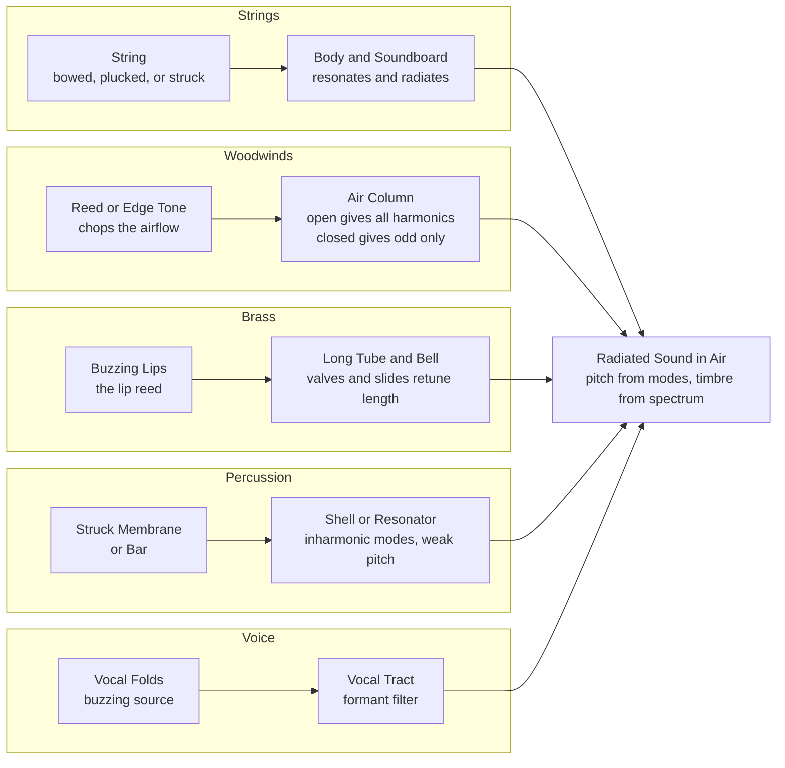

# 🎻 Resonance and Instruments

> [!abstract] TL;DR
> Every musical instrument is a **resonance machine**: an *exciter* dumps a burst of broadband energy into a system, and that system rings loudly only at its **natural frequencies**. Almost all acoustic instruments follow a **source-filter** design — a vibrating source (string, reed, buzzing lips, vocal folds) excites a **resonator** (a soundboard, an air column, or the vocal tract) that selects, amplifies, and colours the sound before radiating it to the air. Whether the resonator supports *all* harmonics (a string or an open pipe) or only the *odd* ones (a closed pipe, i.e. a clarinet) is the difference between a bright buzz and a hollow woody tone — and it is why a clarinet sounds an octave lower than its length suggests.

---

## Intuition

**Analogy first.** Push a child on a swing and let go, then give one small nudge each time the swing returns to you — always at the *same rhythm* the swing already wants to move at. The amplitude builds and builds from tiny pushes. Now try shoving the swing at random, faster-or-slower moments: it lurches, fights you, and never gets going. The swing has one **natural frequency** (set only by the length of the rope), and it responds enormously to energy delivered *at that frequency* and almost not at all to energy delivered off it. That selective, amplitude-multiplying response is **resonance**.

An instrument is a swing with a *whole ladder* of natural frequencies. When a violinist draws a bow across a string, the bow doesn't "play a note" — it injects a messy, broadband scraping of energy. The string, and then the wooden body it is coupled to, respond strongly only at their resonant frequencies (a fundamental and its overtones) and quietly everywhere else. What reaches your ear is not the exciter's mess but the *resonator's preferences*. Change the resonator — trade a bright open flute tube for a stopped clarinet tube, or a taut drumhead for a wooden bar — and you change which frequencies survive, which is to say you change the pitch and the timbre.

---

## How It Works

### Core mechanics

**1. Resonance = a large response at a natural frequency.** Any object with mass and springiness has one or more frequencies at which it "wants" to vibrate. Drive it with a periodic force at one of those frequencies and its oscillation amplitude grows far beyond what the same force would produce off-resonance. How sharp and tall that peak is depends on **damping**: low damping gives a tall, narrow, ringing resonance (a struck wine glass, a tuning fork); high damping gives a broad, shallow, quickly-dying one (a drumhead). The sharpness is summarised by the **Q factor** — high Q means a pure, sustained, pitch-definite tone.

**2. The source-filter model.** Almost every acoustic instrument splits cleanly into two jobs:

- The **source (exciter)** supplies energy and vibrates over a *broad* range: a plucked string flicks the whole overtone ladder into motion; a reed or buzzing lip chops the airflow into a buzzy, harmonic-rich pulse train; the vocal folds do the same for the voice.
- The **filter (resonator)** is a system of standing-wave modes that *selects* which frequencies survive, boosts them, and radiates them. The resonator's mode frequencies set the **pitch**; the *relative strength* it gives each overtone sets the **timbre**.

The heard sound is (source spectrum) shaped by (resonator response). This single idea unifies a violin, a trumpet, and a human vowel.

**3. Standing waves fix the harmonic ladder.** A resonator that is a length of string or a tube of air supports **standing waves** whose allowed wavelengths are fixed by the boundary conditions. This quantises the natural frequencies into a **harmonic series** — the whole reason instruments produce definite pitch:

- **String (fixed at both ends)** and **open pipe (open at both ends):** modes at f, 2f, 3f, 4f, ... — *all* harmonics. Fundamental `f = v / 2L`.
- **Closed pipe (stopped at one end, open at the other):** modes at f, 3f, 5f, 7f, ... — *odd* harmonics only. Fundamental `f = v / 4L`.

Because a closed pipe's fundamental is `v/4L` versus an open pipe's `v/2L`, **a stopped tube sounds an octave lower than an open tube of the same length**, and its missing even harmonics give it a hollow, "woody" timbre. This is the clarinet.

**4. The families, all one model.** Strings, woodwinds, brass, percussion, and the voice are five ways of implementing source + filter (see diagram). What differs is *how* energy is injected and *what* the resonator is.

**5. The body as resonator and radiator.** A bare vibrating string moves almost no air — it is too thin to push on it (an **impedance mismatch**). The string's job is delegated: it drives a **soundboard / body** (guitar top, violin belly, piano soundboard) whose large area couples the vibration efficiently to the air. The body has its *own* resonances (including a **Helmholtz air resonance** of the enclosed cavity venting through the soundhole) that emphasise some frequencies over others — which is why two violins with identical strings sound different. **Sympathetic resonance** is the same physics run backward: an undamped string or a sitar's drone strings will start vibrating on their own when a nearby source hits one of *their* natural frequencies.

### Flow / Architecture



---

## Key Concepts

### Secondary Level

**Instruments ring; they do not just make noise.** When you pluck a string or blow a horn, you feed in a jumble of energy, but the instrument answers back only at its favourite frequencies. That selective, amplifying response is **resonance**, and it is why a violin string stretched over a body is loud and musical while the same string held in your hands is a faint twang.

**Two parts: something that vibrates, and something that resonates.** A guitar string vibrates but is too thin to move much air, so it shakes the wooden **body**, which does the actual pushing on the air. A trumpeter's buzzing lips vibrate, and the **tube** shapes that buzz into a note. This "vibrator plus resonator" pattern — the **source-filter model** — describes nearly every instrument, including your own voice (vocal folds plus throat and mouth).

**The five families.** *Strings* (violin, guitar, piano) — a vibrating string driving a soundboard. *Woodwinds* (flute, clarinet, oboe) — a vibrating air column set going by an air jet or a reed. *Brass* (trumpet, trombone) — a vibrating column driven by buzzing lips, retuned by valves or a slide. *Percussion* (drums, xylophone) — struck skins or bars. *Voice* — vocal folds plus the vocal tract.

**Why drums have fuzzy pitch.** A string's overtones line up in a neat whole-number ladder (f, 2f, 3f), so your ear fuses them into one clear pitch. A drumhead's overtones are *not* whole-number multiples — they are spread at odd ratios — so there is no single frequency for the ear to lock onto. That is why a snare drum has a "thud" rather than a note, while a xylophone bar (specially shaped to tune its overtones) does have a pitch.

### Undergraduate Level

**Standing-wave modes and boundary conditions.** For a string of length `L` fixed at both ends, or a cylindrical pipe *open at both ends*, the allowed standing waves have nodes/antinodes forcing `L = n·(λ/2)`, so `f_n = n·v/(2L)` for n = 1, 2, 3, ... — a **complete harmonic series** (`v` is wave speed on the string or the speed of sound in the pipe). For a pipe *closed at one end* (a pressure antinode at the closed end, a node at the open end), `L = (2m−1)·(λ/4)`, giving `f_m = (2m−1)·v/(4L)` — **odd harmonics only**, with a fundamental one octave below the open pipe of equal length.

**The clarinet is a stopped cylinder.** A clarinet is (acoustically) a cylindrical tube closed at the reed end, so it produces only odd harmonics. Two audible consequences: (1) it sounds roughly an octave lower than a flute (an open tube) of similar length; (2) its overblow register key jumps to the **third harmonic (a twelfth), not the octave** — which is why the clarinet needs many keys to fill the twelfth-wide gap between registers, and why its low "chalumeau" register has that hollow, woody colour. (An oboe and saxophone are *conical* bores, which restores the full harmonic series and the octave overblow, despite also using reeds.)

**Brass and the lip reed.** Brass players buzz their lips as a pressure-controlled valve; the tube's input-impedance peaks lock the buzz onto a member of its harmonic series. A single tube length gives the whole **bugle** series (partials 2, 3, 4, 5, ...), which is why bugle calls use only those notes. **Valves** add tube length (lowering the series) and **slides** vary it continuously, so combinations of the harmonic series and the added lengths fill the chromatic scale.

**Source-filter for the voice, and formants.** The **vocal folds** produce a buzzy pulse train with a harmonic series whose fundamental is the pitch you sing. The **vocal tract** (throat, mouth, lips) is a resonator whose broad resonance peaks — **formants** — boost whichever harmonics fall near them. The pattern of the first two or three formants *is* the vowel: /i/ vs /a/ vs /u/ differ only in tract shape, not in the source pitch. This is the acoustic basis of speech synthesis and vowel identity.

**Q factor and impedance matching.** A resonance's **Q** measures how sharply peaked and long-ringing it is (energy stored divided by energy lost per cycle). High-Q string modes ring for seconds; a heavily damped drumhead is low-Q. The **body/soundboard** exists to solve an **impedance-matching** problem: a thin string is a poor radiator, so its energy is transferred to a large light surface that couples efficiently to air — trading loudness against sustain (a louder instrument radiates its energy faster and rings for less time).

### Graduate Level

**Real strings are inharmonic.** An ideal flexible string has exactly harmonic partials, but a real string has **bending stiffness**, which raises higher partials above their ideal frequency: `f_n ≈ n·f₁·√(1 + B·n²)`, with inharmonicity coefficient B. On a piano this **stretching** is significant, so tuners deliberately use **stretched tuning** — sharpening treble and flattening bass — to make octaves *sound* in tune to partials rather than measure in tune to fundamentals.

**Membrane and bar modes are genuinely inharmonic.** A circular membrane's modes are governed by **Bessel-function zeros**, giving overtone ratios like 1 : 1.59 : 2.14 : 2.30 : 2.65 — non-integer, hence weak pitch. Timpani are engineered (kettle air load, striking point) to suppress the true fundamental and emphasise the 1.5 : 2 : 2.5 : 3 modes, which *do* form a near-harmonic subset around a "missing fundamental", giving them definite pitch. Free bars vibrate as `f_n ∝` (2n+1)²-like ratios (≈ 1 : 2.76 : 5.40); the marimba/xylophone maker **undercuts** the bar to pull the first overtone to a musical interval (an octave or a twelfth) above the fundamental.

**Regeneration and the regime of oscillation.** Sustained tones (bowed strings, reeds, lips, flute edge tones) are **self-sustained nonlinear oscillators**, not driven-linear ones: the resonator's feedback controls the exciter (stick-slip friction for the bow, a pressure-controlled reed valve for the clarinet). The instrument oscillates at a compromise frequency near an **input-impedance peak** of the bore, and the nonlinearity generates the full harmonic spectrum even when individual bore resonances are inharmonic — the resonances must be *aligned* for a stable, strong regime (why a well-made bore has near-harmonically-spaced impedance peaks). Extreme brass playing enters a **shock-wave (brassy) regime** as the wave steepens nonlinearly along the bore.

**Helmholtz resonators.** A rigid cavity of volume `V` venting through a neck of area `A` and effective length `L_eff` resonates at `f = (v/2π)·√(A / (V·L_eff))` — a *single* low resonance independent of standing waves in the cavity. This is the "air mode" of a guitar/violin body (venting through the soundhole/f-holes), the boom of blowing across a bottle, the tuned port of a bass-reflex loudspeaker, and the tuned **bass-trap** in room acoustics.

**Radiation impedance and directivity.** Coupling to air is frequency- and geometry-dependent. A **bell** on a brass instrument is a horn that improves radiation efficiency at high frequencies and makes the sound directional; a soundboard's radiation pattern varies with mode shape. The instrument's *radiated* spectrum therefore differs from its *internal* vibration spectrum — a subtlety that matters for microphone placement and for physically accurate synthesis.

---

## Python Demo

Two ideas in three panels. Panels 1 and 2 compute the resonant-mode ladders of **(a)** an open pipe / vibrating string (all harmonics `f, 2f, 3f, ...`) versus **(b)** a closed pipe / clarinet (odd harmonics only `f, 3f, 5f, ...`), for a tube of the *same length*. This shows two things at once: the closed pipe's fundamental sits an **octave lower**, and its **missing even harmonics** (dotted lines) explain the hollow, woody clarinet timbre. Panel 3 plots the classic **driven-resonance amplitude curve** of a damped oscillator, whose peak sits at the natural frequency and sharpens as damping falls (high Q). numpy and matplotlib only.

```python
import numpy as np
import matplotlib.pyplot as plt

# ---------------------------------------------------------------
# Physical setup: one tube length, compared open vs closed.
# ---------------------------------------------------------------
c = 343.0        # speed of sound in air at ~20 C, in m/s
L = 0.60         # tube / string length in metres

# (a) OPEN pipe or vibrating string: ALL harmonics n = 1,2,3,...
#     fundamental f_open = c / (2L)
f_open      = c / (2 * L)
n_open      = np.arange(1, 11)             # harmonics 1..10
freqs_open  = n_open * f_open              # f, 2f, 3f, ...
amps_open   = 1.0 / n_open                 # 1/n roll-off (typical timbre)

# (b) CLOSED pipe / clarinet: ODD harmonics only n = 1,3,5,...
#     fundamental f_closed = c / (4L) = f_open / 2  (an OCTAVE lower)
f_closed     = c / (4 * L)                 # exactly f_open / 2
n_closed     = np.arange(1, 20, 2)         # 1,3,5,...,19 (odd only)
freqs_closed = n_closed * f_closed         # f, 3f, 5f, ...
amps_closed  = 1.0 / n_closed

# (c) Driven damped resonance: steady-state amplitude vs drive freq.
#     A(w) = 1 / sqrt((w0^2 - w^2)^2 + (2*g*w)^2)
w0 = 1.0                                    # natural (angular) frequency
w  = np.linspace(0.01, 2.5, 800)           # drive frequency sweep
def amplitude(gamma):
    return 1.0 / np.sqrt((w0**2 - w**2)**2 + (2 * gamma * w)**2)

# ---------------------------------------------------------------
# Plot
# ---------------------------------------------------------------
fig, ax = plt.subplots(1, 3, figsize=(16, 4.6))

ax[0].stem(freqs_open, amps_open, basefmt=" ")
ax[0].set_title(f"(a) Open pipe / string\nALL harmonics, f0 = {f_open:.0f} Hz")
ax[0].set_xlabel("Frequency (Hz)")
ax[0].set_ylabel("Relative amplitude (1/n)")
ax[0].set_xlim(0, 3000)
ax[0].grid(True, ls="--", alpha=0.3)

ax[1].stem(freqs_closed, amps_closed, linefmt="C3-", markerfmt="C3o", basefmt=" ")
ax[1].set_title(f"(b) Closed pipe / clarinet\nODD harmonics, f0 = {f_closed:.0f} Hz  (an octave lower)")
ax[1].set_xlabel("Frequency (Hz)")
ax[1].set_xlim(0, 3000)
ax[1].grid(True, ls="--", alpha=0.3)
# dotted lines mark the MISSING even harmonics -> the hollow timbre
for missing in (2 * f_closed, 4 * f_closed, 6 * f_closed, 8 * f_closed):
    ax[1].axvline(missing, color="gray", ls=":", lw=1, alpha=0.6)

for g, col in [(0.05, "C0"), (0.15, "C2"), (0.40, "C1")]:
    ax[2].plot(w, amplitude(g), color=col, lw=1.8, label=f"damping g = {g}")
ax[2].axvline(w0, color="gray", ls="--", lw=1)
ax[2].set_title("(c) Driven resonance\npeak at the natural frequency; sharper = higher Q")
ax[2].set_xlabel("Drive frequency  w / w0")
ax[2].set_ylabel("Steady-state amplitude")
ax[2].legend()
ax[2].grid(True, ls="--", alpha=0.3)

plt.tight_layout()
plt.show()

# ---------------------------------------------------------------
# Numeric takeaways
# ---------------------------------------------------------------
print(f"Open pipe fundamental   : {f_open:6.1f} Hz")
print(f"Closed pipe fundamental : {f_closed:6.1f} Hz   (= f_open / 2, an octave lower)")
print(f"Clarinet overblows to   : {3*f_closed:6.1f} Hz   (3rd harmonic = a twelfth, not an octave)")

# Expected output:
#   * Panel (a): 10 evenly spaced spectral lines at 286, 572, 857, ... Hz.
#   * Panel (b): lines at 143, 429, 715, ... Hz; dotted lines sit where the
#                open pipe HAS energy but the closed pipe does NOT (missing
#                even harmonics -> hollow, woody timbre). Fundamental is an
#                octave below panel (a).
#   * Panel (c): three resonance curves peaking near w/w0 = 1; less damping
#                gives a taller, narrower (higher-Q) peak.
```

---

## Real-World Applications

**Lutherie and instrument design.** Violin makers **tap-tune** the top and back plates to place their body resonances favourably, and adjust the **f-hole/soundhole size** to set the Helmholtz air resonance — literally tuning the filter of the source-filter model. Guitar builders trade a large body (loud, more air coupling) against sustain. Woodwind makers choose bore shape (cylindrical vs conical), toneholes, and the clarinet **register key** to exploit odd-harmonic overblowing at the twelfth.

**Physical-modelling synthesis.** Digital instruments simulate the source-filter chain directly: **Karplus-Strong** and **digital-waveguide** synthesis model a plucked string as an excitation feeding a delay-line resonator; brass and woodwind models couple a nonlinear reed/lip element to a waveguide bore. Faithful timbre comes from getting the resonator's mode structure right.

**Speech technology.** The source-filter model *is* the basis of speech coding and synthesis. **Linear predictive coding (LPC)**, formant synthesisers, and the vocoder stage of modern text-to-speech separate a glottal source from a vocal-tract filter, encoding vowels as formant patterns — see [[TTS_Fundamentals]] and the formant structure visible in [[Spectrograms_Features]].

**Architectural and audio acoustics.** **Helmholtz resonators** are used as tuned **bass traps** and membrane absorbers in studios and concert halls, and as the tuned port in **bass-reflex loudspeakers**. Perforated-panel absorbers are arrays of Helmholtz resonators sized to soak up a target frequency band.

**Engineering cautionary tales.** The same resonance that makes instruments sing destroys structures off the stage: the **Tacoma Narrows Bridge** (1940) and the wobbling **Millennium Bridge** (2000) are resonance failures, and a trained singer can shatter a wine glass by driving it at its high-Q natural frequency — the identical physics as the swing and the string.

---

## Common Pitfalls

- **Confusing the source frequency with the resonant frequency.** The exciter (bow, reed, lips, vocal folds) supplies broadband or buzzy energy; the *resonator* decides the pitch. Change the source excitation and the timbre shifts, but the tube or string length sets the note.
- **Thinking the body "makes" the pitch.** A guitar body, violin belly, or piano soundboard mainly controls **loudness and timbre** (radiation efficiency and which overtones are boosted). The vibrating **string** sets the pitch; the body colours and projects it.
- **Assuming every pipe gives every harmonic.** A pipe **closed at one end** supports **odd harmonics only** and sounds an octave lower than an open pipe of the same length. Forgetting this misexplains the clarinet's register, pitch, and hollow tone.
- **Believing the clarinet overblows at the octave.** It overblows at the **twelfth** (third harmonic), because the even harmonics are absent — which is why clarinet fingering and its wide register break are notoriously awkward. Conical reeds (oboe, sax) overblow the octave instead.
- **Treating drum and bell partials as harmonic.** Membranes (Bessel modes) and bars are genuinely **inharmonic**; their overtones are not integer multiples, which is why their pitch is weak or ambiguous unless the maker deliberately re-tunes the modes.
- **Ignoring string inharmonicity.** Real (stiff) strings have slightly **stretched** partials; assuming perfect harmonicity leads pianos to sound out of tune. Tuners compensate with **stretched tuning**.
- **Modelling self-sustained tones as linear driven oscillators.** Bowed strings and wind reeds are **nonlinear feedback oscillators**; the simple "driven resonance" curve is only a first intuition, not the full mechanism of a sustained note.

---

## Related Concepts

**Music theory context**
- [[Music_Theory_Overview]] — The parent survey; this note zooms into the acoustics half (source, spectrum, timbre) that grounds pitch and harmony.

**Physics of vibration and sound**
- [[Oscillations_and_SHM]] — Driven damped oscillation, resonance, and the Q factor — the exact physics of Panel 3 and of every instrument mode. (Its own alias list even includes "Resonance".)
- [[Wave_Motion_and_Properties]] — Standing waves and boundary conditions that quantise a string or pipe into a harmonic series.
- [[Waves_in_Fluids_and_Acoustics]] — Sound as a pressure wave in air: how pipes resonate and how energy radiates to the listener.

**Spectra and harmonic analysis**
- [[Fourier_Series]] — The mathematics that a periodic tone equals a fundamental plus integer-multiple harmonics; the language of the harmonic ladder in Panels 1 and 2.
- [[Frequency_Spectrum]] — A sound's spectrum is the shape the resonator imposes on the source; timbre *is* that shape.

**Audio and the human voice**
- [[TTS_Fundamentals]] — The source-filter model applied to speech: vocal folds as source, vocal tract as formant filter — the voice as an instrument.
- [[Spectrograms_Features]] — Time-frequency images where harmonics, formants, and inharmonic percussion partials become visible.
- [[STFT_and_Windowing]] — How the evolving spectrum (attack, decay, vibrato) is tracked over time — timbre is dynamic, not static.
- [[Mel_Filterbank_MFCCs]] — Perceptually warped features that summarise instrument and voice timbre for classification.

**Perception**
- [[Auditory_and_Speech_Perception]] — Why a harmonic overtone ladder fuses into one pitch while inharmonic drum partials do not; the missing-fundamental effect that gives timpani their pitch.

---

## Review Questions

### Secondary

1. A flute and a clarinet are close to the same length, yet the clarinet sounds noticeably *lower*. Using the idea of a tube that is open at both ends versus closed at one end, explain why — and explain in plain terms why the clarinet also sounds "hollow" or "woody" compared with the flute.

### Undergraduate

2. A cylindrical tube of length `L = 0.6 m` is played in air (`v = 343 m/s`). (a) Compute the fundamental and the first three overtones if the tube is **open at both ends**, and again if it is **closed at one end**. (b) A clarinettist presses the register key to overblow; to which frequency does the note jump, and what musical interval is that above the fundamental? (c) Explain, in source-filter terms, why the *body* of a violin changes its timbre but not the pitch of a given fingered string.

### Graduate

3. A circular drumhead has overtone frequencies in ratios roughly 1 : 1.59 : 2.14 : 2.30 : 2.65, so it lacks a clear pitch, yet a timpani built on the *same* membrane physics *does* sound a definite note. (a) Explain how the kettle (air load) and the choice of striking point re-weight the modes toward a near-harmonic 1.5 : 2 : 2.5 : 3 series and how the "missing fundamental" percept supplies the heard pitch. (b) Contrast this deliberate mode-tuning with the *undercutting* of a marimba bar. (c) Why is it more accurate to model a sustained bowed string or clarinet reed as a nonlinear self-sustained oscillator locked to a bore impedance peak, rather than as the linear driven resonance of Panel 3?

---

## Sources

- Fletcher, N. H., & Rossing, T. D. (1998). *The Physics of Musical Instruments* (2nd ed.). Springer. — The standard graduate reference on strings, pipes, reeds, membranes, and bars.
- Benade, A. H. (1990). *Fundamentals of Musical Acoustics* (2nd rev. ed.). Dover. — Classic, physically intuitive treatment of woodwind and brass bores and the regime of oscillation.
- Rossing, T. D., Moore, F. R., & Wheeler, P. A. (2002). *The Science of Sound* (3rd ed.). Addison-Wesley. — Accessible undergraduate coverage of resonance, instruments, and the voice.
- Wolfe, J. *Music Acoustics*, University of New South Wales. https://newt.phys.unsw.edu.au/music/ — Peer-quality online resource with impedance measurements for real instruments (clarinet, flute, brass, voice).
- Helmholtz, H. von (1885/1954). *On the Sensations of Tone as a Physiological Basis for the Theory of Music* (A. J. Ellis, trans.). Dover. — Foundational work linking resonance, overtones, timbre, and the source-filter view of the voice.

---

#music-theory #resonance #instruments #acoustics #organology
