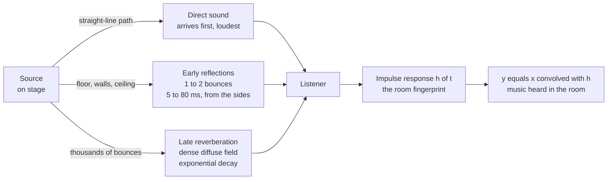

# 🏛️ Room Acoustics and Reverberation

> [!abstract] TL;DR
> A room is a **filter** placed between the instrument and your ear. Every note reaches you first as **direct sound**, then as a handful of distinct **early reflections** off nearby surfaces, and finally as a dense, exponentially decaying **reverberant tail** of thousands of overlapping echoes. The single most important number describing that decay is **RT60** — the time for the sound level to fall by 60 dB after the source stops — predicted by **Sabine's equation** $RT_{60} = 0.161\,V/A$ from the room volume $V$ and its total absorption $A$. The room's complete acoustic "fingerprint" is its **impulse response** $h(t)$; playing music *through* a room is mathematically just **convolving** the dry signal with $h(t)$, which is exactly how convolution reverb plug-ins work.

## Intuition — analogy FIRST

Clap your hands once in a **tiled bathroom or a large stone cathedral**. The sound doesn't stop when your hands stop — it hangs in the air, blooming and slowly fading over a second or more, ringing off the hard walls. Now clap once inside a **carpeted closet full of coats**. The sound is dead, dry, gone almost the instant it started; the soft surfaces swallow it.

Same clap, same ears — the *room* did all the work. In the cathedral the sound bounces thousands of times off hard stone before enough energy is absorbed for you to stop hearing it, so it lingers. In the closet the soft fabric absorbs almost every bounce on contact, so there is nothing left to linger. **Room acoustics is the study of how a space adds this "tail" and "colour" to every sound made inside it — and reverberation is that tail.** A great concert hall is essentially a cathedral tuned so the tail flatters music instead of smearing it into mud.

---

## How It Works

### Core mechanics

1. **Direct sound arrives first.** It travels the straight-line path from source to listener, so it is the first wavefront and the loudest single arrival. It carries the *localization* cue — your brain uses its direction to decide where the source is.
2. **Early reflections follow (roughly 5–80 ms later).** These are sound that bounced **once or twice** off the floor, ceiling, and side walls before reaching you. They arrive as a sparse set of distinct, delayed, attenuated copies of the direct sound. Because they come from the *sides*, they are the main source of the sense of **spaciousness** and hall "width".
3. **The reverberant tail builds and decays.** After enough bounces the reflections become so numerous and so densely spaced in time that they merge into a smooth, statistically **diffuse field** — a random-sounding wash whose energy decays **exponentially**. On a decibel scale exponential decay is a straight downward line; its slope defines RT60.
4. **Energy is lost at every bounce.** Each surface has an **absorption coefficient** $\alpha \in [0,1]$: $\alpha = 0$ is a perfect mirror (bare concrete at low frequency), $\alpha = 1$ is an open window (all energy lost). Soft, porous, thick materials absorb; hard, dense, flat ones reflect. **Diffusers** neither absorb nor reflect specularly — they *scatter* sound in many directions, breaking up echoes while keeping the room live.
5. **Sabine's equation ties it together.** The reverberation time depends only on how big the room is and how absorptive its surfaces are:
$$RT_{60} = \frac{0.161\,V}{A}, \qquad A = \sum_i S_i\,\alpha_i$$
   with $V$ the volume in m³, $S_i$ the area of each surface in m², $\alpha_i$ its absorption coefficient, and $A$ the total absorption in "sabins". The constant $0.161 \approx 24\ln(10)/c$ comes from the speed of sound $c \approx 343$ m/s. **Bigger room → longer tail; more soft material → shorter tail.**
6. **The impulse response is the fingerprint.** Fire one perfect impulse — a starter pistol, a balloon pop, a swept sine — and record everything that comes back. That recording $h(t)$ contains the direct sound, every early reflection, and the whole decaying tail. Because a room is (approximately) a **linear time-invariant** system, the sound of *any* signal $x(t)$ in that room is the convolution $y(t) = x(t) * h(t)$. Measure once, and you can re-apply the room to anything.

### The room as an LTI filter — spatial paths become the impulse response



---

## Key Concepts

### Secondary

- **Reverberation** is the persistence of sound after the source stops, caused by countless reflections off room surfaces. It is *not* the same as **echo**: an echo is a single reflection heard as a distinct, separate repeat (needs roughly 50+ ms of delay); reverb is the smooth blur of many reflections too close together to separate.
- **RT60 (reverberation time)** is how long the sound takes to fade by 60 dB — from loud to effectively silent. A bathroom might be 1 s, a living room 0.4 s, a cathedral 6–10 s, a great symphony hall around 1.8–2.0 s.
- **Absorption vs reflection.** Hard, smooth, heavy surfaces (stone, glass, tile) reflect sound and make a room "live". Soft, porous surfaces (curtains, carpet, foam, people, upholstered seats) absorb sound and make it "dead". An audience is itself a big absorber — halls sound different full versus empty.
- **Why rooms colour sound.** Bass often "booms" in small rooms and untreated bedrooms; certain low notes are much louder than others because of standing waves between parallel walls.

### Undergraduate

- **The three-part impulse response.** Direct sound (single arrival), **early reflections** (sparse discrete arrivals, roughly 5–80 ms, giving spaciousness and apparent source width), and the **late reverberant tail** (dense diffuse field decaying exponentially). The gap between direct sound and the first strong reflection — the **initial time delay gap** — correlates with perceived intimacy in halls.
- **Sabine's equation:** $RT_{60} = 0.161\,V/A$ with $A = \sum_i S_i \alpha_i$ sabins. It assumes a **diffuse field** (sound energy uniform everywhere) and breaks down when absorption is very high or very uneven — then use **Eyring's** correction $RT_{60} = 0.161\,V / \left[-S\ln(1-\bar\alpha)\right]$, which stays finite as $\bar\alpha \to 1$ whereas Sabine wrongly predicts a nonzero tail for an anechoic room.
- **Room modes / standing waves.** Between two parallel walls a distance $L$ apart, resonances sit at $f_n = n\,c/(2L)$ ($n = 1, 2, 3, \dots$). In a rectangular room the full set is
$$f_{n_x n_y n_z} = \frac{c}{2}\sqrt{\left(\frac{n_x}{L_x}\right)^2 + \left(\frac{n_y}{L_y}\right)^2 + \left(\frac{n_z}{L_z}\right)^2}.$$
  At low frequencies these modes are sparse and audible as **bass buildup and nulls** — moving your head can make a bass note jump in loudness. Above the **Schroeder frequency** $f_S \approx 2000\sqrt{RT_{60}/V}$ the modes overlap into a statistically diffuse field and the room behaves "acoustically", not "modally".
- **Flutter echo.** Two hard, parallel, facing walls with nothing between them create a rapid, metallic "boing" or ringing after a transient — sound ping-ponging back and forth at a fixed period. Cured by absorbing or **diffusing** one wall, or by making the walls non-parallel.
- **Convolution = playing through the room.** Because the room is LTI, $y(t) = \int x(\tau)\,h(t-\tau)\,d\tau$. This is the entire theory behind **convolution reverb**: sample a real room's $h(t)$ and convolve any dry track with it to place that track in the space. See [[CT_Convolution]] and [[Impulse_Response]].

### Graduate

- **Clarity vs reverberance — the fundamental hall trade-off.** More reverberation gives **fullness, blend, and richness** (long RT, high late energy), but too much smears fast passages into mud. Clarity is quantified by **C80**, the ratio of early to late energy in decibels:
$$C_{80} = 10\log_{10}\frac{\int_0^{80\,\text{ms}} h^2(t)\,dt}{\int_{80\,\text{ms}}^{\infty} h^2(t)\,dt}.$$
  Positive $C_{80}$ = articulate and clear (good for opera, chamber, speech); negative = enveloping and reverberant (good for late-Romantic symphonic). **Early Decay Time (EDT)**, the RT extrapolated from just the first 10 dB of decay, correlates with *perceived* reverberance better than the full RT60.
- **Why the great shoebox halls sound great.** Vienna's **Musikverein**, Amsterdam's **Concertgebouw**, and Boston's **Symphony Hall** (1900, the first hall ever designed with acoustic science — by Wallace Clement Sabine himself) share a narrow, high, rectangular "shoebox" shape. Narrow width means strong **early lateral reflections** off the side walls, and lateral energy is what the two ears decorrelate into a sense of **envelopment and spaciousness**. Ornate coffered ceilings and statuary act as **diffusers**, scattering sound evenly; a mid-frequency RT near 2.0 s gives Romantic repertoire its bloom. Wide fan-shaped halls, by contrast, send early reflections overhead rather than laterally and often sound less enveloping.
- **Spatial impression splits in two.** **Apparent Source Width (ASW)** comes from *early* lateral reflections; **Listener Envelopment (LEV)** comes from *late* lateral reflections. Both are driven by low **inter-aural cross-correlation (IACC)** — the more different the signals at your two ears, the more spacious it sounds. This is why mono-summed reverb sounds flat and true stereo/lateral reverb sounds "wide".
- **Precedence (Haas) effect.** When a direct sound and a delayed copy arrive within roughly **1–35 ms**, the auditory system **fuses** them into one event and localizes it toward the *first* arrival — even if the delayed copy is up to about 10 dB *louder* (Haas, 1951). Beyond roughly 40–50 ms the copy is heard as a separate **echo**. This is why early reflections enrich rather than confuse, why PA delay towers are time-aligned so the sound still seems to come from the stage, and why reverb makes sound bigger without moving the source.
- **Acoustic treatment maps to physics.** **Porous absorbers** (mineral wool, foam) work by viscous loss and are effective only when their thickness approaches a quarter-wavelength — so a 5 cm panel absorbs highs but ignores bass. **Bass traps** are placed in room *corners* and *tri-corners* where the pressure maxima of every axial mode coincide, giving low-frequency absorbers maximum grip. **Diffusers** (e.g. Schroeder **quadratic-residue diffusers**, built from wells of number-theoretic depths) scatter reflections over a wide angle without deadening the room, preserving liveness while killing flutter and comb filtering.
- **Artificial reverb lineage.** **Spring reverb** (dispersive torsional waves in a coiled spring; Hammond organs, guitar amps) and **plate reverb** (a suspended steel sheet driven by a transducer; the EMT 140, 1957) are electromechanical impulse responses. **Algorithmic reverb** (Schroeder's 1961 recursive networks of **comb + allpass** filters; later the Lexicon 224, EMT 250) synthesizes a dense decaying tail cheaply from feedback delay networks. **Convolution reverb** takes the opposite path: capture a real $h(t)$ and convolve — maximally realistic but tied to one fixed space and computationally heavy (FFT-based partitioned convolution makes it real-time). See [[Digital_Audio_Fundamentals]].

---

## Python Demo

```python
# Model a room impulse response (RIR) from first principles, measure its RT60,
# and hear what it does to a dry sound by convolution.
#   1) synthesize h(t) = direct sound + early reflections + decaying reverb tail
#   2) plot h(t)
#   3) measure RT60 via Schroeder backward integration (the standard method)
#   4) convolve a short dry pluck with h(t) and plot dry vs wet
# numpy + matplotlib only.

import numpy as np
import matplotlib.pyplot as plt

fs = 44100          # sample rate, Hz
c  = 343.0          # speed of sound, m/s

# ---------------------------------------------------------------
# 1) Synthesize a room impulse response
# ---------------------------------------------------------------
dur = 2.5
N   = int(fs * dur)
t   = np.arange(N) / fs
h   = np.zeros(N)

# Direct sound: first wavefront, full amplitude at t = 0
h[0] = 1.0

# Early reflections: a few discrete bounces off nearby surfaces,
# arriving 5 to ~45 ms later, each quieter and alternating in sign
early_ms   = [8, 13, 19, 26, 34, 43]
early_gain = [0.62, -0.51, 0.42, -0.35, 0.30, -0.25]
for tms, g in zip(early_ms, early_gain):
    h[int(fs * tms / 1000.0)] += g

# Late reverberant tail: dense random reflections whose ENVELOPE decays
# exponentially. Pick tau so the target RT60 is about 1.6 s.
#   amp envelope = exp(-t / tau);  level_dB = -8.686 * t / tau
#   -60 dB is reached at t = 6.908 * tau  ->  tau = RT60 / 6.908
rt60_target = 1.6
tau         = rt60_target / 6.908
rng         = np.random.default_rng(0)
tail        = 0.35 * rng.standard_normal(N) * np.exp(-t / tau)
tail[: int(fs * 0.05)] = 0.0        # let the discrete early part stay clean (~50 ms)
h += tail
h /= np.max(np.abs(h))              # normalize peak to 1

# ---------------------------------------------------------------
# 2) Measure RT60 via Schroeder backward integration
#    Energy Decay Curve = reverse cumulative sum of h^2, in dB.
#    Fit the -5 to -35 dB region (T30) and extrapolate to a 60 dB drop.
# ---------------------------------------------------------------
edc    = np.cumsum(h[::-1] ** 2)[::-1]
edc_db = 10.0 * np.log10(edc / edc[0] + 1e-12)

i5   = np.argmax(edc_db <= -5.0)
i35  = np.argmax(edc_db <= -35.0)
slope, intercept = np.polyfit(t[i5:i35], edc_db[i5:i35], 1)   # dB per second
rt60_measured = -60.0 / slope

# Sabine cross-check for an example room: 20 x 15 x 8 m with avg absorption 0.13
Lx, Ly, Lz = 20.0, 15.0, 8.0
V = Lx * Ly * Lz
S = 2 * (Lx*Ly + Ly*Lz + Lx*Lz)
alpha_bar = 0.13
rt60_sabine = 0.161 * V / (S * alpha_bar)

print(f"Measured RT60 (Schroeder T30) : {rt60_measured:.2f} s  (target {rt60_target} s)")
print(f"Sabine RT60 for {V:.0f} m^3 hall : {rt60_sabine:.2f} s")

# ---------------------------------------------------------------
# 3) Dry -> Wet by convolution: apply the room to a short plucked tone
# ---------------------------------------------------------------
f_tone = 440.0
tsig   = np.arange(int(0.06 * fs)) / fs
dry    = np.sin(2 * np.pi * f_tone * tsig) * np.exp(-tsig / 0.02)   # 60 ms pluck
wet    = np.convolve(dry, h)                                        # play through room
wet   /= np.max(np.abs(wet))

# ---------------------------------------------------------------
# Plots
# ---------------------------------------------------------------
fig, ax = plt.subplots(2, 2, figsize=(13, 8))

# (a) Impulse response
ax[0, 0].plot(t[: int(fs * 0.6)] * 1000, h[: int(fs * 0.6)], color="navy", lw=0.7)
ax[0, 0].set_title("Room Impulse Response  h(t)")
ax[0, 0].set_xlabel("Time in milliseconds")
ax[0, 0].set_ylabel("Amplitude")
ax[0, 0].annotate("direct sound", (0, 1.0), xytext=(40, 0.8),
                  arrowprops=dict(arrowstyle="->"), fontsize=9)
ax[0, 0].annotate("early reflections", (20, 0.5), xytext=(60, 0.55),
                  arrowprops=dict(arrowstyle="->"), fontsize=9)
ax[0, 0].annotate("reverberant tail", (300, 0.1), xytext=(300, 0.6), fontsize=9)
ax[0, 0].grid(alpha=0.3)

# (b) Energy decay curve + RT60 fit
ax[0, 1].plot(t, edc_db, color="teal", label="Energy decay curve")
fit_line = slope * t + intercept
ax[0, 1].plot(t, fit_line, "r--", label=f"fit -> RT60 = {rt60_measured:.2f} s")
ax[0, 1].axhline(-60, color="gray", ls=":", label="-60 dB")
ax[0, 1].set_ylim(-80, 2)
ax[0, 1].set_title("Reverberation Time from Schroeder Integration")
ax[0, 1].set_xlabel("Time in seconds")
ax[0, 1].set_ylabel("Decay level in dB")
ax[0, 1].legend(fontsize=8)
ax[0, 1].grid(alpha=0.3)

# (c) Dry signal
td = np.arange(len(dry)) / fs
ax[1, 0].plot(td * 1000, dry, color="darkgreen")
ax[1, 0].set_title("Dry signal  (a 60 ms plucked 440 Hz tone)")
ax[1, 0].set_xlabel("Time in milliseconds")
ax[1, 0].set_ylabel("Amplitude")
ax[1, 0].grid(alpha=0.3)

# (d) Wet signal = dry convolved with the room
tw = np.arange(len(wet)) / fs
ax[1, 1].plot(tw, wet, color="crimson", lw=0.6)
ax[1, 1].set_title("Wet signal  =  dry  *  h(t)   (the room's reverb tail)")
ax[1, 1].set_xlabel("Time in seconds")
ax[1, 1].set_ylabel("Amplitude")
ax[1, 1].grid(alpha=0.3)

plt.tight_layout()
plt.show()
```

The impulse-response plot shows the anatomy clearly: a spike of direct sound, a few discrete early reflections, then the fuzzy exponential tail. The energy-decay-curve plot's straight red line makes RT60 obvious — its slope, extrapolated to a 60 dB drop, recovers the ~1.6 s we built in. The dry pluck is a short, dry blip; the wet version rings on for over a second, blooming and fading exactly like the impulse response — because convolving with $h(t)$ stamps the room's tail onto every sample of the input.

---

## Real-World Applications

- **Concert hall design.** Acousticians target an RT60 near 1.8–2.0 s for symphonic repertoire, shape side walls for strong lateral early reflections, and add ceiling coffers and reliefs as diffusers. Renovations of famous halls are guided by measured impulse responses and metrics like C80, EDT, and IACC.
- **Recording studios and control rooms.** Live rooms are tuned for a pleasant, controlled reverb; control rooms are made "reflection-free" at the mix position with broadband absorption and corner bass traps so engineers hear the recording, not the room.
- **Convolution reverb plug-ins** (Altiverb, Waves IR, Space Designer). They ship libraries of sampled impulse responses from real cathedrals, halls, and vintage plates, then convolve your track with them — the room becomes a file you can load. See [[Digital_Audio_Fundamentals]].
- **Home theatre and hi-fi.** Room-correction systems (Dirac, Audyssey) measure the in-room impulse response, identify modal bass peaks and reflection colouration, then apply inverse EQ and delay to flatten the response at the listening seat.
- **Architectural speech intelligibility.** Classrooms, courts, airports, and houses of worship are designed to a *short* RT60 (roughly 0.6–1.0 s) so consonants are not smeared by the tail; the **STI** speech-transmission index and C50 clarity guide the treatment.
- **Game and VR audio.** Real-time engines simulate room impulse responses (ray/beam tracing, feedback delay networks) so a footstep in a virtual cave reverberates differently from one in a virtual field — spatial reverb is a core immersion cue.
- **Noise control.** Adding absorption to a loud open-plan office, gym, or restaurant lowers RT60 and the reverberant sound-energy build-up, reducing the "din" even though the sources are unchanged.

---

## Common Pitfalls

- **Confusing echo with reverberation.** A single delayed repeat you can count is an **echo** (needs ~50+ ms and the precedence-effect fusion window to be exceeded); the smooth wash of thousands of merged reflections is **reverb**. Flutter echo sits in between — periodic distinct repeats from parallel walls.
- **Trusting Sabine in a dead or lopsided room.** Sabine's formula assumes a **diffuse field** and low-to-moderate absorption. In a heavily treated room or one with all the absorption on one surface it over-predicts RT; use **Eyring** (or measurement) instead. Sabine also wrongly predicts a finite RT for a perfectly anechoic room.
- **Treating only the high frequencies.** Thin foam and cheap panels are quarter-wavelength absorbers, so they kill sibilance and flutter but do **nothing** for boomy bass. That leaves a room that is dead on top and boomy on the bottom. Bass needs thick porous traps or membrane/Helmholtz resonators, placed in corners.
- **Ignoring room modes when placing speakers and seats.** Sitting in a modal null makes bass vanish; sitting in a peak makes it boom. No EQ fully fixes a position-dependent modal problem — move the speakers, the seat, or add bass trapping first.
- **Assuming more reverb always sounds better.** Long RT smears fast music and speech into mush. The right RT depends on use: cathedral organ loves 6 s, a lecture hall needs under 1 s, a mixing room wants it nearly dead.
- **Forgetting the audience is an absorber.** A hall measured empty can have a dramatically longer RT than when full of people and soft clothing. Upholstered seats are chosen to absorb similarly whether occupied or not, keeping the acoustic stable.
- **Comb filtering from a single strong early reflection.** One hard, close reflection (a bare desk, a nearby wall) combines with the direct sound to notch out regularly spaced frequencies — a hollow, phasey colouration. Absorb or diffuse the first reflection points.

---

## Related Concepts

- [[Impulse_Response]] — the room's acoustic fingerprint $h(t)$ *is* the impulse response of an LTI system; measuring a hall with a starter pistol is measuring $h(t)$.
- [[CT_Convolution]] — playing music through a room is convolving the dry signal with $h(t)$; the mathematical engine behind convolution reverb.
- [[Pitch_and_the_Harmonic_Series]] — room modes are standing waves obeying the same boundary-condition physics ($f_n = nc/2L$) that quantizes a string's harmonics.
- [[Digital_Audio_Fundamentals]] — spring, plate, algorithmic, and convolution reverb are all digital/analog realizations of a room's decay applied to a sampled signal.
- [[Waves_in_Fluids_and_Acoustics]] — sound propagation, reflection, and absorption in air is the underlying physics of every bounce inside a room.
- [[Wave_Motion_and_Properties]] — reflection, superposition, and standing waves explain early reflections, flutter echo, and modal buildup.

---

## Review Questions

1. **(Secondary)** You clap once in an empty tiled kitchen and the sound rings for about a second; you then fill the room with people and hang thick curtains and the ring almost disappears. In terms of absorption and reflection, explain what changed. Which room has the longer RT60, and why?
2. **(Undergraduate)** A rectangular hall is 24 m long, 16 m wide, and 10 m high, with an average absorption coefficient of 0.15. (a) Use Sabine's equation to estimate its RT60. (b) The lowest axial mode along the length is at what frequency (use $c = 343$ m/s)? (c) Why do these low modes cause audible "bass buildup" while modes above the Schroeder frequency do not?
3. **(Graduate)** Two proposed symphony halls have identical RT60 of 2.0 s, but Hall A is a narrow shoebox and Hall B is a wide fan shape. Predict which will be judged more "enveloping" by audiences and justify your answer using early lateral reflections, IACC, and the precedence effect. Then explain the clarity-versus-reverberance trade-off using $C_{80}$, and describe how you would treat a control room differently from either hall and why.

---

## Sources

- Wallace Clement Sabine, *Collected Papers on Acoustics*, Harvard University Press, 1922 (origin of the reverberation-time equation and Boston Symphony Hall).
- Leo L. Beranek, *Concert Halls and Opera Houses: Music, Acoustics, and Architecture*, 2nd ed., Springer, 2004.
- Heinrich Kuttruff, *Room Acoustics*, 6th ed., CRC Press, 2016.
- F. Alton Everest and Ken C. Pohlmann, *Master Handbook of Acoustics*, 6th ed., McGraw-Hill, 2015.
- Manfred R. Schroeder, "Natural Sounding Artificial Reverberation," *Journal of the Audio Engineering Society*, 10(3), 1962.

---

#music-theory #room-acoustics #reverberation #rt60 #impulse-response
