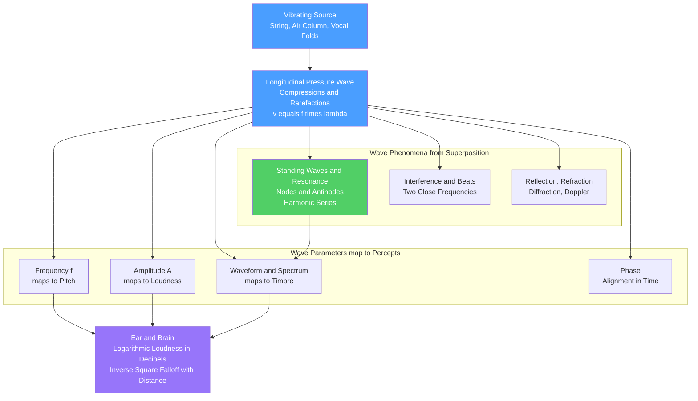

# 🔊 Sound Waves and Acoustics

> [!abstract] TL;DR
> Sound is a **longitudinal pressure wave** — a travelling pattern of compressions and rarefactions in a medium (usually air). Four wave parameters map onto four musical percepts: **frequency → pitch**, **amplitude → loudness**, **waveform/spectrum → timbre**, and **phase → alignment in time**. The wave obeys $v = f\lambda$ with $v \approx 343$ m/s in air, and when it reflects between boundaries it forms **standing waves** whose allowed modes are the **harmonic series** — the acoustic root of every pitched instrument. Loudness perception is **logarithmic**, which is why we measure it in **decibels**, and intensity falls off as $1/r^2$ with distance. Superposition of waves produces **interference, beats, and the Doppler effect**, while **Fourier decomposition** shows any tone is a sum of sinusoids. This note is the physics foundation under everything else in music theory.

## Intuition — analogy FIRST

Line up a hundred people shoulder to shoulder. Shove the person on the left end forward. They bump the next person, who bumps the next, and a **squeeze travels down the line** — even though no single person moves more than a step. Now shove rhythmically, back and forth: a train of squeezes (bunched-up people) and gaps (spread-out people) ripples along the row. That is exactly a **sound wave**. The "people" are air molecules; the squeezes are **compressions** (high pressure), the gaps are **rarefactions** (low pressure), and the whole pattern races outward at the speed of sound while each molecule just jiggles in place. Sound carries **energy and information, not matter** — which is why the squeeze reaches your ear but the air in the room does not fly across it.

Two more everyday facts fall straight out of the analogy. **How fast you shove** sets the **pitch** (shove faster and the squeezes arrive more often — higher frequency, higher note). **How hard you shove** sets the **loudness** (a violent shove makes a big pressure swing — larger amplitude). The whole of acoustics is bookkeeping on those squeezes: how fast, how hard, in what shape, and what happens when they bounce, bend, and overlap.

---

## How It Works

### Core mechanics

1. **A source vibrates.** A plucked string, a buzzing reed, a bowed body, or vocal folds push on the surrounding air, alternately compressing and rarefying it.
2. **The disturbance propagates.** Each parcel of air pushes its neighbour and springs back (air's pressure acts like a restoring force), so the pressure pattern travels outward at speed $v$ **parallel** to its own motion — a **longitudinal** wave. In air at 20 °C, $v \approx 343$ m/s.
3. **Parameters encode the music.** The wave carries a **frequency** $f$ (cycles per second, Hz), an **amplitude** (peak pressure swing), a **waveform** (the shape of one cycle, equivalently its spectrum of harmonics), and a **phase** (where in its cycle it is at a given instant). These four map to pitch, loudness, timbre, and temporal alignment.
4. **$v = f\lambda$ ties space to time.** In one period $T = 1/f$ the wave advances one **wavelength** $\lambda$, so $v = \lambda/T = f\lambda$. High notes have short wavelengths; a 440 Hz A in air spans about 0.78 m.
5. **Boundaries create resonance.** When the wave reflects off the fixed ends of a string or the ends of a pipe, the outgoing and returning waves **superpose**. At special frequencies the reflections reinforce into a **standing wave** with fixed **nodes** (no motion) and **antinodes** (maximum motion). Only a discrete ladder of frequencies fits — the **harmonic series** $f_1, 2f_1, 3f_1, \dots$ — and this is what gives an instrument a definite pitch and timbre.
6. **Perception is nonlinear.** The ear responds to enormous pressure ratios (a jet engine is a trillion times more intense than a whisper), so loudness is coded **logarithmically** and measured in **decibels**.

### Flow / Architecture



---

## Key Concepts

### Secondary Level

**Sound needs a medium.** Sound is vibration passed from molecule to molecule, so it travels through solids, liquids, and gases but **not through a vacuum** — ring a bell inside a jar and pump the air out, and the bell falls silent. Light still gets through; sound does not.

**The four things a wave can vary.**

| Wave property | You hear it as | Everyday example |
|---|---|---|
| Frequency (Hz) | **Pitch** (high vs low) | A whistle vs a tuba |
| Amplitude (pressure swing) | **Loudness** (soft vs loud) | Whisper vs shout |
| Waveform / spectrum | **Timbre** (tone colour) | Flute vs violin, same note |
| Phase | Timing alignment | Two speakers in or out of step |

**Speed of sound and $v = f\lambda$.** Sound travels about **343 m/s** in room-temperature air (faster in water ~1480 m/s, faster still in steel ~5000 m/s). Frequency and wavelength are locked together: $v = f\lambda$. That is why you see the lightning before you hear the thunder — light is almost instant, sound crawls, so counting the seconds and multiplying by 343 m/s gives the distance to the strike.

**Echoes and bending.** Sound **reflects** off hard surfaces (an echo), **bends around** corners and obstacles (**diffraction**, which is why you can hear someone through an open doorway you cannot see them through), and gets **louder as you get closer** to the source.

### Undergraduate Level

**The acoustic wave equation.** For small pressure disturbances $p(x,t)$ in a fluid,
$$\frac{\partial^2 p}{\partial t^2} = v^2\,\frac{\partial^2 p}{\partial x^2}, \qquad v = \sqrt{\frac{\gamma P_0}{\rho}} = \sqrt{\frac{\gamma R T}{M}}.$$
Here $\gamma = C_P/C_V$ (about 1.4 for air), $P_0$ is ambient pressure, $\rho$ is density. Because $v \propto \sqrt{T}$, the speed of sound rises about 0.6 m/s per °C — wind instruments go sharp as they warm up.

**Standing waves and the harmonic series.** Two equal counter-propagating waves add to a standing wave $y = 2A\sin(kx)\cos(\omega t)$. Boundary conditions pick the allowed modes:

| System | Boundary | Allowed frequencies | Harmonics present |
|---|---|---|---|
| String, both ends fixed | node–node | $f_n = n\dfrac{v}{2L}$ | all $n = 1,2,3,\dots$ |
| Pipe, both ends open | antinode–antinode | $f_n = n\dfrac{v}{2L}$ | all $n$ |
| Pipe, one end closed | node–antinode | $f_n = (2n-1)\dfrac{v}{4L}$ | **odd only** |

The closed-pipe rule (odd harmonics only, and a fundamental an octave lower than an open pipe of the same length) is why a stopped organ pipe or a clarinet sounds "hollow" and plays lower than its length suggests. These allowed frequencies **are** the harmonic series — see [[Pitch_and_the_Harmonic_Series]].

**Resonance.** Drive a system at one of its natural frequencies and the amplitude builds up dramatically — this is how a small vibrating reed or lip fills a whole horn with sound, and how a soundboard amplifies a string.

**The decibel scale.** Sound intensity $I$ (power per area) is proportional to the **square** of pressure amplitude. Loudness is expressed logarithmically:
$$\text{SPL} = 10\log_{10}\!\frac{I}{I_0} = 20\log_{10}\!\frac{p}{p_0}\ \text{dB}, \quad I_0 = 10^{-12}\,\text{W/m}^2,\ p_0 = 20\ \mu\text{Pa}.$$
Consequences worth memorising: **+10 dB ≈ twice as loud** (10× the intensity), **+6 dB = double the pressure amplitude**, and **+3 dB = double the intensity**. The log scale exists because the ear spans about **120 dB** of usable range — a factor of $10^{12}$ in intensity — which is impossible to read on a linear ruler (this perceptual compression is the acoustics side of [[Auditory_and_Speech_Perception]]).

**Inverse-square law.** A point source radiating into open space spreads its power over a sphere of area $4\pi r^2$, so $I \propto 1/r^2$. **Doubling the distance drops the level by 6 dB.** Move from 1 m to 10 m and you lose 20 dB.

**Beats.** Two tones $f_1$ and $f_2$ close in frequency superpose into a single tone at the average frequency whose amplitude throbs at the **beat frequency** $f_\text{beat} = |f_1 - f_2|$. Piano tuners listen for these throbs to vanish.

**The Doppler effect.** Relative motion shifts the observed frequency:
$$f' = f\,\frac{v \pm v_\text{observer}}{v \mp v_\text{source}}.$$
An approaching siren is sharp, a receding one flat — the classic "eee-yowww" as it passes.

**The wave phenomena, together.** Superposition gives **interference** (constructive and destructive), boundaries give **reflection** and **standing waves**, a change of medium or temperature gradient gives **refraction** (sound bends toward cooler air, carrying farther at night), and wavelength-scale obstacles give **diffraction** (bass wraps around corners far better than treble).

### Graduate Level

**Deriving the wave equation.** Combine the linearised **continuity** equation, **Euler's** momentum equation, and the **adiabatic** equation of state $p = c^2\rho'$ for small perturbations. Eliminating density and velocity yields $\partial_{tt}p = c^2\nabla^2 p$ with $c^2 = \gamma P_0/\rho_0 = (\partial P/\partial\rho)_S$. The adiabatic (not isothermal) modulus is correct because sound oscillations are too fast for heat to diffuse — Newton's isothermal estimate was 18% low, a discrepancy Laplace fixed with $\gamma$. See [[Waves_in_Fluids_and_Acoustics]] for the fluid-dynamics derivation.

**Acoustic impedance and boundaries.** The **specific acoustic impedance** $Z = \rho c$ (the "stiffness" a wave feels) governs reflection and transmission at interfaces:
$$R = \frac{Z_2 - Z_1}{Z_2 + Z_1}.$$
The huge mismatch between air ($Z \approx 415$ rayl) and water or tissue ($Z \approx 1.5\times10^6$ rayl) means ~99.9% of airborne sound reflects off water — the physics behind impedance-matching horns, the middle ear's ossicles, and ultrasound coupling gel.

**Fourier decomposition is the bridge to timbre.** Any periodic waveform of period $T$ expands as a **Fourier series** — a sum of sinusoids at $f_1, 2f_1, 3f_1, \dots$ with amplitudes $c_n$ and phases $\phi_n$. The set $\{c_n\}$ is the **spectral envelope**, and it is what the ear reads as **timbre**: a sawtooth ($c_n \sim 1/n$, all harmonics) sounds bright and buzzy; a square wave (odd harmonics, $c_n \sim 1/n$) sounds hollow like a clarinet. Non-periodic and transient sounds require the full **Fourier transform**. This is the mathematical link from acoustics to [[Fourier_Series]], [[Frequency_Spectrum]], and [[Fourier_Transform]]; computationally it is done with the [[DFT_and_FFT]].

**Real strings are inharmonic.** Bending stiffness adds a term to the string equation, raising overtone frequencies above exact integers: $f_n \approx n f_1\sqrt{1 + B n^2}$. This **inharmonicity** is why pianos are tuned with **stretched octaves** — the top is tuned sharp and the bottom flat so that the sounding overtones, not the ideal ones, line up.

**Room acoustics.** A room is a 3-D resonator with modal frequencies $f_{lmn} = \tfrac{c}{2}\sqrt{(l/L_x)^2 + (m/L_y)^2 + (n/L_z)^2}$, and its liveness is summarised by **Sabine's reverberation time** $T_{60} = 0.161\,V/(S\bar\alpha)$ (seconds for sound to decay 60 dB), where $V$ is volume, $S$ surface area, and $\bar\alpha$ average absorption. Concert-hall design is largely the art of shaping modes and $T_{60}$.

**Psychoacoustics of loudness.** The decibel is physical; **perceived** loudness follows the **equal-loudness contours** (Fletcher–Munson / ISO 226): the ear is most sensitive around 3–4 kHz and far less so in the bass, so loudness (in **phons** and **sones**) depends on both level and frequency. This is why meters use **A-weighting (dBA)** and why quiet mixes seem to "lose the bass."

**Shock waves.** Push the source past $v$ (Mach 1) and the wavefronts pile into a **Mach cone**; the pressure discontinuity is a sonic boom — the nonlinear, large-amplitude limit where the linear wave equation breaks down.

---

## Python Demo

Four panels build the whole story with **numpy and matplotlib only**: (1) frequency sets pitch, (2) amplitude sets loudness, (3) a standing wave on a fixed–fixed string built by superposing two travelling waves, shown for the first four harmonic modes, and (4) the logarithmic decibel scale versus linear amplitude.

```python
import numpy as np
import matplotlib.pyplot as plt

# ============================================================
# 1 & 2. A SOUND WAVE IS A SINUSOID.
#        frequency -> pitch,   amplitude -> loudness
# ============================================================
fs  = 44100                                    # sample rate (Hz)
dur = 0.02                                      # 20 ms window -> a few cycles
t   = np.linspace(0, dur, int(fs * dur), endpoint=False)

# Frequency sets PITCH: 220 Hz (A3) vs 440 Hz (A4, one octave up), equal amplitude
low_pitch  = np.sin(2 * np.pi * 220 * t)
high_pitch = np.sin(2 * np.pi * 440 * t)

# Amplitude sets LOUDNESS: same 440 Hz, amplitude 1.0 (loud) vs 0.3 (soft)
loud = 1.0 * np.sin(2 * np.pi * 440 * t)
soft = 0.3 * np.sin(2 * np.pi * 440 * t)

# ============================================================
# 3. STANDING WAVE ON A STRING FIXED AT BOTH ENDS.
#    Superpose two equal waves travelling in opposite directions:
#      y1 = A sin(k x - w t),  y2 = A sin(k x + w t)
#      y  = y1 + y2 = 2A sin(k x) cos(w t)
#    Fixed-fixed string length L: mode n has k_n = n*pi/L,  f_n = n*f_1
# ============================================================
L = 1.0
x = np.linspace(0, L, 500)
v = 1.0                                          # wave speed (arbitrary units)

def standing_wave(n, x, t, A=1.0):
    k = n * np.pi / L                            # wavenumber of mode n
    w = v * k                                    # angular frequency
    y1 = A * np.sin(k * x - w * t)               # right-moving travelling wave
    y2 = A * np.sin(k * x + w * t)               # left-moving travelling wave
    return y1 + y2                               # = 2A sin(kx) cos(wt)

snapshot_t = 0.0                                 # snapshot when cos(wt) = 1 (peak)

# ============================================================
# 4. DECIBELS: loudness is LOGARITHMIC in amplitude.
#    Intensity ~ amplitude^2  ->  dB = 20*log10(A/A_ref)
# ============================================================
A_ratio = np.logspace(-4, 0, 300)               # amplitude ratio A/A_ref
dB      = 20 * np.log10(A_ratio)                 # sound level in dB

# ------------------------------------------------------------
# Plot
# ------------------------------------------------------------
fig, ax = plt.subplots(2, 2, figsize=(13, 8))

# Panel 1: frequency -> pitch
ax[0, 0].plot(t * 1000, low_pitch,  color='#1f77b4', label='220 Hz  (A3, low pitch)')
ax[0, 0].plot(t * 1000, high_pitch, color='#d62728', alpha=0.8, label='440 Hz  (A4, high pitch)')
ax[0, 0].set_title('Frequency sets PITCH  (equal amplitude)')
ax[0, 0].set_xlabel('Time (ms)'); ax[0, 0].set_ylabel('Air pressure (rel.)')
ax[0, 0].set_ylim(-1.15, 1.15); ax[0, 0].legend(fontsize=8); ax[0, 0].grid(alpha=0.3)

# Panel 2: amplitude -> loudness
ax[0, 1].plot(t * 1000, loud, color='#2ca02c', label='amplitude 1.0  (loud)')
ax[0, 1].plot(t * 1000, soft, color='#ff7f0e', label='amplitude 0.3  (soft)')
ax[0, 1].set_title('Amplitude sets LOUDNESS  (same 440 Hz pitch)')
ax[0, 1].set_xlabel('Time (ms)'); ax[0, 1].set_ylabel('Air pressure (rel.)')
ax[0, 1].set_ylim(-1.15, 1.15); ax[0, 1].legend(fontsize=8); ax[0, 1].grid(alpha=0.3)

# Panel 3: standing-wave harmonic modes on a fixed-fixed string
colors = ['#1f77b4', '#d62728', '#2ca02c', '#9467bd']
for n, c in zip([1, 2, 3, 4], colors):
    y = standing_wave(n, x, snapshot_t)
    ax[1, 0].plot(x, y, color=c, label=f'mode n={n}   f_{n} = {n} x f_1')
    # mark interior nodes (fixed points of this mode)
    nodes = np.array([j * L / n for j in range(n + 1)])
    ax[1, 0].scatter(nodes, np.zeros_like(nodes), color=c, s=18, zorder=5)
ax[1, 0].axhline(0, color='k', lw=0.6)
ax[1, 0].set_title('Standing Waves on a String Fixed at Both Ends\n'
                   'ends are nodes, mode n has n antinodes -> harmonic series')
ax[1, 0].set_xlabel('Position along string   x / L')
ax[1, 0].set_ylabel('Displacement')
ax[1, 0].legend(fontsize=7); ax[1, 0].grid(alpha=0.3)

# Panel 4: decibels vs linear amplitude
ax[1, 1].plot(A_ratio, dB, color='#8c564b', lw=2)
ax[1, 1].set_xscale('log')
ax[1, 1].set_title('Loudness is LOGARITHMIC\ndB = 20 log10(A / A_ref)')
ax[1, 1].set_xlabel('Amplitude ratio   A / A_ref   (log axis)')
ax[1, 1].set_ylabel('Sound level (dB)')
for ref in (-20, -40, -60):
    ax[1, 1].axhline(ref, color='gray', ls=':', lw=1)
ax[1, 1].grid(which='both', alpha=0.3)

plt.tight_layout()
plt.show()

# ---- Numeric sanity checks -------------------------------------------
c_air = 343.0                                    # speed of sound, air at 20 C (m/s)
print(f"Wavelength of A4 (440 Hz) in air: lambda = v/f = {c_air/440.0:.3f} m")
print(f"Doubling amplitude changes level by 20*log10(2)  = {20*np.log10(2):.2f} dB")
print(f"10x  amplitude changes level by 20*log10(10)     = {20*np.log10(10):.1f} dB")
print(f"Doubling distance (inverse-square) changes level by {10*np.log10(1/4):.1f} dB")

# Expected output:
#   Panel 1: two sines, the 440 Hz curve completing twice as many cycles as 220 Hz.
#   Panel 2: two sines of identical period; one reaches +/-1.0, the other +/-0.3.
#   Panel 3: four mode shapes; mode n crosses zero at n+1 points (the fixed nodes)
#            and has n bellies (antinodes) -> the first four harmonics of the string.
#   Panel 4: a straight line on a log-x axis -> equal amplitude RATIOS give equal dB steps.
#   Printed:  lambda ~ 0.780 m,  +6.02 dB,  +20.0 dB,  -6.0 dB.
```

---

## Real-World Applications

**Instrument design.** Every pitched instrument is a standing-wave machine: string length, tension, and mass set $f_1 = \tfrac{1}{2L}\sqrt{T/\mu}$; a flute is an open pipe, a clarinet a closed pipe (odd harmonics, sounds an octave lower than its length), and brass players select harmonics of a fixed tube with their lips. Bore shape, bell flare, and body resonances sculpt the timbre.

**Concert-hall and studio acoustics.** Sabine's reverberation time, modal spacing, and absorption are engineered so speech stays intelligible and orchestras bloom. Studios add bass traps and diffusers to tame room modes and flutter echoes; the inverse-square law dictates microphone distance and monitor placement.

**Audio engineering and metering.** Mixing consoles, loudness normalisation (LUFS on streaming platforms), and hearing-safety limits (OSHA 85 dBA) all rest on the decibel and equal-loudness contours; A-weighting mirrors the ear's frequency sensitivity.

**Medical and industrial ultrasound.** Imaging exploits impedance mismatch at tissue boundaries to form echoes (coupling gel matches skin to the transducer); Doppler ultrasound reads blood-flow velocity from the frequency shift. The same reflection physics underlies SONAR and non-destructive testing of metal.

**Noise control and prediction.** Highway barriers use diffraction limits, mufflers use destructive interference, and active noise-cancelling headphones synthesise an anti-phase wave in real time — direct engineering of superposition.

---

## Common Pitfalls

- **Thinking air molecules travel with the sound.** They oscillate about fixed positions; only the pressure *pattern* and its energy propagate. The wind in the room is not "the sound moving."
- **Confusing frequency with pitch, or amplitude with loudness.** Frequency, amplitude, and spectrum are *physical*; pitch, loudness, and timbre are *perceptual* and nonlinear. Loudness depends on frequency (equal-loudness contours), and pitch can persist even when the fundamental is missing.
- **Reading decibels as a linear meter.** +10 dB is roughly *twice as loud*, not "10 units more." Because dB is logarithmic, you cannot add sources by adding dB — two identical uncorrelated sources give **+3 dB**, not double the number.
- **Forgetting the inverse-square law only holds for a free field.** In a reverberant room or a waveguide, level does not keep dropping 6 dB per doubling of distance — reflections sustain it.
- **Assuming a closed pipe behaves like an open one.** A tube closed at one end plays an octave lower and produces **odd harmonics only**; treating it as open mis-predicts both pitch and timbre.
- **Ignoring temperature.** Since $v \propto \sqrt{T}$, wind instruments drift sharp as they warm; tuning a cold instrument to a warm one guarantees a clash.
- **Treating real overtones as exact integers.** Stiff strings are inharmonic ($f_n \approx n f_1\sqrt{1+Bn^2}$), which is why pianos need stretched tuning — mathematically perfect harmonics would sound out of tune.

---

## Related Concepts

- [[Pitch_and_the_Harmonic_Series]] — The standing-wave modes derived here *are* the harmonic series; that note turns these frequencies into intervals, consonance, and tuning.
- [[Wave_Motion_and_Properties]] — The general physics of the wave equation, superposition, standing waves, and dispersion that sound is a special case of.
- [[Oscillations_and_SHM]] — Simple harmonic motion is the single vibrating element whose superposition builds every tone and every standing wave.
- [[Waves_in_Fluids_and_Acoustics]] — The fluid-dynamics derivation of the acoustic wave equation, impedance, and pressure-wave propagation.
- [[Interference_and_Diffraction]] — The superposition physics behind beats, room modes, noise cancellation, and sound bending around obstacles.
- [[Fourier_Series]] — Decomposes any periodic waveform into the harmonic amplitudes that the ear perceives as timbre.
- [[Frequency_Spectrum]] — The spectral view where a tone's fundamental and overtones appear as discrete lines.
- [[Fourier_Transform]] — Extends harmonic analysis to transient and non-periodic sounds such as attacks and percussion.
- [[DFT_and_FFT]] — The computational engine that extracts pitch and spectrum from recorded sound.
- [[Auditory_and_Speech_Perception]] — Why loudness is logarithmic, how the ear maps frequency to pitch, and the psychoacoustics of critical bands.
- [[Auditory_System_and_Sound_Processing]] — The neural pathway that turns these pressure waves into perceived sound.

---

## Review Questions

### Secondary

1. A camper sees a lightning flash and hears the thunder 4 seconds later. Roughly how far away was the strike, and why does the sound arrive so much later than the light? Which wave property of the thunder tells you it was a low rumble rather than a high crack?

### Undergraduate

2. A guitar string 0.65 m long is fixed at both ends and its fundamental is 110 Hz (A2). (a) What is the wave speed on the string, and what are the frequencies of the second and third harmonics? (b) The same 110 Hz played on an organ pipe *closed* at one end: how long is the pipe, and which harmonics does it produce? (c) If you now play two strings at 110 Hz and 112 Hz together, what do you hear, and at what rate?

### Graduate

3. The speed of sound is $v = \sqrt{\gamma P_0/\rho}$, the adiabatic result, whereas Newton assumed an isothermal process and got a value ~18% too low. (a) Explain physically why the adiabatic modulus is the correct one for audible sound. (b) A piano string has inharmonicity $f_n \approx n f_1\sqrt{1 + Bn^2}$. Explain qualitatively why this forces "stretched" tuning, and how a tuner decides how much to stretch. (c) Two loudspeakers each produce 70 dB SPL at a listener's position. Why is the combined level 73 dB rather than 140 dB, and under what condition could it instead reach 76 dB?

---

## Sources

- Rossing, T. D., Moore, F. R., & Wheeler, P. A. (2014). *The Science of Sound* (3rd ed.). Pearson. — Standard survey of acoustics, standing waves, decibels, and hearing.
- Fletcher, N. H., & Rossing, T. D. (1998). *The Physics of Musical Instruments* (2nd ed.). Springer. — Definitive treatment of strings, pipes, resonance, and inharmonicity.
- Hall, D. E. (2001). *Musical Acoustics* (3rd ed.). Brooks/Cole. — Accessible bridge from wave physics to music.
- Benson, D. J. (2007). *Music: A Mathematical Offering*. Cambridge University Press. — Rigorous mathematics of vibration, Fourier analysis, and tuning (freely available online).
- Fletcher, H., & Munson, W. A. (1933). "Loudness, its definition, measurement and calculation." *Journal of the Acoustical Society of America*, 5(2), 82–108. — Original equal-loudness contours behind the phon and dBA.

---

#music-theory #acoustics #sound-waves #standing-waves #decibels
