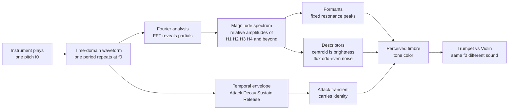

# 🎨 Timbre and the Spectrum

> [!abstract] TL;DR
> **Timbre** ("tone color") is everything that lets you tell a trumpet from a violin when they play the **same pitch at the same loudness**. It is not one number but a bundle of features, and the two biggest are: (1) the **spectrum** — the relative amplitudes of the harmonics/partials, i.e. the recipe of overtones revealed by a **Fourier transform**; and (2) the **temporal envelope** — how the sound is born, sustained, and dies (**ADSR**: attack, decay, sustain, release), where the brief **attack transient** carries most of an instrument's identity. Add **formants** (fixed resonance peaks), **inharmonicity** (bells, drums), and **noise** components, and you have the multidimensional fingerprint that the ear reads as tone color.

## Intuition — analogy FIRST

Play the exact same note — say A3 at 220 Hz — on a trumpet and on a violin, matched for pitch and volume, and nobody confuses them. Why? Think of the note as a **recipe** rather than a single ingredient. Both instruments serve the "flavor" at 220 Hz, but each blends in a different mix of higher **overtones**: the trumpet piles on strong, buzzy upper harmonics (a bright, brassy recipe), while a flute is nearly pure fundamental (a smooth, hollow recipe). Same base note, different seasoning.

But the recipe is only half the story. Record a piano note, then digitally **snip off the first tenth of a second** — the hammer's "thunk" — and play only the ringing part. Most listeners now hear something organ-like and can no longer name the instrument. The **beginning** of a sound — how it attacks and settles — is as much a signature as its overtone mix. Timbre = **which frequencies are present and how loud** (the spectrum) **plus how that sound evolves over time** (the envelope).

---

## How It Works

### Core mechanics

1. A sustained pitched tone is **periodic**, so by Fourier's theorem it equals a sum of sinusoids at the fundamental $f_0$ and integer-multiple **harmonics** $2f_0, 3f_0, \dots$. The *waveform shape* in time and the *set of partial amplitudes* in frequency are two views of one signal (see [[Fourier_Series]], [[Frequency_Spectrum]]).
2. **Timbre lives in the weights.** A sine has energy only at $f_0$ (thin). A sawtooth-like tone has **all** harmonics with amplitude $\sim 1/n$ (bright, buzzy). A square-like tone has **only odd** harmonics $\sim 1/n$ (hollow — this is the clarinet's fingerprint). Same $f_0$, radically different color.
3. Real bodies add **resonances that do not move with pitch** — **formants**. A violin's wooden body, a trumpet's bell, and the human vocal tract each boost fixed frequency bands. Whatever note you sing, the formant peaks stay put; sliding harmonics under fixed formant peaks is what distinguishes the vowels "ee" and "ah".
4. Not everything is a neat integer stack. **Bells, drums, cymbals, and gongs** have **inharmonic** partials — frequencies that are *not* integer multiples of any $f_0$ — giving a metallic, pitch-ambiguous character. Stiff piano strings are slightly inharmonic too.
5. **The envelope is decisive.** The **attack transient** — the chaotic first tens of milliseconds (hammer thunk, bow scratch, breath chiff, pluck click) — is where noise and rapidly shifting partials encode the instrument. **ADSR** (Attack, Decay, Sustain, Release) is the amplitude-over-time contour synthesizers use to model this.
6. We summarize spectra with **descriptors**: the **spectral centroid** (energy-weighted mean frequency) tracks perceived **brightness**; **spectral flux** tracks how fast the spectrum changes; noise energy, odd/even balance, and attack time round out the picture. Because no single axis suffices, timbre is intrinsically **multidimensional**.



---

## Key Concepts

### Secondary

- **Timbre = tone color.** It is the quality that separates a trumpet, violin, flute, and voice **even when they play the identical pitch at identical loudness**. Pitch answers "how high?", loudness answers "how loud?", timbre answers "**what kind of sound?**"
- Every instrument tone is a **fundamental plus a mix of overtones**. The particular mix — which overtones are loud, which are quiet or missing — is that instrument's **sound fingerprint**.
- We describe timbre with words like **bright vs dark**, **warm vs harsh**, **rich vs thin**, **hollow vs full**. "Bright" usually means lots of strong high overtones; "dark" means the high overtones are weak.
- **How a note begins matters as much as its overtones.** A plucked, bowed, struck, or blown start sounds different from the first instant. Remove that beginning (the **attack**) and even familiar instruments become hard to name.

### Undergraduate

- **Spectral basis of timbre.** Decompose a steady tone with a Fourier transform and you get its **line spectrum** — a stem plot of harmonic amplitudes. Timbre is essentially *the shape of that spectrum*. This is the direct musical payoff of [[Fourier_Series]] and the [[DFT_and_FFT]].
- **Harmonic vs inharmonic spectra.** Strings and air columns give near-perfect integer harmonics (**harmonic** spectra → clear single pitch). Bells, drums, and cymbals give **inharmonic** partials (non-integer ratios → metallic, blurred or ambiguous pitch). A church bell's "strike note" is partly a *virtual* pitch inferred from clashing partials.
- **Even vs odd harmonics.** A cylindrical tube closed at one end (clarinet) resonates only at **odd** harmonics $f_0, 3f_0, 5f_0, \dots$, producing a **square-wave-like**, hollow timbre. A conical bore (oboe, saxophone) or open tube (flute) supports **all** harmonics and sounds fuller. Odd-only spectra also explain the clarinet's "woody" low register and its twelfth-overblow.
- **Formants.** Fixed **resonance peaks** of the resonating body or vocal tract that stay at roughly constant frequency regardless of $f_0$. In speech, the pair (F1, F2) defines the vowel; in instruments, body/bore resonances shape the "singer's formant" of a trained voice or the nasal "honk" of a bassoon. Contrast: **harmonics move with pitch; formants do not.**
- **ADSR temporal envelope.** **Attack** (silence → peak), **Decay** (peak → sustain level), **Sustain** (held level while energy is supplied), **Release** (level → silence). A plucked string has a fast attack and no true sustain (immediate decay); a bowed string or organ has a slow attack and a real sustain. The **attack transient** is where noise and unstable partials live and is the single strongest identity cue.
- **The FFT reveals the spectrum.** Apply a window, take the FFT, view magnitude — the peaks land on the harmonics and their heights are the recipe. For **time-varying** timbre use the **short-time Fourier transform** and a spectrogram (see [[STFT_and_Windowing]], [[Spectrograms_Features]]).

### Graduate

- **Timbre is multidimensional.** Grey's (1977) multidimensional-scaling study of listener similarity judgments recovered roughly three perceptual axes: **spectral centroid** (brightness), **spectral flux / spectral fine-structure** (how much the spectrum changes and how "even" it is), and **attack time** (log-attack-time). No scalar captures timbre; it is a point in a feature space.
- **Spectral centroid** (brightness):
  $$ \text{centroid} = \frac{\sum_k f_k\,|X_k|}{\sum_k |X_k|} $$
  the amplitude-weighted mean frequency. Sawtooth-like tones have a high centroid (bright); sines the lowest.
- **Spectral flux** (change rate): the frame-to-frame Euclidean distance between successive magnitude spectra, $\sum_k \big(|X_k^{(t)}| - |X_k^{(t-1)}|\big)^2$ — large at onsets, small during steady sustain. Used for onset detection and to quantify how "alive" a tone is.
- **Noise components.** Breath noise (flute, recorder), bow noise, key clicks, and the pluck's transient are **aperiodic** energy spread across the spectrum. A convincing synthetic instrument needs this noise floor; harmonic content alone sounds sterile.
- **Source–filter model.** Many instruments and the voice factor as an **excitation source** (glottal pulse, reed buzz, string spectrum) passed through a **fixed filter** (vocal tract, body, bore) that imposes formants. The source sets the harmonics; the filter sculpts the envelope. This underpins LPC, vocoders, and formant-preserving pitch shifting.
- **Inharmonicity coefficient.** Stiff strings deviate as $f_n \approx n f_0 \sqrt{1 + B n^2}$; ideal membranes and bars have modal frequencies set by Bessel functions or bar equations, not by $n f_0$ — the mathematical root of "unpitched" percussion.
- **Timbre in synthesis.** **Additive** (sum partials directly), **subtractive** (filter a harmonic-rich source), **FM** (Chowning: modulate one oscillator with another to spawn sidebands), **wavetable**, and **physical modeling** each sculpt spectrum + envelope by different means. FM's genius was generating rich, evolving spectra cheaply.
- **Timbre in MIR.** Music Information Retrieval represents timbre with **MFCCs** (a compact model of the spectral envelope; see [[Mel_Filterbank_MFCCs]]) plus spectral centroid/flux/rolloff/flatness for instrument recognition, genre/mood tagging, and query-by-timbre (see [[Music_Classification_MIR]]).
- **Role of phase.** For steady-state tones, the ear is largely **phase-deaf** (Ohm's acoustic law) — timbre is dominated by the magnitude spectrum. But in **transients** phase relationships matter, which is why time-domain attack modeling is not optional.

---

## Python Demo

```python
# Timbre = spectral content + temporal envelope.
# Synthesize the SAME pitch (220 Hz) with four harmonic "recipes":
#   1) pure sine (fundamental only)
#   2) sawtooth-like (ALL harmonics, amplitude ~ 1/n)  -> bright/buzzy
#   3) square-like   (ODD harmonics only, amplitude ~ 1/n) -> hollow
#   4) clarinet-ish  (odd-dominant with a formant-like weighting)
# For each: plot the waveform AND its FFT magnitude spectrum, and report
# the spectral centroid (brightness). Finally, plot an ADSR envelope.
# numpy + matplotlib only.

import numpy as np
import matplotlib.pyplot as plt

# --- Parameters ---
f0 = 220.0            # fundamental (A3) in Hz
fs = 44100            # sample rate in Hz
dur = 1.0            # seconds of audio for the spectrum
N_H = 20             # harmonics available to the additive engine

t = np.arange(int(fs * dur)) / fs


def additive(f0, t, amps):
    """Sum sinusoids: amps[k] is the amplitude of harmonic (k+1)."""
    sig = np.zeros_like(t)
    for n, a in enumerate(amps, start=1):
        if a != 0.0:
            sig += a * np.sin(2 * np.pi * n * f0 * t)
    # peak-normalize so all timbres are matched in level (loudness fixed)
    return sig / np.max(np.abs(sig))


# --- Four harmonic recipes over harmonics 1..N_H ---
sine_amps = [1.0] + [0.0] * (N_H - 1)
saw_amps  = [1.0 / n for n in range(1, N_H + 1)]                       # all harmonics
sq_amps   = [1.0 / n if n % 2 == 1 else 0.0 for n in range(1, N_H + 1)] # odd only
# clarinet-ish: strong odd harmonics with a mild resonance bump around H3-H5,
# tiny even harmonics, gentle high roll-off
clar_amps = []
for n in range(1, N_H + 1):
    if n % 2 == 1:
        bump = 1.0 if n <= 5 else 0.55        # emphasize low odd partials
        clar_amps.append(bump / (n ** 0.9))
    else:
        clar_amps.append(0.06 / n)            # weak evens (real reeds leak a little)

recipes = [
    ("Sine (H1 only)",        sine_amps),
    ("Sawtooth-like (all H)", saw_amps),
    ("Square-like (odd H)",   sq_amps),
    ("Clarinet-ish (odd + formant)", clar_amps),
]


def mag_spectrum(sig, fs):
    """Windowed FFT magnitude spectrum, normalized to its own peak."""
    w = np.hanning(len(sig))
    X = np.fft.rfft(sig * w)
    mag = np.abs(X)
    mag = mag / np.max(mag)
    freqs = np.fft.rfftfreq(len(sig), 1.0 / fs)
    return freqs, mag


def spectral_centroid(freqs, mag):
    """Amplitude-weighted mean frequency == perceived 'brightness'."""
    return float(np.sum(freqs * mag) / np.sum(mag))


# --- Figure 1: waveform (left) + spectrum (right) for each timbre ---
fig, axes = plt.subplots(len(recipes), 2, figsize=(12, 10))
show_ms = 20.0                                 # milliseconds of waveform to draw
n_show = int(fs * show_ms / 1000.0)
plot_max_hz = 3500.0                           # zoom the spectrum to the audible partials

for row, (name, amps) in enumerate(recipes):
    sig = additive(f0, t, amps)
    freqs, mag = mag_spectrum(sig, fs)
    centroid = spectral_centroid(freqs, mag)

    ax_w = axes[row, 0]
    ax_w.plot(t[:n_show] * 1000, sig[:n_show], color="navy")
    ax_w.set_ylabel("amp")
    ax_w.set_title(f"{name}  |  waveform")
    ax_w.grid(alpha=0.3)
    if row == len(recipes) - 1:
        ax_w.set_xlabel("time in ms")

    ax_s = axes[row, 1]
    mask = freqs <= plot_max_hz
    ax_s.plot(freqs[mask], mag[mask], color="crimson")
    ax_s.set_ylabel("mag")
    ax_s.set_title(f"spectrum  |  centroid = {centroid:.0f} Hz (brightness)")
    ax_s.grid(alpha=0.3)
    if row == len(recipes) - 1:
        ax_s.set_xlabel("frequency in Hz")

    print(f"{name:32s} spectral centroid = {centroid:7.1f} Hz")

fig.suptitle("Same pitch (220 Hz), different timbre = different spectrum", fontsize=13)
fig.tight_layout(rect=[0, 0, 1, 0.97])

# --- Figure 2: ADSR amplitude envelope (the temporal half of timbre) ---
def adsr(fs, attack, decay, sustain_level, sustain_time, release):
    a = np.linspace(0.0, 1.0, int(fs * attack), endpoint=False)
    d = np.linspace(1.0, sustain_level, int(fs * decay), endpoint=False)
    s = np.full(int(fs * sustain_time), sustain_level)
    r = np.linspace(sustain_level, 0.0, int(fs * release))
    return np.concatenate([a, d, s, r])

env = adsr(fs, attack=0.02, decay=0.08, sustain_level=0.6,
           sustain_time=0.5, release=0.25)
te = np.arange(len(env)) / fs

# apply the envelope to the clarinet-ish tone to hear "spectrum x envelope"
tone = additive(f0, np.arange(len(env)) / fs, clar_amps)
shaped = tone * env

fig2, (axe, axt) = plt.subplots(2, 1, figsize=(12, 6))
axe.plot(te, env, color="darkgreen", lw=2)
axe.set_title("ADSR amplitude envelope: Attack, Decay, Sustain, Release")
axe.set_ylabel("amplitude")
axe.grid(alpha=0.3)
axe.annotate("Attack",  xy=(0.01, 0.9), fontsize=9)
axe.annotate("Decay",   xy=(0.05, 0.8), fontsize=9)
axe.annotate("Sustain", xy=(0.35, 0.63), fontsize=9)
axe.annotate("Release", xy=(0.72, 0.3), fontsize=9)

axt.plot(te, shaped, color="purple", lw=0.6)
axt.set_title("Clarinet-ish spectrum x ADSR envelope = a musical note")
axt.set_xlabel("time in seconds")
axt.set_ylabel("amplitude")
axt.grid(alpha=0.3)
fig2.tight_layout()

plt.show()
```

Running it prints rising spectral centroids from the sine (lowest, "darkest") through the sawtooth-like tone (highest, "brightest"), shows the square-like and clarinet-ish spectra with their tell-tale **missing even harmonics**, and draws an ADSR contour. The two ingredients — the **spectrum** (Figure 1) and the **envelope** (Figure 2) — are exactly what "timbre" is made of.

---

## Real-World Applications

- **Synthesizers.** Additive synths (Hammond drawbars) sum partials directly; subtractive synths (Moog) filter a harmonic-rich source; FM synths (Yamaha DX7's electric piano and bells) generate evolving sidebands; wavetable synths (Serum) morph between spectra. Every synth is a machine for sculpting **spectrum + envelope**.
- **Sampling and looping.** Samplers must capture the **attack transient** faithfully — you can loop a steady sustain to save memory, but crop the attack and the instrument loses its identity. This is the direct engineering consequence of "the onset carries the fingerprint."
- **Music Information Retrieval.** Instrument recognition, genre/mood tagging, and "sounds-like" search use timbre features — **MFCCs** plus spectral centroid, flux, rolloff, and flatness — as their front end (see [[Mel_Filterbank_MFCCs]], [[Music_Classification_MIR]]).
- **Perceptual audio codecs.** MP3 and AAC quantize the spectrum according to a psychoacoustic model, discarding partials that are masked by louder neighbors — timbre-aware compression that keeps the tone color while dropping inaudible spectral detail.
- **Voice processing.** Vocoders, Auto-Tune's formant-preserving pitch shift, and TTS all rely on the **source–filter** split: change the source pitch while holding the formant filter so the voice stays natural.
- **Orchestration and mixing.** Composers combine instruments so their spectra fuse into a new color (e.g. flute + clarinet in octaves); mixing engineers ride a "presence" EQ boost (2 to 6 kHz) precisely because that band controls perceived brightness / spectral centroid.

---

## Common Pitfalls

- **Reducing timbre to the spectrum alone.** The steady-state recipe is only half of it — strip the attack and a piano can pass for an organ. Always model **spectrum AND envelope**.
- **Assuming every pitched instrument is harmonic.** Bells, drums, cymbals, and gongs are **inharmonic**; their partials are not integer multiples, which is why they resist a single clear pitch. Analysis code that assumes an $n f_0$ comb will mislabel them.
- **Confusing loudness with brightness.** You can raise the level without touching the spectral centroid. "Bright" is a *spectral* property (strong highs), not a *level* property.
- **Thinking formants move with pitch.** They do the opposite — **formants are fixed** resonances; the harmonics slide underneath them as you change $f_0$. Mixing this up breaks vowel synthesis and formant-preserving pitch shift.
- **Fixating on the steady state.** Onset-blind analysis (only measuring the sustain) throws away the strongest identity cue. Use onset detection / spectral flux and keep the transient.
- **Forgetting to window the FFT.** An un-windowed FFT of a tone smears energy across bins (spectral leakage), hiding the true partial amplitudes — apply a Hann/Hamming window before reading a spectrum (see [[STFT_and_Windowing]]).
- **Overrating phase for steady tones.** For sustained sounds the ear is largely phase-insensitive, so chasing exact phase in additive synthesis wastes effort — but do respect phase in the **attack**.

---

## Related Concepts

- [[Pitch_and_the_Harmonic_Series]] — timbre is the *weighting* of the same harmonic series that pitch is built on; pitch names $f_0$, timbre reads the relative loudness of the partials above it.
- [[Fourier_Series]] — a steady tone's timbre *is* its Fourier line spectrum; the partial amplitudes are the Fourier coefficients.
- [[Frequency_Spectrum]] — the stem/curve of partial magnitudes that timbre analysis reads off.
- [[Fourier_Transform]] — the mathematical bridge from a waveform in time to the spectrum that defines its color.
- [[DFT_and_FFT]] — the algorithm that actually computes an instrument's spectrum from sampled audio.
- [[STFT_and_Windowing]] — captures **time-varying** timbre (attack vs sustain) via short overlapping windowed FFTs.
- [[Spectrograms_Features]] — the 2-D time–frequency picture in which envelope and spectral evolution become visible.
- [[Mel_Filterbank_MFCCs]] — the standard compact model of the spectral envelope used as a timbre feature in MIR and speech.
- [[Music_Classification_MIR]] — uses timbre descriptors (MFCC, centroid, flux) to classify instruments, genre, and mood.

---

## Review Questions

1. **(Secondary)** A trumpet and a flute both play a written A at 220 Hz, matched for loudness, yet you can instantly tell them apart. Name the **two** physical ingredients of timbre that make this possible, and explain in one sentence why cropping the very start of each note makes them harder to identify.
2. **(Undergraduate)** A clarinet's spectrum is dominated by **odd** harmonics. Explain the physical reason (bore shape and boundary conditions) and describe how that shapes its timbre versus an instrument with all harmonics present. Then: given a magnitude spectrum $|X_k|$ at frequencies $f_k$, write the formula for the **spectral centroid** and state what a higher centroid tells you perceptually.
3. **(Graduate)** You are building an automatic **instrument classifier**. Given that timbre is multidimensional, list the time-domain and frequency-domain features you would extract and justify each with respect to a known perceptual axis (brightness, attack, spectral flux/irregularity). Explain why the **attack transient** deserves special treatment, how you would capture **time variation** rather than a single averaged spectrum, and where inharmonic instruments (bells, drums) would break a naive harmonic-comb assumption.

---

## Sources

- Grey, J. M. (1977). "Multidimensional perceptual scaling of musical timbres." *Journal of the Acoustical Society of America*, 61(5), 1270–1277.
- Risset, J.-C., & Wessel, D. L. (1999). "Exploration of Timbre by Analysis and Synthesis." In D. Deutsch (Ed.), *The Psychology of Music* (2nd ed.), Academic Press.
- Rossing, T. D., Moore, F. R., & Wheeler, P. A. (2002). *The Science of Sound* (3rd ed.). Addison-Wesley.
- Peeters, G., Giordano, B. L., Susini, P., Misdariis, N., & McAdams, S. (2011). "The Timbre Toolbox: Extracting audio descriptors from musical signals." *JASA*, 130(5), 2902–2916.
- Sethares, W. A. (2005). *Tuning, Timbre, Spectrum, Scale* (2nd ed.). Springer.

---

#music-theory #timbre #spectrum #fourier #adsr
