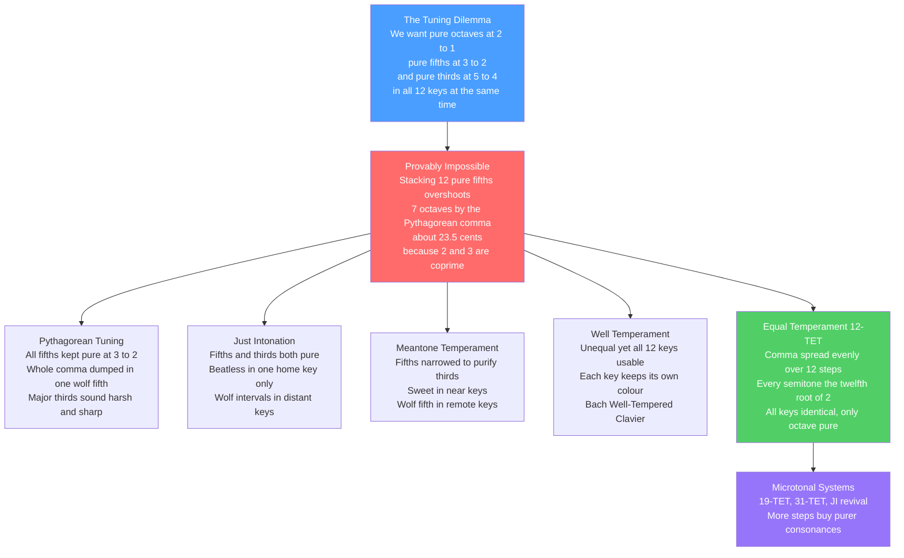

# 🎹 Tuning Systems and Temperament

> [!abstract] TL;DR
> You cannot have **pure octaves**, **pure fifths**, **and twelve equal steps** all at once — the arithmetic simply forbids it. Stacking twelve perfect 3:2 fifths lands about **23.5 cents** (the **Pythagorean comma**) above seven perfect octaves, so the circle of fifths never actually closes. Every tuning system is a different way of *spending* that leftover error. **Pythagorean tuning** keeps fifths pure and sacrifices thirds; **just intonation** makes one key beatless but poisons the rest with **wolf intervals**; **meantone** narrows fifths to sweeten thirds; **well temperament** makes all keys usable but each a distinct colour; and modern **12-tone equal temperament (12-TET)** smears the comma evenly so every semitone is exactly $2^{1/12}$ — all keys identical, but *no* interval except the octave is pure. The piano is a beautiful compromise, not a perfect instrument.

---

## Intuition

**Analogy first — the map that will not tile the globe.** A flat paper map cannot show the round Earth without distortion: you must either stretch the poles (Mercator), shrink the middle, or cut slits. There is no version that keeps *all* distances, *all* angles, and *all* areas correct at once — cartographers simply choose which errors to tolerate for the job at hand. Tuning is exactly this problem in sound. The "globe" is the octave; the "features you want to preserve" are the pure consonances (the fifth 3:2, the third 5:4); and the demand that twelve notes fit evenly into the octave is the demand that the map lie flat. You cannot satisfy everything, so every tuning system is a **projection** — a deliberate choice about *where to hide the unavoidable distortion*.

Another way to feel it: imagine tiling a circular floor with identical square tiles. The tiles (equal semitones) never come back exactly to the start after going around, because the circumference is not a whole number of tile-widths. You can shave every tile a hair (equal temperament), leave one gap that you shove all the leftover into (Pythagorean's "wolf"), or cut a few tiles slightly differently (well temperament). What you cannot do is use perfect, identical tiles *and* close the circle *and* keep every seam pure. That impossibility — not any lack of engineering skill — is the entire subject.

---

## How It Works

### Core Mechanics

1. **Intervals are frequency ratios, and ratios multiply.** Going up an octave multiplies frequency by 2; a perfect fifth by 3:2; a major third by 5:4 (see [[Intervals_and_Consonance]]). To *stack* intervals you **multiply** their ratios. This is why a logarithmic unit — the **cent** — is so useful: it turns multiplication into addition.

2. **The cent is the ruler.** One octave is defined as exactly **1200 cents**, so a cent is $1/1200$ of an octave. In formula form, the size of any ratio $r$ in cents is $1200 \cdot \log_2 r$. A 12-TET semitone is exactly 100 cents; the pure fifth 3:2 is 701.955 cents; the just major third 5:4 is 386.3 cents. The **just-noticeable difference** for trained ears is roughly 3 to 5 cents, so errors of 15 to 25 cents are plainly audible.

3. **The fundamental conflict: 2 and 3 are coprime.** Building notes from pure fifths means multiplying by powers of 3 (and folding back by powers of 2). Building octaves means powers of 2. Because 2 and 3 are distinct primes, **no power of 3 is ever a power of 2** — $3^{12} = 531441$ can never equal $2^{19} = 524288$ (see [[Divisibility_and_Primes]]). They miss by the ratio $531441 / 524288 \approx 1.01364$, the **Pythagorean comma** ($\approx 23.46$ cents). This is why twelve pure fifths overshoot seven octaves. The impossibility is number-theoretic, not practical.

4. **A second comma appears with thirds.** If you build a major third by stacking four pure fifths (C to E via G, D, A), you get $81:64$ (408 cents) — but the *pure* major third from the harmonic series is $5:4$ (386 cents, see [[Pitch_and_the_Harmonic_Series]]). The gap $81:80 \approx 21.5$ cents is the **syntonic comma**. So even fifths and thirds fight each other, not just fifths and octaves.

5. **Every temperament is a distribution scheme.** Since the commas *must* go somewhere, each system decides how to spend them:
   - **Pythagorean:** keep all fifths pure; dump the whole Pythagorean comma into one unusable "wolf" fifth. Thirds come out 22 cents sharp.
   - **Just intonation:** hand-pick pure small-integer ratios for one key. Beatless and gorgeous — but transpose or modulate and wolf intervals bite.
   - **Meantone:** narrow *every* fifth by a fraction of the syntonic comma (quarter-comma meantone narrows each by 1/4 comma) so that thirds become pure or near-pure. Great for close keys, wolf in remote ones.
   - **Well temperament:** distribute the comma *unevenly* so all 12 keys are playable, but each key retains a slightly different character ("key colour"). This is the world of Bach's *Well-Tempered Clavier*.
   - **12-TET:** distribute the Pythagorean comma *perfectly evenly*, making every semitone $2^{1/12}$. All keys become interchangeable; only the octave stays pure.

### Flow / Architecture



---

## Key Concepts

### Secondary Level

**Doubling the frequency gives the "same note" higher — the octave.** Play 220 Hz and 440 Hz and you hear the same letter name (A), an octave apart. The octave, ratio 2:1, is the one interval *every* tuning system keeps perfectly pure, because octave equivalence is baked into how we hear.

**The fifth is the next-most-important interval.** After the octave, the ratio 3:2 (a perfect fifth, like C up to G) is the most consonant and the building block of the **circle of fifths**. If you keep going up by fifths — C, G, D, A, E, B, F#, ... — after twelve steps you *seem* to arrive back at C, seven octaves higher. The catch: you do not quite land on the same note.

**Why the piano can never be perfectly in tune.** The tiny leftover error (the comma) means you must "cheat" somewhere. Modern pianos cheat *everywhere equally*: every semitone is stretched to exactly the same size so you can play in any key. The price is that the piano's thirds and fifths are all very slightly out of tune — you just get so used to it that it sounds normal.

**A cent is a tiny unit of pitch distance.** There are 100 cents in a piano semitone and 1200 in an octave. Humans notice a difference of about 5 cents, so errors of 20-plus cents are clearly audible to attentive listeners.

### Undergraduate Level

**Pythagorean tuning: pure fifths, ugly thirds.** Generate every note by stacking pure 3:2 fifths and folding back into one octave. Fifths are perfect (great for medieval organum), but the resulting major third is $81:64$ (408 cents) — a full syntonic comma (22 cents) sharper than the pure $5:4$. That is why medieval theory treated the third as a *dissonance*: in Pythagorean tuning it genuinely beats.

**Just intonation: pure everything, but only at home.** Choose ratios from the harmonic series: $1/1, 9/8, 5/4, 4/3, 3/2, 5/3, 15/8, 2/1$ for a just major scale. Chords in the home key are **beatless** — the overtones line up exactly. But move to another key and some intervals become badly mistuned (a "wolf"), because the fixed pitches were optimised for one tonic. A cappella choirs and string quartets drift toward just intonation naturally; fixed-pitch keyboards cannot.

**Meantone: trade fifth-purity for third-purity.** Since pure fifths make sharp thirds, deliberately *narrow* each fifth. **Quarter-comma meantone** shrinks every fifth by one-quarter of a syntonic comma, which makes the major thirds *exactly* pure ($5:4$). This dominated European keyboard music roughly 1500-1700. The cost: the "leftover" is concentrated into one horrible **wolf fifth** (usually G# to E-flat), so remote keys are unusable.

**Well temperament: all keys, each with character.** Around 1700, tuners (Werckmeister, Kirnberger, Vallotti) distributed the comma *unevenly but cleverly* so that no wolf remained and every one of the 24 keys could be played. Common keys (C, G, F) stayed closer to pure; remote keys (F#, D-flat) were more tempered and "spicier." This "key colour" is likely part of what Bach exploited in *The Well-Tempered Clavier* (1722) — often misread as a manifesto for *equal* temperament, which it is not.

**12-TET: the modern default.** Define one semitone as the ratio $2^{1/12} \approx 1.05946$. Twelve of them multiply to exactly 2 (a pure octave). The equal-tempered fifth is $2^{7/12} = 1.4983$ — only about 2 cents flat of pure, essentially inaudible. The equal-tempered major third is $2^{4/12} = 1.2599$ — about 14 cents *sharp* of pure, which is quite audible and gives 12-TET thirds their faintly restless beating. Every key is now literally a transposed copy of every other.

### Graduate Level

**The comma bookkeeping.** Two commas govern the whole subject. The **Pythagorean comma** $= 3^{12}/2^{19} = 531441/524288 \approx 23.46$ cents (twelve fifths versus seven octaves). The **syntonic comma** $= 81/80 \approx 21.51$ cents (four fifths versus a pure third-plus-two-octaves). They differ by the tiny **schisma** ($\approx 1.95$ cents), the ratio $32805/32768$. A "regular temperament" is fully specified by how much of a comma is shaved from the generating fifth: 0 gives Pythagorean, $1/11$ of a Pythagorean comma gives 12-TET, $1/4$ of a syntonic comma gives quarter-comma meantone, $1/3$ gives third-comma meantone (pure minor thirds), and $1/6$ gives a milder sixth-comma meantone.

**Equal temperament as an irrational compromise.** 12-TET is the unique 12-note division into *equal* logarithmic steps. Because $2^{n/12}$ is irrational for $n \notin \{0, 12\}$, no 12-TET interval except the octave is a rational ratio — it can approximate small-integer consonances but never *equal* them. This is the deep reason 12-TET can never be "just": you have replaced a lattice of rational numbers (a subgroup of the multiplicative rationals generated by 2, 3, 5) with a cyclic group of order 12. The circle of fifths *literally becomes a circle* (a finite cyclic group $\mathbb{Z}/12$) only under equal temperament; in just intonation it is an infinite non-closing spiral.

**Why 12? Continued fractions.** The remarkable near-closure of twelve fifths is a fact about the continued-fraction convergents of $\log_2(3/2) = 0.58496...$. The convergents give the best rational approximations $7/12, 24/41, 31/53, ...$, which is exactly why **12-TET**, **41-TET**, and **53-TET** are unusually good at representing pure fifths (53-TET's fifth is accurate to a fraction of a cent). The choice of 12 is not arbitrary; it is the smallest division that renders both the fifth and the octave acceptably.

**Microtonal alternatives.** Dividing the octave differently can *beat* 12-TET on specific consonances. **19-TET** yields near-pure minor thirds and is close to third-comma meantone, giving it a warm, gentle character. **31-TET** almost exactly reproduces quarter-comma meantone, so its major thirds are nearly pure — Christiaan Huygens analysed it in 1691, and Adriaan Fokker built keyboards for it. **53-TET** nails both pure fifths and pure thirds (5-limit just intonation) to within a couple of cents. Meanwhile a **just-intonation revival** (Harry Partch's 43-tone scale, Ben Johnston, La Monte Young, spectralists like Grisey) abandons equal steps entirely to chase beatless purity and higher-prime harmonies. These microtonal and alternative tunings are the natural next topic (Microtonality, section S05).

**Consonance is timbre-relative.** Everything above assumes **harmonic** spectra (integer overtones), which makes small-integer ratios line up and beat-cancel. On **inharmonic** instruments — gamelan metallophones, bells, FM-synthesised timbres — the "best" scale is *not* built from simple ratios at all. William Sethares showed you can co-design a spectrum and a scale so that any desired set of intervals sounds consonant. Consonance is therefore a joint property of tuning *and* timbre, not of arithmetic alone.

---

## Python Demo

Three things, numerically. First, compute the twelve chromatic intervals in **Pythagorean tuning**, **5-limit just intonation**, and **12-TET**. Second, plot each system's deviation (in **cents**) from the pure just ratios — the just scale is the zero baseline, and the dotted lines mark the $\pm 21.5$-cent syntonic comma. Third, demonstrate the **Pythagorean comma** directly: stack twelve pure fifths and show they overshoot seven octaves by about 23.5 cents. numpy and matplotlib only.

```python
import numpy as np
import matplotlib.pyplot as plt

# ------------------------------------------------------------------
# Helper: convert a frequency ratio to cents.  1200 cents = 1 octave.
#     cents = 1200 * log2(ratio)
# The logarithm turns interval STACKING (multiplication) into ADDITION.
# ------------------------------------------------------------------
def cents(ratio):
    return 1200.0 * np.log2(ratio)

note_names = ['C', 'C#', 'D', 'D#', 'E', 'F',
              'F#', 'G', 'G#', 'A', 'A#', 'B']

# ------------------------------------------------------------------
# 1. The 12 chromatic intervals as ratios in each system (one octave).
# ------------------------------------------------------------------
# 5-limit Just Intonation -- the "pure" small-integer reference.
just = np.array([1/1, 16/15, 9/8, 6/5, 5/4, 4/3,
                 45/32, 3/2, 8/5, 5/3, 9/5, 15/8])

# Pythagorean tuning -- every note reached by stacking pure 3:2 fifths,
# then folded back into a single octave (powers of 3 over powers of 2).
pyth = np.array([1/1, 256/243, 9/8, 32/27, 81/64, 4/3,
                 729/512, 3/2, 128/81, 27/16, 16/9, 243/128])

# 12-tone Equal Temperament -- every semitone is exactly 2 ** (1/12).
et = 2.0 ** (np.arange(12) / 12.0)

# ------------------------------------------------------------------
# 2. Deviation of each system from the pure just ratios, in cents.
#    (Just intonation is the zero baseline by construction.)
# ------------------------------------------------------------------
dev_pyth = cents(pyth / just)
dev_et   = cents(et   / just)

print("Note   Just(c)   Pyth-dev(c)   ET-dev(c)")
for i, n in enumerate(note_names):
    print(f"{n:>3s}   {cents(just[i]):7.1f}   {dev_pyth[i]:+9.1f}    {dev_et[i]:+8.1f}")

# ------------------------------------------------------------------
# 3. The Pythagorean comma: 12 pure fifths vs 7 pure octaves.
# ------------------------------------------------------------------
twelve_fifths = (3/2) ** 12          # stack twelve perfect fifths
seven_octaves = 2 ** 7               # what should "close the circle"
comma_ratio   = twelve_fifths / seven_octaves
print(f"\n(3/2)**12   = {twelve_fifths:.6f}   =  3**12 / 2**12")
print(f"2**7        = {seven_octaves:.6f}")
print(f"comma ratio = {comma_ratio:.6f}   (would be 1.0 if the circle closed)")
print(f"Pyth. comma = {cents(comma_ratio):.2f} cents  of leftover error")

# Cumulative pitch height while stacking fifths, and the 7-octave grid.
n_fifths    = np.arange(0, 13)
fifth_cents = n_fifths * cents(3/2)          # 701.955 cents per fifth
octave_line = 7 * 1200.0                      # 7 octaves = 8400 cents

# ------------------------------------------------------------------
# Plot
# ------------------------------------------------------------------
fig, ax = plt.subplots(1, 2, figsize=(14, 5))

x = np.arange(12)
w = 0.4
ax[0].bar(x - w/2, dev_pyth, w, label='Pythagorean', color='#d62728')
ax[0].bar(x + w/2, dev_et,   w, label='12-TET',      color='#2ca02c')
ax[0].axhline(0, color='#1f77b4', lw=2, label='Just intonation (baseline)')
ax[0].axhline( 21.5, color='gray', ls=':', lw=1)
ax[0].axhline(-21.5, color='gray', ls=':', lw=1)
ax[0].text(11.4, 22.5, 'syntonic comma', fontsize=7, color='gray', ha='right')
ax[0].set_xticks(x); ax[0].set_xticklabels(note_names)
ax[0].set_ylabel('Deviation from pure just ratio (cents)')
ax[0].set_title('How far each system strays from just intonation')
ax[0].legend(fontsize=8); ax[0].grid(True, axis='y', ls='--', alpha=0.3)

ax[1].plot(n_fifths, fifth_cents, 'o-', color='#d62728',
           label='Cumulative pure fifths')
ax[1].axhline(octave_line, color='#1f77b4', ls='--', lw=2,
              label='7 octaves = 8400 cents')
ax[1].annotate('Pythagorean comma\n~23.5 cent overshoot',
               xy=(12, fifth_cents[-1]), xytext=(6.2, 7250),
               arrowprops=dict(arrowstyle='->', color='black'), fontsize=8)
ax[1].set_xlabel('Number of pure fifths stacked')
ax[1].set_ylabel('Total pitch height (cents)')
ax[1].set_title('12 pure fifths do NOT equal 7 octaves')
ax[1].legend(fontsize=8); ax[1].grid(True, ls='--', alpha=0.3)

plt.tight_layout()
plt.show()

# Expected highlights:
#   * ET fifth (G) is only about -2 cents; ET major third (E) is about +14 cents.
#   * Pythagorean fifth (G) is exactly 0 (pure); its major third (E) is +21.5
#     cents -- landing right on the syntonic-comma dotted line.
#   * Panel 2: the fifth-stacking line ends at 8423.5 cents, ABOVE the
#     8400-cent (7-octave) line -- the 23.5-cent Pythagorean comma made visible.
```

---

## Real-World Applications

**Every modern keyboard, synth, and DAW uses 12-TET.** Digital instruments compute pitch straight from the equal-tempered formula $f = 440 \cdot 2^{(n-69)/12}$ (MIDI note $n$, A4 = 440 Hz). Universal 12-TET is precisely what lets a producer transpose a track to any key and layer instruments built by different makers without re-tuning — the flexibility the comma-spreading buys.

**Historically informed performance re-tunes deliberately.** Ensembles playing Baroque and Renaissance repertoire tune harpsichords and organs to **meantone** or **well temperaments** (Werckmeister III, Vallotti, Kirnberger) because the music was *composed for* those key colours. A Bach prelude in a remote key was meant to sound spicier than one in C; 12-TET erases that intended contrast.

**A cappella groups and string players drift toward just intonation.** Because they have continuous pitch control, choirs, barbershop quartets, and string ensembles instinctively pull thirds and fifths toward beatless pure ratios when a chord is sustained — which is why a well-tuned choral chord can sound "more in tune than a piano." Leading tones, by contrast, are often played *higher* than 12-TET for melodic tension, an expressive intonation that no fixed keyboard allows.

**Electronic and microtonal music exploit alternative divisions.** Composers and instrument builders use **19-TET**, **31-TET**, and pure just intonation for new harmonic colours (Wendy Carlos's non-octave *alpha* and *beta* scales, Harry Partch's 43-tone instruments, spectral composers). Software synths and trackers now expose full **Scala** tuning-file support, making any historical or invented temperament a preset.

**Piano tuning uses stretched octaves.** Real strings are slightly **inharmonic** (their overtones run sharp), so tuners deliberately stretch the octaves — tuning the top notes sharp and the bottom flat relative to strict 12-TET — so the *overtones* line up. This is applied comma management on top of equal temperament, and it is why an electronically "perfect" 12-TET piano sample can sound subtly lifeless.

---

## Common Pitfalls

- **Believing equal temperament is "perfectly in tune."** In 12-TET *every* interval except the octave is detuned from its pure ratio — the major third is a very audible 14 cents sharp. 12-TET is an even *compromise*, not an acoustic ideal. "In tune" and "equal temperament" are not synonyms.
- **Thinking the circle of fifths actually closes.** In pure tuning it is a *spiral*, not a circle: twelve fifths overshoot by the Pythagorean comma. It only becomes a literal closed circle *because* we temper. Drawing it as a neat closed circle is a convenient lie that equal temperament makes true.
- **Adding intervals instead of multiplying ratios.** A fifth plus a fourth is an octave because $\tfrac{3}{2} \times \tfrac{4}{3} = 2$, not $3/2 + 4/3$. Interval math is multiplicative; only after converting to **cents** (a log scale) may you add. Forgetting this is the single most common arithmetic error in tuning.
- **Confusing the two commas.** The **Pythagorean** comma (23.5 cents) is fifths-versus-octaves; the **syntonic** comma (21.5 cents) is fifths-versus-thirds. Meantone tempers away the *syntonic* comma; 12-TET distributes the *Pythagorean* comma. They are close in size but conceptually distinct.
- **Reading Bach's *Well-Tempered Clavier* as "equal-tempered."** "Well-tempered" meant *all keys usable*, which unequal well temperaments already achieved while preserving key colour. Bach almost certainly did not intend modern 12-TET; the title celebrates playability in every key, not equality of every key.
- **Assuming pure ratios are always best.** Small-integer consonance depends on **harmonic** timbres. On inharmonic instruments (bells, gamelan, some synths) the most consonant intervals are *not* simple ratios — consonance is a property of tuning *and* timbre together, not arithmetic alone.

---

## Related Concepts

- [[Intervals_and_Consonance]] — Defines the frequency ratios (octave 2:1, fifth 3:2, third 5:4) that tuning systems try, and fail, to preserve simultaneously; consonance is exactly what temperament trades away.
- [[Pitch_and_the_Harmonic_Series]] — The overtone series is *where the pure ratios come from*; just intonation simply lifts its intervals directly, and the syntonic comma is the gap between the series' third and a stack of fifths.
- [[Scales_and_Modes]] — A tuning system assigns actual frequencies to the scale degrees; the same major scale sounds different in Pythagorean, meantone, or 12-TET.
- [[Functional_Harmony_and_Progressions]] — Free modulation through all 24 keys — the engine of tonal harmony — is only practical *because* equal temperament abolished wolf intervals.
- [[Exponential_and_Logarithmic_Functions]] — The cent is a base-2 logarithm of a ratio, and the equal-tempered semitone is $2^{1/12}$; the whole subject is applied logs and exponentials.
- [[Divisibility_and_Primes]] — The Pythagorean comma exists because 2 and 3 are coprime, so $3^{12}$ can never equal $2^{19}$; the impossibility of perfect tuning is a fact of number theory.
- [[Music_Theory_Overview]] — Places tuning within the broader map of pitch, harmony, and the physics-perception-convention chain.

---

## Review Questions

### Secondary

1. The octave (ratio 2:1) is the one interval that stays perfectly pure in *every* tuning system, yet the piano's fifths and thirds are all slightly out of tune. In plain language, explain why a piano can play in every key but can never be "perfectly in tune," and name the leftover error responsible.

### Undergraduate

2. Using cents $= 1200 \cdot \log_2 r$: (a) compute the size in cents of the 12-TET fifth $2^{7/12}$ and of the pure fifth $3/2$, and state which is larger and by how much. (b) Compute the 12-TET major third $2^{4/12}$ and the pure third $5/4$; by how many cents is the equal-tempered third out, and in which direction? (c) Why does this make 12-TET thirds beat more noticeably than 12-TET fifths?

### Graduate

3. Quarter-comma meantone narrows each fifth by one-quarter of a syntonic comma to make major thirds *exactly* pure. (a) Explain what this buys and what it costs (address the wolf fifth and remote keys). (b) 31-TET closely reproduces quarter-comma meantone while remaining a *closed*, equal division — explain, using the continued-fraction convergents of $\log_2(3/2)$ or of the meantone fifth, why 31 (and also 12, 19, 53) are especially favourable equal divisions. (c) Under what conditions (timbre) would the whole premise — that simple ratios are the most consonant — break down, and what does that imply for choosing a tuning?

---

## Sources

- Barbour, J. Murray (1951). *Tuning and Temperament: A Historical Survey*. Michigan State College Press. — The classic technical-historical catalogue of Pythagorean, meantone, well, and equal systems.
- Helmholtz, H. von (1885/1954). *On the Sensations of Tone as a Physiological Basis for the Theory of Music* (A. J. Ellis, trans.). Dover. — Foundational treatment of consonance, beats, and just intonation; Ellis's appendix introduced the cent.
- Duffin, Ross W. (2007). *How Equal Temperament Ruined Harmony (and Why You Should Care)*. W. W. Norton. — Accessible argument for the expressive losses of 12-TET versus historical temperaments.
- Isacoff, Stuart (2001). *Temperament: How Music Became a Battleground for the Great Minds of Western Civilization*. Alfred A. Knopf. — Narrative history of the centuries-long fight over tuning.
- Sethares, William A. (2005). *Tuning, Timbre, Spectrum, Scale* (2nd ed.). Springer. — Quantitative theory tying consonance to spectrum, and spectrum-scale matching for inharmonic timbres.

---

#music-theory #tuning #temperament #equal-temperament #just-intonation
