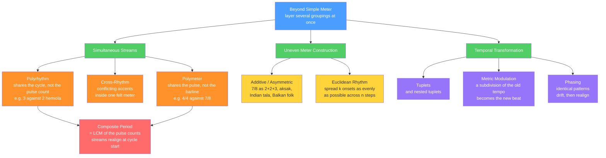

# 🥁 Advanced Rhythm and Polyrhythm

> [!abstract] TL;DR
> Advanced rhythm is what happens when you stop dividing a bar into one set of equal beats and start **layering several independent groupings in time at once**. The core techniques are **polyrhythm** (two or more streams that split the same span into a different number of equal pulses — 3-against-2, 4-against-3), **polymeter** (different bar lengths running simultaneously over a shared pulse), **additive / asymmetric meter** (bars built by *adding* uneven groups, like 7/8 = 2+2+3), plus the transformational tools of **tuplets**, **metric modulation** (retuning the tempo by reinterpreting a subdivision), and **phasing** (identical patterns drifting apart and back). One number governs almost all of it: two interlocking streams only realign — the combined pattern only *repeats* — after the **least common multiple** of their pulse counts. That friction between competing pulses is the engine of West African drumming, Balkan folk, Carnatic konnakol, Reich's process music, and every prog-metal odd-meter riff.

---

## Intuition

**Analogy — two joggers on one circular track.** Send two runners around the same lap, starting together at the start line. Runner A takes exactly **3 equal strides** per lap; Runner B takes exactly **2 equal strides** per lap. Between the start lines their feet almost never hit the ground together — you hear a rolling, interlocking *clatter*, foot-… foot-foot-… foot — but at every start line they slam down in perfect unison again. The **distance between start lines is the composite cycle**, and the number of tiny "stride slots" you'd need to line up both runners exactly is the **least common multiple** of 3 and 2, which is 6. That interlocking-then-realigning feeling *is* a 3-against-2 polyrhythm.

Everything on this page is a variation on that picture. **Polymeter** is two runners with *different lap lengths* on the same track (they only meet after many laps). **Additive meter** is a single runner whose strides are deliberately *unequal* — long, long, short. **Metric modulation** is smoothly handing the stopwatch from one runner to the other mid-race. And **phasing** is two runners doing the identical stride pattern while one *imperceptibly* speeds up, so they slide out of step and eventually lap back into unison. Once you can *feel* the cycle and hear where the streams coincide, none of it is mystical — it is arithmetic you can dance to.

---

## How It Works

The unifying principle is **superimposition of groupings**. Ordinary (simple) meter picks *one* way to carve up time. Advanced rhythm runs *two or more* carvings at once and lives in the tension between them. Because each stream is periodic, the *combined* texture is also periodic — and its period is the **least common multiple (LCM)** of the individual streams. Whenever you cannot "feel" a polyrhythm, the fix is almost always: find the LCM, lay down that fine grid, then place each stream on it.

### Polyrhythm and the composite LCM period

In an **m-against-n** polyrhythm, one voice divides a shared span into *m* equal pulses and another into *n* equal pulses. To see where onsets *can* fall, overlay a fine grid with **LCM(m, n)** subdivisions:

- **3-against-2** (the **hemiola**): LCM is 6. The 3-voice strikes every **2** subdivisions (0, 2, 4); the 2-voice strikes every **3** (0, 3). Inside the cycle they **coincide only at 0**, then realign at subdivision 6 — the cycle boundary. The hemiola is everywhere: Baroque cadences, Chopin waltzes, and the 6/8-vs-3/4 shimmer of Latin music. Musicians memorize it with the mnemonic phrase **"hot-cup-of-tea."**
- **4-against-3**: LCM is 12. The 4-voice hits 0, 3, 6, 9; the 3-voice hits 0, 4, 8 — a denser interlock with *more* offbeats before they lock back up. Mnemonic: **"pass-the-god-damn-but-ter."**

The takeaway: the *combined* pattern repeats after **LCM(m, n)** grid units. Bigger, coprime pulse counts (5-against-4, 7-against-3) produce longer, more "impossible"-sounding cycles precisely because their LCM is large.

### Three ways to layer — cross-rhythm, polyrhythm, polymeter

These three are constantly confused; the distinction is *what is shared*:

1. **Cross-rhythm** — one governing meter and downbeat, but a figure whose *accents* imply a **contradicting grouping** (e.g., accenting every 3rd eighth inside a 4/4 bar). The conflict is *within* a single felt meter.
2. **Polyrhythm** — two genuinely **independent pulse streams** sound at once, each internally steady, **sharing the cycle (barline)** but not the pulse count.
3. **Polymeter** — two different **meters with different bar lengths** run simultaneously over the **same pulse (unit)**. A part in 4/4 against a part in 7/8 at the same eighth-note share the eighth but not the barline; their downbeats drift and only realign after **LCM(8, 7) = 56 eighths**. (If the two parts also ran at genuinely different *tempi*, that would be **polytempo**, a further step.)

Memory hook: **polymeter shares the pulse, not the barline; polyrhythm shares the barline, not the pulse count.**

### Additive / asymmetric meter

Instead of dividing a bar into *equal* beats, build it by **adding unequal groups** of a common short pulse (usually the eighth): **7/8 = 2+2+3**, **5/8 = 2+3** or **3+2**, **9/8 = 2+2+2+3** (note: *not* compound 3+3+3). The felt beats are now **unequal in length** — long and short beats alternate, a gait the Balkans call **aksak** ("limping"). Beaming and accent must *show* the grouping, or players cannot read the meter. In the Indian **tala** system, cyclic time is grouped similarly: **Rupak tal** is 7 as 3+2+2, **Jhaptal** is 10 as 2+3+2+3, **Teental** is 16 as 4+4+4+4.

### Transformations in time — tuplets, metric modulation, phasing

- **Tuplets** squeeze an irregular number of equal notes into a duration that normally holds a different number (a **triplet** = 3 in the space of 2; a **quintuplet** = 5 in the space of 4). **Nested tuplets** put a tuplet *inside* a tuplet to reach very fine, irrational-feeling subdivisions.
- **Metric modulation** (tempo modulation) changes tempo by a **precise rational ratio**: a subdivision of the *old* tempo is reinterpreted as the *beat* of the *new* tempo, keeping one note value constant across the seam. Elliott Carter systematized it — e.g., "the triplet-eighth of quarter = 120 becomes the eighth of the new tempo," yielding an exact 3:2 tempo jump.
- **Phasing** (Steve Reich): two performers play the **same** repeating pattern while one drifts microscopically faster, sliding through every alignment before locking back into unison — process, not notation.



---

## Key Concepts

### Secondary (school-level intuition)
- **Two rhythms at once.** Clap 3 evenly in one hand and 2 evenly in the other over the same beat; they hit together only at the start of each cycle. That is a polyrhythm.
- **Odd meters exist.** Some music counts in 5s and 7s instead of 4s — Dave Brubeck's *Take Five* is in 5, Pink Floyd's *Money* is in 7 — and the beats can be **unequal** (long-short).
- **Off-beat accents.** Deliberately stressing weak spots (syncopation) and starting a pattern late (displacement) are what make grooves feel funky rather than square.

### Undergraduate (music-theory rigor)
- **Computing a polyrhythm.** For **m-against-n**, lay a grid of **LCM(m, n)** subdivisions; voice A strikes every LCM/m units, voice B every LCM/n units; the composite pattern repeats after the full LCM. Hemiola (3:2) and 4:3 are the everyday cases.
- **Cross-rhythm vs polyrhythm vs polymeter.** Share the meter but fight its accents (cross-rhythm); share the cycle but not the pulse count (polyrhythm); share the pulse but not the bar length (polymeter). Polytempo is different tempi entirely.
- **Additive meter and beaming.** 5/8, 7/8, 9/8 grouped as sums of 2s and 3s (aksak); notation must beam to reveal the groups. Distinguish **additive** 9/8 (2+2+2+3) from **compound** 9/8 (3+3+3).
- **Tuplets.** *n*-in-the-space-of-*m*; irregular divisions and **nested tuplets** for fine subdivision.
- **Metric modulation.** Pivot on a shared note value so the tempo changes by an exact ratio; the seam is *proportional*, not approximate.
- **Displacement and phasing.** Shifting a motif by a fixed number of pulses; continuous phasing (Reich, *Piano Phase*) vs discrete displacement (Reich, *Clapping Music*, one eighth per cycle).

### Graduate (research / advanced)
- **Euclidean rhythms (Toussaint).** Distributing **k** onsets as evenly as possible among **n** pulses is computed by the **Euclidean algorithm** applied to k and n−k. The catalog **E(k, n)** reproduces a startling number of world rhythms: **E(3, 8)** = the Cuban tresillo, **E(5, 8)** = cinquillo, **E(5, 16)** = the son clave, **E(7, 12)** = the West African "standard" bell pattern. The evenness objective ties rhythm to the same GCD/LCM number theory in **[[Divisibility_and_Primes]]** and to the three-distance (Steinhaus) theorem.
- **Indian tala and layakari.** Cyclic time framed by **sam** (the strong cycle-start) and **khali** (the "empty," waved beat); **layakari** = rhythmic ratios (tisra 3, chatusra 4, khanda 5, misra 7, sankirna 9 subdivisions per beat); **konnakol** is the spoken solkattu language (*ta-ka-di-mi*, *ta-ki-ta*) used to construct **korvai** and cadential **tihai** (a phrase stated three times to land on sam).
- **African timeline theory.** The bell/timeline (gankogui) provides an asymmetric repeating reference — the standard 12-pulse pattern equals **E(7, 12)** — over which interlocking drums are cross-rhythmic; dancers and drummers may legitimately feel *different* downbeats (metric ambiguity as an aesthetic, not an error). See Locke and Agawu on offbeat timing.
- **Metric dissonance formalism (Krebs).** Distinguishes **grouping dissonance** (G-type: 3-against-2 conflicts of *grouping*) from **displacement dissonance** (D-type: the same grouping shifted out of phase), giving an analytic vocabulary for Schumann, Brahms, and beyond.
- **Extreme polytempo.** Nancarrow's player-piano *Studies* use **irrational tempo ratios** (canons at ratios like $e : \pi$) that no human ensemble can execute — the outer limit of the polyrhythm idea.

---

## Python Demo

```python
# Advanced rhythm visualized with numpy + matplotlib only.
#   (1) 3-against-2 and (2) 4-against-3 polyrhythms drawn as two pulse trains
#       on a shared timeline. The composite pattern repeats after LCM(m, n)
#       subdivisions, and the voices only COINCIDE at the marked (dashed) points.
#   (3) an additive / asymmetric meter, 7/8 grouped as 2+2+3, showing that the
#       bar is NOT four equal beats but three UNEQUAL beats (long-long-short-ish).

import numpy as np
import matplotlib.pyplot as plt


def polyrhythm(m, n, cycle=1.0):
    """m-against-n over one shared cycle of duration `cycle`.
    Overlay a fine grid of LCM(m, n) equal subdivisions; voice A strikes every
    LCM/m units, voice B every LCM/n units. Return onset TIMES and the times
    where both voices coincide (the composite pattern repeats after the LCM)."""
    L = int(np.lcm(m, n))                    # subdivisions in the composite cycle
    unit = cycle / L
    grid = np.arange(L + 1) * unit           # include the closing boundary
    a_idx = np.arange(0, L + 1, L // m)      # voice A onsets (index space)
    b_idx = np.arange(0, L + 1, L // n)      # voice B onsets
    coincide = np.intersect1d(a_idx, b_idx) * unit
    return L, grid, a_idx * unit, b_idx * unit, coincide


def draw_polyrhythm(ax, m, n):
    L, grid, a_t, b_t, co = polyrhythm(m, n)
    for g in grid:                                   # faint LCM subdivision grid
        ax.axvline(g, color="0.90", lw=1, zorder=0)
    for c in co:                                     # coincidence lines
        ax.axvline(c, color="0.55", ls="--", lw=1.6, zorder=1)
    # two pulse trains on separate rows (A on top, B below)
    ax.vlines(a_t, 0.55, 1.35, color="#d6336c", lw=3, label=f"voice A: {m} pulses")
    ax.vlines(b_t, -0.35, 0.45, color="#1c7ed6", lw=3, label=f"voice B: {n} pulses")
    ax.plot(a_t, np.full_like(a_t, 1.35), "v", color="#d6336c")
    ax.plot(b_t, np.full_like(b_t, -0.35), "^", color="#1c7ed6")
    ax.set_title(f"{m}-against-{n}   composite period = LCM({m},{n}) = {L} subdivisions")
    ax.set_yticks([0, 1]); ax.set_yticklabels(["B", "A"])
    ax.set_xlim(-0.03, 1.03); ax.set_ylim(-0.85, 1.85)
    ax.set_xlabel("time (one shared cycle)")
    ax.annotate("coincide", xy=(0.0, 1.58), fontsize=9, color="#495057")
    ax.annotate("realign / repeat", xy=(1.0, 1.58), ha="right",
                fontsize=9, color="#495057")
    ax.legend(loc="upper center", ncol=2, fontsize=8, framealpha=0.9)


def draw_additive(ax, groups, label):
    total = int(sum(groups))                          # eighth-note pulses in the bar
    starts = np.cumsum([0] + groups[:-1])             # where each unequal beat begins
    pulses = np.arange(total)
    weight = np.where(np.isin(pulses, starts), 1.0, 0.4)  # group-starts accented
    ax.vlines(pulses, 0, weight, color="#495057", lw=2)
    ax.plot(starts, np.ones_like(starts), "o", color="#f08c00",
            markersize=11, label="beat = group onset")
    x = 0
    for g in groups:                                  # bracket + size over each group
        ax.annotate(str(g), xy=(x + (g - 1) / 2.0, 1.18), ha="center",
                    fontsize=12, color="#f08c00", weight="bold")
        ax.plot([x - 0.35, x + g - 1 + 0.35], [1.05, 1.05], color="#f08c00", lw=1.6)
        x += g
    grouping = "+".join(str(g) for g in groups)
    ax.set_title(f"Additive meter {label} grouped {grouping}  ->  "
                 f"{len(groups)} UNEQUAL beats")
    ax.set_xticks(pulses); ax.set_ylim(0, 1.45); ax.set_yticks([])
    ax.set_xlabel("eighth-note pulse index")
    ax.legend(loc="upper right", fontsize=8)


fig, axes = plt.subplots(3, 1, figsize=(11, 9))
draw_polyrhythm(axes[0], 3, 2)      # hemiola
draw_polyrhythm(axes[1], 4, 3)      # denser interlock
draw_additive(axes[2], [2, 2, 3], "7/8")
plt.tight_layout()
plt.show()

# Takeaways:
#   * 3:2 -> LCM 6; the voices align ONLY at 0 and at the cycle boundary.
#   * 4:3 -> LCM 12; a denser interlock with more offbeats before they realign.
#   * 7/8 = 2+2+3 -> a limping bar of long/short beats, NOT four equal beats.
```

**What it shows.** In the polyrhythm panels the two colored pulse trains almost never line up — the dashed lines mark the *only* moments they strike together, and the count of faint grid lines between them is exactly **LCM(m, n)**. Compare 3:2 (grid of 6, sparse coincidence) with 4:3 (grid of 12, a busier interlock): larger coprime numbers push the realignment further apart, which is why they *sound* more complex. The bottom panel makes additive meter concrete — 7/8 is drawn as **three unequal beats (2, 2, 3)**, with the tall orange onsets showing where the "limp" falls, not as seven featureless eighths.

---

## Real-World Applications

> **Example — prog, metal, and jazz odd meters.** Meshuggah build long **polymetric** riffs (a repeating groove in, say, 23 or 17 sixteenths) laid over a drummer anchoring straight 4/4, so the guitar phrase slowly walks around the barline before realigning — the LCM cycle *is* the song section. Tool's *Schism* famously shifts between 5/8 and 7/8, and Brubeck's *Blue Rondo à la Turk* runs 9/8 as **2+2+2+3** against swung 4/4. This is the [[Rhythm_Meter_and_Tempo]] foundation pushed into asymmetric and layered territory.

> **Example — Euclidean sequencers in electronic music.** Hardware and software step-sequencers (Mutable Instruments *Grids*/*Marbles*, many Eurorack modules, Ableton and VCV Rack Euclidean generators) let a producer dial in **k onsets over n steps** and instantly get world-flavored grooves — **E(3, 8)** yields the tresillo, **E(5, 8)** the cinquillo, **E(7, 16)** a Brazilian-style bell. Running several tracks with *different* step counts creates drifting **polymeter** for free, the direct application of the mathematics of rhythm.

> **Example — concert and film music.** Elliott Carter's chamber works thread continuous **metric modulation** to glide between tempi without a hard cut; Steve Reich's *Piano Phase*, *Clapping Music*, and *Music for 18 Musicians* are built on **phasing**; and Ligeti's *Poème Symphonique* (100 metronomes) and Nancarrow's player-piano canons realize extreme **polytempo** that human ensembles cannot.

> **Example — living traditions.** West African ensemble drumming (Ewe *Agbekor*) locks interlocking drums to a bell timeline that is literally **E(7, 12)**; Cuban son and rumba organize everything around the **clave** (a rotation of **E(5, 16)**); Bulgarian *Ruchenitsa* dances in **7/8**; and Carnatic musicians recite dazzling **konnakol** korvais that resolve exactly on **sam**. The rhythmic sophistication of these traditions is the world-music counterpart to the modal richness catalogued in [[Scales_and_Modes]].

---

## Common Pitfalls

- **Hearing a polyrhythm as two separate tempos.** Beginners try to run two clocks and lose the alignment points. Anchor to the *one* shared cycle, subdivide it into the **LCM** grid, then place both streams on that single grid.
- **Confusing polymeter, polyrhythm, and polytempo.** Polymeter shares the **pulse** but has different **bar lengths**; polyrhythm shares the **cycle** but different **pulse counts**; polytempo has genuinely different **tempi**. Mislabeling them leads to counting the passage wrong.
- **Notating additive meter without showing the groups.** Writing 7/8 as seven undifferentiated eighths hides the meter. Beam and accent to reveal **2+2+3** (or whichever grouping) so players feel the long/short beats.
- **Assuming 9/8 (or 6/8) is automatically compound.** In Balkan music 9/8 is often **additive 2+2+2+3**, not compound **3+3+3**; the same fraction can mean opposite feels. Context and beaming decide.
- **Rushing or dragging tuplets by "feel."** Triplets collapse into "two-and-a-bit" and nested tuplets fall apart. Subdivide against a common reference grid; keep the beat audible underneath.
- **Getting the metric-modulation pivot wrong.** The shared note value must be **exactly equal** on both sides of the seam — it is a rational proportion, not an approximation. A ratio error derails the whole ensemble.
- **Treating a Euclidean rhythm as "the" traditional rhythm.** E(k, n) predicts the *set* of onsets, but **rotation and phase matter** — the son clave is a *specific* rotation of E(5, 16) — and real grooves add ornaments and microtiming a bare Euclidean pattern omits. Not every world rhythm is maximally even.
- **Losing the downbeat while phasing.** Each performer must hold their *own* internal pattern and ignore the other; listening too hard to the drifting copy collapses the phase relationship.

---

## Related Concepts

- [[Rhythm_Meter_and_Tempo]] — the simple-meter foundation this note extends; pulse, meter, tempo, syncopation, and basic tuplets are defined there (Section 01).
- [[Notation_and_the_Staff]] — how time signatures, tuplet brackets, beaming, and ties actually encode odd meters and polyrhythms on the page.
- [[Divisibility_and_Primes]] — the GCD, LCM, and **Euclidean algorithm** that literally generate Euclidean rhythms and set the composite period of any polyrhythm or polymeter.
- [[Scales_and_Modes]] — the pitch-domain analog of world rhythmic systems; the modal/world scales that pair with these meters in Balkan, Indian, and African music.
- [[Auditory_and_Speech_Perception]] — the entrainment and temporal-grouping machinery that lets listeners lock onto a pulse and tolerate the metric ambiguity of cross-rhythm and phasing.

---

## Review Questions

1. **(Conceptual)** Explain why a 3-against-2 polyrhythm's combined pattern only repeats after **6** subdivisions, and give the number for a 4-against-3 and a 5-against-4 polyrhythm. What single arithmetic operation produces all three answers, and why does a *coprime* pair of pulse counts feel harder than a pair that shares a common factor?
2. **(Scenario)** A bandmate writes a riff in **7/8** and stacks it over a drummer playing straight **4/4** at the *same* eighth-note pulse. After how many eighth notes do the two parts' downbeats realign, is this polyrhythm, polymeter, or polytempo, and how would you beam the guitar part (e.g., 2+2+3) so the drummer can actually follow the accents?
3. **(Trade-off / comparison)** You want to generate a "West African" bell groove in a modular synth. Compare hand-programming a fixed 12-step pattern against using a **Euclidean E(7, 12)** generator: what does the Euclidean approach capture about the tradition, what does it miss (rotation/phase, ornaments, microtiming), and in what situation would you instead reach for **metric modulation** to transition smoothly between two such grooves at different tempi?

---

## Sources

- Toussaint, G. T. (2013). *The Geometry of Musical Rhythm: What Makes a "Good" Rhythm Good?* CRC Press — Euclidean rhythms, clave, and the mathematics of world rhythm. (See also his 2005 BRIDGES paper, "The Euclidean Algorithm Generates Traditional Musical Rhythms.")
- London, J. (2012). *Hearing in Time: Psychological Aspects of Musical Meter* (2nd ed.). Oxford University Press — meter perception, non-isochronous and additive meters.
- Krebs, H. (1999). *Fantasy Pieces: Metrical Dissonance in the Music of Robert Schumann.* Oxford University Press — grouping vs displacement dissonance.
- Locke, D. (1982). "Principles of Offbeat Timing and Cross-Rhythm in Southern Ewe Dance Drumming." *Ethnomusicology*, 26(2), 217–246 — African bell/timeline and cross-rhythm.
- Schiff, D. (1998). *The Music of Elliott Carter* (2nd ed.). Cornell University Press — metric (tempo) modulation in practice.

---

#music-theory #polyrhythm #cross-rhythm #additive-meter #rhythm
