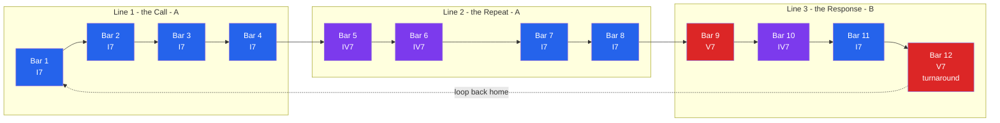

# 🎸 Blues and Popular Harmony

> [!abstract] TL;DR
> The **blues** is the harmonic and melodic taproot of nearly all popular music — jazz, rock, R&B, and soul all grow from it. Its two defining "rule-breaking" moves are: (1) making the **I, IV, and V chords all dominant sevenths** (a sound that classical theory says should never sit still), and (2) singing **blue notes** — a lowered/bent 3rd, 5th, and 7th that drape a *minor-pentatonic melody over major-key harmony*, creating a deliberate, expressive clash. Where classical harmony drives forward through functional tension-and-release, popular harmony is often **loop-based and groove-driven**: a short chord cycle (the 12-bar blues, the I–V–vi–IV "axis," the 50s I–vi–IV–V) repeats endlessly, and the interest lives in melody, rhythm, and timbre on top.

---

## Intuition

**Analogy — talking with a rough, expressive voice instead of a polished one.** Imagine two singers. The first sings each note dead-center and in tune, like a formal speech — that is classical, functional harmony, where every chord "belongs" and resolves cleanly. The second *slides into* notes, cracks the voice, bends a pitch flat and then lets it drift up, and answers their own phrases like a preacher and congregation — that is the blues. The "wrong" notes and the sliding pitches are not mistakes; they are the *accent* of the music, the way a bent, grainy human voice carries more feeling than a synthesizer.

Technically, that expressive "accent" is the friction between a **major-key backdrop** (the bright I–IV–V chords) and a **minor/pentatonic melody** (the blue notes) sung over the top. Two color palettes fight in the same frame, and that tension — never fully resolved — is the entire emotional engine of the style and everything descended from it.

---

## How It Works

### The 12-bar blues form

The core structure is a **12-bar loop** built almost entirely from three chords: the tonic (**I**), subdominant (**IV**), and dominant (**V**). The canonical layout splits into three four-bar lines:

- **Bars 1–4:** `I – I – I – I` (a "quick change" to IV in bar 2 is common)
- **Bars 5–8:** `IV – IV – I – I`
- **Bars 9–12:** `V – IV – I – V` (the last bar is the **turnaround** that shoots you back to the top)

### The "wrong" dominant sevenths

Here is the theory-breaking part. In classical harmony, a **dominant seventh** is an unstable, restless chord: its internal **tritone** demands resolution, so only the V chord is normally a dominant 7th. The blues ignores this: **I7, IV7, and V7 are all dominant-quality sevenths**, sitting there stable and grooving. By common-practice rules the I7 should immediately resolve — but in the blues it is *home*. This recolors the whole key: the flat-7 on the tonic imports the b7 blue note straight into the harmony, so chord and melody share the same "bent" flavor.

### Blue notes and the melody/harmony clash

The vocal and lead lines draw from the **blues scale** and minor pentatonic, featuring three **blue notes** relative to the major key:

- **b3** — the flat/bent third, clashing against the major 3rd inside the I chord
- **b5** — the flat fifth, a passing "sigh" between the 4th and 5th
- **b7** — the flat seventh, already baked into the dominant-7th chords

In practice these are **microtonal**: a blues singer or guitarist bends *between* the minor and major third, landing in the cracks of the piano. Recorded and notated they read as b3/b5/b7, but performed they are living, sliding pitches — the source of the style's "vocal" quality.

### Call-and-response and AAB

Two structural habits reinforce the loop. **Call-and-response** — a phrase (voice, or a lead lick) "calls" and another voice or the instrument "answers" — mirrors the African and gospel roots of the music and maps neatly onto the leftover bars in each 4-bar line. The lyric form is typically **AAB**: a line is sung (A), *repeated* (A, giving the singer time to improvise the answer), then capped with a rhyming punchline (B), aligning with the three 4-bar phrases of the form.

### The shuffle / swing feel

Blues rhythm is rarely "straight." The **shuffle** (or swing) feel divides each beat into a long-then-short pair — roughly a triplet with the middle note removed — producing a rolling, lopsided groove. This rhythmic *feel* is as identifying as the chords; the same I–IV–V played straight sounds like a march, but played with a shuffle it sounds like the blues (see rhythm, meter, and groove).

### From blues to rock and pop

Popular styles inherit the blues and then simplify or extend it:

- **Rock** keeps the I–IV–V and the shuffle but often replaces full chords with **power chords** (root + fifth, no third) — deliberately dropping the 3rd so the major/minor ambiguity of the blue note is never resolved, which is why power chords sound neither happy nor sad.
- **Pop** favors short **diatonic loops**: the **I–V–vi–IV "axis"** progression, the 50s **doo-wop I–vi–IV–V**, and the jazz-derived **ii–V–I**.
- **Borrowed chords / mode mixture**: pop freely borrows chords from the parallel minor (bVII, bVI, iv), producing colors like the **backdoor cadence** (bVII7 → I) and the **plagal "amen" cadence** (IV → I) that soften or sidestep the sharp classical V → I pull.

### Functional vs loop-based harmony

The deepest conceptual point: **classical functional harmony is goal-directed** — chords are arranged so tension accumulates and *resolves* at cadences (see functional harmony). **Popular/loop-based harmony is often cyclic** — a 2-to-8-chord loop repeats with no final resolution, and the "movement" comes from melody, rhythm, production, and arrangement rather than from harmonic goal-seeking. The I–V–vi–IV loop deliberately *never closes*, which is exactly why it can sustain a whole song.



---

## Key Concepts

### 🟢 Secondary (foundations)
- **Three chords:** the blues is built on **I, IV, V**, all made **dominant 7ths** (I7, IV7, V7).
- **12-bar form:** `I-I-I-I / IV-IV-I-I / V-IV-I-V`, repeating as a loop.
- **Blue notes:** the lowered/bent **b3, b5, b7** give the blues its "sad-over-happy" sound.
- **Shuffle feel:** the lopsided long-short swing that makes I–IV–V *feel* like blues.
- **AAB lyrics & call-and-response:** a line, its repeat, then a punchline; a phrase and its answer.

### 🟡 Undergraduate (mechanics)
- **The dominant-7th "rule break":** why making I and IV dominant-quality contradicts common-practice function, and how it reflavors the tonic with the b7.
- **Blues scale vs minor pentatonic:** hexatonic blues = 1, b3, 4, **b5**, 5, b7; the b5 is the added "blue" passing tone.
- **Microtonality:** blue notes are *bent, in-between* pitches, not fixed keyboard notes.
- **Pop loops:** **I–V–vi–IV** (axis), **I–vi–IV–V** (doo-wop), **ii–V–I** (jazz backbone).
- **Power chords:** root+fifth with no third — deliberately ambiguous, the rock workhorse.

### 🔴 Graduate (theory and analysis)
- **Non-functional / cyclic harmony:** loop-based progressions resist Roman-numeral *goal* analysis; the "tonic" may be asserted by riff and repetition rather than by cadence.
- **Mode mixture / borrowed chords:** bVII, bVI, iv, and the **backdoor cadence** (bVII7→I) vs the **plagal cadence** (IV→I) as characteristic pop/rock resolutions that avoid the leading tone.
- **Dual tonicity:** the blues superimposes a minor-pentatonic melodic space on a major/dominant harmonic space — a stable *bitonal* coexistence rather than an unresolved dissonance.
- **The blues as a scale-degree grammar** that later jazz elaborated into ii–V–I chains, tritone substitution, and extended dominants (see seventh chords and extensions).

---

## Python Demo

We visualize three things with numpy + matplotlib only: (1) the **12-bar blues chord grid** as a colored timeline, (2) the **blues scale vs the major scale** on the 12 pitch-class grid, highlighting the **blue notes** and the signature b3-vs-major-3rd "bend," and (3) the **I–V–vi–IV axis progression** for comparison.

```python
# Blues and popular harmony, visualized with numpy + matplotlib only.
import numpy as np
import matplotlib.pyplot as plt

# ---------------------------------------------------------------
# 1) The 12-bar blues chord grid: I-I-I-I / IV-IV-I-I / V-IV-I-V
#    Every chord is a DOMINANT 7th (I7, IV7, V7) -- the "rule-breaking"
#    hallmark of the blues.
# ---------------------------------------------------------------
bars  = np.arange(1, 13)
roman = ["I7","I7","I7","I7", "IV7","IV7","I7","I7", "V7","IV7","I7","V7"]
root_semitone = {"I7": 0, "IV7": 5, "V7": 7}          # root above tonic, in semitones
func_color    = {"I7": "#2563eb", "IV7": "#7c3aed", "V7": "#dc2626"}  # T / PD / D
heights = [root_semitone[c] + 1 for c in roman]        # +1 so the I7 bars are visible
colors  = [func_color[c] for c in roman]

# ---------------------------------------------------------------
# 2) Blues scale vs major scale on the 12 pitch-class grid.
#    Major (Ionian) : 0 2 4 5 7 9 11
#    Hexatonic blues: 0 3 5 6 7 10   -> b3, b5, b7 are the BLUE NOTES
# ---------------------------------------------------------------
pcs         = np.arange(12)
major_scale = np.array([0, 2, 4, 5, 7, 9, 11])
blues_scale = np.array([0, 3, 5, 6, 7, 10])
blue_notes  = np.array([3, 6, 10])                     # b3, b5, b7
non_blue    = np.setdiff1d(blues_scale, blue_notes)    # 0, 5, 7 (root, 4th, 5th)
note_names  = ["C","C#","D","Eb","E","F","F#","G","Ab","A","Bb","B"]

# ---------------------------------------------------------------
# 3) The "axis"/pop progression I-V-vi-IV (diatonic TRIADS) for contrast.
# ---------------------------------------------------------------
axis_roman = ["I", "V", "vi", "IV"]
axis_semi  = {"I": 0, "V": 7, "vi": 9, "IV": 5}
axis_color = {"I": "#2563eb", "V": "#dc2626", "vi": "#059669", "IV": "#7c3aed"}

# ---------------------------------------------------------------
# Plot: three stacked panels.
# ---------------------------------------------------------------
fig = plt.figure(figsize=(11, 9))
gs  = fig.add_gridspec(3, 1, height_ratios=[1.0, 0.9, 1.2], hspace=0.7)

# --- Panel A: 12-bar blues timeline ---
axA = fig.add_subplot(gs[0])
axA.bar(bars, heights, color=colors, edgecolor="black", width=0.9)
for x, c, h in zip(bars, roman, heights):
    axA.text(x, h + 0.2, c, ha="center", va="bottom", fontsize=9, fontweight="bold")
axA.set_xticks(bars)
axA.set_ylim(0, 10)
axA.set_yticks([])
axA.set_xlabel("Bar number (loop of 12)")
axA.set_title("12-Bar Blues:  I7-I7-I7-I7 / IV7-IV7-I7-I7 / V7-IV7-I7-V7\n"
              "bar height = root above tonic;  blue=Tonic  purple=Subdominant  red=Dominant")

# --- Panel B: the axis / pop progression I-V-vi-IV ---
axB   = fig.add_subplot(gs[1])
ax_h  = [axis_semi[c] + 1 for c in axis_roman]
ax_c  = [axis_color[c] for c in axis_roman]
axB.bar(np.arange(1, 5), ax_h, color=ax_c, edgecolor="black", width=0.6)
for x, c, h in zip(np.arange(1, 5), axis_roman, ax_h):
    axB.text(x, h + 0.25, c, ha="center", va="bottom", fontsize=12, fontweight="bold")
axB.set_xticks(np.arange(1, 5))
axB.set_ylim(0, 12)
axB.set_yticks([])
axB.set_xlabel("Loop position (repeats endlessly, never fully closes)")
axB.set_title("The 'Axis' / Pop Progression:  I - V - vi - IV   (vi = green tonic substitute)")

# --- Panel C: blues scale vs major scale on the pitch-class grid ---
axC = fig.add_subplot(gs[2])
axC.scatter(major_scale, np.ones_like(major_scale), s=260, marker="s",
            color="#94a3b8", edgecolor="black", zorder=3, label="Major scale (harmony)")
axC.scatter(non_blue, np.zeros_like(non_blue), s=260, marker="o",
            color="#0ea5e9", edgecolor="black", zorder=3, label="Blues scale (melody)")
axC.scatter(blue_notes, np.zeros_like(blue_notes), s=360, marker="*",
            color="#f59e0b", edgecolor="black", zorder=4, label="Blue notes (b3, b5, b7)")

# The signature clash: major 3rd (pc 4) in the harmony vs bent b3 (pc 3) in the melody.
axC.annotate("", xy=(3, 0.12), xytext=(4, 0.88),
             arrowprops=dict(arrowstyle="<->", color="red", lw=1.8))
axC.text(3.5, 0.5, "the 'bend':\nb3 <-> major 3rd", ha="center", va="center",
         fontsize=8, color="red")

axC.set_xticks(pcs)
axC.set_xticklabels(note_names)
axC.set_yticks([0, 1])
axC.set_yticklabels(["Blues melody", "Major harmony"])
axC.set_ylim(-0.6, 1.6)
axC.set_xlim(-0.6, 11.6)
axC.set_xlabel("Pitch class (semitones above tonic C)")
axC.set_title("Blue Notes: a minor-pentatonic melody bent against major harmony")
axC.legend(loc="upper right", fontsize=8, framealpha=0.9)
axC.grid(axis="x", linestyle=":", alpha=0.4)

plt.tight_layout()
plt.show()
```

**Reading the output.** Panel A shows the blues loop as a striped timeline — the red V7 in bars 9 and 12 launches the turnaround, and every bar is a dominant 7th. Panel B shows the pop axis loop, where the green **vi** stands in for tonic so the four-chord cycle never truly resolves. Panel C is the payoff: the major scale (grey squares) provides the bright harmony, while the blues scale (blue circles + gold stars) supplies a *darker* melodic set — and the red arrow marks the defining friction, a bent **b3** rubbing against the **major 3rd** living inside the I chord. That single semitone gap, performed as a microtonal bend, is the sound of the blues.

---

## Real-World Applications

- **Rock and roll:** Chuck Berry's "Johnny B. Goode," countless AC/DC and Led Zeppelin tracks, and most 12-bar rockers run I7–IV7–V7 with a shuffle and blues-scale guitar licks.
- **Jazz:** the 12-bar blues is a standard "head" and jam vehicle (e.g. "Now's the Time," "C Jam Blues"); bebop elaborated it into the **ii–V–I**-laden "bird blues."
- **Pop songwriting:** the **I–V–vi–IV** axis underpins a huge share of hits across decades; the **I–vi–IV–V** doo-wop loop defined 1950s ballads and still recurs constantly.
- **R&B and soul:** gospel-derived **call-and-response**, plagal "amen" cadences, and blue-note melodies over major/dominant harmony are the genre's backbone.
- **Guitar pedagogy and production tools:** the minor-pentatonic/blues scale is the first improvisation vocabulary most guitarists learn, and DAW loop libraries and chord-suggestion plugins lean heavily on these repeating popular progressions.

---

## Common Pitfalls

- **Analyzing loop-based pop with strict classical function.** A I–V–vi–IV loop has no cadential goal; forcing T–PD–D–T onto it (or expecting the I7 in a blues to "resolve") is a category error. Popular harmony is often cyclic, not goal-directed.
- **Playing blue notes as fixed keyboard pitches.** The b3/b5/b7 are *bent, microtonal* pitches; nailing them dead-on the piano's Eb/Gb/Bb loses the sliding, vocal quality that defines the sound.
- **Treating the b5 as a chord tone.** In the melody the b5 is usually a fast *passing* tone between the 4th and 5th; parking on it or harmonizing it as a stable note kills the effect.
- **Confusing "major key" with "major mood."** Blues sits on major/dominant chords yet feels bittersweet precisely because the *melody* is minor-flavored. Hearing the chords as "happy" misses the whole point.
- **Assuming power chords are just "simplified" chords.** Dropping the third is a deliberate harmonic choice: it removes the major/minor distinction, letting the riff stay ambiguous and heavy — not a shortcut but an aesthetic.
- **Over-quantizing the shuffle.** Straightening the swing feel to a grid turns blues and R&B into stiff march rhythms; the lopsided long-short subdivision is essential, not optional.

---

## Related Concepts

- [[Functional_Harmony_and_Progressions]] — the goal-directed T–PD–D–T system that the blues *bends and breaks*; contrasting it with loop-based popular harmony is the core conceptual point of this note.
- [[Seventh_Chords_and_Extensions]] — the dominant seventh (with its internal tritone) is the chord the blues puts on I, IV, *and* V; jazz then extends it into 9ths, 13ths, and altered dominants.
- [[Scales_and_Modes]] — the blues scale and minor pentatonic are the melodic source of the blue notes, sitting against the major (Ionian) harmony.
- [[Jazz_Harmony_and_Improvisation]] — jazz grows directly out of the blues, elaborating its scale-degree grammar into ii–V–I chains, chord-scale theory, and tritone substitution.
- [[Groove_Syncopation_and_Swing]] — the shuffle/swing feel and backbeat that make I–IV–V *feel* like blues rather than a march; groove is as identifying as the harmony.
- [[Song_Structure_and_Popular_Forms]] — the 12-bar blues and the loop-based pop progressions here are the harmonic content that verse–chorus and AABA forms arrange into songs.
- [[Chords_and_Triads]] — the underlying I/IV/V triads that get "seventh-ified," and the power chord as a triad with its third removed.
- [[Rhythm_Meter_and_Tempo]] — the pulse-and-meter scaffold on which the shuffle subdivision and backbeat sit.
- [[Modulation_and_Tonicization]] — mode mixture and borrowed chords (bVII, bVI, iv) that give pop its backdoor and plagal cadences are close cousins of chromatic tonicization.

---

## Review Questions

**🟢 Secondary.** Write out the chords of a 12-bar blues in the key of C (using dominant-7th chords), and name the three "blue notes" relative to the C major scale.

**🟡 Undergraduate.** Classical theory says a dominant-7th chord is unstable and must resolve. Explain why the blues can use I7 and IV7 as *stable* chords, and describe how a blues singer treats the b3 differently from how a pianist would play it.

**🔴 Graduate.** Contrast the harmonic logic of a 12-bar blues, a I–V–vi–IV pop loop, and a common-practice classical phrase. In what sense is each "resolved" or "unresolved," and why does Roman-numeral functional analysis illuminate the classical phrase but only partially describe the two popular examples? Reference mode mixture and the backdoor cadence in your answer.

---

## Sources

- David Temperley, *The Musical Language of Rock*, Oxford University Press, 2018 — corpus-based analysis of rock/pop harmony, loops, and blue notes. [publisher](https://global.oup.com/academic/product/the-musical-language-of-rock-9780190870195)
- Peter van der Merwe, *Origins of the Popular Style*, Oxford University Press, 1989 — the blues roots of 20th-century popular harmony and the blue-note concept.
- Walter Everett, "Making Sense of Rock's Tonal Systems," *Music Theory Online* 10.4, 2004 — a taxonomy of tonal/modal/blues systems in popular music. [mtosmt.org](https://mtosmt.org/issues/mto.04.10.4/mto.04.10.4.everett.html)
- Trevor de Clercq & David Temperley, "A corpus analysis of rock harmony," *Popular Music* 30(1), 2011 — empirical frequencies of chords and progressions in rock. [Cambridge Core](https://www.cambridge.org/core/journals/popular-music/article/corpus-analysis-of-rock-harmony/)
- *Open Music Theory* (open online textbook) — chapters on blues form, the blues scale, and popular-music harmony. [openmusictheory.github.io](https://openmusictheory.github.io/)

---

#music-theory #blues #popular-music #12-bar-blues #blue-notes
