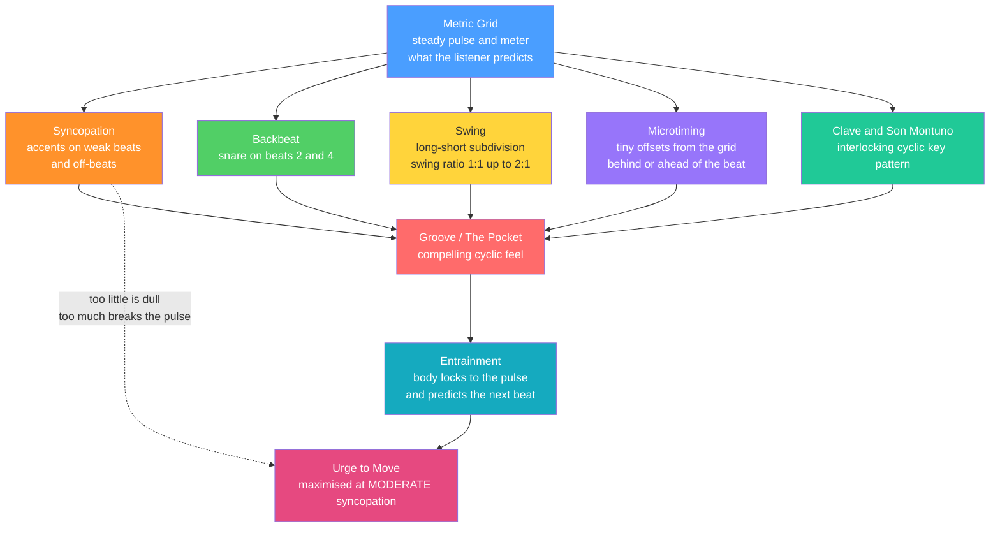

# 🕺 Groove, Syncopation, and Swing

> [!abstract] TL;DR
> **Groove** is the compelling, cyclic rhythmic feel that makes you want to move — "the pocket." It is built by playing *against* the metric grid in three coordinated ways: **syncopation** (putting accents on weak beats and off-beats, contradicting where the pulse says the emphasis "should" be), **swing** (splitting the beat into a long-then-short pair instead of two even halves, measured as a *swing ratio* from 1:1 straight up to roughly 2:1 triplet feel), and **microtiming** (tiny, systematic offsets from the metronomic grid — a snare played a hair *behind* the beat, a hi-hat *ahead* of it — that give an ensemble its "feel"). Groove research (Janata, Madison, Witek) shows the urge to move follows an inverted-U in syncopation: *moderate* syncopation maximizes it, while zero is dull and too much shatters the pulse. The single most important idea is that **groove lives in the deviations** — a perfectly quantized, metronomic performance has *no* groove, which is exactly why producers "humanize" grids and why drummers, not click tracks, are hired for feel.

---

## Intuition

**Analogy — walking with a friend who is *slightly* off-step.** Two things make you want to move to music, and you already know both from walking. First, there is a **steady pulse** your body locks onto for free — the same tick that lets two people fall into step without discussing it. Second — and this is the secret — the thing that makes a groove *irresistible* is not the perfect metronome; it is the **small, consistent way the music leans against that tick**. Think of a great dance partner: they are not robotically on the beat, they push and pull *just* a little, and that tiny springiness is what pulls your body along. Iron out every imperfection and you get a drum machine on its factory setting: technically flawless, emotionally dead.

So groove is a *relationship*, not a thing. It needs a clock to lean against (the meter and pulse from **[[Rhythm_Meter_and_Tempo]]**) and it needs deliberate, patterned leaning: accents landing where the pulse did not expect them (**syncopation**), the beat divided unevenly into a long-short lilt (**swing**), and hits nudged microseconds off the grid to sit "behind" or "ahead" (**microtiming**). Strip the leaning away and the pulse is still there — but the *pocket* is gone. Everything technical below is just a precise account of *how much* to lean, *where*, and *why moderate is the sweet spot*.

---

## How It Works

Groove is an **expressive layer that sits on top of the metric grid**. The listener's brain locks onto the pulse within a few beats (**entrainment**) and then keeps predicting where the next beat will fall. Every groove device works by creating a *productive mismatch* between that prediction and what actually sounds — enough tension to be interesting, not so much that the prediction collapses.

### 1. Syncopation — accenting against the grid

The metric hierarchy (see **[[Rhythm_Meter_and_Tempo]]**) makes beat 1 strongest, beat 3 next, the other beats weaker, and the off-beats ("the *ands*") weakest. **Syncopation** deliberately puts accents — via onsets, held notes, or dynamics — on those weak positions, and especially puts an onset on a weak spot that then *holds through* the following strong beat, so the strong beat is "stolen." A classic measure is the **tresillo / 3-3-2** pattern: onsets on eighth-pulses 0, 3, 6 of a bar, two of which dodge the beat. Syncopation is the *engine* of funk, Motown, Afrobeat, and Latin music.

### 2. The backbeat

In rock, pop, R&B, and soul the drummer plays the **snare on beats 2 and 4** — the *backbeat*. In common-practice terms 2 and 4 are metrically weak, so a hard snare there is itself a form of institutionalized syncopation: the "boom-**CHK**-boom-**CHK**" that defines an entire century of popular music, and the reason audiences clap on 2 and 4 rather than 1 and 3.

### 3. Swing — the uneven subdivision

Instead of dividing a beat into two *even* eighth-notes, **swing** divides it into a **long first eighth and a short second eighth**. The **swing ratio** is `long : short`:

- **1 : 1** — perfectly even ("straight" eighths).
- **~1.5 : 1** (60/40) — a gentle shuffle / light swing.
- **2 : 1** — the textbook "triplet swing" (the beat felt as a quarter-triplet then eighth-triplet), the canonical jazz feel.
- **> 2 : 1** — hard-swung, dotted-eighth-and-sixteenth territory (some shuffles, hard bop).

Real players do not hold a fixed ratio: measured jazz swing ratios *shrink toward 1:1 as tempo increases* (Friberg & Sundström), so "swing" is a tempo-dependent, negotiated feel, not a single number.

### 4. Microtiming and expressive timing

Even after you fix the notated rhythm, the swing ratio, and the accents, players introduce **microtiming**: systematic deviations of a few to a few dozen milliseconds from the exact grid. A drummer might play the snare **behind the beat** (late = "laid back," relaxed, heavy) or **ahead of the beat** (early = "pushing," urgent, driving), while the kick sits dead-center. These are *reproducible* and *stylistic*, not random errors — Charles Keil called the friction between slightly-misaligned parts **"participatory discrepancies,"** and Vijay Iyer tied it to embodied, danced cognition. This is the drummer's "feel," and it is why **the pocket** — an ensemble locking their microtiming into a shared, stable relationship — is the highest praise in a rhythm section.

### 5. The clave and son montuno (Afro-Cuban)

Afro-Cuban music organizes groove around the **clave**: a two-bar, five-stroke asymmetric key pattern (e.g., **son clave** = 3-2 or 2-3) that governs which side of the phrase feels "strong" and against which every other part is aligned. The **son montuno** is the interlocking piano/tres *guajeo* — a repeating, syncopated arpeggiated figure that locks to the clave. Here groove is explicitly a **cyclic, interlocking system**: no single part states the beat plainly; the pulse *emerges* from the coordinated syncopations, a hallmark of West-African-derived musics.

### 6. Groove and entrainment — the inverted-U

Empirical "groove" research quantifies the urge to move. Janata, Tomic & Haley (2012) linked self-reported groove to spontaneous sensorimotor coupling (people move to high-groove music without being asked). Witek et al. (2014) showed the crucial result: **pleasure and the desire to move follow an inverted-U in the amount of syncopation**. *Medium* syncopation maximizes wanting-to-move; **zero** syncopation is metrically obvious and boring, and **very high** syncopation destroys the listener's ability to feel the beat, so the urge collapses. Groove is thus a **Goldilocks phenomenon** — a tuned balance of predictability and violation.



---

## Key Concepts

### 🟢 Secondary (school-level intuition)
- **Groove / the pocket.** The "feel" that makes you tap, nod, or dance; a repeating rhythmic loop that sounds *tight*.
- **Backbeat.** Snare (or hand-claps) on beats **2 and 4** — the heartbeat of rock and pop.
- **Syncopation.** Putting the emphasis on the "wrong," weak part of the bar — the off-beat "and."
- **Swing vs straight.** "Straight" eighths are even (da-da-da-da); "swung" eighths are a bouncy long-short (dah-di, dah-di), like a shuffle.

### 🟡 Undergraduate (rigor)
- **Swing ratio.** The long-to-short duration ratio of a swung eighth pair: 1:1 straight, ~1.5:1 light, 2:1 triplet swing. It is *tempo-dependent*, shrinking toward 1:1 as tempo rises.
- **Syncopation formalized.** An onset on a metrically weak position that is not re-articulated on the next strong position — the note "steals" the strong beat; the **tresillo (3-3-2)** is the canonical example.
- **Microtiming / expressive timing.** Systematic millisecond-scale offsets from the grid: playing "behind" (laid-back) or "ahead" (pushing) the beat. Reproducible and stylistic, not error.
- **Clave and son montuno.** The Afro-Cuban two-bar key pattern (3-2 or 2-3 son clave) and the interlocking syncopated *guajeo* that groove is organized around.
- **Quantization vs humanization.** In a DAW, *quantizing* snaps onsets onto the grid (kills feel); *humanizing* / swing templates re-introduce controlled deviation (restores feel). See **[[Digital_Audio_Fundamentals]]**.

### 🔴 Graduate (research / advanced)
- **The groove inverted-U (Witek et al., 2014).** Wanting-to-move and pleasure peak at *moderate* syncopation; both zero and extreme syncopation reduce it — a predictive-processing account of tension vs resolution.
- **Sensorimotor coupling (Janata et al., 2012).** High-groove music elicits spontaneous, involuntary movement; "groove" is operationalized as a psychological *and* motor phenomenon, tied to beat-based temporal prediction.
- **Participatory discrepancies (Keil) and embodied microtiming (Iyer).** Groove emerges from the *friction* between slightly misaligned parts; expressive timing is grounded in the body and the dance, not just the score.
- **Ensemble timing and mutual entrainment.** Two-person tapping / ensemble studies show players track and correct each other's timing with characteristic error-correction gains; "the pocket" is a *stable coupled state* of a multi-agent timing system, not a property of any one player.
- **Neural entrainment.** Oscillator / predictive-coding models explain why a periodic pulse can be felt through silence and why *violated* predictions (syncopation) drive both pleasure and movement.

---

## Python Demo

```python
# Quantifying SWING and MICROTIMING with numpy + matplotlib only.
#
# Part 1: a "straight" eighth-note grid (1:1) vs a "swung" grid (long-short),
#         and the measured SWING RATIO.
# Part 2: MICROTIMING deviations -- the small, systematic offsets from the
#         metronome grid where "groove" actually lives. We plot onset timing
#         AGAINST the grid to show a quantized loop would be all-zeros, while
#         a real groove is a patterned cloud of non-zero deviations.

import numpy as np
import matplotlib.pyplot as plt

BPM = 120
beat = 60.0 / BPM        # seconds per quarter-note beat = 0.5 s at 120 BPM
n_beats = 4

# ------------------------------------------------------------------
# Part 1: eighth-note onsets, straight vs swung, and the swing ratio
# ------------------------------------------------------------------
def eighth_onsets(swing_ratio):
    """Onset times (s) for eighth notes over n_beats.
    swing_ratio = long:short duration of the two eighths inside one beat.
    1.0 = straight (even) ; 1.5 = 60/40 shuffle ; 2.0 = triplet 'jazz' swing."""
    long_frac = swing_ratio / (swing_ratio + 1.0)   # where the off-beat lands in the beat
    onsets = []
    for k in range(n_beats):
        onsets.append(k * beat)                      # on-beat eighth (the down)
        onsets.append(k * beat + long_frac * beat)   # off-beat eighth (the 'and'), swung late
    return np.array(onsets)

def measured_swing_ratio(onsets):
    """Recover long/short ratio from consecutive eighth onsets."""
    durs = np.diff(onsets)
    long, short = durs[0::2], durs[1::2]             # long = down->and, short = and->next down
    return long.mean() / short.mean()

straight = eighth_onsets(1.0)
swung    = eighth_onsets(2.0)                        # classic triplet swing
print(f"Straight eighths -> swing ratio {measured_swing_ratio(straight):.2f} : 1")
print(f"Swung   eighths -> swing ratio {measured_swing_ratio(swung):.2f} : 1")

# ------------------------------------------------------------------
# Part 2: a one-bar groove on a 16th grid, with MICROTIMING
# ------------------------------------------------------------------
sixteenth = beat / 4.0                               # 0.125 s = 125 ms
rng = np.random.default_rng(42)

# instrument: (name, grid positions in 16ths, systematic offset ms, colour)
parts = [
    ("Kick",  [0, 8, 11],               0.0, "#2563eb"),   # dead on the grid
    ("Snare", [4, 12],                 18.0, "#dc2626"),   # LAID BACK: behind the beat
    ("Hat",   [0, 2, 4, 6, 8, 10, 12, 14], 0.0, "#059669"),
]

names, times, devs, cols = [], [], [], []
for name, positions, base_off, colour in parts:
    for p in positions:
        off = base_off
        # hi-hats on the OFF-beats (the 'and's: 16th-positions 2,6,10,14) get a swing push
        if name == "Hat" and (p // 2) % 2 == 1:
            off = 22.0
        off += rng.normal(0.0, 4.0)                  # human jitter, ~4 ms std
        names.append(name); times.append(p * sixteenth)
        devs.append(off);   cols.append(colour)
times, devs = np.array(times), np.array(devs)
print(f"\nMean microtiming deviation (ms): "
      f"Kick {devs[np.array(names)=='Kick'].mean():+.1f}, "
      f"Snare {devs[np.array(names)=='Snare'].mean():+.1f}, "
      f"Hat {devs[np.array(names)=='Hat'].mean():+.1f}")

# ------------------------------------------------------------------
# PLOT
# ------------------------------------------------------------------
fig, (axA, axB, axC) = plt.subplots(3, 1, figsize=(11, 10))

# Panel A: straight vs swung eighth grid on a timeline
for k in range(n_beats + 1):
    axA.axvline(k * beat, color="0.80", zorder=0)                       # beat lines
    if k < n_beats:
        axA.axvline(k * beat + 0.5 * beat, color="0.90", ls=":", zorder=0)  # straight 'and'
axA.plot(straight, np.ones_like(straight), "o", color="#2563eb", ms=11,
         label="straight eighths  (1:1)")
axA.plot(swung, np.zeros_like(swung), "s", color="#dc2626", ms=11,
         label="swung eighths  (2:1 triplet)")
for t in swung[1::2]:                                                   # arrows: the delayed 'and'
    axA.annotate("", xy=(t, 0.15), xytext=(t - beat * 0.1667, 0.15),
                 arrowprops=dict(arrowstyle="->", color="#dc2626"))
axA.set_yticks([0, 1]); axA.set_yticklabels(["swung", "straight"])
axA.set_ylim(-0.5, 1.5); axA.set_xlabel("time (s)")
axA.set_title("Straight vs swung eighths: the off-beat 'and' is pushed LATE (swing)")
axA.legend(loc="upper right")

# Panel B: swing ratio sweep -- long/short split of one beat
ratios = [1.0, 1.5, 2.0, 3.0]
for i, s in enumerate(ratios):
    lf = s / (s + 1.0)
    y = len(ratios) - i
    axB.barh(y, lf,       height=0.55, color="#4a9eff", edgecolor="k")  # long (on-beat) eighth
    axB.barh(y, 1 - lf, left=lf, height=0.55, color="#ffd43b", edgecolor="k")  # short (off-beat)
    axB.text(1.03, y, f"{s:.1f} : 1", va="center", fontsize=10)
axB.set_yticks([len(ratios) - i for i in range(len(ratios))])
axB.set_yticklabels(["straight 1.0", "shuffle 1.5", "swing 2.0", "hard 3.0"])
axB.set_xlim(0, 1.25); axB.set_xlabel("fraction of one beat  (blue = long, yellow = short)")
axB.set_title("Swing ratio: how the beat is split into a long-then-short pair")

# Panel C: microtiming deviations -- where the groove lives
axC.axhline(0, color="k", lw=1.2, label="the grid (quantized = zero deviation)")
for k in range(n_beats + 1):
    axC.axvline(k * beat, color="0.85", zorder=0)
for name, colour in [("Kick", "#2563eb"), ("Snare", "#dc2626"), ("Hat", "#059669")]:
    m = np.array(names) == name
    axC.vlines(times[m], 0, devs[m], color=colour, alpha=0.45)
    axC.scatter(times[m], devs[m], color=colour, s=70, zorder=3, label=name)
axC.set_xlabel("nominal grid time (s)"); axC.set_ylabel("timing deviation (ms)")
axC.set_title("Microtiming: snare LAID BACK (+), hats swung late (+); groove = the pattern of offsets")
axC.text(0.02, axC.get_ylim()[1] * 0.9, "above 0 = behind the beat\nbelow 0 = ahead of the beat",
         fontsize=8, va="top")
axC.legend(loc="lower right", fontsize=8)

plt.tight_layout()
plt.show()

# Reading the figure:
#   Panel A: the swung 'and's sit visibly later than the straight (dotted) 'and's.
#   Panel B: as the swing ratio grows, the long (blue) eighth eats the beat, the short shrinks.
#   Panel C: a QUANTIZED loop would be a flat line at 0 ms -- no groove. The real groove is the
#            structured cloud: snare consistently late (laid back), off-beat hats pushed, plus
#            small human jitter. That non-zero pattern IS the feel.
```

**What it shows.** Panel A makes swing concrete: the off-beat eighth is not exactly halfway through the beat, it is *pushed late*, and the `measured_swing_ratio` function recovers the 2:1 lilt directly from onset times. Panel B shows that the swing ratio is a continuous dial from robotic-straight to hard-shuffle, not a binary. Panel C is the punchline of the whole note: a perfectly quantized loop would be a flat line at 0 ms — *no* groove — while the real feel is the *structured pattern of deviations* (snare consistently behind, hats swung, kick centered) plus a little human jitter. Groove lives in the deviations.

---

## Real-World Applications

> **Example — the DAW "swing" and "humanize" controls.** Every producer's tool — the MPC's legendary *swing* knob (J Dilla's swung, "drunk" hi-hats), Ableton Live's groove pool, Logic's *Humanize* — implements exactly the demo above. A programmed hi-hat pattern sounds mechanical because it is quantized to 0 ms deviation; dialing in 54–62% swing pushes every off-beat 16th late, and humanization sprinkles jitter, converting a stiff loop into something that breathes. This is the operational meaning of quantization vs humanization discussed in **[[Digital_Audio_Fundamentals]]**.

> **Example — the drummer hired for "feel."** Studios pay for players whose microtiming is trusted: Bernard Purdie's laid-back "Purdie shuffle," Steve Gadd's pocket, or the deliberately behind-the-beat snare of soul and hip-hop. A metronomically perfect session player can still be passed over because the *feel* — the ensemble microtiming relationship — is what the record needs.

> **Example — Afro-Cuban and Latin ensembles.** Salsa, son, and rumba are built on the **clave**; if a horn line or piano *guajeo* is "crossed" (misaligned with the clave direction, 2-3 vs 3-2), the whole band feels wrong even though every note is "correct." Groove here is a system-level property of interlocking syncopation, not any single part.

> **Example — the global backbeat.** From Chuck Berry to modern pop, the **snare on 2 and 4** is so ingrained that audiences worldwide clap there; comedic "clapping on 1 and 3" is a running joke among musicians precisely because it violates the entrained backbeat.

---

## Common Pitfalls

- **Confusing groove with tempo or complexity.** Groove is not "fast" and not "busy." A slow, sparse two-chord vamp can groove ferociously while a dense, virtuosic passage feels stiff. Groove is about the *relationship* to the grid, not the note count.
- **Believing quantization improves feel.** Snapping everything to the grid removes microtiming — the very thing that creates groove. Over-quantized productions sound sterile; the fix is controlled *de*-quantization (swing + humanize), not more precision.
- **Treating the swing ratio as a fixed number.** Swing is tempo-dependent and player-dependent; forcing a rigid 2:1 at fast tempos sounds wrong because real players relax toward 1:1 as tempo rises.
- **Assuming more syncopation is always groovier.** The urge-to-move follows an inverted-U: past a point, extra syncopation destroys the felt pulse and the groove *collapses*. Moderate is the target, not maximal.
- **Mistaking sloppiness for feel.** "Behind the beat" is *consistent and intentional*; random lateness is just bad timing. Real microtiming is reproducible and pattern-locked across the whole rhythm section — that consistency is what makes the pocket.
- **Ignoring the reference grid.** Syncopation, swing, and "behind the beat" are all defined *relative to* the pulse. If the underlying meter is not clearly established (see **[[Rhythm_Meter_and_Tempo]]**), the listener has nothing to feel the groove *against* and the deviations read as chaos.
- **Crossing the clave.** In Afro-Cuban music, aligning parts to the wrong side of the clave breaks the groove even when every individual rhythm is accurate.

---

## Related Concepts

- [[Rhythm_Meter_and_Tempo]] — the metric grid, pulse, meter, and metrical hierarchy that groove is felt *against*; syncopation, swing, and microtiming are all deviations *from* this scaffold (Section 01).
- [[Digital_Audio_Fundamentals]] — the DSP/DAW layer where groove becomes concrete: quantization snaps onsets to the grid, while swing templates and humanization re-introduce the deviations that create feel.

> [!note] Planned sibling notes (not yet created — no wikilinks added)
> This note is designed to cross-link, once they exist, to **Advanced_Rhythm** (polyrhythm, polymeter, metric modulation — the structural cousin of groove) in `Music_Theory/05_Rhythm_Groove_and_World_Music/`, to **Blues_and_Popular_Harmony** (the backbeat, shuffle, and 12-bar forms that host these grooves), and to **Music_Cognition** (beat induction, entrainment, and the neural basis of the groove inverted-U) in Section 06. These files were not found via Glob, so they are intentionally left unlinked.

---

## Review Questions

1. **(Conceptual — Secondary/Undergraduate)** Explain why a *perfectly quantized* drum loop, with every hit exactly on the grid, tends to have *no* groove, whereas the same loop with the snare nudged a few milliseconds late feels better. What does this reveal about where groove actually "lives"?
2. **(Scenario — Undergraduate)** A producer gives you a stiff-sounding hip-hop beat at 88 BPM and asks you to "make it swing and give it feel." Concretely, what would you change to the *off-beat* hi-hats (swing ratio and direction), to the *snare* (microtiming), and to overall timing consistency — and why must the changes be *systematic* rather than random?
3. **(Trade-off / research — Graduate)** Witek et al. found that the urge to move follows an inverted-U in the amount of syncopation. Explain, using the ideas of entrainment and prediction, *why* both zero syncopation and very high syncopation reduce the desire to move, and describe what "moderate" syncopation is doing to the listener's beat prediction that makes it the sweet spot.

---

## Sources

- Janata, P., Tomic, S. T., & Haley, M. J. (2012). "Sensorimotor coupling in music and the psychology of the groove." *Journal of Experimental Psychology: General*, 141(1), 54–75. [DOI](https://doi.org/10.1037/a0024208)
- Witek, M. A. G., Clarke, E. F., Wallentin, M., Kringelbach, M. L., & Vuust, P. (2014). "Syncopation, body-movement and pleasure in groove music." *PLoS ONE*, 9(4), e94446 — the inverted-U of syncopation vs urge to move. [DOI](https://doi.org/10.1371/journal.pone.0094446)
- Madison, G. (2006). "Experiencing groove induced by music: Consistency and phenomenology." *Music Perception*, 24(2), 201–208. [DOI](https://doi.org/10.1525/mp.2006.24.2.201)
- Friberg, A., & Sundström, A. (2002). "Swing ratios and ensemble timing in jazz performance: Evidence for a common rhythmic pattern." *Music Perception*, 19(3), 333–349 — swing ratio shrinks toward 1:1 with tempo. [DOI](https://doi.org/10.1525/mp.2002.19.3.333)
- Iyer, V. (2002). "Embodied mind, situated cognition, and expressive microtiming in African-American music." *Music Perception*, 19(3), 387–414 — microtiming as embodied, danced cognition (with Keil's participatory discrepancies). [DOI](https://doi.org/10.1525/mp.2002.19.3.387)

---

#music-theory #groove #swing #syncopation #microtiming
