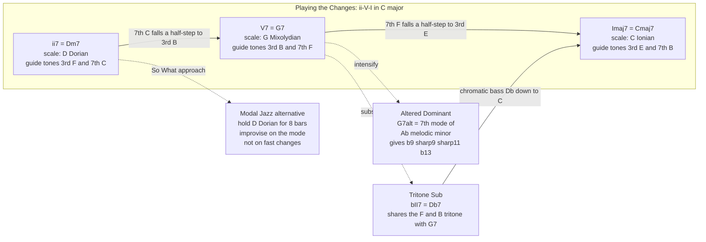

# 🎷 Jazz Harmony and Improvisation

> [!abstract] TL;DR
> **Jazz harmony** is the extended language built on **seventh, ninth, eleventh, and thirteenth chords** and their **altered** cousins, threaded together by the **ii-V-I** progression — the genre's fundamental sentence. **Improvisation** is real-time composition *over* those changes, and its central tool is **chord-scale theory**: to each chord you assign a parent scale (**Dorian** over the ii, **Mixolydian** over the V, **Ionian** over the I; a **melodic-minor mode** over an altered dominant) whose notes become your melodic vocabulary. **Guide tones** (the 3rds and 7ths) carry the harmony and voice-lead by half-step through the changes, while **reharmonization** devices — **tritone substitution**, backdoor, and Coltrane changes — swap chords that share the same critical tritone. **Modal jazz** ("So What") strips the fast changes away so players improvise on a single mode for many bars. The whole art is a **shared language**: transcribed vocabulary, swing, and call-and-response turned into spontaneous conversation.

---

## Intuition

**Analogy first.** A jazz solo is a **spontaneous conversation in a shared language**. The rhythm section states a topic — a chord progression, printed as a **lead sheet** in the *Real Book* — and everyone at the table already knows the grammar (the ii-V-I), the vocabulary (licks and phrases absorbed by **transcribing** the masters), and the accent (swing). When it is your turn to speak, you do not read from a script; you **improvise a sentence in real time** that fits the grammar, borrows familiar phrases, answers what the last person said (**call-and-response**), and develops a small idea (a **motif**) the way a good speaker returns to a theme. Playing "**inside**" is speaking plainly and on-topic; playing "**outside**" is a daring metaphor that momentarily strays before resolving back — thrilling precisely because everyone hears the tension against the shared grammar.

In the technical domain: the "shared grammar" is **functional harmony** compressed into the ii-V-I cell; the "vocabulary" is a **scale mapped to each chord** plus memorized melodic fragments; the "accent" is **swing feel and groove**; and "answering the last phrase" is **motivic development over the changes**. Chord-scale theory is simply the dictionary that tells you which words (pitches) belong to which moment (chord).

---

## How It Works

### Core Mechanics

Jazz harmony and improvisation rest on a handful of interlocking systems. Work through them in order and the whole language snaps into focus.

1. **Extended and altered chords are the default unit.** Where classical harmony leans on triads, jazz treats the **seventh chord** as the *minimum* and routinely stacks **9ths, 11ths, and 13ths** on top, then **alters** them on dominants (**b9, #9, #11, b13**) for extra pull. See [[Seventh_Chords_and_Extensions]] for the interval recipes. A "Cmaj7" or "G7" on a chart is an *invitation* to voice color notes, not a literal four-note instruction.

2. **The ii-V-I is the fundamental building block.** Almost every jazz standard is a chain of **ii7 - V7 - Imaj7** cells (in C: **Dm7 - G7 - Cmaj7**). It is [[Functional_Harmony_and_Progressions|functional harmony]] — predominant, dominant, tonic — packed into three chords. Recognizing ii-V-I cells (and their minor-key form **iiø7 - V7alt - i**) is how players sight-read and memorize hundreds of tunes: you learn *patterns*, not individual chords.

3. **Chord-scale theory maps a scale to each chord.** For every chord you pick a **parent scale** whose notes are consonant with the harmony, and you improvise from that pool:
   - **ii7 → Dorian** (Dm7 → D Dorian: the natural-6 minor mode).
   - **V7 → Mixolydian** (G7 → G Mixolydian: the dominant mode with a natural 4 that becomes an *avoid note*).
   - **Imaj7 → Ionian** (Cmaj7 → C Ionian, or Lydian for a brighter #11 color).
   - **V7alt → altered scale** = the **7th mode of melodic minor** (G7alt → the 7th mode of Ab melodic minor), which supplies **all four alterations** b9, #9, #11, b13 at once. Other melodic-minor modes fuel other colors: the **4th mode (Lydian dominant)** for 7#11, the **6th mode (Locrian ♮2)** for half-diminished chords. See [[Scales_and_Modes]].

4. **Guide tones and voice leading run the whole thing.** The **3rd and 7th** of each chord — the **guide tones** — carry its quality and its tritone, and they **voice-lead by half-step** through the changes: the 7th of one chord *falls* to the 3rd of the next. In Dm7 - G7 - Cmaj7 the chain is **C→B, F→E**: two smooth half-step descents. This linear skeleton (formalized in [[Voice_Leading_and_Counterpoint]]) is why **rootless voicings** work — the bass covers the root, freeing the pianist to voice only 3-7-9-13.

5. **Reharmonization swaps chords that share a tritone.** A dominant 7th's **tritone** (its 3rd and 7th) is its functional fingerprint. **Tritone substitution** replaces **V7** with **bII7** — a dominant a tritone away that contains the *same* tritone (G7 and Db7 both hold the {F, B} tritone), giving a chromatic bass descent Db→C. Related tricks: the **backdoor** dominant (bVII7 → I) and **Coltrane changes** (dividing the octave into three major-third key centers).

6. **Modal jazz relaxes the changes.** Instead of racing through ii-V-Is, **modal jazz** (Miles Davis's *So What*) sits on **one mode for eight or sixteen bars** (D Dorian, then Eb Dorian). Improvisation becomes about melody, space, and quartal voicings rather than "making the changes."

7. **The blues and bebop scales add idiomatic color.** The **blues scale** (minor pentatonic plus the b5 "blue note") overlays the whole form regardless of the underlying chord — the deeper story of blue notes and the 12-bar form lives in [[Blues_and_Popular_Harmony]]. **Bebop scales** insert a chromatic passing tone (e.g., the Mixolydian bebop scale adds a ♮7 to the dominant) so that **chord tones land on the strong beats** at bebop tempo.

8. **Improvisation is real-time composition.** Over this scaffold the soloist develops **motifs**, trades **call-and-response** phrases, quotes memorized **vocabulary/licks** absorbed through **transcription**, and chooses moment to moment between playing **inside** (spelling the changes) and **outside** (deliberate, resolved dissonance) — all locked to **swing and groove** (see [[Groove_Syncopation_and_Swing]]).

### Flow / Architecture



---

## Key Concepts

### Secondary Level

**Jazz uses "bigger" chords than pop or rock.** Where a pop song might play a plain C chord (three notes), jazz plays **Cmaj7, C9, or C13** (four, five, or more notes). Those extra notes are **color notes** that give jazz its rich, "floating" sound. You do not need to know all their names to hear that jazz harmony sounds lusher and more complicated than a campfire strum.

**Most jazz tunes are built from one repeating pattern: the ii-V-I.** It is three chords in a row that create a feeling of *setup → tension → home*. In the key of C that is **Dm7 → G7 → C**. Once you can hear this pattern, you start noticing it *everywhere* in jazz — it is the genre's favorite sentence, repeated in different keys throughout a song.

**Improvising is making up a melody on the spot.** A jazz soloist is not reading written-out notes; they are **composing in real time** over the chords the band is playing. It is like a conversation: the band lays down the topic (the chords), and the soloist "talks" over it, using melodies that fit. Good improvisers listen and **answer each other** — one plays a short idea, another responds, like call-and-response.

**Which notes can you play? The scale that matches the chord.** For each chord there is a **scale that sounds right** over it. A big part of learning jazz is memorizing which scale goes with which chord, so that when a chord goes by you already know your "safe" notes to build a melody from. That idea is called **chord-scale theory**.

**Swing is the feel.** Jazz "swings" — the beats are played with a bouncing, uneven long-short rhythm instead of straight and even. Swing is the accent that makes jazz *sound* like jazz even before you notice the fancy chords.

### Undergraduate Level

**The ii-V-I is functional harmony compressed.** The **ii7** is a predominant, the **V7** is the dominant (carrying the tritone that pulls home), and the **Imaj7** is the tonic. Jazz strings these cells together, often modulating through many keys in one tune (*Giant Steps*, *Autumn Leaves*). The minor-key version is **iiø7 - V7alt - i**, using a half-diminished ii and an altered dominant. Reading a lead sheet is largely the skill of **spotting ii-V-I cells** and their keys at sight.

**Chord-scale theory, precisely.** Assign each chord a parent scale so its **extensions become available tensions**:

| Chord | Scale | Chord tones (1-3-5-7) | Available tensions | Avoid note |
|-------|-------|-----------------------|--------------------|------------|
| Dm7 (ii) | D Dorian | D F A C | 9 (E), 11 (G), 13 (B) | none |
| G7 (V) | G Mixolydian | G B D F | 9 (A), 13 (E) | 11 = C (♮4) |
| Cmaj7 (I) | C Ionian | C E G B | 9 (D), 13 (A) | 11 = F (♮4) |

The **avoid note** (natural 11 over major and dominant chords) sits a half-step above the 3rd and clashes; replace it with **#11** (the Lydian fourth). On minor/Dorian chords the natural 11 is fine.

**The modes of melodic minor rule the altered dominant.** When a V7 must pull hard (especially into a minor tonic), players use the **altered scale = the 7th mode of melodic minor**. G7alt draws from **Ab melodic minor**, supplying **b9, #9, #11 (b5), and b13 (#5)** all at once — every extension is altered. Sister modes: the **4th mode = Lydian dominant** (7#11), the **6th mode = Locrian ♮2** (for m7b5). This single parent scale (melodic minor) generates most "modern" dominant colors.

**Guide-tone lines are the harmonic skeleton.** The **3rds and 7ths** define chord quality and resolve into each other by half-step across the changes. In Dm7 - G7 - Cmaj7: the 7th of Dm7 (**C**) falls to the 3rd of G7 (**B**); the 7th of G7 (**F**) falls to the 3rd of Cmaj7 (**E**). Voicing just these two lines — plus a couple of extensions — gives you **rootless voicings** (Bill Evans, Red Garland): the pianist omits the root because the bassist plays it, voicing instead something like **3-13-7-9**.

**Tritone substitution.** Because a dominant's identity lives in its **tritone**, you can swap **V7 for bII7** — the dominant a tritone away, which contains the *same* tritone. **G7** and **Db7** both hold the tritone **{F, B}** (in Db7, F is the 3rd and Cb=B is the 7th). Substituting produces a smooth **chromatic bass** Db→C instead of G→C, and the altered tensions of G7 become the natural tensions of Db7. Related reharmonizations: the **backdoor ii-V** (Fm7-Bb7 → Cmaj7, borrowing from the parallel minor) and **Coltrane changes** (dividing the octave into three major-third-related keys, B-G-Eb).

**Modal jazz.** *Kind of Blue* (1959) replaced dense ii-V-I chains with **static modes**: *So What* is 16 bars of **D Dorian**, 8 of **Eb Dorian**, 8 more of D Dorian. With no fast changes to "make," improvisers focus on **melodic development, space, and quartal voicings** (stacked fourths, McCoy Tyner). This is harmony as *color and mode* rather than tension-and-release.

**Blues and bebop scales.** The **blues scale** (minor pentatonic + b5) is layered over an entire blues form regardless of the chord of the moment, producing the genre's signature grit — see [[Blues_and_Popular_Harmony]] for the 12-bar form and blue notes. **Bebop scales** add a **chromatic passing tone** to a 7-note scale (e.g., the Mixolydian bebop scale adds the ♮7 to the dominant scale, making 8 notes) so that at fast tempo the **chord tones automatically fall on the downbeats** — a rhythmic-alignment trick, not just a new color.

### Graduate Level

**Chord-scale theory is a heuristic, not a law.** The scale-per-chord model (codified by George Russell's *Lydian Chromatic Concept* and popularized by Berklee pedagogy) is powerful but can produce **vertical, scale-running** playing that ignores line. The masters think **horizontally** — long guide-tone and voice-leading lines, chromatic enclosures, and **target notes** approached from above and below — so the "correct scale" is often a byproduct of *where the line is going*, not its generator. Charlie Parker's language is better described as chromatic voice-leading around chord tones than as running the "right" mode.

**Playing "outside" is controlled dissonance with a resolution plan.** Devices such as **side-slipping** (playing a phrase a half-step away and resolving back), **superimposition** (playing an unrelated triad or ii-V over the actual changes — Coltrane's "sheets of sound," triad pairs), and **polytonality** create tension *against* the shared grammar. Their coherence depends entirely on **resolution**: an outside line that never returns is noise, but one that resolves onto a strong chord tone on a strong beat is heard as sophisticated. This is why "outside" only works over a firmly established "inside" — the listener needs the reference frame.

**Reharmonization as voice-leading transformation.** Tritone substitution is one instance of a general principle: **hold the guide-tone tritone invariant and move the root.** Coltrane changes (*Giant Steps*) further exploit **equal division of the octave** into three major-third-related tonics (B, G, Eb), each approached by its own ii-V, creating a symmetrical harmonic maze where traditional key-of-the-moment thinking breaks down. Neo-Riemannian and geometric approaches (Tymoczko) model these moves as efficient paths in **voice-leading space**, revealing why substitutions that share many common tones sound smooth.

**Modal harmony demands non-functional voicings.** In a static Dorian passage there is no dominant pulling home, so **tertian root-position chords sound too "resolved."** Modal players therefore adopt **quartal voicings** (stacked fourths) and **so-what chords** (three fourths plus a major third on top), which are harmonically ambiguous — they belong to the mode without asserting a root or a tonic pull. The ambiguity is the point: it sustains the floating, tonally-suspended character of modal jazz.

**Vocabulary, transcription, and the oral tradition.** Jazz is transmitted primarily as an **oral/aural tradition**: improvisers build a personal lexicon of **licks** and rhythmic phrasing by **transcribing** recorded solos by ear, internalizing not just pitches but articulation, time-feel, and phrasing. The result is a paradox at the heart of the art — improvisation is **spontaneous** yet draws on **deeply pre-learned vocabulary**, exactly like fluent speech in a natural language: novel sentences assembled in real time from memorized words and idioms, shaped by the groove and by what the other musicians just played.

---

## Python Demo

Three panels turn chord-scale theory into arithmetic on the 12 pitch classes (C = 0). **Panel A** plots the ii-V-I in C — Dm7, G7, Cmaj7 — on a **pitch-class grid**, marking for each chord the **chord tones**, the **available tensions** drawn from its parent scale (Dorian, Mixolydian, Ionian), and the **avoid note**. **Panel B** draws the **guide-tone lines**: the 3rds and 7ths descending by half-step through the changes. **Panel C** proves the **tritone substitution numerically** — that G7 and Db7 share the identical tritone `{F, B}`, which is why bII7 can replace V7. numpy and matplotlib only.

```python
import numpy as np
import matplotlib.pyplot as plt

# --- Pitch-class helpers (C = 0) ---
NAMES = ["C", "Db", "D", "Eb", "E", "F", "Gb", "G", "Ab", "A", "Bb", "B"]

def pcs(root, intervals):
    """Return pitch classes for a root name + semitone intervals."""
    r = NAMES.index(root)
    return [(r + i) % 12 for i in intervals]

# --- Parent scales (semitone patterns from their own root) ---
IONIAN     = [0, 2, 4, 5, 7, 9, 11]   # major
DORIAN     = [0, 2, 3, 5, 7, 9, 10]   # minor with natural 6
MIXOLYDIAN = [0, 2, 4, 5, 7, 9, 10]   # dominant

# --- Seventh-chord shapes (1, 3, 5, 7) ---
MIN7  = [0, 3, 7, 10]
DOM7  = [0, 4, 7, 10]
MAJ7  = [0, 4, 7, 11]

# --- The ii-V-I in C major, each with its recommended scale ---
# name, root, chord shape, scale root, scale pattern, hand-picked avoid note (or None)
progression = [
    ("Dm7  (ii)",   "D", MIN7, "D", DORIAN,     None),
    ("G7   (V)",    "G", DOM7, "G", MIXOLYDIAN, "C"),   # natural 11 = avoid
    ("Cmaj7 (I)",   "C", MAJ7, "C", IONIAN,     "F"),   # natural 11 = avoid
]

# ----- Build a classification per chord: chord tone / tension / avoid -----
grid = []            # rows aligned to progression
for label, croot, shape, sroot, spat, avoid in progression:
    chord_pcs = set(pcs(croot, shape))
    scale_pcs = set(pcs(sroot, spat))
    avoid_pc  = None if avoid is None else NAMES.index(avoid)
    row = {"label": label, "chord": chord_pcs, "scale": scale_pcs, "avoid": avoid_pc}
    grid.append(row)
    tensions = sorted(scale_pcs - chord_pcs - ({avoid_pc} if avoid_pc is not None else set()))
    print(f"{label:12s} chord tones {sorted(chord_pcs)}  "
          f"tensions {tensions}  avoid {avoid_pc}")

# ----- Guide tones: 3rd and 7th of each chord (2nd and 4th entries of shape) -----
guide = []
for label, croot, shape, *_ in progression:
    third = pcs(croot, [shape[1]])[0]
    seventh = pcs(croot, [shape[3]])[0]
    guide.append((label, third, seventh))
    print(f"{label:12s} guide tones -> 3rd {NAMES[third]:2s}  7th {NAMES[seventh]:2s}")

# ----- Tritone substitution: G7 vs Db7 share the same tritone -----
g7_tritone  = {pcs("G", [4])[0], pcs("G", [10])[0]}    # B, F
db7_tritone = {pcs("Db", [4])[0], pcs("Db", [10])[0]}  # F, Cb(=B)
print("\nTritone substitution check:")
print(f"  G7 tritone  = {sorted(g7_tritone)}  = {[NAMES[p] for p in sorted(g7_tritone)]}")
print(f"  Db7 tritone = {sorted(db7_tritone)} = {[NAMES[p] for p in sorted(db7_tritone)]}")
print(f"  shared tritone? {g7_tritone == db7_tritone}  -> bII7 can replace V7")

# ================= PLOT =================
fig = plt.figure(figsize=(14, 9))

# (A) Pitch-class grid: chord tones vs tensions vs avoid, over the ii-V-I
axA = fig.add_subplot(2, 1, 1)
for r, row in enumerate(grid):
    axA.plot([0, 11], [r, r], color="lightgray", lw=0.7, zorder=1)
    for pc in range(12):
        if pc in row["chord"]:
            axA.scatter(pc, r, s=260, color="#1f77b4", zorder=4)          # chord tone
        elif row["avoid"] is not None and pc == row["avoid"]:
            axA.scatter(pc, r, s=200, marker="X", color="#d62728", zorder=4)  # avoid
        elif pc in row["scale"]:
            axA.scatter(pc, r, s=150, marker="^", color="#2ca02c", zorder=3)  # tension
axA.set_yticks(range(len(grid)))
axA.set_yticklabels([row["label"] for row in grid], fontsize=10)
axA.set_xticks(range(12))
axA.set_xticklabels(NAMES)
axA.set_xlabel("Pitch class")
axA.set_title("Chord-Scale Map of ii-V-I in C   "
              "[ dots = chord tones, triangles = available tensions, X = avoid note ]")
axA.set_xlim(-0.5, 11.5); axA.set_ylim(-0.6, len(grid) - 0.4)
axA.grid(True, axis="x", ls="--", alpha=0.3)

# (B) Guide-tone lines descending by half-step through the changes
axB = fig.add_subplot(2, 2, 3)
xs = np.arange(len(guide))
thirds  = [g[1] for g in guide]
sevenths = [g[2] for g in guide]
# Unwrap sevenths above thirds for a clean descending picture
sev_plot = [s + 12 if s < th else s for s, th in zip(sevenths, thirds)]
axB.plot(xs, thirds,   "-o", color="#1f77b4", label="3rd")
axB.plot(xs, sev_plot, "-o", color="#ff7f0e", label="7th")
for x, g, sp in zip(xs, guide, sev_plot):
    axB.annotate(NAMES[g[1]], (x, g[1]),  textcoords="offset points", xytext=(0, -14), ha="center")
    axB.annotate(NAMES[g[2]], (x, sp),    textcoords="offset points", xytext=(0, 8),  ha="center")
axB.set_xticks(xs)
axB.set_xticklabels(["Dm7", "G7", "Cmaj7"])
axB.set_ylabel("Pitch class (7th unwrapped up)")
axB.set_title("Guide-Tone Lines: 7th falls to 3rd")
axB.legend(loc="upper right", fontsize=8)
axB.grid(True, ls="--", alpha=0.3)

# (C) Tritone substitution: G7 vs Db7 on the pitch-class circle
axC = fig.add_subplot(2, 2, 4, projection="polar")
theta = [2 * np.pi * p / 12 for p in range(12)]
axC.set_xticks(theta); axC.set_xticklabels(NAMES)
axC.set_yticklabels([])
g7  = pcs("G", DOM7)
db7 = pcs("Db", DOM7)
for p in g7:
    axC.scatter(2 * np.pi * p / 12, 1.0, s=180, color="#1f77b4", zorder=3)
for p in db7:
    axC.scatter(2 * np.pi * p / 12, 0.7, s=120, color="#9467bd", zorder=3)
# draw the shared tritone F-B
F, B = NAMES.index("F"), NAMES.index("B")
axC.plot([2 * np.pi * F / 12, 2 * np.pi * B / 12], [1.05, 1.05],
         color="#d62728", lw=2.5, zorder=2)
axC.set_title("Tritone Sub: G7 (blue) and Db7 (purple)\nshare the F-B tritone (red)", fontsize=10)
axC.set_ylim(0, 1.25)

plt.tight_layout()
plt.show()

# Expected output (console):
#   Dm7  (ii)    chord tones [0, 2, 5, 9]   tensions [4, 7, 11]  avoid None
#   G7   (V)     chord tones [2, 5, 7, 11]  tensions [4, 9]      avoid 0
#   Cmaj7 (I)    chord tones [0, 4, 7, 11]  tensions [2, 9]      avoid 5
#   Dm7  (ii)    guide tones -> 3rd F   7th C
#   G7   (V)     guide tones -> 3rd B   7th F
#   Cmaj7 (I)    guide tones -> 3rd E   7th B
#   G7 tritone  = [5, 11] = ['F', 'B'];  Db7 tritone = [5, 11] = ['F', 'B']
#   shared tritone? True  -> bII7 can replace V7
```

---

## Real-World Applications

**Learning and playing the standard repertoire.** The **Real Book** (and its predecessors, the fake books) distills thousands of standards to **lead sheets** — melody plus chord symbols — precisely because jazz musicians supply harmony, voicings, and solos from shared theory. A working player who understands ii-V-I cells and chord-scale mapping can perform an unfamiliar tune on a bandstand with only the chart, the way a fluent speaker improvises around a topic.

**Bebop and post-bop soloing.** Charlie Parker, Dizzy Gillespie, and their descendants built an entire idiom on **fast ii-V-I navigation**, **altered dominants**, **bebop-scale chromaticism**, and memorized **vocabulary**. Post-bop (Herbie Hancock, Wayne Shorter) extended it with modal interchange and dense reharmonization; *Giant Steps* is the canonical stress test of Coltrane changes.

**Modal jazz and its downstream influence.** Miles Davis's *Kind of Blue* (*So What*, *Flamenco Sketches*) made **modal improvisation** a permanent option, influencing not just jazz but rock (the extended modal jams of the Grateful Dead, Santana) and film scoring, where a single sustained mode conveys mood without harmonic urgency.

**Neo-soul, gospel, and modern R&B.** Robert Glasper, D'Angelo, and Hiatus Kaiyote apply jazz **extended voicings, rootless chords, and reharmonization** over hip-hop and R&B grooves — the harmonic sophistication of bebop welded to a modern beat.

**Music technology and pedagogy.** **iReal Pro**, Band-in-a-Box, and DAW "smart chord" tools encode chord-scale relationships and ii-V-I patterns to generate backing tracks and suggest voicings. **Automatic improvisation and MIR** systems (chord-conditioned generative models, jazz LSTM/transformer solo generators) are trained on exactly this grammar — changes, chord-scale mappings, and transcribed vocabulary.

---

## Common Pitfalls

- **Running scales vertically instead of playing lines.** Beginners who mechanically "play the right scale" over each chord produce aimless, up-and-down noodling. The masters play **horizontal lines** with target notes, enclosures, and guide-tone motion; the scale is a *pool*, not a phrase. Practice resolving to **chord tones on strong beats**, not just spelling scales.
- **Playing the avoid note on strong beats.** The **natural 11 over a dominant or major chord** (C over G7, F over Cmaj7) clashes a half-step above the 3rd. It is fine as a quick passing tone but sour when sustained or landed on a downbeat. Use **#11** for a consonant color, or resolve the 11 quickly.
- **Ignoring guide-tone voice leading in comping.** Voicing every chord in root position with all extensions produces muddy, disconnected comping. Voice the **3rds and 7ths smoothly** (rootless voicings) so the harmony *connects* — the tritone of one chord should slide to the next by half-step.
- **Overusing tritone subs and reharmonization.** Substituting *every* V7 with bII7, or forcing Coltrane changes onto a simple tune, obscures the form and confuses the rhythm section. Reharmonization is seasoning; too much and the listener (and bandmates) lose the map.
- **Confusing "outside" with wrong notes.** Playing **outside** only works when the inside is firmly established and the outside phrase **resolves**. Random dissonance with no resolution plan is not "advanced" — it just sounds like mistakes. Establish the changes, then depart and return.
- **Treating modal tunes like changes tunes.** Blowing fast ii-V licks over a static Dorian vamp (*So What*) fights the aesthetic. Modal playing calls for **melodic development, space, and quartal voicings**, not chord-chasing.
- **Learning theory without transcribing.** Chord-scale theory explains the *grammar* but not the *accent, phrasing, and time-feel*. Players who never **transcribe** recordings sound stiff and academic; the vocabulary and swing come from the ears, not the page.
- **Neglecting swing and groove.** The most correct note choices fall flat without the right **time-feel**. Rhythm and articulation are as much a part of the language as the harmony.

---

## Related Concepts

- [[Seventh_Chords_and_Extensions]] — The raw materials of jazz harmony: the maj7 / dom7 / m7 / m7b5 recipes, the 9th-11th-13th extensions, and the altered dominants (b9, #9, #11, b13) that this note strings into progressions.
- [[Functional_Harmony_and_Progressions]] — The ii-V-I is functional harmony (tonic-predominant-dominant) compressed into three chords; the dominant's tritone resolution formalized there is exactly what tritone substitution exploits.
- [[Scales_and_Modes]] — Chord-scale theory *is* the application of modes: Dorian, Mixolydian, Ionian, and the modes of melodic minor mapped one-per-chord for improvisation.
- [[Voice_Leading_and_Counterpoint]] — Guide-tone lines (3rds and 7ths falling by half-step through the changes) are voice leading applied to jazz; rootless voicings are its practical payoff.
- [[Blues_and_Popular_Harmony]] — The blues scale, blue notes, and 12-bar form that jazz absorbed at its origin and still overlays on the changes; dominant-7th-everywhere harmony is shared DNA.
- [[Groove_Syncopation_and_Swing]] — The swing feel and time-feel that make all this harmonic vocabulary *sound* like jazz; harmony and groove are inseparable in performance.

---

## Review Questions

### Secondary

1. In the key of C, write out the three chords of a **ii-V-I** progression. In one or two sentences, describe the *feeling* this progression creates (setup, tension, home) and explain in plain language what a jazz musician means by "**improvising**" over these chords.

### Undergraduate

2. You are handed a lead sheet showing **Dm7 - G7 - Cmaj7**. (a) Name the parent scale you would improvise from over each chord under standard chord-scale theory. (b) Identify the **guide tones** (3rd and 7th) of each chord and show the two half-step resolutions that connect them through the progression. (c) One of these scales contains an **avoid note** over its chord — name it, explain why it clashes, and state which altered extension replaces it.

### Graduate

3. A pianist reharmonizes the **G7** in a ii-V-I as **Db7** (a tritone substitution). (a) Demonstrate *numerically* (by pitch class) why Db7 can stand in for G7 — which two notes do they share, and what interval do those notes form? (b) Explain how the altered tensions of G7alt map onto the *natural* chord tones and tensions of Db7, and describe the bass-line effect of the substitution. (c) Contrast this **changes-based** thinking with the **modal** approach of *So What*: what changes about voicings and about the improviser's goals when there is no dominant chord pulling toward a tonic? What does each approach reveal about the difference between harmony as **tension-and-release** versus harmony as **color**?

---

## Sources

- Levine, M. (1995). *The Jazz Theory Book*. Sher Music. — The standard modern reference for ii-V-I, chord-scale theory, modes of melodic minor, rootless voicings, and tritone substitution.
- Russell, G. (1953/2001). *The Lydian Chromatic Concept of Tonal Organization*. Concept Publishing. — The foundational text behind chord-scale thinking and modal jazz.
- Berliner, P. F. (1994). *Thinking in Jazz: The Infinite Art of Improvisation*. University of Chicago Press. — Ethnographic study of how improvisers build vocabulary, transcribe, and think in real time.
- Aebersold, J. *Jazz Play-A-Long* series (esp. Vol. 1, *How to Play Jazz and Improvise*). Jamey Aebersold Jazz. — Classic practical method pairing scales to chords over ii-V-I.
- Tymoczko, D. (2011). *A Geometry of Music*. Oxford University Press. — Geometric account of why tritone substitution and Coltrane changes work as efficient voice-leading transformations.

---

#music-theory #jazz #improvisation #chord-scale #ii-v-i
