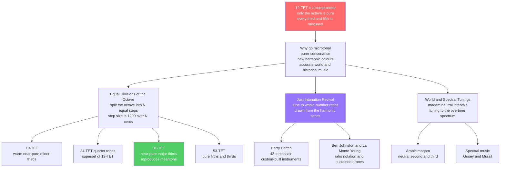

# 🎛️ Microtonality and Alternative Tunings

> [!abstract] TL;DR
> **Microtonality** is any music that uses pitches *between* the twelve equal semitones of the piano — either intervals smaller than a 12-TET semitone (like the **quarter tone**) or entirely different ways of dividing the octave. The motivation is direct: 12-TET is a **compromise** that keeps only the octave pure and mistunes every other interval (its major third is a very audible **14 cents sharp**). The "xenharmonic" world explores the alternatives — **equal divisions of the octave (EDO)** such as **19-TET**, **24-TET** (quarter tones), **31-TET** (which almost perfectly reproduces meantone's near-pure thirds), and **53-TET** (pure fifths *and* thirds); the **just-intonation revival** of Harry Partch, Ben Johnston, and La Monte Young, who chase beatless whole-number ratios; **spectral** composers (Grisey, Murail) who tune to the harmonic series itself; and the living **quarter-tone** traditions of Arabic *maqam*. Digital synthesis makes any tuning a preset, so the old excuse — "you can't build an instrument for it" — is gone. Microtonality is not novelty for its own sake: it buys **new harmonic resources**, faithful **historical performance**, and honest **ethnomusicological** notation.

---

## Intuition

**Analogy first — the cracks between the piano keys.** Look at a piano keyboard and you see twelve keys per octave, evenly spaced, as if those twelve pitches were the only notes that exist. But the piano is not a picture of *sound* — it is a picture of one particular *filing system* for sound, chosen around 1900 for convenience. Between every pair of adjacent keys there is a continuous ribbon of pitch, and inside those "cracks" live thousands of intervals a violinist, a singer, or an *oud* player uses every day without a second thought. Slide a finger up a fretless string and you pass smoothly through all of them; the piano's keys are just the handful of stepping-stones Western keyboards froze into place. Microtonality is simply the decision to *stop pretending the cracks are empty* — to build scales, instruments, and notations that let you land deliberately on the notes the keyboard skips over.

Here is why the cracks matter and are not just "out-of-tune" versions of the real notes. The pure, beatless intervals your ear actually craves — the fifth at exactly 3:2, the major third at exactly 5:4 — do **not** sit on the piano keys. The keyboard's third is a compromise sitting *in a crack, on the wrong side*. So the microtonalist's claim flips the usual intuition on its head: it is often the *black-and-white keys* that are slightly wrong, and the pitch hiding in the crack that is dead in tune.

---

## How It Works

### The problem microtonality answers

Stacking pure intervals can never be squared with twelve equal steps — this is the whole subject of [[Tuning_Systems_and_Temperament]]. Twelve pure fifths overshoot seven octaves by the **Pythagorean comma** (about 23.5 cents), so any 12-note keyboard must *temper* — shave the error somewhere. **12-TET** shaves it perfectly evenly: every semitone is exactly `2^(1/12)`, so all keys are interchangeable, but the price is that only the octave stays pure. The equal-tempered major third lands **13.7 cents sharp** of the pure 5:4, which is well above the roughly **5-cent** threshold a trained ear can hear. Microtonality asks the obvious follow-up question: *if we are going to divide the octave anyway, why stop at twelve?*

### The three roads out of 12-TET

1. **Equal divisions of the octave (EDO / N-TET).** Keep the equal-step idea but change the number of steps. Divide the octave into `N` equal parts, each `1200/N` cents. A larger `N` gives a finer grid that can *land closer* to the pure ratios. The best approximation of any target ratio in `N`-EDO is `round(N * log2(ratio))` steps. Crucially, more steps do not automatically mean "better" — what matters is whether the grid happens to fall near the low-integer ratios. **19-TET** gives warm, near-pure minor thirds; **24-TET** simply inserts a **quarter tone** between every 12-TET semitone (so it *contains* 12-TET and its familiar intervals are no better); **31-TET** places a step within a cent of the pure major third and reproduces quarter-comma **meantone**; **53-TET** nails both pure fifths *and* pure thirds.

2. **Just intonation (JI) revival.** Abandon equal steps entirely and tune directly to whole-number frequency ratios drawn from the [[Pitch_and_the_Harmonic_Series|harmonic series]] — `9/8`, `5/4`, `4/3`, `3/2`, `7/4`, and higher-prime exotica. Chords become **beatless** because the overtones line up exactly (see [[Intervals_and_Consonance]]). **Harry Partch** built a 43-tone-per-octave JI scale in the 1930s-40s and, because no instrument could play it, *invented his own* — the Chromelodeon, Diamond Marimba, Cloud-Chamber Bowls. **Ben Johnston** created an accidentals system to notate ratios on a normal staff; **La Monte Young** sustained JI chords for hours to let listeners inhabit the pure ratios.

3. **Spectral / world tunings.** Tune to a spectrum rather than to a rule. **Spectral** composers (Gérard Grisey, Tristan Murail) analyse a real sound's overtone spectrum and build harmony from those exact (often microtonally inflected) partials — the orchestra becomes a resynthesis of the harmonic series. Living oral traditions did this all along: Arabic and Turkish **maqam** use **neutral** seconds and thirds — pitches roughly *between* the major and minor of Western theory — that no 12-TET keyboard can produce.

### Why 31 beats 12 for thirds (the payoff)

- Pure major third `5:4` = **386.3 cents**. In 12-TET the nearest step is 400 cents → **+13.7 cents** error. In 31-TET the nearest step (10 of them, `10 * 1200/31`) = 387.1 cents → **+0.8 cents** error — essentially perfect.
- The trade: 31-TET's *fifth* is a meantone-style **narrow** fifth (about 5 cents flat), slightly worse than 12-TET's near-pure fifth. You spend fifth-purity to buy third-purity — exactly the meantone bargain, now as a *closed, equal* system.

### Flow / Architecture



---

## Key Concepts

### Secondary Level

**A microtone is a note between the piano keys.** The smallest step on a piano is the **semitone** (100 cents). A **quarter tone** cuts that in half (50 cents) and is the most familiar microtone — it is the "in-between" pitch you hear bending a guitar string halfway or in a lot of Middle-Eastern music. Anything that uses such in-between pitches, or that divides the octave into a number of steps other than twelve, is **microtonal**.

**Why bother?** Because 12-TET is a *compromise*, not a law of nature. The piano's fifths and thirds are all slightly out of tune — you have just grown up hearing it and it sounds "normal." A singer or a string quartet, free of frets and keys, instinctively drifts toward the *pure* versions of those intervals because they sound smoother (beatless). Microtonality gives fixed instruments a way to reach those purer notes, and gives composers brand-new intervals no piano can play.

**The octave is still the octave.** Almost every microtonal system still treats the 2:1 octave as home base and just divides *inside* it differently — into 19, 24, 31, or more equal steps, or into hand-picked pure ratios. So microtonality is less "throw out music theory" and more "use a finer ruler."

**Other cultures never used only twelve.** Arabic, Turkish, Persian, and Indian classical musics all use pitches between the Western semitones as an ordinary part of their scales — the quarter-tone-ish "neutral" third of a *maqam* is not an error, it is the correct, characteristic note. Western 12-TET is one local choice, not the universal one.

### Undergraduate Level

**Equal divisions of the octave (EDO), quantified.** In `N`-EDO every step is `1200/N` cents and any pitch is `k * 1200/N` for integer `k`. To find how well a system serves a pure interval, compute its **best approximation**: the number of steps is `round(N * log2(ratio))` and the error is `(that many steps in cents) - (the pure interval in cents)`. This single formula explains the whole EDO zoo:

| System | Step (cents) | Best M3 vs 5:4 | Best P5 vs 3:2 | Character |
|---|---|---|---|---|
| **12-TET** | 100.0 | +13.7 (sharp) | -2.0 | Universal default; thirds noticeably beat |
| **19-TET** | 63.2 | -7.4 | -7.2 | Warm; near-pure minor thirds; third-comma meantone |
| **24-TET** | 50.0 | +13.7 | -2.0 | 12-TET plus quarter tones; consonances *no better* |
| **31-TET** | 38.7 | **+0.8** | -5.2 | Near-pure thirds; equals quarter-comma meantone |
| **53-TET** | 22.6 | -1.4 | **-0.1** | Pure fifths *and* thirds; 5-limit JI in disguise |

The lesson: **24-TET does not fix the third at all** — because it contains 12-TET, its best major third is still the +13.7-cent one. The quarter tones buy *new melodic colours and neutral intervals*, not better triads. **31-TET**, by contrast, is transformative for harmony precisely because its grid falls next to `5:4`.

**Why these numbers and not others?** The unusually good EDOs (12, 19, 31, 41, 53) are the **continued-fraction convergents** of the relevant logarithms — 12 and 53 are excellent for the pure fifth `log2(3/2)`; 19 and 31 are excellent for meantone/thirds. This is the same continued-fraction fact that makes 12 the smallest workable Western division.

**Just intonation as a lattice, not a ladder.** A JI system is generated by prime ratios (2, 3, 5, sometimes 7, 11, ...), forming a multi-dimensional **pitch lattice** rather than a single row of equal steps. Partch's **43-tone scale** is an 11-limit JI lattice folded into one octave. The reward is beatless consonance; the cost is that the number of usable pitches explodes and modulation to a distant key demands new pitches the instrument may not have.

**Neutral intervals of maqam.** The *maqam* "neutral third" sits near **350 cents** — roughly halfway between the 300-cent minor and 400-cent major third — and is genuinely ambiguous to a Western ear. It is *not* well modelled by 24-TET's quarter tone alone (which would put it at exactly 350) because performed intonation is flexible and context-dependent; this is why fixed quarter-tone notation of Arabic music is a well-known approximation, not a transcription.

### Graduate Level

**The notation problem.** Standard staff notation encodes only 12 pitch classes, so every microtonal system needs an **accidental extension**, and there is no universal standard — a real obstacle to the repertoire. Approaches include: **quarter-tone accidentals** (the half-sharp and half-flat, e.g., Ivan Wyschnegradsky, and used loosely for *maqam*); **Ben Johnston's ratio-based accidentals**, where the plain natural is a pure 5-limit interval and further symbols raise or lower by a syntonic comma (`+`/`-`), a septimal comma (`7`/upside-down `7`), and so on; **Sagittal**, a systematic microtonal accidental system covering arbitrary JI and EDO pitches by comma; and **HEWM/Helmholtz-Ellis** notation for extended just intonation. The lack of consensus means a microtonal score often ships with its own legend.

**Adaptive tuning.** Fixed-pitch instruments face a dilemma JI cannot escape: a *comma pump* progression (e.g., I-vi-ii-V-I in strict 5-limit JI) drifts the tonic downward by a syntonic comma each cycle. **Adaptive tuning** (the "Hermode" tuning in some synths, and Sethares/Stange-Elbe algorithms) solves this in software: it re-tunes each chord toward just intonation *vertically* while nudging pitches minimally to keep the *melodic* line and the tonic stable. It is real-time temperament — impossible on a harpsichord, trivial in a DAW.

**Spectral tuning and inharmonicity.** Spectral composers derive harmony from a **Fourier analysis** of a recorded sound, orchestrating its partials at their true (often non-12-TET) frequencies (see [[Timbre_and_the_Spectrum]]). This ties tuning to *timbre*: Sethares showed that consonance is a joint property of scale **and** spectrum, so for **inharmonic** timbres (gamelan metallophones, bells, FM synthesis) the most consonant scale is *not* built from simple ratios at all — the Bohlen-Pierce scale (a division of the `3:1` "tritave," not the octave) is consonant precisely for spectra rich in odd harmonics. Microtonality and synthesis are therefore deeply entwined (see [[Digital_Audio_Fundamentals]]).

**Perception limits.** Whether a microtonal distinction is *usable* depends on psychoacoustics (see [[Psychoacoustics_and_Pitch_Perception]]). The pitch **just-noticeable difference** is roughly 3-5 cents for sustained tones in the mid-register but widens in fast passages, in the extreme bass, and for short notes. A 53-TET step (22.6 cents) is comfortably resolvable melodically; distinguishing a `5:4` from a `81:64` third (21.5 cents apart) in a *chord* is easy because of **beating**, not because of raw pitch resolution — the two mistuned thirds sound different because one beats and one does not, a harmonicity cue rather than a place-pitch cue.

**Why microtonality matters, precisely.** Three non-aesthetic arguments. (i) **New harmonic resources**: 31-TET offers consonant `7:4`, `7:5`, and `11:8` intervals with no 12-TET counterpart, a genuinely larger chord vocabulary. (ii) **Historically informed performance**: Renaissance and Baroque music was *composed for* meantone/well temperaments; 31-TET or actual meantone restores the intended key colours that 12-TET erased. (iii) **Ethnomusicological accuracy**: transcribing *maqam*, Indonesian *slendro/pelog*, or Indian *sruti* into 12-TET is a systematic falsification; microtonal analysis is the difference between describing the music and rewriting it.

---

## Python Demo

We compare **equal divisions of the octave** numerically. First we compute the pitch ladder (in cents) of **12-TET**, **19-TET**, **24-TET** (quarter tones), and **31-TET** across one octave, alongside a **just-intonation** major scale for reference. Second, for each system we find its **best approximation** of the pure major third `5:4` and pure fifth `3:2` and plot the error — showing that **31-TET nails the third to under a cent** while 12-TET is nearly 14 cents sharp, and that **24-TET's quarter tones do not improve the triad at all**. numpy and matplotlib only.

```python
import numpy as np
import matplotlib.pyplot as plt

# ------------------------------------------------------------------
# cents = 1200 * log2(ratio).  The log turns interval STACKING
# (multiplication of ratios) into ADDITION of cents.
# ------------------------------------------------------------------
def cents(ratio):
    return 1200.0 * np.log2(ratio)

# Equal Divisions of the Octave to compare.
edos = [12, 19, 24, 31, 53]

# Pure just-intonation targets we want every system to hit.
M3_cents = cents(5/4)   # pure major third  = 386.31 cents
P5_cents = cents(3/2)   # pure perfect fifth = 701.96 cents

# Best approximation of a target interval inside an N-EDO grid:
#   nearest number of equal steps, its size in cents, and the signed error.
def best_edo_approx(N, target_cents):
    step   = 1200.0 / N
    k      = int(round(target_cents / step))   # nearest whole number of steps
    approx = k * step
    return k, approx, approx - target_cents

# ------------------------------------------------------------------
# 1. Print the approximation table.
# ------------------------------------------------------------------
print(f"Pure major third 5:4  = {M3_cents:6.2f} cents")
print(f"Pure perfect fifth 3:2 = {P5_cents:6.2f} cents\n")
print("EDO  step(c)  M3 steps  M3approx  M3 err    P5 steps  P5approx  P5 err")
m3_err, p5_err = [], []
for N in edos:
    k3, a3, e3 = best_edo_approx(N, M3_cents)
    k5, a5, e5 = best_edo_approx(N, P5_cents)
    m3_err.append(e3); p5_err.append(e5)
    print(f"{N:>3d}  {1200/N:6.2f}    {k3:>4d}   {a3:8.2f}  {e3:+6.2f}     "
          f"{k5:>4d}   {a5:8.2f}  {e5:+6.2f}")

# ------------------------------------------------------------------
# 2. A just-intonation major scale, in cents, for the pitch ladder.
# ------------------------------------------------------------------
ji_major   = np.array([1/1, 9/8, 5/4, 4/3, 3/2, 5/3, 15/8, 2/1])
ji_cents   = cents(ji_major)

# ------------------------------------------------------------------
# Plot
# ------------------------------------------------------------------
fig, ax = plt.subplots(1, 2, figsize=(14, 6))

# --- Panel 1: the pitch ladders (finer EDO = denser grid of pitches) ---
ladder_edos = [12, 19, 24, 31]
for xi, N in enumerate(ladder_edos):
    degs = np.arange(N + 1) * (1200.0 / N)      # every degree in the octave
    ax[0].scatter(np.full_like(degs, xi), degs, s=16, color="#1f77b4")

xi_ji = len(ladder_edos)
ax[0].scatter(np.full_like(ji_cents, xi_ji), ji_cents,
              s=60, color="#d62728", marker="_", linewidths=2)

ax[0].axhline(M3_cents, color="#2ca02c", ls="--", lw=1, label="pure major third 5:4")
ax[0].axhline(P5_cents, color="#9467bd", ls="--", lw=1, label="pure fifth 3:2")
ax[0].set_xticks(list(range(len(ladder_edos) + 1)))
ax[0].set_xticklabels([f"{N}-TET" for N in ladder_edos] + ["JI major"])
ax[0].set_ylabel("Pitch within the octave (cents)")
ax[0].set_ylim(-20, 1220)
ax[0].set_title("Equal divisions of the octave\nmore steps means a finer pitch grid")
ax[0].legend(fontsize=8, loc="lower right")
ax[0].grid(True, axis="y", ls="--", alpha=0.3)

# --- Panel 2: how far each system's best third and fifth miss the pure ratio ---
x = np.arange(len(edos))
w = 0.38
ax[1].bar(x - w/2, m3_err, w, label="best major third error", color="#2ca02c")
ax[1].bar(x + w/2, p5_err, w, label="best fifth error",       color="#9467bd")
ax[1].axhline(0, color="black", lw=1)
ax[1].axhline( 5, color="gray", ls=":", lw=1)
ax[1].axhline(-5, color="gray", ls=":", lw=1)
ax[1].text(len(edos) - 0.5, 5.6, "plus or minus 5 cents ~ JND",
           fontsize=7, color="gray", ha="right")
ax[1].set_xticks(x)
ax[1].set_xticklabels([f"{N}-TET" for N in edos])
ax[1].set_ylabel("Error from the pure ratio (cents)")
ax[1].set_title("Approximation of just consonances\n"
                "31-TET nails the third; 12-TET is +14 cents sharp; 24-TET no better")
ax[1].legend(fontsize=8)
ax[1].grid(True, axis="y", ls="--", alpha=0.3)

plt.tight_layout()
plt.show()

# Expected highlights:
#   * 12-TET third = +13.7 c; 24-TET third = +13.7 c (identical -- quarter
#     tones do NOT improve the triad, since 24-TET contains 12-TET).
#   * 31-TET third = +0.8 c (near-pure), at the cost of a -5.2 c narrow fifth.
#   * 53-TET nails BOTH: third -1.4 c, fifth -0.1 c (5-limit just intonation).
#   * Panel 1: the JI-major column's markers land ON the green/purple pure lines,
#     while the 12-TET dots sit visibly above the pure major third.
```

---

## Real-World Applications

**Digital synthesis and DAWs make any tuning free.** A software synth computes pitch straight from frequency, so loading a **Scala (.scl) tuning file** — 19-TET, 31-TET, Partch's 43-tone JI, or a custom *maqam* — is a one-click preset. This inverted the historical constraint: for centuries microtonality meant *building a new instrument*; today it is a menu. **MPE (MIDI Polyphonic Expression)** and MIDI 2.0 give every note its own pitch bend, so per-note microtuning and adaptive tuning run in real time (see [[Digital_Audio_Fundamentals]]).

**Harry Partch's instrument orchestra.** Unable to buy an instrument for his 43-tone just-intonation scale, Partch spent decades building his own — the Chromelodeon (a retuned reed organ), the Diamond Marimba (laid out as his tonality diamond), the Cloud-Chamber Bowls, the Kithara. The instruments *are* the theory made physical, and his works (*Delusion of the Fury*, *And on the Seventh Day Petals Fell in Petaluma*) can only be performed on them.

**Historically informed keyboard performance.** Early-music ensembles re-tune harpsichords and organs to **meantone** or **well temperaments** because Renaissance and Baroque music was composed for those systems. Playing this repertoire in **31-TET** (a modern, closed stand-in for quarter-comma meantone) restores the pure thirds and distinct key colours that 12-TET flattens away — a direct microtonal application (see [[Tuning_Systems_and_Temperament]]).

**Living world traditions.** Arabic, Turkish, Persian, and Egyptian classical musics use **quarter-tone-inflected** *maqam* scales as their everyday language; the *qanun* has small tuning levers (*mandal*) to shift pitches by fractions of a semitone mid-performance. Indonesian **gamelan** uses non-octave-equivalent *slendro* and *pelog* tunings that vary from ensemble to ensemble by design. Indian classical music theorises **22 srutis** per octave as the intonational palette behind its ragas.

**Spectral and contemporary concert music.** Spectral composers (Grisey's *Partiels*, Murail's *Gondwana*) orchestrate the microtonally-inflected partials of an analysed sound. Composers such as Ben Johnston (String Quartet No. 7 uses over 1,200 distinct pitches), Georg Friedrich Haas, and Kaija Saariaho write extended-JI and quarter-tone scores that are now standard advanced-repertoire, and the electronic-music scene explores EDOs from 5 to 72 as a matter of course.

---

## Common Pitfalls

- **Thinking microtonal just means "out of tune."** Pure just intervals (`3:2`, `5:4`) are *more* in tune than the piano's — they beat *less*. A JI third is not a detuned piano third; the piano third is a detuned JI third. Microtonality is often a move *toward* acoustic purity, not away from it.
- **Assuming more EDO steps is always better.** **24-TET does not improve the major third at all** — because it contains 12-TET, its best triad is still 13.7 cents sharp. Quarter tones buy *new melodic and neutral intervals*, not better harmony. What matters is *where* the grid falls (31-TET beats 24-TET for thirds despite having more of the "wrong" kind of extra note only in one case).
- **Equating quarter tones with maqam.** Notating Arabic *maqam* in strict 24-TET quarter tones is a convenient approximation, not the truth: performed neutral intervals are flexible, context-dependent, and region-specific, and often sit a few cents off the exact quarter-tone grid. The fixed grid falsifies a living, inflected practice.
- **Ignoring the notation problem.** There is no universal microtonal notation. A score in Johnston, Sagittal, Helmholtz-Ellis, or ad-hoc quarter-tone accidentals is unreadable without its legend, and mixing systems silently corrupts pitch. Always specify the tuning and the accidental scheme.
- **Forgetting the comma drift in just intonation.** Strict 5-limit JI on fixed pitches drifts flat through common progressions (the comma pump); a naive "just" retuning of a chord sequence will sink in pitch. Real JI performance needs adaptive tuning or deliberate comma management.
- **Treating tuning as independent of timbre.** Simple-ratio consonance assumes **harmonic** spectra. On inharmonic timbres (bells, gamelan, FM synthesis) the most consonant scale is *not* built from simple ratios — consonance is a joint property of scale and spectrum (see [[Timbre_and_the_Spectrum]]).

---

## Related Concepts

- [[Tuning_Systems_and_Temperament]] — The foundation: why 12-TET is a compromise and how meantone, well temperament, and the commas work. Microtonality is the "what comes after 12-TET" chapter of that story, and 31-TET is quarter-comma meantone made into a closed equal system.
- [[Intervals_and_Consonance]] — Defines the pure ratios (`3:2`, `5:4`, `7:4`) that microtonal systems chase and the beating/roughness mechanism by which we hear one third as purer than another.
- [[Pitch_and_the_Harmonic_Series]] — The overtone series is *where* just intonation and spectral tuning draw their ratios from; higher-prime microtonality simply reaches further up the series.
- [[Scales_and_Modes]] — Microtonal scales (19-TET modes, Partch's tonality diamond, *maqam*, *pelog*) generalise the diatonic scale-building logic beyond twelve notes.
- [[Timbre_and_the_Spectrum]] — Spectral tuning and inharmonic-timbre scale design tie the choice of tuning directly to the sound's Fourier spectrum; consonance is a joint property of scale and timbre.
- [[Psychoacoustics_and_Pitch_Perception]] — The pitch just-noticeable difference and beating cues determine which microtonal distinctions are actually audible and usable.
- [[Digital_Audio_Fundamentals]] — Digital synthesis computes pitch directly from frequency, which is what makes arbitrary tunings trivial to realise (Scala files, per-note pitch bend, adaptive tuning).

---

## Review Questions

### Secondary

1. A piano has twelve keys per octave, but a singer or violinist can produce pitches "between the keys." In plain language, explain what a **quarter tone** is, and why a microtonalist would argue that some of the *in-between* pitches are actually more in tune than the piano keys themselves.

### Undergraduate

2. Using `cents = 1200 * log2(ratio)` and the best-approximation rule `steps = round(N * log2(ratio))`: (a) Show that the pure major third `5:4` is about 386 cents, and find the best major-third approximation and its error in both **12-TET** and **31-TET**. (b) Explain why **24-TET** (quarter tones) has *exactly the same* major-third error as 12-TET despite having twice as many notes. (c) 31-TET's third is nearly pure but its fifth is about 5 cents flat — what historical temperament is 31-TET reproducing, and what is being traded for what?

### Graduate

3. A composer wants to write beatless 5-limit just-intonation harmony for a fixed-pitch electronic instrument, using a I-vi-ii-V-I progression. (a) Explain the **comma-pump** problem this progression creates in strict JI and by how much the tonic drifts. (b) Describe how **adaptive tuning** resolves it, and what it optimises (vertical purity vs melodic/tonic stability). (c) The same composer then wants the piece playable from a standard staff by other performers — discuss the **notation problem** and name at least two microtonal notation systems, explaining what each encodes. (d) Finally, if the timbre is made **inharmonic**, why might simple ratios *stop* being the most consonant choice, and what does that imply for the tuning?

---

## Sources

- Partch, Harry (1949/1974). *Genesis of a Music* (2nd ed.). Da Capo Press. — The foundational text of the 20th-century just-intonation revival, the 43-tone scale, and Partch's instruments.
- Sethares, William A. (2005). *Tuning, Timbre, Spectrum, Scale* (2nd ed.). Springer. — Quantitative theory of consonance as a joint property of tuning and timbre; EDO approximation, adaptive tuning, and inharmonic scales.
- Gann, Kyle (2019). *The Arithmetic of Listening: Tuning Theory and History for the Impractical Musician*. University of Illinois Press. — Accessible modern survey of just intonation, EDOs, and the microtonal repertoire.
- Fokker, Adriaan D. (1955). "Equal Temperament and the Thirty-one-keyed Organ." *The Scientific Monthly*, 81(4), 161-166. — The case for 31-TET as a practical near-meantone equal division, by the builder of the Fokker organ.
- Doty, David B. (2002). *The Just Intonation Primer* (3rd ed.). Just Intonation Network. — Practical introduction to JI ratios, lattices, and notation.

---

#music-theory #microtonality #xenharmonic #tuning #quarter-tones
