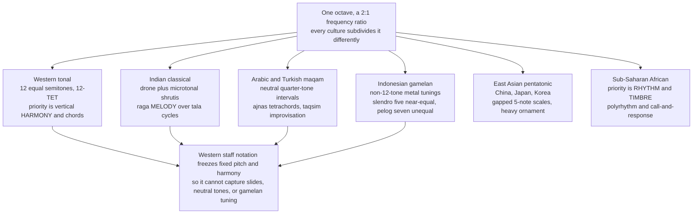

# 🌍 World Music Scales and Systems

> [!abstract] TL;DR
> Western tonal harmony — 12 equal semitones, major/minor keys, chord progressions — is **one musical system among many**, not the default of nature. Across the world, music organizes pitch with drones and microtonal inflections (Indian **raga**), quarter-tones and modal improvisation (Arabic/Turkish **maqam**), non-12-tone metal tunings (Indonesian **slendro/pelog**), gapped pentatonics (East Asia), and timbre-plus-polyrhythm priorities (Sub-Saharan Africa). Studying them dissolves the illusion that the piano keyboard is universal and reveals which features of music are cultural conventions versus genuine human universals.

---

## Intuition

**Analogy:** Imagine four master chefs handed the *same* raw ingredient — a whole octave of pitch, the doubling of frequency our ears hear as "the same note higher." One chef slices it into **12 identical portions** and builds elaborate stacked "chord" dishes (Western). Another refuses to pre-slice at all: she keeps a constant background hum going and *bends and slides* through the space between the cuts, and each recipe forbids certain moves and mandates certain phrases (Indian raga). A third slices it into portions that are deliberately **wider than a Western semitone but narrower than two** — the "quarter-tone" flavors that a piano simply cannot cook (Arabic maqam). The fourth throws out the ruler entirely and forges metal bars into **five nearly-but-not-quite-equal chunks**, tuned by ear so no two orchestras match (Indonesian gamelan).

Same octave, four utterly different cuisines. The Western listener's instinct that the others are "out of tune" is exactly like a diner insisting all food should taste like their grandmother's cooking. **Ethnomusicology** is the discipline that takes each cuisine on its own terms.

The technical translation: an octave is a 2:1 frequency ratio, and every tradition subdivides that ratio — but *how many* divisions, whether they are *equal*, whether pitch is *fixed or fluid*, and whether the organizing priority is *harmony, melody, timbre, or rhythm* are all cultural choices, not acoustic necessities.

---

## How It Works

### Core Mechanics

The single most useful unit for comparing systems is the **cent**: 1200 cents = one octave, so one Western semitone = exactly 100 cents. Cents are logarithmic (equal ratios sound like equal steps), which lets us lay every scale on one ruler and see where its notes fall relative to the piano's cracks.

1. **Western tonal harmony (12-TET).** The octave is split into 12 *mathematically equal* steps, each multiplying frequency by `2^(1/12) ≈ 1.0595`. This equal division is a compromise (see [[Intervals_and_Consonance]] and [[Scales_and_Modes]]): it detunes every interval except the octave slightly, in exchange for the freedom to modulate to any key and stack **vertical harmony** (chords, functional progressions). Harmony is the organizing priority.

2. **Indian classical music (Hindustani & Carnatic).** Pitch is organized *melodically and horizontally*, not by chords. Key elements:
   - **Drone (tanpura):** a constant sounding tonic (Sa) and fifth (Pa). With a fixed reference always present, the ear becomes exquisitely sensitive to microtonal shading of every other note.
   - **Shrutis:** the octave is conceptually divided into **22 microtonal shrutis** — unequal, just-intonation-flavored steps. The 7 main notes (swaras: Sa Re Ga Ma Pa Dha Ni) are drawn from these, and their exact tuning shifts by raga.
   - **That / melakarta:** parent scale frameworks. Hindustani music groups ragas under **10 thaats**; Carnatic music under **72 melakarta** parent scales — a combinatorial system generating all 7-note scales.
   - **Raga:** far more than a scale. A raga specifies ascending/descending note sets (arohana/avarohana), characteristic phrases (pakad), notes to stress or bend (gamaka/andolan), a mood (rasa), and even a time of day. Two ragas can share the same notes yet be different ragas because of *how* the notes are approached.
   - **Tala:** cyclic rhythmic frameworks (e.g. 16-beat Teental) with a defined cycle of stressed and empty beats — a rhythmic architecture as deep as the melodic one (a topic for a forthcoming Advanced Rhythm note).

3. **Arabic / Turkish / Persian maqam.** A **modal** system built on **quarter-tones and neutral intervals** — notes sitting *between* the Western minor and major (e.g. a "neutral third" around 350 cents, halfway between 300 and 400). Elements:
   - **Ajnas (singular jins):** tetrachord/pentachord building blocks. A maqam is assembled from a lower jins and an upper jins glued at a junction note.
   - **Neutral intervals:** the half-flat (Arabic *sika*, Turkish *koma* microtones) that give Maqam Rast, Bayati, and Saba their unmistakable color — impossible on a fixed 12-tone keyboard.
   - **Taqsim:** unmetered, improvised solo exploration of a maqam, gradually revealing its modulations between ajnas.

4. **Indonesian gamelan (Java & Bali).** Bronze/iron gong-and-metallophone orchestras tuned to **non-12-TET** scales, and crucially, **each ensemble is tuned to itself** — instruments are built as a matched set, so a piece cannot simply migrate to another gamelan:
   - **Slendro:** five **near-equal** tones (~240 cents each), but never exactly equal — the small irregularities are prized character, not error.
   - **Pelog:** seven **unequal** tones with a mix of large and small steps; most pieces use a 5-note subset (pathet).
   - **Kotekan:** two players interlock fast complementary parts so the *combined* result is a single rapid line neither plays alone — a texture, not a scale, feature.

5. **East Asian pentatonic systems.** China (the *gong-shang-jiao-zhi-yu* pentatonic derived historically from a cycle-of-fifths *sanfen sunyi* method), Japan (the *yo* bright and *in* dark pentatonic scales, the latter with characteristic half-steps), and Korea all foreground **5-note, gapped scales** that avoid semitone clashes, with heavy emphasis on ornamentation, vibrato, and pitch-bending on instruments like the guzheng, koto, and gayageum.

6. **Sub-Saharan African music.** Frequently the organizing priorities are **rhythm and timbre rather than pitch-scale**: dense **polyrhythm** and cross-rhythm (multiple simultaneous meters), **call-and-response** antiphony, and deliberate **timbral "noise"** (buzzing membranes on mbira/kora, rattles) valued as beauty. Pitch systems vary widely and are often heptatonic or pentatonic with their own tunings.

7. **Andean, Balkan, and other traditions.** Andean music uses pentatonic melodies on panpipes (siku) split antiphonally between two players (hocket). Balkan music (Bulgaria, Macedonia) is famous for **aksak** "limping" additive meters like 7/8 = 2+2+3 and 11/8, plus dense vocal seconds. These show that even *within* broadly Western-tuned pitch, rhythm and texture diverge sharply.

8. **Heterophony and the limits of Western notation.** Much of this music is **heterophonic**: several performers play the *same* melody simultaneously but each ornaments it differently — neither the unison of Western melody nor the independent voices of counterpoint. Western five-line staff notation, built to freeze fixed pitches and vertical harmony, **cannot faithfully capture** sliding gamaka, neutral intervals, gamelan tunings, or the elastic timing of these traditions; transcriptions are approximations at best (a limitation shared with capturing spoken pitch — see [[Prosody_and_Suprasegmentals]]).

9. **Cultural relativism vs universals.** Ethnomusicology insists we judge each system by its own aesthetics (relativism). Yet **near-universals** do exist: the octave (2:1) is recognized almost everywhere, most cultures use ~5–7 pitches per octave rather than 12+ or 3, and lullabies and dance rhythms are cross-culturally identifiable. The open research question — which features are wired into human [[Psychoacoustics_and_Pitch_Perception]] versus learned — sits at the border of a forthcoming Music Cognition note and echoes the same relativism/universals debate in [[Phonological_Typology_and_Universals]].

### Flow / Architecture



---

## Key Concepts

**Secondary (high-school level).** The 12 notes on a piano are not a law of nature — they are one culture's choice. Indian music keeps a constant drone hum and slides between notes; Arabic music uses "quarter-tones" that live between the piano keys; Indonesian gamelan orchestras use 5 or 7 notes tuned so each orchestra sounds slightly different from every other. Some music (much African drumming) cares more about layered *rhythm* and *drum timbre* than about which notes. "Out of tune" often just means "tuned to a different system."

**Undergraduate (music-theory / ethnomusicology core).** Use **cents** (1200 per octave) to compare systems quantitatively. Understand that a **raga** is a melodic framework (arohana/avarohana, pakad, gamaka, rasa), not merely a scale, and that thaat/melakarta are its parent-scale taxonomy. Analyze a **maqam** as a chain of **ajnas** (tetrachords) with **neutral thirds/sevenths**, and distinguish **slendro** (5 near-equal) from **pelog** (7 unequal). Recognize **heterophony** as a distinct texture from monophony, homophony, and polyphony, and articulate why Western notation systematically distorts non-fixed-pitch traditions.

**Graduate (advanced / theoretical).** Model each system as a subset of pitch space measured in cents and compare against just-intonation ratios and the harmonic series ([[Pitch_and_the_Harmonic_Series]]): Indian shruti tuning approximates just intervals (Ga at ~386 cents = 5:4, not 400); maqam neutral tones resist any simple ratio and vary regionally; slendro resists a generative theory altogether, being tuned by ear per-ensemble. Engage the **relativism–universals** debate empirically: statistical work (e.g. Savage et al.) finds cross-cultural regularities (discrete pitches, octave equivalence, isochronous beats) alongside vast diversity, and probe how much derives from cochlear/neural constraints versus enculturation. Consider **timbre-centric** aesthetics (African "noise" ideals, gamelan *ombak* beating) as a challenge to pitch-and-harmony-centric Western theory itself.

---

## Python Demo

```python
# Compare how four musical traditions carve up ONE octave.
# Everything is expressed in CENTS: 1200 cents = one octave, and one
# Western 12-TET semitone = exactly 100 cents. Plotting every system on
# the same 0..1200 cents ruler shows where non-Western tones fall
# *between the cracks* of the Western piano.
import numpy as np
import matplotlib.pyplot as plt

# --- 1. Western 12-TET: twelve mathematically EQUAL steps of 100 cents ---
tet12 = np.arange(0, 1300, 100)          # 0,100,...,1200

# --- 2. Indian (Bilawal thaat), read with just-intonation SHRUTI ratios ---
#     Sa Re Ga Ma Pa Dha Ni Sa. Cents = 1200*log2(ratio) of pure intervals,
#     so Ga lands at ~386c (the pure 5:4 third), NOT the 400c of 12-TET.
indian_ratios = np.array([1/1, 9/8, 5/4, 4/3, 3/2, 5/3, 15/8, 2/1])
indian = 1200 * np.log2(indian_ratios)

# --- 3. Arabic Maqam Rast: note the NEUTRAL 3rd (~355c) and 7th (~1055c) ---
#     These half-flat "quarter-tones" sit between Western minor and major
#     and cannot be played on a fixed 12-key piano.
rast = np.array([0, 204, 355, 498, 702, 906, 1055, 1200], dtype=float)

# --- 4. Indonesian slendro: five NEAR-equal steps (~240c), never exactly ET ---
#     Real gamelans differ set-to-set; these are representative measured values.
slendro = np.array([0, 245, 476, 720, 953, 1200], dtype=float)

systems = [
    ("Western 12-TET  (12 equal)",   tet12,   "tab:blue"),
    ("Indian Bilawal thaat  (JI)",   indian,  "tab:green"),
    ("Arabic Maqam Rast",            rast,    "tab:red"),
    ("Indonesian slendro  (5-tone)", slendro, "tab:purple"),
]

# --- numeric comparison: how far each tone strays from the 12-TET grid ---
for name, cents, _ in systems:
    nearest = np.round(cents / 100) * 100
    dev = cents - nearest                      # deviation from nearest semitone
    print(f"\n{name}")
    print("  cents        :", np.round(cents).astype(int).tolist())
    print("  off-grid (c) :", np.round(dev).astype(int).tolist())

# --- plot: one horizontal ruler per system on a shared cents axis ---
fig, ax = plt.subplots(figsize=(12, 5))

for gx in range(0, 1300, 100):                 # faint 12-TET reference grid
    ax.axvline(gx, color="lightgray", lw=0.8, zorder=0)

n = len(systems)
for row, (name, cents, color) in enumerate(systems):
    y = n - 1 - row                            # first system on top
    ax.hlines(y, 0, 1200, color="black", lw=1, zorder=1)
    ax.vlines(cents, y - 0.28, y + 0.28, color=color, lw=3, zorder=2)
    ax.plot(cents, np.full(len(cents), y), "o", color=color, ms=6, zorder=3)

ax.set_yticks([n - 1 - r for r in range(n)])
ax.set_yticklabels([systems[r][0] for r in range(n)])
ax.set_xticks(range(0, 1300, 100))
ax.set_xlabel("Cents within one octave  (100 cents = one Western semitone)")
ax.set_xlim(-30, 1230)
ax.set_ylim(-0.6, n - 0.4)
ax.set_title("Four traditions divide the same octave differently\n"
             "gray lines = the Western 12-TET grid; colored ticks = each system's notes")
plt.tight_layout()
plt.show()
```

Running it prints each system's pitches in cents and their deviation from the nearest piano key: the Indian just-intonation third comes out ~14 cents *flat* of 12-TET; Rast's neutral third sits ~55 cents off (squarely between the cracks); and slendro's five steps drift off the equal grid by tens of cents in both directions. The plot stacks four rulers over the same octave so you can *see* that the Western grid is just one way to cut the pie — the other systems' ticks land in the gaps.

---

## Real-World Applications

> **Example — Gamelan tuning that cannot be recreated on a synth preset:** When composer Lou Harrison and instrument builders craft an American gamelan, they must physically tune each metal key by filing it, because there is no standard slendro/pelog frequency table — the ensemble's identity *is* its unique tuning. A software sampler loading one gamelan's recordings will clash with any other, which is exactly why the demo shows slendro as irregular near-equal steps rather than a clean formula.

- **Film and game scoring:** the neutral intervals of maqam signal "Middle East," slendro/pelog gongs signal "Southeast Asia," and shruti-inflected sitar signals "India" — composers borrow these systems as sonic shorthand (with ongoing debates about appropriation and accuracy).
- **Digital audio and MIDI limits:** standard MIDI assumes 12-TET, so reproducing maqam quarter-tones or Indian gamaka requires **pitch-bend messages, MPE (MIDI Polyphonic Expression), or microtonal tuning tables (Scala .scl files)** — a direct engineering consequence of Western tools baking in one system.
- **Music Information Retrieval:** key- and scale-detection algorithms trained on Western data fail on raga or maqam; specialized systems model raga via pitch-distribution histograms and pakad phrase detection, and maqam via jins segmentation.
- **Ethnomusicological fieldwork:** researchers measure real tunings with electronic pitch analyzers precisely because notation and Western ears mislead — see [[Ethnographic_Methods_and_Fieldwork]] for the methodology and [[Oral_Tradition_and_Narrative]] for how these systems transmit without notation.
- **Cross-cultural collaboration:** projects pairing a sitarist with a jazz group, or a maqam ensemble with an orchestra, must negotiate the tuning gap explicitly — often by retuning the fixed-pitch instruments or restricting to compatible pitches.

---

## Common Pitfalls

- **Calling non-Western music "out of tune."** The most common ethnocentric error. A maqam neutral third or a slendro step is precisely tuned — to a *different* system. "In tune" is only meaningful relative to a chosen tuning framework.
- **Treating a raga as just a scale.** A raga encodes phrases, ornaments, note hierarchy, ascending/descending asymmetry, and mood. Two ragas with identical notes (e.g. sharing a thaat) can be entirely distinct pieces of musical identity. Reducing it to "an exotic scale" misses the whole art.
- **Forcing everything onto the piano / 12-TET grid.** Quantizing maqam or gamelan to the nearest 12-TET semitone destroys the neutral intervals and unique tunings that *define* those musics — the very off-grid deviations the demo highlights.
- **Assuming harmony is the point everywhere.** Western theory is chord-obsessed; in Indian, Arabic, and much African music, vertical harmony is nearly absent and the depth lives in melody, microtiming, rhythm, or timbre. Looking for chord progressions where there are none is a category error.
- **Mistaking heterophony for sloppy unison.** When many performers ornament one melody differently, the "blur" is the intended texture (see the forthcoming Texture note), not players failing to synchronize.
- **Believing Western notation is a neutral universal.** The staff was engineered for fixed pitch and harmony; every transcription of raga glides, maqam quarter-tones, or gamelan tuning silently discards information. Notation shapes what a tradition can even conceive.
- **Over-correcting into pure relativism.** Denying *all* universals is also wrong: octave equivalence, discrete pitch sets of modest size, and isochronous pulse recur across cultures. The honest position is "mostly diverse, with a few deep commonalities."

---

## Related Concepts

- [[Scales_and_Modes]] — the Western baseline (12-TET, diatonic modes) that this note reframes as one system among many; its Graduate section already flags maqam, slendro, and raga thaats.
- [[Intervals_and_Consonance]] — cents, ratios, and why equal temperament is a compromise; the measuring stick for comparing all these tunings.
- [[Pitch_and_the_Harmonic_Series]] — the overtone series behind just intonation, which Indian shruti tuning approximates and 12-TET deliberately detunes.
- [[Rhythm_Meter_and_Tempo]] — Western meter, the foundation the polyrhythm, tala cycles, and Balkan aksak meters of world traditions extend and complicate.
- [[Psychoacoustics_and_Pitch_Perception]] — how the ear maps frequency to pitch, the substrate underlying the cross-cultural relativism-vs-universals debate.
- [[Timbre_and_the_Spectrum]] — the spectral analysis behind the timbre-centric aesthetics of African music and the metallic beating (ombak) of gamelan.
- [[Culture_Symbols_and_Meaning]] *(Anthropology)* — cultural relativism as an interpretive stance, applied here to music.
- [[Ethnographic_Methods_and_Fieldwork]] *(Anthropology)* — the fieldwork methodology ethnomusicology inherits for documenting living traditions.
- [[Oral_Tradition_and_Narrative]] *(Anthropology)* — how raga and maqam are transmitted teacher-to-student without notation.
- [[Prosody_and_Suprasegmentals]] *(Linguistics)* — linguistic pitch and tone, a parallel case of continuous pitch that notation struggles to capture.
- [[Phonological_Typology_and_Universals]] *(Linguistics)* — the same relativism-versus-universals debate playing out in the sound systems of language.

*Forthcoming sibling notes to link once created:* Advanced_Rhythm_and_Polyrhythm (tala, aksak, African polyrhythm), Tuning_Systems and Non_Western_Tuning / Microtonality (S04), Texture (S03, heterophony), and Music_Cognition (S06, universals).

---

## Review Questions

1. **(Recall / conceptual)** Define a *cent* and explain why cents (rather than Hertz) are the right unit for comparing an Indian shruti, an Arabic neutral third, and a slendro step. What is the cent value of the octave, and roughly where does a maqam neutral third fall relative to the Western minor and major thirds?

2. **(Application / scenario)** A film composer wants an authentic Arabic-flavored theme and plans to record it on a standard 88-key piano into a 12-TET DAW session. Explain precisely what will be lost, and describe two concrete technical options for restoring the intended maqam intervals.

3. **(Analysis / trade-off)** Ethnomusicology urges cultural relativism ("judge each system on its own terms"), yet statistical studies find cross-cultural regularities like octave equivalence and discrete pitch sets. Argue how both can be true, and explain why reducing a raga to "just an exotic scale" or quantizing gamelan to 12-TET are failures of relativism — while denying all universals is also a mistake.

---

## Sources

- Nettl, B. — *The Study of Ethnomusicology: Thirty-Three Discussions*, 3rd ed. (University of Illinois Press, 2015).
- Sachs, C. — *The Rise of Music in the Ancient World, East and West* / and the classic comparative tuning literature; see also the Grove entries below.
- Savage, P. E., Brown, S., Sakai, E., & Currie, T. E. — "Statistical universals reveal the structures and functions of human music," *PNAS* 112(29), 2015: [pnas.org/doi/10.1073/pnas.1414495112](https://www.pnas.org/doi/10.1073/pnas.1414495112)
- Touma, H. H. — *The Music of the Arabs* (Amadeus Press, 1996) — maqam, ajnas, and taqsim.
- Maqam World — reference on Arabic maqamat, ajnas, and their tunings in cents: [maqamworld.com](https://www.maqamworld.com/)
- Wikipedia — *Slendro*, *Pelog*, and *Raga*: [en.wikipedia.org/wiki/Slendro](https://en.wikipedia.org/wiki/Slendro)

---

#music-theory #world-music #raga #maqam #ethnomusicology
