# 💾 Digital Audio and Sampling

> [!abstract] TL;DR
> A microphone hands us a **continuous** wiggle of air pressure; a computer can only store **numbers**. **Analog-to-digital conversion** bridges the gap in two independent steps: **sampling** discretizes *time* — it takes an amplitude snapshot $f_s$ times per second — and **quantization** discretizes *amplitude* — it rounds each snapshot to one of $2^N$ levels set by the **bit depth** $N$. The **Nyquist-Shannon theorem** says you can perfectly rebuild the wave *only if* $f_s > 2 f_\text{max}$; that is why CD uses **44.1 kHz** to cover the ~20 kHz limit of hearing. Break that rule and high frequencies **alias** — fold down and masquerade as phantom low tones — which an **anti-aliasing filter** prevents. Bit depth sets the noise floor and **dynamic range** at roughly **6 dB per bit** (16-bit ≈ 96 dB). Store the raw numbers as **PCM/WAV**, or throw away inaudible detail with **psychoacoustic** codecs (MP3/AAC), then a **DAC** turns the numbers back into a smooth wave for the speaker. This is the substrate every **DAW** stands on.

## Intuition

**Analogy:** A movie does not record continuous motion — it shoots 24 still photographs per second, and your brain fuses them back into smooth movement. Digital audio is a movie of a sound wave. The **sample rate** is the frame rate: how many amplitude snapshots we grab per second. The **bit depth** is the resolution of each photo: how many distinct brightness (amplitude) levels each snapshot can distinguish. Too few frames per second and fast motion breaks — a spoked wagon wheel in an old Western appears to spin backward or stand still because the camera samples it too slowly. That "wagon-wheel effect" is **aliasing**, and in audio it means a shrill 19 kHz overtone can reappear as an audible low buzz that was never in the room.

Two knobs, two axes: **sampling** chops the *time* axis into frames; **quantization** chops the *amplitude* axis into rungs of a ladder. Get either too coarse and the reconstruction lies to your ear.

---

## How It Works

### Core Mechanics

1. **Band-limit first (anti-aliasing).** Before any sampling, an analog **low-pass filter** removes energy above $f_s/2$. Aliasing is *irreversible* — once a high tone folds down onto a low one you cannot separate them again — so the filter must act *before* the sampler, in the analog domain.
2. **Sample in time.** The ADC measures the instantaneous voltage every $T_s = 1/f_s$ seconds, producing a sequence $x[n] = x(nT_s)$. Ideal sampling is multiplication by an impulse train, which in the frequency domain **replicates** the spectrum every $f_s$ (see [[Sampling_Theorem]]).
3. **Quantize in amplitude.** Each real-valued sample is rounded to the nearest of $L = 2^N$ levels. With full-scale range $2A$ the step size is $\Delta = 2A / 2^N$. Rounding introduces a **quantization error** bounded by $\pm\Delta/2$ — heard as a faint hiss, the **quantization noise**.
4. **Encode / store.** The stream of integer levels is **Pulse-Code Modulation (PCM)**. Written raw with a header, that is a **WAV** (or AIFF) file. Perceptual codecs (**MP3, AAC, Opus**) instead discard spectral detail hidden by **auditory masking** — see [[Psychoacoustics_and_Pitch_Perception]].
5. **Reconstruct (DAC).** The **digital-to-analog converter** emits one voltage per sample, usually held flat until the next (**zero-order hold**), giving a staircase. A **reconstruction filter** (a low-pass at $f_s/2$) smooths the staircase back into the band-limited continuous wave. Ideal reconstruction is **sinc interpolation**; real DACs approximate it with oversampling and digital filters (see [[Digital_Filter_Design]]).

The key insight: sampling loss and quantization loss are **orthogonal**. Sample rate controls the *highest frequency* you can represent; bit depth controls the *quietest detail* (the noise floor). You trade them independently.

### Flow / Architecture

```mermaid
flowchart LR
    A["Analog Sound<br/>continuous pressure wave"] --> B["Microphone<br/>pressure to voltage"]
    B --> C["Anti-Aliasing Filter<br/>analog low-pass below half fs"]
    C --> D["Sample in Time<br/>snapshot every 1 over fs seconds"]
    D --> E["Quantize in Amplitude<br/>round to nearest of 2 to the N levels"]
    E --> F["Encode as PCM<br/>store WAV or compress to MP3 and AAC"]
    F --> G["DAC<br/>convert each number back to voltage"]
    G --> H["Reconstruction Filter<br/>smooth the staircase at half fs"]
    H --> I["Analog Sound<br/>to amplifier and speaker"]
```



---

## Key Concepts

### Secondary

- **Two dials.** **Sample rate** (in Hz or kHz) = how many snapshots per second; **bit depth** (in bits) = how finely each snapshot's loudness is measured. More of either = more faithful, bigger files.
- **CD quality = 44,100 Hz, 16-bit, stereo.** 44.1 kHz was chosen to capture up to ~22 kHz, comfortably above the ~20 kHz ceiling of human hearing. 16 bits give 65,536 loudness levels.
- **File formats.** **WAV** stores every sample exactly (large, lossless). **MP3/AAC** are **lossy** — they delete sounds your ear cannot hear anyway, shrinking files ~10x with little audible change. **FLAC/ALAC** are *lossless* compression (smaller than WAV, perfect on playback).
- **A DAW** (Digital Audio Workstation — Pro Tools, Ableton, Logic, Reaper) is the software studio where you record, edit, and mix these samples. Everything inside it is just arrays of numbers.

### Undergraduate

- **Nyquist-Shannon theorem.** A signal band-limited to $f_\text{max}$ is *perfectly* recoverable from its samples iff $f_s > 2 f_\text{max}$. The **Nyquist rate** is $2 f_\text{max}$; the **Nyquist frequency** is $f_s/2$.
- **Aliasing formula.** A tone at frequency $f$ sampled at $f_s$ folds to $f_\text{alias} = \lvert f - \text{round}(f/f_s)\cdot f_s\rvert$. Example: 900 Hz sampled at 1000 Hz reappears as 100 Hz. This is the audio wagon-wheel effect.
- **Anti-aliasing filter.** An analog low-pass at $f_s/2$ applied *before* the ADC. Because ideal "brick-wall" filters do not exist, practical systems leave a small **transition band** (part of why 44.1 kHz > 40 kHz — the extra ~2 kHz is filter roll-off room).
- **Quantization noise and the 6 dB rule.** For a uniform quantizer with a full-scale sine, the **signal-to-quantization-noise ratio** is $\text{SQNR} \approx 6.02\,N + 1.76$ dB. Each added bit halves the step $\Delta$ and buys ~**6 dB** of dynamic range. So 16-bit ≈ **96 dB**, 24-bit ≈ **144 dB** (in practice analog noise floors cap this near ~120 dB).
- **Dynamic range** = distance between the loudest undistorted signal and the noise floor. 16-bit's 96 dB already exceeds most listening environments; 24-bit's headroom mainly protects *recording/mixing*, where you leave margin and process before dithering down.
- **PCM** = the raw uncompressed representation (samples as signed integers, e.g. 16-bit two's complement). WAV is PCM plus a header describing rate, depth, channels.
- **Latency and buffering.** A DAW processes audio in **blocks** (buffers) of, say, 128 or 256 samples. Round-trip latency ≈ (buffer size / $f_s$) times the number of buffers in the chain. At 256 samples / 48 kHz that block alone is ~5.3 ms. Small buffers = low latency but risk **dropouts** (buffer underruns); large buffers = safe but sluggish monitoring.

### Graduate

- **Reconstruction as interpolation.** Ideal recovery is $x(t) = \sum_n x[n]\,\text{sinc}\!\big((t-nT_s)/T_s\big)$. A real DAC's **zero-order hold** imposes a $\text{sinc}$-shaped magnitude droop $\lvert\text{sinc}(f/f_s)\rvert$ that must be equalized. **Oversampling DACs** run at 4x–256x, pushing images far above the audio band so a gentle analog filter suffices.
- **Sigma-delta conversion and noise shaping.** Modern audio ADCs/DACs are **1-bit sigma-delta** running at MHz rates. A feedback loop **shapes** quantization noise up out of the audible band, then decimates; you trade sample-rate for bit-depth. This is why a "1-bit" converter can deliver 20+ effective bits in-band.
- **Dithering.** Rounding is deterministic, so quiet signals produce **correlated**, tonal quantization distortion (audible as ugly artifacts, not benign hiss). Adding a tiny amount of shaped random noise (**TPDF dither**, ~1 LSB) *before* truncation decorrelates the error, converting distortion into steady, benign noise — and even lets signals *below* 1 LSB survive statistically. Essential every time you reduce bit depth (e.g. 24-bit mix → 16-bit master).
- **Jitter.** Timing errors in the sample clock ($T_s$ not perfectly constant) modulate the signal, creating sidebands and a raised noise floor. Distinct from quantization noise; solved with low-phase-noise clocks and asynchronous reclocking.
- **Perceptual coding.** MP3/AAC split audio into subbands, compute a **masking threshold** from a psychoacoustic model, and allocate just enough bits to keep quantization noise *below* that threshold per band — spending nothing on the inaudible. Directly built on masking from [[Psychoacoustics_and_Pitch_Perception]].
- **Convolution and effects.** Once audio is samples, filters and reverbs are **discrete convolutions**; convolution reverb literally convolves the dry signal with a room's sampled impulse response (see [[Room_Acoustics_and_Reverberation]]). Spectral analysis of those samples uses the [[DFT_and_FFT]].

---

## Python Demo

```python
# Demonstrates the two pillars of digital audio:
#   PART A  Sampling and the Nyquist theorem -> aliasing.
#           A 900 Hz tone sampled well above Nyquist is captured faithfully;
#           the same tone sampled BELOW Nyquist (1000 Hz, limit 500 Hz)
#           folds down and masquerades as a phantom 100 Hz tone.
#   PART B  Quantization -> rounding amplitudes to a few bits produces a
#           staircase and a bounded quantization error (+/- half a step),
#           whose loudness follows the ~6 dB-per-bit rule.
import numpy as np
import matplotlib.pyplot as plt

# ------------------------------------------------------------------
# PART A -- Sampling and aliasing
# ------------------------------------------------------------------
f_sig   = 900.0     # Hz  the true tone
fs_good = 8000.0    # Hz  8 kHz  >> 2*900 = 1800 Hz  (safe, above Nyquist)
fs_bad  = 1000.0    # Hz  1 kHz  <  1800 Hz          (undersampled)

dur    = 0.01                                   # 10 ms window
t_cont = np.linspace(0, dur, 5000)              # "continuous" reference
x_cont = np.sin(2 * np.pi * f_sig * t_cont)

t_good = np.arange(0, dur, 1 / fs_good)         # snapshots, safe rate
x_good = np.sin(2 * np.pi * f_sig * t_good)

t_bad  = np.arange(0, dur, 1 / fs_bad)          # snapshots, too-slow rate
x_bad  = np.sin(2 * np.pi * f_sig * t_bad)

# frequency a listener actually hears after undersampling
f_alias = abs(f_sig - round(f_sig / fs_bad) * fs_bad)
x_alias = np.sin(2 * np.pi * f_alias * t_cont)  # phantom low tone

# ------------------------------------------------------------------
# PART B -- Quantization
# ------------------------------------------------------------------
def quantize(x, n_bits, xmax=1.0):
    """Mid-rise uniform quantizer to n_bits over [-xmax, xmax]."""
    step = 2 * xmax / (2 ** n_bits)
    q = step * (np.floor(x / step) + 0.5)
    return np.clip(q, -xmax + step / 2, xmax - step / 2), step

f_q = 200.0                                     # low, smooth tone
t_q = np.linspace(0, 0.02, 2000)
x_q = 0.9 * np.sin(2 * np.pi * f_q * t_q)

n_bits = 3                                      # only 8 levels, exaggerated
x_quant, step = quantize(x_q, n_bits)
q_error = x_quant - x_q                          # bounded by +/- step/2

sqnr_measured = 10 * np.log10(np.mean(x_q ** 2) / np.mean(q_error ** 2))
sqnr_rule     = 6.02 * n_bits + 1.76             # 6 dB-per-bit rule

# ------------------------------------------------------------------
# Plots
# ------------------------------------------------------------------
fig, ax = plt.subplots(2, 2, figsize=(13, 9))

# (A1) safe sampling
ax[0, 0].plot(t_cont * 1000, x_cont, color="steelblue", alpha=0.6,
              label=f"true tone {f_sig:.0f} Hz")
ax[0, 0].stem(t_good * 1000, x_good, linefmt="g-", markerfmt="go",
              basefmt=" ", label=f"samples fs = {fs_good/1000:.1f} kHz")
ax[0, 0].set_title("Above Nyquist: tone captured faithfully")
ax[0, 0].set_xlabel("time in ms"); ax[0, 0].set_ylabel("amplitude")
ax[0, 0].legend(fontsize=8); ax[0, 0].grid(alpha=0.3)

# (A2) undersampled -> alias
ax[0, 1].plot(t_cont * 1000, x_cont, color="steelblue", alpha=0.4,
              label=f"true tone {f_sig:.0f} Hz")
ax[0, 1].plot(t_cont * 1000, x_alias, "r--", alpha=0.8,
              label=f"phantom alias {f_alias:.0f} Hz")
ax[0, 1].stem(t_bad * 1000, x_bad, linefmt="r-", markerfmt="ro",
              basefmt=" ", label=f"samples fs = {fs_bad/1000:.1f} kHz")
ax[0, 1].set_title("Below Nyquist: 900 Hz masquerades as 100 Hz")
ax[0, 1].set_xlabel("time in ms"); ax[0, 1].set_ylabel("amplitude")
ax[0, 1].legend(fontsize=8); ax[0, 1].grid(alpha=0.3)

# (B1) quantization staircase
ax[1, 0].plot(t_q * 1000, x_q, color="steelblue", alpha=0.7,
              label="continuous signal")
ax[1, 0].plot(t_q * 1000, x_quant, color="darkorange", drawstyle="steps-mid",
              label=f"{n_bits}-bit quantized, {2**n_bits} levels")
for lv in step * (np.arange(2 ** n_bits) - 2 ** n_bits / 2 + 0.5):
    ax[1, 0].axhline(lv, color="grey", lw=0.5, ls=":")
ax[1, 0].set_title("Quantization: amplitude snapped to nearest level")
ax[1, 0].set_xlabel("time in ms"); ax[1, 0].set_ylabel("amplitude")
ax[1, 0].legend(fontsize=8); ax[1, 0].grid(alpha=0.3)

# (B2) quantization error
ax[1, 1].plot(t_q * 1000, q_error, color="crimson",
              label="error = quantized minus true")
ax[1, 1].axhline(step / 2,  color="k", ls="--", lw=1, label="plus/minus half a step")
ax[1, 1].axhline(-step / 2, color="k", ls="--", lw=1)
ax[1, 1].set_title("Quantization error is bounded")
ax[1, 1].set_xlabel("time in ms"); ax[1, 1].set_ylabel("error")
ax[1, 1].legend(fontsize=8); ax[1, 1].grid(alpha=0.3)

plt.tight_layout(); plt.show()

print(f"True tone         : {f_sig:.0f} Hz")
print(f"Undersampled at   : {fs_bad:.0f} Hz  (Nyquist limit {fs_bad/2:.0f} Hz)")
print(f"Heard instead as  : {f_alias:.0f} Hz  (irreversible alias)")
print(f"Quantizer bits    : {n_bits} -> {2**n_bits} levels, step = {step:.3f}")
print(f"SQNR measured     : {sqnr_measured:5.2f} dB")
print(f"SQNR 6 dB rule    : {sqnr_rule:5.2f} dB  (6.02*bits + 1.76)")
```

Running it shows four panels: (A1) the 900 Hz tone cleanly traced by its 8 kHz samples; (A2) the *same* tone under-sampled, with the red samples tracing a phantom 100 Hz wave — the audio wagon-wheel effect; (B1) a smooth sine snapped onto only 8 amplitude rungs, forming a staircase; and (B2) the resulting error hugging the $\pm\Delta/2$ bounds. The printout confirms the measured SQNR sits right at the $6.02N + 1.76$ dB prediction.

---

## Real-World Applications

- **CD, streaming, and podcasts.** Red Book CD is 44.1 kHz / 16-bit PCM; streaming (Spotify, Apple Music) ships AAC/Opus that lean on psychoacoustic masking, while "hi-res" tiers offer 24-bit / 96 kHz FLAC. See [[Digital_Audio_Fundamentals]].
- **Music production in DAWs.** Ableton, Logic, and Reaper record at 24-bit / 48 kHz (headroom for mixing), then **dither down** to 16-bit for the final master. Plugins (EQ, compression, reverb) all operate on the sample arrays.
- **Convolution reverb.** Plug-ins capture a hall's sampled **impulse response** and convolve it with your dry track to transplant that space — direct application of digital sampling plus convolution (see [[Room_Acoustics_and_Reverberation]]).
- **Telephony and voice.** Phone audio is 8 kHz / 8-bit companded PCM (G.711); VoIP uses Opus, which switches between speech and music modes and adapts bitrate to the network.
- **Synthesis and samplers.** A hardware/software **sampler** stores recorded instrument notes as PCM and repitches them by resampling; digital synths generate waveforms directly as sample streams.
- **Spectral analysis and ML features.** Every spectrogram, MFCC, or transformer audio model starts from sampled PCM and an FFT window (see [[DFT_and_FFT]] and [[Timbre_and_the_Spectrum]]).

---

## Common Pitfalls

- **Filtering aliasing after the ADC.** Aliasing is **irreversible** — a folded frequency and a real one become indistinguishable. The anti-aliasing low-pass *must* precede the sampler, in the analog domain.
- **Confusing sample rate with bit depth.** They fix different things: sample rate sets the **highest frequency**, bit depth sets the **noise floor / dynamic range**. Raising one does nothing for the other's limitation.
- **Chasing ultra-high sample rates for playback.** 192 kHz playback captures ultrasonics no one hears, bloats files, and can even *add* audible distortion via intermodulation. High rates help *production* (gentler filters, time-stretching), not listening.
- **Reducing bit depth without dither.** Truncating 24-bit to 16-bit by plain rounding creates correlated, tonal distortion on quiet passages. Always **dither** on bit-depth reduction.
- **Clipping at 0 dBFS.** Digital full-scale is a hard ceiling; exceeding it flat-tops the wave into harsh distortion. Leave headroom and normalize, unlike analog's softer overload.
- **Undersized DAW buffers.** Too-small buffers cause **underruns** (clicks, dropouts); too-large buffers add monitoring **latency**. Match buffer size to the task — small for live tracking, large for mixdown.
- **Treating the ZOH staircase as the output.** The DAC's staircase must pass through a reconstruction filter; without it you keep the sinc-droop and high-frequency images.

---

## Related Concepts

- [[Sampling_Theorem]] — the Signals & Systems derivation of Nyquist-Shannon, spectral replication, and the aliasing formula this note applies to audio.
- [[Digital_Audio_Fundamentals]] — the Audio/Speech companion covering PCM, sample rate, and bit depth from a machine-listening angle.
- [[Psychoacoustics_and_Pitch_Perception]] — the masking model that justifies lossy MP3/AAC coding and the ~20 kHz hearing ceiling behind 44.1 kHz.
- [[Room_Acoustics_and_Reverberation]] — impulse responses and convolution reverb, which operate directly on the sampled audio produced here.
- [[Timbre_and_the_Spectrum]] — the harmonic content that sampling must preserve; its overtones are exactly what can alias if unfiltered.
- [[DFT_and_FFT]] — the discrete transform used to view a sampled signal's spectrum and to detect aliases and quantization noise.
- [[Digital_Filter_Design]] — how anti-aliasing and reconstruction filters (and oversampling) are actually built.

---

## Review Questions

1. **(Secondary)** A CD stores audio at 44,100 samples per second with 16 bits per sample. In plain terms, what does each of those two numbers control, and why was 44.1 kHz chosen rather than, say, 20 kHz?
2. **(Undergraduate)** A tone at 900 Hz is sampled at 1000 Hz. What frequency will actually be heard on playback, and why can it never be filtered back out afterward? Separately, by how many dB does moving from 16-bit to 24-bit extend the dynamic range, and roughly what total range does each give?
3. **(Graduate)** You are mastering a 24-bit mix down to a 16-bit release. Explain precisely why naive truncation harms quiet fade-outs, how TPDF dithering fixes it, and why adding *noise* can paradoxically preserve signal detail below one LSB. Then explain how a sigma-delta converter delivers 20-bit in-band resolution from a 1-bit quantizer.

---

## Sources

- Ken C. Pohlmann, *Principles of Digital Audio*, 6th ed., McGraw-Hill, 2011.
- Julius O. Smith III, *Mathematics of the Discrete Fourier Transform (DFT), with Audio Applications*, W3K Publishing, 2007 — [ccrma.stanford.edu](https://ccrma.stanford.edu/~jos/mdft/).
- Udo Zölzer, *Digital Audio Signal Processing*, 2nd ed., Wiley, 2008.
- C. E. Shannon, "Communication in the Presence of Noise," *Proceedings of the IRE*, 37(1), 1949.
- John Watkinson, *The Art of Digital Audio*, 3rd ed., Focal Press, 2001.

---

#music-theory #digital-audio #sampling #nyquist #quantization
