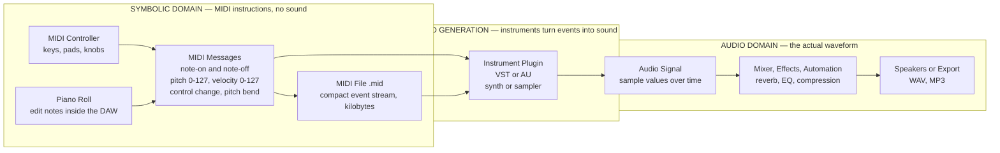

# 🎹 MIDI and Music Software

> [!abstract] TL;DR
> **MIDI** (Musical Instrument Digital Interface, standardised in **1983**) is a protocol for representing music as **instructions** — "play pitch 60 at velocity 90 now, release it a beat later" — **not** as recorded sound. A MIDI file stores *events*, not a waveform, which is why a two-minute song fits in a few kilobytes and can be re-voiced with any instrument. Modern production happens inside a **DAW** (Digital Audio Workstation), where MIDI note events are edited on a **piano roll**, fed to **VST/AU** software instruments that turn them into audio, and mixed alongside recorded audio tracks. Because MIDI is compact, symbolic, and lossless in the note domain, it is also the dominant data format for **music AI and Music Information Retrieval**.

## Intuition

**Analogy first:** MIDI is **sheet music for computers**. A page of sheet music does not make a sound — it is a set of *instructions* ("play middle C, hold it for one beat, then E") that a musician reads and performs. Hand the same page to a violinist, a pianist, or a tuba player and you get three completely different sounds from **one identical set of instructions**. MIDI works exactly this way: it carries the *what to play*, and a separate instrument decides *what it sounds like*.

Contrast this with an **audio recording**, which is like a **photograph of the performance**: it captures the actual sound waves once, frozen, timbre and all. You cannot swap a trumpet for a piano in a photograph. This is the single most important idea in the whole topic — **MIDI is the instructions; audio is the sound**. A `.mid` file is a script; a `.wav` file is the movie.

Once you internalise "instructions, not sound," everything else follows. Editing MIDI is like editing a script — you can drag a note to a new pitch, make it louder, or change *who plays it* — without ever re-recording. The **piano roll** you see in every DAW is just this script drawn as a graph: pitch on the vertical axis, time on the horizontal, one bar per note.

## How It Works

MIDI solves a specific problem: **how do you let electronic instruments, computers, and controllers talk to each other about music in real time?** Its answer is a stream of short, standardised **messages**. The most important are:

1. **Note-On** — "start sounding this pitch." Carries a **pitch number** (0–127, where **60 = middle C / C4** and **69 = A4 = 440 Hz**) and a **velocity** (0–127, how hard the key was struck — usually mapped to loudness and/or brightness).
2. **Note-Off** — "stop sounding this pitch." (By convention, a Note-On with velocity 0 also counts as a Note-Off.) Every Note-On **must** eventually be balanced by a Note-Off, or you get a **stuck note** that drones forever.
3. **Control Change (CC)** — continuous controllers: CC7 = volume, CC10 = pan, CC1 = modulation wheel, CC64 = sustain pedal, and dozens more.
4. **Pitch Bend** — a high-resolution wheel for smoothly sliding pitch up/down.
5. **Program Change** — "switch to instrument/patch number N" (which **General MIDI** maps to a standard sound, e.g. program 0 = Acoustic Grand Piano).
6. **Channels** — MIDI carries **16 channels** so one cable can address 16 independent instruments (channel 10 is reserved for drums in General MIDI).

Crucially, **none of these messages contain audio**. They are symbolic events with timestamps. A **sound generator** — a hardware synth, or a software **VST/AU instrument** inside a DAW — receives the events and *synthesises or samples* the actual waveform (see [[Synthesis_and_Sound_Design]] for how that engine works, and [[Digital_Audio_and_Sampling]] for the audio-domain result). Change the instrument, and the same events produce a piano, a violin, or a screaming lead synth.

A **DAW** is the studio that ties it together. It hosts **MIDI tracks** (event streams routed to software instruments) and **audio tracks** (recorded waveforms) side by side, applies **plugin effects** (reverb, EQ, compression), and **mixes** everything down to a final stereo audio file. The **piano roll** is the DAW's primary MIDI editor; **sequencing** is arranging these events on a timeline; **quantization** snaps note timings to a rhythmic grid.



## Key Concepts

### Secondary (foundational)

**MIDI is instructions, audio is sound.** The defining distinction. A `.mid` file lists *events* (which note, how hard, when); a `.wav`/`.mp3` file stores the *waveform itself* (the subject of [[Digital_Audio_and_Sampling]]). This is why MIDI files are tiny, endlessly editable, and instrument-agnostic — and why they sound different (or wrong) on different playback devices.

**Note number and velocity.** Pitch is an integer **0–127**; each step is one semitone in **12-tone equal temperament**. **Middle C = 60**, **A4 = 69 = 440 Hz**. Velocity **0–127** encodes how forcefully the note was played, typically driving loudness and often timbre (harder hits are brighter on real instruments and good samplers).

**The piano roll.** The universal visual editor: a grid with **pitch on the vertical axis** and **time on the horizontal axis**, each note drawn as a horizontal bar whose length is its duration. It is the direct computational descendant of staff notation — the same pitch-vs-time graph with the decoration removed.

**General MIDI (GM).** A standard map assigning **128 instrument sounds** to program numbers (0 = Acoustic Grand Piano, 40 = Violin, 56 = Trumpet, ...) plus a fixed **drum map** on channel 10. GM lets a MIDI file play *roughly* the intended instruments on any GM-compliant device — a lowest-common-denominator interoperability layer.

**MIDI files (.mid).** A standard file format storing one or more tracks of time-stamped messages, plus tempo and time-signature meta-events. Two common types: **Type 0** (all events merged into one track) and **Type 1** (parallel tracks, e.g. one per instrument).

### Undergraduate

**The full message vocabulary.** Beyond Note-On/Off, real productions lean on **Control Change** (mod wheel, expression, sustain, pan), **Pitch Bend** (14-bit smooth pitch slides), **Program Change** (patch selection), **Aftertouch** (pressure after the key is down), and **System messages** (clock/sync, System Exclusive "SysEx" for device-specific data). All are packed into compact **status + data byte** packets on **16 channels**.

**Sequencing and quantization.** A **sequencer** records and arranges MIDI events on a timeline. **Quantization** snaps note onsets (and optionally lengths) to a grid (1/8, 1/16, triplets) to tighten sloppy timing. But hard-quantizing everything sounds robotic, so DAWs offer **groove/swing templates** and **humanize** functions that add controlled timing/velocity variation — this is the quantize-versus-humanize trade-off between *precision* and *feel* (explored in [[Groove_Syncopation_and_Swing]]).

**The DAW anatomy.** Tracks (MIDI + audio), a **mixer** (per-track faders, pan, sends), **plugins** (instruments and effects), **automation** (recording parameter changes over time), and a **transport/timeline**. Popular DAWs: **Ableton Live, Logic Pro, FL Studio, Cubase, Pro Tools, Reaper, Bitwig, GarageBand**.

**VST / AU / AAX plugins.** Cross-application plugin standards. **VST** (Virtual Studio Technology, Steinberg), **AU** (Audio Units, Apple), and **AAX** (Avid Pro Tools) let third-party **instruments** (VSTi — synths like Serum, samplers like Kontakt) and **effects** load inside any host DAW. MIDI events flow *in*, audio flows *out*.

**Notation software vs DAWs.** **Sibelius, Finale, Dorico**, and the free/open-source **MuseScore** engrave printed scores and export **MusicXML** (score interchange) and **MIDI** (playback). DAWs optimise for *production and mixing*; notation software optimises for *readable printed parts* — but both share MIDI as the note-data lingua franca (see the companion staff-notation note).

**MIDI controllers.** Hardware that *generates* MIDI without making sound itself: keyboard controllers, pad grids (Ableton Push, MPC), knob/fader banks, wind controllers, and guitar-to-MIDI converters. They are the "typewriter" that types the musical script.

### Graduate

**The MIDI 1.0 wire protocol and its limits.** Classic MIDI is a **31,250 baud** asynchronous serial link with **7-bit** data resolution. Consequences: velocity and CC have only **128 steps** (audible "zipper noise" on smooth sweeps), pitch-bend and a few controllers get 14 bits via paired messages, and everything is **unidirectional** — a device cannot query another's capabilities. Timing is generally excellent for note events but bandwidth-limited for dense controller data.

**MIDI 2.0 (2020).** A major, backward-compatible extension: **bidirectional** negotiation via **MIDI-CI** (Capability Inquiry), **32-bit** velocity/controller resolution, **per-note** controllers and pitch bend (true polyphonic expression), **Profiles** (auto-configure a device as, say, a drawbar organ), **Property Exchange**, and the new **Universal MIDI Packet (UMP)** transport. It closes MIDI 1.0's resolution and one-way-communication gaps while keeping the note-event model.

**MIDI as symbolic data for music AI / MIR.** Because MIDI is compact, exact in pitch/onset, and free of acoustic noise, it is the **preferred representation for symbolic music modelling** (the symbolic-input side of [[Music_Information_Retrieval_and_AI]]). Notes become **piano-roll tensors** (pitch × time matrices) or **token sequences** (MIDI-like / REMI tokenisations) fed to Transformers and RNNs. Landmark datasets — **Lakh MIDI**, **MAESTRO**, **NES-MDB** — and systems like **Google Magenta** and **MuseNet** treat MIDI as the training substrate for generation, transcription, and analysis. Symbolic representation trades away *timbre and micro-acoustic nuance* for *clean, structured, editable note data* — exactly the trade-off that makes it powerful for machine learning.

**Limits of the symbolic model.** MIDI quantises music onto **12-TET pitch integers** and event timestamps. It cannot natively express continuous microtonality (beyond pitch-bend hacks), the full acoustic identity of an instrument, or performance nuances that live *between* the notes — the same expressive gap that staff notation has, inherited into the digital age.

## Python Demo

No external MIDI libraries — just **numpy** and **matplotlib**. We (1) represent a short **MIDI-like event stream** (note-on/note-off with pitch, velocity, time), (2) **parse** it into notes and print each one's **frequency** via `f = 440 · 2^((n − 69)/12)`, and (3) draw the **piano roll** with bars **coloured by velocity**, plus the exponential pitch-to-frequency curve that shows why every +12 note numbers *doubles* the frequency (one octave).

```python
import numpy as np
import matplotlib.pyplot as plt
from matplotlib.patches import Rectangle
from matplotlib.cm import ScalarMappable
from matplotlib.colors import Normalize

# ----------------------------------------------------------------------
# 1. A MIDI-like event stream. In a real .mid file each message is
#    (delta_time, status, data1=pitch, data2=velocity). Here we use
#    absolute time in beats for clarity. Pitch and velocity are 0-127.
#    A note_on with velocity 0 conventionally means note_off.
# ----------------------------------------------------------------------
events = [
    # (time_beats, type,       pitch, velocity)
    (0.0, "note_on",  60,  90),   # C4  medium-strong
    (1.0, "note_off", 60,   0),
    (1.0, "note_on",  64, 110),   # E4  hard
    (2.0, "note_off", 64,   0),
    (2.0, "note_on",  67,  70),   # G4  soft
    (3.0, "note_off", 67,   0),
    (3.0, "note_on",  72, 127),   # C5  maximum velocity
    (4.5, "note_off", 72,   0),
    (4.5, "note_on",  71,  55),   # B4  gentle
    (5.0, "note_off", 71,   0),
    (5.0, "note_on",  67,  80),   # G4
    (6.0, "note_off", 67,   0),
]

# ----------------------------------------------------------------------
# 2. Parse the event stream into (pitch, start, duration, velocity)
#    by matching each note_on to the later note_off of the same pitch.
# ----------------------------------------------------------------------
def parse_notes(evts):
    active = {}                       # pitch -> (start_time, velocity)
    notes = []
    for t, kind, pitch, vel in evts:
        if kind == "note_on" and vel > 0:
            active[pitch] = (t, vel)
        else:                         # note_off, or note_on velocity 0
            start, v = active.pop(pitch)
            notes.append((pitch, start, t - start, v))
    return notes

notes = parse_notes(events)

# ----------------------------------------------------------------------
# 3. MIDI note number -> frequency (Hz):  f = 440 * 2**((n - 69) / 12)
#    n = 69 == A4 == 440 Hz is the anchor of the equal-tempered grid.
# ----------------------------------------------------------------------
def midi_to_freq(n):
    return 440.0 * 2.0 ** ((np.asarray(n, dtype=float) - 69.0) / 12.0)

NOTE_NAMES = ["C", "C#", "D", "D#", "E", "F",
              "F#", "G", "G#", "A", "A#", "B"]
def midi_to_name(n):
    return f"{NOTE_NAMES[n % 12]}{n // 12 - 1}"

print("MIDI  Name  Frequency(Hz)  Velocity")
for pitch, start, dur, vel in notes:
    print(f"{pitch:>4}  {midi_to_name(pitch):<4}  {float(midi_to_freq(pitch)):>11.2f}  {vel:>3}")

# ----------------------------------------------------------------------
# 4. Piano roll (pitch vs time, bars coloured by velocity) + freq curve.
# ----------------------------------------------------------------------
cmap = plt.cm.viridis
norm = Normalize(vmin=0, vmax=127)

fig, (ax1, ax2) = plt.subplots(1, 2, figsize=(13, 5),
                               gridspec_kw={"width_ratios": [2, 1]})

for pitch, start, dur, vel in notes:
    ax1.add_patch(Rectangle((start, pitch - 0.4), dur, 0.8,
                            facecolor=cmap(norm(vel)),
                            edgecolor="black", linewidth=0.6))
    ax1.text(start + dur / 2, pitch, midi_to_name(pitch),
             ha="center", va="center", color="white", fontsize=8)

ax1.set_xlim(-0.3, 6.5)
ax1.set_ylim(58, 74)
ax1.set_xlabel("Time (beats, read left to right)")
ax1.set_ylabel("Pitch (MIDI note number, higher = higher)")
ax1.set_title("Piano Roll: bars coloured by velocity")
ax1.grid(axis="x", color="0.9")
sm = ScalarMappable(cmap=cmap, norm=norm)
sm.set_array([])
fig.colorbar(sm, ax=ax1, label="Velocity (0-127)")

grid = np.arange(48, 85)                       # C3 .. C6
ax2.plot(grid, midi_to_freq(grid), color="0.6", zorder=1)
mel_pitch = np.array([p for p, *_ in notes])
mel_vel = np.array([n[3] for n in notes])
ax2.scatter(mel_pitch, midi_to_freq(mel_pitch),
            c=mel_vel, cmap=cmap, norm=norm,
            edgecolor="black", zorder=3, s=60)
ax2.axhline(440, color="crimson", linestyle="--", linewidth=1)
ax2.text(48, 460, "A4 = 440 Hz  (MIDI 69, the anchor)",
         color="crimson", fontsize=8)
ax2.set_xlabel("Pitch (MIDI note number)")
ax2.set_ylabel("Frequency (Hz)")
ax2.set_title("f = 440 * 2^((n-69)/12)  — exponential, +12 doubles Hz")

plt.tight_layout()
plt.savefig("midi_piano_roll.png", dpi=150)
plt.show()
```

The printout shows each note's pitch, name, frequency, and velocity; the left panel is the piano roll (identical to what a DAW shows) with brighter bars = harder hits; the right panel proves the pitch-to-frequency mapping is **exponential** — moving up 12 note numbers (one octave) always *doubles* the frequency, which is why equal temperament and MIDI's linear integer scale fit together.

## Real-World Applications

- **Studio production.** Every modern DAW (Ableton Live, Logic Pro, FL Studio, Cubase, Reaper) is built on MIDI + audio tracks; producers program drums, basslines, and synths as MIDI, then render them through VST instruments.
- **Film, TV, and game scoring.** Composers mock up full orchestras in a DAW using MIDI driving multi-gigabyte sample libraries (Spitfire, Kontakt) before (or instead of) a live recording session.
- **Notation and publishing.** Sibelius, Dorico, and MuseScore engrave scores and use MIDI for audio playback and MusicXML for interchange, feeding both print and digital distribution.
- **Live performance and DJing.** MIDI controllers, clock sync, and MIDI-mapped effects let performers trigger clips, tweak parameters, and keep hardware and software locked to one tempo on stage.
- **Show control beyond music.** MIDI (and MIDI Show Control) synchronises stage lighting, pyrotechnics, and theatrical cues to a musical timeline.
- **Music AI and MIR.** Symbolic-music models (Magenta, MuseNet) train on MIDI datasets (Lakh MIDI, MAESTRO); transcription systems output MIDI; piano-roll tensors are a standard model input for generation, key/chord estimation, and beat tracking.

## Common Pitfalls

- **Confusing MIDI with audio.** The #1 beginner error: expecting a `.mid` file to *sound* like the studio track. It only carries instructions — playback depends entirely on the receiving instrument, so the same file can sound like a grand piano or a cheesy GM synth.
- **Stuck notes.** A Note-On with no matching Note-Off (crashed plugin, dropped cable, buggy sequence) leaves a pitch droning forever. The "panic"/All-Notes-Off button exists precisely for this.
- **Velocity is not volume.** Velocity encodes *how the note was struck* and only maps to loudness (and often brightness) via the instrument's response curve. Two instruments interpret the same velocity differently; CC7 is the actual channel volume.
- **General MIDI patch mismatch.** Relying on Program Change numbers means your "strings" may play as a "banjo" on a different device. GM guarantees only rough sound categories, never identical timbre.
- **Quantizing to death.** Snapping every note to a rigid grid strips the groove and makes music sound mechanical. Use swing/groove templates or humanize to preserve feel — precision is not the same as musicality.
- **7-bit resolution artefacts.** In MIDI 1.0, smooth CC or volume automation across only 128 steps produces audible "zipper noise." MIDI 2.0's 32-bit resolution (or plugin-side smoothing) fixes it.
- **Channel and routing confusion.** Sending events on the wrong channel, or all instruments to channel 1, is a classic reason "nothing plays" or "everything plays the drum kit." Channel 10 is drums under GM.

## Related Concepts

- [[Digital_Audio_and_Sampling]] — the audio-domain counterpart to MIDI: where MIDI carries symbolic instructions, this covers the actual sampled waveform (the `.wav` to MIDI's `.mid`), making the instructions-versus-sound distinction concrete.
- [[Synthesis_and_Sound_Design]] — how VST/AU instruments and synths turn MIDI note events into an actual timbre; MIDI is the trigger, synthesis is the sound engine.
- [[Music_Information_Retrieval_and_AI]] — consumes MIDI as clean symbolic data (piano-roll tensors, token sequences) for generation, transcription, key/chord estimation, and beat tracking.
- [[Notation_and_the_Staff]] — staff notation is the paper ancestor of MIDI; the piano roll is the same pitch-vs-time graph with the engraving stripped away, and both share note-number/scientific-pitch encoding.
- [[Rhythm_Meter_and_Tempo]] — sequencing and quantization operate on the beat/meter grid defined here; tempo and time-signature meta-events live in the MIDI file.
- [[Groove_Syncopation_and_Swing]] — the quantize-versus-humanize trade-off in depth; microtiming, swing, and feel are what make quantized MIDI sound human rather than robotic.
- [[Tuning_Systems_and_Temperament]] — the `f = 440 · 2^((n−69)/12)` conversion is 12-tone equal temperament made digital; MIDI's integer pitch scale assumes exactly this tuning.
- [[Pitch_and_the_Harmonic_Series]] — grounds why A4 = 440 Hz is the anchor and how the exponential octave-doubling relationship maps onto MIDI's linear note numbers.
- [[Timbre_and_the_Spectrum]] — the timbre that MIDI events lack, supplied by the instrument; the same note stream sounds like a piano or a violin depending on the instrument's spectrum.

## Review Questions

1. **(Secondary)** You email a friend a 3 KB `.mid` file of a song and it plays back sounding thin and "cheap" on their laptop, but rich in your studio. Explain, in terms of the MIDI-versus-audio distinction, why the *same file* sounds different — and what you would send instead if you needed it to sound identical everywhere.
2. **(Undergraduate)** A drummer's recorded MIDI performance sounds sloppy, but full quantization makes it sound robotic. Describe what quantization does to the event timestamps, why hard-quantizing kills the feel, and two DAW techniques that tighten timing while preserving groove.
3. **(Graduate)** A research team wants to train a Transformer to generate piano music and is choosing between raw audio and MIDI as the representation. Explain what MIDI gains and loses as a modelling substrate, how note events become model inputs (piano-roll tensor vs token sequence), and one musical property that the symbolic representation fundamentally cannot capture.

## Sources

- MIDI Association. *MIDI 1.0 Detailed Specification* and note-number/General MIDI reference. https://www.midi.org/specifications
- MIDI Association. *MIDI 2.0 Specification Overview* (MIDI-CI, Universal MIDI Packet, Profiles). https://www.midi.org/midi-2-0
- Huber, David Miles. *The MIDI Manual: A Practical Guide to MIDI within the Project Studio* (4th ed.). Routledge, 2020.
- Roads, Curtis. *The Computer Music Tutorial* (2nd ed.). MIT Press, 2023.
- Raffel, Colin. *Learning-Based Methods for Comparing Sequences, with Applications to Audio-to-MIDI Alignment and Matching* (Lakh MIDI Dataset). PhD thesis, Columbia University, 2016. https://colinraffel.com/projects/lmd/

#music-theory #midi #daw #music-software #sequencing
