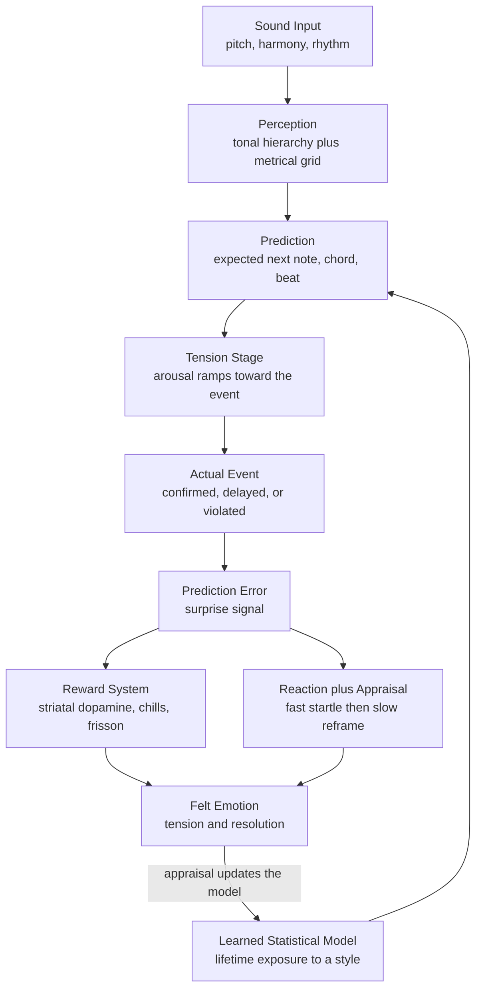

# 🎶 Music Cognition and Emotion

> [!abstract] TL;DR
> **Music cognition** is the study of how the mind builds structure out of sound — turning a stream of frequencies into a felt *key*, a felt *beat*, and a felt *arc of tension and release* — and **music and emotion** asks why that structure *moves* us. The central modern answer is **expectation**: the brain is a prediction machine that constantly forecasts the next note, chord, and beat from a lifetime of statistical learning; **emotion arises from the interplay of confirmed and violated predictions**. Leonard Meyer (1956) first argued that musical meaning *is* the tension of expectation, and David Huron's **ITPRA** theory (Imagination, Tension, Prediction, Reaction, Appraisal) unpacks the five response stages, dovetailing with the **predictive-processing** account of the mind as a hierarchical prediction-error minimiser. Physiologically, well-timed violations and resolutions recruit the **dopaminergic reward system** — the same circuitry as food, sex, and money — producing measurable **"chills" / frisson** (Salimpoor & Zatorre). Layered on top are **expressive cues** (major sounds happy, minor sad; fast is exciting, slow is calm), the deep entanglement of **music with memory** (earworms, music-evoked autobiographical memory, the striking preservation of musical memory in dementia), and the still-open **evolutionary puzzle** — is music an adaptation (Cross, Mithen) or "auditory cheesecake" that merely tickles faculties evolved for other reasons (Pinker)?

---

## Intuition

**Analogy — a musical bet you did not know you were placing.** Imagine walking up a familiar staircase in the dark. Your body *knows* how tall each step is, so it pre-programs the exact lift of your foot for the next one. When the steps are all where you expect, you glide up effortlessly and feel nothing — the prediction was silently confirmed. But if one step is missing, or an inch too tall, your stomach lurches: your unconscious *bet* about the world was wrong, and the error announces itself as a jolt of feeling. Music works the same way. Every phrase sets up an expectation — the ear leans toward the tonic, toward the downbeat, toward the note the style has trained it to want — and **the emotion you feel is the felt shape of those bets being confirmed, delayed, or broken.**

A perfect cadence landing exactly on the beat is the reassuring "the step was right there." A deceptive cadence — where the dominant resolves to vi instead of I — is the missing stair: harmless, but it makes you *feel* something precisely because your prediction was violated. Composers are, in this view, professional manipulators of your unconscious wagers, and a great melody is one that keeps you betting and keeps surprising you *just enough*.

---

## How It Works

Music cognition runs as a **generative prediction loop**. The listener does not passively receive sound; the brain maintains an internal model of "how music like this behaves" and continuously simulates what should come next. Emotion is the affective read-out of how those simulations fare.

### 1. Perception builds mental structure (pitch, tonality, meter)

Before there can be expectation, the raw signal must be parsed into cognitive objects:

1. **Pitch and octave equivalence.** The ear maps frequency onto a logarithmic pitch space with a circular **chroma** dimension — notes an octave apart share a pitch class. (Mechanics in [[Psychoacoustics_and_Pitch_Perception]].)
2. **Tonality and the tonal hierarchy.** Within a key, the twelve pitch classes are *not* equal. **Krumhansl and Kessler's** landmark "probe-tone" experiments measured a stable **tonal hierarchy**: in C major, C is felt as most stable, then G and E (the tonic triad), then the rest of the diatonic scale, and finally the chromatic non-scale tones as least stable. These perceived-stability ratings become the **key profiles** used to model both *which key* a listener infers and *how much tension* each note carries.
3. **Meter and entrainment.** From a stream of onsets the brain locks onto a periodic pulse — **beat induction** — and projects a metrical grid of strong and weak beats. This **entrainment** is a coupled-oscillator phenomenon: internal neural rhythms phase-lock to the external beat, which is why we can tap *ahead* of the next beat and why the body wants to move. (Full treatment in [[Rhythm_Meter_and_Tempo]].)

### 2. Expectation is the engine of emotion (Meyer → Huron's ITPRA)

Leonard **Meyer** (*Emotion and Meaning in Music*, 1956) proposed that musical emotion is generated *within* the music: a tendency (an expectation) is aroused, and its inhibition, delay, or fulfilment produces affect. David **Huron** (*Sweet Anticipation*, 2006) turned this into a testable five-stage model, **ITPRA**:

- **I — Imagination.** Before the event, you imagine possible futures and pre-feel their outcomes (this is why anticipating a drop is itself pleasurable).
- **T — Tension.** As the moment approaches, arousal and attention ramp up, tuning the body for the predicted event.
- **P — Prediction.** The outcome is compared to the prediction; **accurate prediction is intrinsically rewarding** (the "prediction response") regardless of what was predicted.
- **R — Reaction.** A fast, automatic, worst-case appraisal fires first (a sudden loud chord startles you before you know it is "just music").
- **A — Appraisal.** A slower, conscious evaluation reframes the event ("that surprise was delicious"), and can flip a negative reaction into pleasure.

The pleasure of music thus comes from *two* sources at once: the reward of **confirmed expectation** (fluency, "rightness," the satisfying cadence) and the frisson of **violated-then-resolved expectation** (surprise that is quickly made safe). This maps directly onto **predictive processing** ([[Predictive_Processing_and_Free_Energy]]): the brain minimises long-run prediction error, and music is a safe playground for generating and resolving error on purpose.

### 3. The neuroscience: from auditory cortex to the reward system

Structural analysis lives in **auditory cortex** and its hierarchy ([[Auditory_System_and_Sound_Processing]]), but the *feeling* recruits the emotional and reward circuits. **Salimpoor, Zatorre and colleagues** used PET and fMRI to show that peak pleasure moments — musical **"chills" / frisson** — coincide with **dopamine release in the striatum**: *anticipatory* dopamine in the dorsal striatum (caudate) during the build-up, and *consummatory* dopamine in the ventral striatum (nucleus accumbens) at the peak. Reward-prediction machinery normally reserved for food and money is thus hijacked by pure abstract sound. Functional connectivity between auditory cortex and the nucleus accumbens predicts how much a listener will pay for a new song. (Reward circuitry in [[Decision_Making_and_Reward_Circuits]].)

### 4. Expressive cues, memory, and culture

- **Expressive cues** are learned associations between surface features and affect: **mode** (major → happy/bright, minor → sad/dark), **tempo** (fast → excited, slow → calm/sad), **dynamics** and **articulation** (loud/staccato → energetic, soft/legato → tender). Some cues (fast + loud = high arousal) appear near-universal; the *major/minor → happy/sad* link is partly culturally learned.
- **Music and memory** are unusually fused: **earworms** (involuntary musical imagery), **music-evoked autobiographical memory** (a song instantly retrieves the summer you first heard it), and the clinically striking preservation of musical memory and responsiveness in **dementia** patients who have lost most declarative memory.
- **Universals vs cultural specificity.** Some responses look cross-cultural (arousal from tempo/loudness; the Mafa of Cameroon, with no exposure to Western music, still rated Western excerpts' basic happy/sad/scared affect above chance). Others are learned: scales, the *specific* emotional meaning of intervals, and which violations count as "expressive."



---

## Key Concepts

### Secondary (school-level intuition)
- **Music is about expectation.** Your ear guesses what comes next; music plays with those guesses. A tune that ends "correctly" feels satisfying; a surprise ending makes you feel something.
- **Major vs minor.** Major keys tend to sound happy or bright, minor keys sad or serious — one of the first emotional cues everyone hears.
- **Fast vs slow, loud vs soft.** A fast, loud song feels exciting; a slow, quiet one feels calm or sad. These are the simplest emotional dials in music.
- **Chills.** That shiver down your spine at a great moment in a song is a real, measurable event in the brain's reward system — the same system that responds to food and rewards.
- **Music and memory.** A song can instantly transport you back to a specific time and place, and songs get "stuck" in your head as earworms.

### Undergraduate (music-cognition rigor)
- **Tonal hierarchy and key profiles.** Krumhansl-Kessler probe-tone ratings quantify perceived stability of each scale degree; the **Krumhansl-Schmuckler** algorithm finds a key by correlating a piece's pitch-class distribution against all 24 rotated profiles (see demo). Stability = low tension; instability = expectation to resolve.
- **Meyer and implication-realization.** Meyer's expectation theory, formalised by **Narmour's implication-realization model**, predicts melodic continuation from Gestalt principles (small intervals imply continuation in the same direction; large intervals imply reversal).
- **ITPRA in detail.** The five stages (Imagination, Tension, Prediction, Reaction, Appraisal) separate *pre-outcome* responses (imagination, tension) from *post-outcome* responses (prediction, reaction, appraisal); the **prediction response** rewards accuracy per se, explaining why we enjoy re-listening to music whose surprises we already know.
- **Entrainment and the pleasure of groove.** Beat perception as neural oscillators phase-locking to the pulse; **groove** — the urge to move — peaks at *intermediate* rhythmic complexity (some syncopation, not too much), an inverted-U that mirrors the expectation account (link back to [[Rhythm_Meter_and_Tempo]]).
- **Expressive-cue coding.** Juslin's "lens model": performers encode emotion via probabilistic acoustic cues (tempo, loudness, timbre, timing) that listeners decode — a redundant, noisy communication channel.
- **The chills paradigm.** Frisson is elicited reliably by specific structural features (sudden dynamic/textural change, a solo voice entering, expectancy violations, appoggiaturas) and measured via skin conductance, piloerection, and self-report.

### Graduate (research / theoretical)
- **Predictive processing formalisation.** Music as **hierarchical Bayesian inference**: melodic/harmonic priors generate top-down predictions, and **precision-weighted prediction errors** propagate up. Information-theoretic models (Pearce's **IDyOM**, a variable-order Markov model) compute **information content** (surprise, `-log p`) and **entropy** (uncertainty) of each note; both correlate with listeners' expectedness ratings, EEG responses, and pupil dilation. The **"Wundt curve" / inverted-U** links liking to intermediate complexity (predictability × surprise).
- **Two neural systems, two pleasures.** Anticipatory (dorsal striatum, caudate) vs consummatory (ventral striatum, NAcc) dopamine dissociate the *wanting* of the build-up from the *liking* of the peak; causal work with dopaminergic drugs (levodopa vs risperidone) modulates chills, showing dopamine is not merely correlational.
- **Reward-prediction-error accounts.** Musical pleasure as reward-prediction error in a temporal-difference-learning framework: pleasure tracks *better-than-expected* outcomes, integrating Huron's prediction response with reinforcement-learning theory (link to [[Decision_Making_and_Reward_Circuits]]).
- **Interoceptive / constructed-emotion view.** Following Barrett and the affective-science frontier (see [[Emotion_and_Cognition]] and [[Emotion_Theories]]), musical "emotions" may be constructed from **core affect** (valence × arousal) plus learned concepts and interoceptive inference, rather than being discrete basic emotions triggered by the music.
- **The evolutionary debate.** **Pinker's "auditory cheesecake"** — music is a non-adaptive by-product that tickles pleasure circuits evolved for language, emotion, and motor control. Adaptationist rivals: **Ian Cross** (music as social/coordinative "floating intentionality"), **Steven Mithen** ("Hmmmmm" — a musical proto-language predating speech), the **social-bonding hypothesis** (synchronised music releases endorphins and builds group cohesion), and **sexual-selection** (Darwin) and **mother-infant / motherese** accounts.
- **Cross-cultural universality.** Statistical universals in song structure (Savage et al.) coexist with culture-specific tonal systems; the field carefully separates *low-level psychoacoustic* universals from *learned schematic* expectations.

---

## Python Demo

```python
# Modelling musical expectation and tension with numpy + matplotlib only.
#
# Part A: Krumhansl-Schmuckler key finding.
#   Correlate a piece's pitch-class histogram against the 24 rotated
#   Krumhansl-Kessler key profiles to infer the key the listener hears.
#
# Part B: A tonal TENSION / EXPECTATION curve over a chord progression.
#   Using the established key's profile as an expectation distribution,
#   score each chord's "surprise" as prediction error = -log(expectedness).
#   Peaks = violated expectation (a chromatic surprise chord);
#   troughs = confirmed expectation / resolution (the tonic).
#   This is the ITPRA / prediction-error account made concrete.

import numpy as np
import matplotlib.pyplot as plt

# Krumhansl-Kessler probe-tone profiles: perceived stability of each of the
# 12 scale degrees, indexed 0..11 relative to the tonic (0 = tonic).
major_profile = np.array([6.35, 2.23, 3.48, 2.33, 4.38, 4.09,
                          2.52, 5.19, 2.39, 3.66, 2.29, 2.88])
minor_profile = np.array([6.33, 2.68, 3.52, 5.38, 2.60, 3.53,
                          2.54, 4.75, 3.98, 2.69, 3.34, 3.17])

PC = ['C', 'C#', 'D', 'D#', 'E', 'F', 'F#', 'G', 'G#', 'A', 'A#', 'B']

# ---------------------------------------------------------------
# Part A: Krumhansl-Schmuckler key finding
# ---------------------------------------------------------------
def find_key(pc_histogram):
    """Correlate a 12-bin pitch-class histogram with all 24 keys."""
    scores = []
    for tonic in range(12):
        r_maj = np.corrcoef(pc_histogram, np.roll(major_profile, tonic))[0, 1]
        r_min = np.corrcoef(pc_histogram, np.roll(minor_profile, tonic))[0, 1]
        scores.append((r_maj, f"{PC[tonic]} major"))
        scores.append((r_min, f"{PC[tonic]} minor"))
    scores.sort(reverse=True)
    return scores

# Histogram from a C-major passage (emphasise the C-major scale + tonic triad)
#            C  C# D  D# E  F  F# G  G# A  A# B
hist = np.array([5, 0, 3, 0, 4, 3, 0, 5, 0, 3, 0, 2], dtype=float)
ranked = find_key(hist)
print("Krumhansl-Schmuckler key estimate (top 3):")
for r, name in ranked[:3]:
    print(f"  {name:9s}  correlation = {r:+.3f}")

# ---------------------------------------------------------------
# Part B: tension / expectation over a chord progression
# ---------------------------------------------------------------
# Progression in C major with a deliberate surprise:
#   I  -  vi  -  IV  -  V/V (D7)  -  V (G7)  -  I
# The D7 injects F# (pc 6), chromatic to C major -> an expectancy violation.
progression = [
    ("C  (I)",      [0, 4, 7]),        # C  E  G
    ("Am (vi)",     [9, 0, 4]),        # A  C  E
    ("F  (IV)",     [5, 9, 0]),        # F  A  C
    ("D7 (V/V)",    [2, 6, 9, 0]),     # D  F# A  C   <- F# is out of key
    ("G7 (V)",      [7, 11, 2, 5]),    # G  B  D  F
    ("C  (I)",      [0, 4, 7]),        # resolution
]

# Established key = C major; use its profile as an expectation distribution.
key_expectation = major_profile / major_profile.sum()

def chord_surprise(pcs):
    """Prediction error = -log(mean expectedness of the chord's tones)."""
    expectedness = np.mean([key_expectation[p] for p in pcs])
    return -np.log(expectedness)

labels = [name for name, _ in progression]
tension = np.array([chord_surprise(pcs) for _, pcs in progression])

print("\nTonal tension (prediction error) per chord:")
for name, t in zip(labels, tension):
    print(f"  {name:10s}  surprise = {t:.3f}")

# ---------------------------------------------------------------
# Plot
# ---------------------------------------------------------------
fig, (ax0, ax1) = plt.subplots(2, 1, figsize=(11, 9))

# Part A: correlation of every candidate key
all_scores = find_key(hist)
names = [n for _, n in all_scores][::-1]        # ascending for barh
vals = [r for r, _ in all_scores][::-1]
colors = ['crimson' if n == all_scores[0][1] else '0.6' for n in names]
ax0.barh(range(len(names)), vals, color=colors)
ax0.set_yticks(range(len(names)))
ax0.set_yticklabels(names, fontsize=7)
ax0.set_xlabel("Correlation with Krumhansl-Kessler profile")
ax0.set_title(f"Part A: Key finding -> best fit = {all_scores[0][1]}  (in red)")
ax0.grid(axis='x', alpha=0.3)

# Part B: tension curve over the progression
x = np.arange(len(labels))
ax1.plot(x, tension, '-o', color='navy', markersize=9, linewidth=2)
ax1.fill_between(x, tension, tension.min() - 0.05, alpha=0.12, color='navy')
peak = int(np.argmax(tension))
ax1.annotate("expectation VIOLATED\n(chromatic F# in D7 = surprise)",
             xy=(peak, tension[peak]),
             xytext=(peak - 1.6, tension[peak] + 0.02),
             arrowprops=dict(arrowstyle="->", color='crimson'),
             color='crimson', fontsize=9)
ax1.annotate("RESOLUTION\n(return to stable tonic)",
             xy=(len(labels) - 1, tension[-1]),
             xytext=(len(labels) - 2.4, tension[-1] + 0.03),
             arrowprops=dict(arrowstyle="->", color='green'),
             color='green', fontsize=9)
ax1.set_xticks(x)
ax1.set_xticklabels(labels, fontsize=9)
ax1.set_ylabel("Prediction error  (surprise = -log expectedness)")
ax1.set_title("Part B: Tonal tension over I - vi - IV - V/V - V - I")
ax1.grid(alpha=0.3)

plt.tight_layout()
plt.show()

# Reading it: the key finder recovers C major from raw pitch counts alone.
# The tension curve peaks on the borrowed D7 (its F# is unexpected in C major)
# and drops to its floor on the final tonic -- the felt arc of tension and
# release that Meyer described and ITPRA / predictive processing formalise.
```

**What it shows.** Part A recovers *C major* from nothing but a histogram of pitch classes — the same statistical inference a listener's brain performs to "hear the key." Part B turns the abstract idea of tension into a number: each chord's **surprise** (prediction error) is plotted over time, spiking on the out-of-key **D7** (its F# violates the C-major expectation) and collapsing to its minimum on the final **tonic**. That rise-and-fall *is* the emotional arc — Meyer's tension-of-expectation and Huron's prediction/appraisal stages rendered as a curve.

---

## Real-World Applications

> **Example — music recommendation and the reward brain.** Streaming services (Spotify, Apple Music) implicitly exploit the expectation-reward loop: features like acousticness, energy, and "danceability" are proxies for the arousal and predictability that drive liking, and the inverted-U (familiar-but-fresh) is why recommenders blend known favourites with mild novelty. Salimpoor's finding that auditory-cortex-to-nucleus-accumbens connectivity predicts willingness-to-pay is the neuroscience under the business model.

> **Example — music therapy.** Clinically, the memory-music fusion is put to work: **Music-Evoked Autobiographical Memory** and preserved musical responsiveness in **dementia** (the basis of programs like Music & Memory) can reawaken engagement when declarative memory is gone. **Neurologic Music Therapy** uses **entrainment** — Rhythmic Auditory Stimulation — to drive gait rehabilitation in Parkinson's and stroke, because the motor system phase-locks to an external beat (see [[Rhythm_Meter_and_Tempo]]).

> **Example — film scoring and game audio.** Composers engineer expectation deliberately: unresolved dominants and suspensions to hold **tension**, deceptive cadences for a "gut-punch," sudden dynamic/textural shifts to trigger **chills**, and adaptive game scores that resolve or destabilise on player action — real-time ITPRA manipulation.

> **Example — computational modelling / MIR.** The **Krumhansl-Schmuckler** algorithm (Part A) is a staple of automatic **key detection** in Music Information Retrieval; **IDyOM** and related predictive models power research on expectation, generative composition, and even affective computing that tags music by predicted emotional response.

---

## Common Pitfalls

- **Treating musical emotion as pure stimulus-response.** The same chord can feel triumphant or devastating depending on context, culture, and the listener's model. Emotion lives in the *relationship* between prediction and outcome, not in the acoustics alone — appraisal (the A in ITPRA) can flip a startle into pleasure.
- **Confusing *perceived* with *felt* emotion.** Recognising that a piece "sounds sad" (cognitivist position) is not the same as *feeling* sad (emotivist position). Studies must distinguish "the music expresses X" from "the music made me feel X."
- **Assuming major/minor → happy/sad is universal.** It is substantially *learned*. Arousal cues (tempo, loudness) are far more cross-cultural than the valence meaning of mode; do not export Western conventions as human universals.
- **Over-reading correlational neuroimaging.** "The reward system lit up" does not prove dopamine *causes* the pleasure; the causal case rests on pharmacological manipulation (levodopa/risperidone) and connectivity, not blobs alone.
- **Ignoring uncertainty as well as surprise.** Expectation is two numbers: **information content** (how surprising the actual event was) and **entropy** (how uncertain the prediction was beforehand). A surprise is only pleasurable if the context made it *safe*; high-entropy chaos is not the same as a well-placed violation.
- **Forgetting the inverted-U.** Neither total predictability (boring) nor total unpredictability (noise) is pleasurable. Groove, catchiness, and "just-right" surprise all live at intermediate complexity; models that reward only surprise, or only fluency, miss this.
- **Mistaking key-finding output for perception.** The Krumhansl-Schmuckler correlation is a *first-order* model using only pitch-class counts; it ignores order, meter, and voice-leading, so it can mislabel modulating or chromatic passages a human hears correctly.

---

## Related Concepts

- [[Rhythm_Meter_and_Tempo]] — beat induction, entrainment, and the metrical grid this note relies on; groove and the urge to move are the rhythmic side of musical emotion.
- [[Psychoacoustics_and_Pitch_Perception]] — the low-level machinery (pitch, chroma, critical bands) that supplies the raw perceptual objects tonality and expectation are built from.
- [[Auditory_and_Speech_Perception]] — the Cognitive Science view of auditory scene analysis, streaming, and the shared prediction/grouping mechanisms behind melody and speech prosody.
- [[Predictive_Processing_and_Free_Energy]] — the general "brain as prediction-error minimiser" framework that ITPRA and music-as-expectation are a special case of.
- [[Emotion_and_Cognition]] — appraisal theory, core affect, and constructed emotion; how affect and cognition interweave, of which musical emotion is a vivid instance.
- [[Emotion_Theories]] — the Psychology map (James-Lange, Cannon-Bard, Schachter-Singer, appraisal) that frames what "an emotion" even is.
- [[Decision_Making_and_Reward_Circuits]] — the dopaminergic striatal reward system and reward-prediction error that underlie musical chills and "wanting" vs "liking."
- [[Auditory_System_and_Sound_Processing]] — the neuroscience of cochlea-to-cortex processing that feeds the structural analysis stage.

---

## Review Questions

1. **(Secondary)** A song builds up quietly and then a huge chord and drum hit arrive at the chorus, giving you a shiver down your spine. In everyday terms, explain what your brain was *doing* just before that moment and why the arrival feels so good. Which part of the brain is responsible for the "chill"?
2. **(Undergraduate)** Using Huron's ITPRA model, walk through what happens when a **deceptive cadence** replaces the expected V–I with V–vi. Which of the five stages produce the "surprise," and how does the *appraisal* stage let a listener end up enjoying a violation of their own expectation? Contrast the emotional source of a *confirmed* cadence with that of a *violated* one.
3. **(Graduate)** You have an information-theoretic model (e.g., IDyOM) that outputs both **information content** (surprise) and **entropy** (uncertainty) for every note. (a) Explain why liking is predicted by an *inverted-U* over predictability rather than by surprise alone. (b) Sketch how you would test, with fMRI and a dopaminergic drug manipulation, the claim that *anticipatory* and *consummatory* musical pleasure depend on dissociable striatal circuits. (c) How would you disentangle low-level psychoacoustic universals from culturally learned schematic expectations in a cross-cultural study?

---

## Sources

- Meyer, L. B. (1956). *Emotion and Meaning in Music.* University of Chicago Press — the founding argument that musical emotion is the play of expectation.
- Huron, D. (2006). *Sweet Anticipation: Music and the Psychology of Expectation.* MIT Press — the ITPRA theory.
- Krumhansl, C. L. (1990). *Cognitive Foundations of Musical Pitch.* Oxford University Press — the tonal hierarchy and probe-tone/key-profile method.
- Salimpoor, V. N., Benovoy, M., Larcher, K., Dagher, A., & Zatorre, R. J. (2011). "Anatomically distinct dopamine release during anticipation and experience of peak emotion to music." *Nature Neuroscience*, 14(2), 257-262.
- Pearce, M. T. (2018). "Statistical learning and probabilistic prediction in music cognition: mechanisms of stylistic enculturation." *Annals of the New York Academy of Sciences*, 1423(1), 378-395 — the IDyOM predictive-processing account.
- Juslin, P. N., & Sloboda, J. A. (Eds.) (2010). *Handbook of Music and Emotion: Theory, Research, Applications.* Oxford University Press.

---

#music-theory #music-cognition #emotion #expectation #neuroscience-of-music
