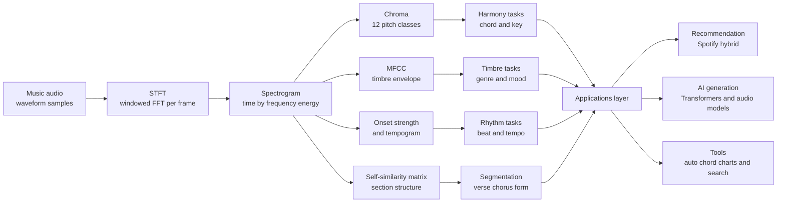

# 🤖 Music Information Retrieval and AI

> [!abstract] TL;DR
> **Music Information Retrieval (MIR)** is the science of teaching computers to *understand* music — extracting pitch, chords, key, tempo, structure, genre, mood, and similarity from raw **audio** or **symbolic** scores. It leans on the **FFT** to turn sound into spectra, then folds those spectra into musically meaningful features — **chroma** (which of the 12 pitch classes are sounding), **MFCCs** (timbre), **tempograms** (rhythm). These features power everything from **Spotify's recommendations** to automatic chord charts. The same representations now feed **generative AI** — from Markov chains and LSTMs to Transformers (Music Transformer, MuseNet) and audio-domain models (Jukebox, MusicLM, Suno) — raising fresh questions about **evaluation, copyright, and creativity**.

## Intuition

Imagine handing a friend who has never studied music a **giant search engine full of songs** and asking them to "find me more tracks that feel like this one." They can't read a score and they can't name a chord, but they *can* notice patterns: this song thumps at a steady pace, that one has bright jangly guitars, another lingers on sad-sounding chords. If you gave them a systematic checklist — *"count the beats per minute, list which notes keep coming back, describe the texture"* — they could turn a fuzzy feeling into numbers, and numbers you can compare.

That checklist is exactly what MIR builds. A computer cannot "hear" music the way you do, so we first convert sound into a **spectrum** (the recipe of frequencies present, via the [[DFT_and_FFT]]), then boil that spectrum down to a handful of **descriptors** a machine can compare: a 12-number fingerprint of the harmony (**chroma**), a compact summary of the timbre (**MFCCs**), and a pulse-tracking curve for the rhythm. Once music is numbers, everything a search engine does — matching, ranking, clustering, and now *generating* — becomes possible.

---

## How It Works

### Core mechanics

MIR is a pipeline that climbs a **ladder of abstraction**, from raw pressure waves up to semantic labels a human would recognize.

1. **Signal → spectrum.** Audio arrives as a stream of samples (see [[Digital_Audio_Fundamentals]]). Cut it into short overlapping frames, window each, and take the **FFT** — the **Short-Time Fourier Transform (STFT)** — to get a **spectrogram**: energy as a function of time and frequency. This is the substrate everything else is computed from.
2. **Spectrum → low-level features.** Raw spectra are too high-dimensional and octave-sensitive to compare directly, so MIR distills them:
   - **Chroma / pitch-class profile** — fold all octaves onto **12 semitone bins** (C, C#, …, B). This throws away *which* octave a note is in and keeps *what note* it is — perfect for harmony.
   - **MFCCs** — a compact model of the **spectral envelope**, capturing **timbre** (instrument texture) rather than pitch (see [[Mel_Filterbank_MFCCs]], [[Timbre_and_the_Spectrum]]).
   - **Spectral descriptors** — centroid (brightness), rolloff, flux, flatness.
   - **Onset strength & tempograms** — where energy suddenly rises marks note onsets; the periodicity of those onsets gives **tempo** and the **beat grid**.
3. **Features → musical tasks.** Each feature family feeds a task:
   - **Pitch / melody extraction** → the dominant f0 contour over time (monophonic is easy; polyphonic is hard).
   - **Chord recognition & key detection** → correlate chroma with chord/key templates or decode with an HMM (link [[Functional_Harmony_and_Progressions]]).
   - **Beat tracking & tempo estimation** → autocorrelation of the onset envelope.
   - **Structure / segmentation** → build a **self-similarity matrix** (compare every frame's feature vector to every other) and read off repeats, choruses, and section boundaries (link [[Musical_Form_and_Structure]]).
   - **Genre / mood classification, similarity, cover-song detection, source separation** → learned models over these features.
4. **Classical vs deep.** Early MIR hand-crafted features and fed them to SVMs, k-NN, HMMs, and Gaussian mixtures. Modern MIR feeds **mel-spectrograms** (or raw audio) to CNNs, CRNNs, and Transformers that *learn* features, and increasingly to **self-supervised foundation models** (MERT) pre-trained on huge unlabeled music corpora and fine-tuned per task.
5. **Understanding → generation.** The same sequence models that *analyze* music can *produce* it. **Symbolic** generators predict the next note/token in a MIDI-like stream (Markov → RNN/LSTM → Transformer: MuseNet, Music Transformer). **Audio-domain** generators synthesize the waveform itself (Jukebox, MusicLM, Suno), usually via discrete audio tokens plus a language model.



---

## Key Concepts

### Secondary

- **MIR = teaching a computer to listen.** Given a song, a program figures out its **speed** (tempo in BPM), its **key** (is it in C major or A minor?), the **chords** going by, whether it is happy or sad, and which other songs sound similar. All of that starts by turning sound into numbers.
- **Chroma is a 12-note fingerprint.** There are only **12 note names** in Western music that repeat every octave (C, C#, D, … B). A chroma vector says *how much of each of those 12 names is sounding right now*. A C-major chord lights up C, E, and G. This is how software guesses chords.
- **The computer never "hears" — it measures frequencies.** Every sound is a mix of frequencies. A device called the **Fourier transform** lists which frequencies are present and how strong they are; music software reads that list to find the notes.
- **The same tech that recognizes music can now write it.** AI models trained on millions of songs can compose new melodies, harmonize a tune, or even generate finished audio from a text prompt like "upbeat lo-fi hip-hop." They learned by predicting "what note or sound comes next," over and over.
- **Recommendations are pattern-matching at scale.** When a streaming app suggests a song, it is partly noticing that people who like *this* also like *that* (behavior), and partly that the two songs *sound alike* (audio features).

### Undergraduate

- **The STFT is the workhorse.** A single [[DFT_and_FFT]] over a whole song blurs time; MIR instead slides a window and takes an FFT per frame (the STFT), producing a spectrogram with tunable **time–frequency trade-off** (long window = fine frequency, coarse time; short window = the reverse).
- **Chroma / pitch-class profile.** Map each spectral bin at frequency $f$ to a pitch class $p = \text{round}\!\left(12\log_2\frac{f}{440}\right)\bmod 12$ (with C = 0), then sum energy per class: $$C[p] = \sum_{k \,:\, \text{pc}(f_k) = p} |X_k|^2.$$ Octave-invariance is the whole point — it makes the feature about **harmony**, not register.
- **Key detection (Krumhansl–Schmuckler).** Average chroma over a passage and **correlate** it with 24 template profiles (12 major + 12 minor keys) derived from perceptual "probe-tone" experiments; the best-correlating template names the key. Chord recognition does the same over **short windows** with 24+ triad templates.
- **Beat & tempo.** Differentiate the log-energy to get an **onset strength envelope**; its **autocorrelation** (or a Fourier tempogram) reveals the dominant period → BPM. Beats are then the phase-aligned pulse grid.
- **Structure via self-similarity.** Stack per-frame feature vectors and compute the pairwise distance matrix. **Diagonal stripes** off the main diagonal mark **repeated sections** (a returning chorus); **block structure** marks homogeneous segments. This is computational [[Musical_Form_and_Structure]].
- **Timbre features for genre/mood.** [[Mel_Filterbank_MFCCs]] plus spectral centroid/flux/rolloff summarize texture; classic genre classifiers (GTZAN) combine these with chroma and rhythm features (see [[Music_Classification_MIR]]).
- **Symbolic vs audio generation.** *Symbolic* models operate on **notes/MIDI events** — clean, compact, but silent (needs a synth to hear). *Audio* models operate on the **waveform/spectrogram** — directly listenable, but vastly higher-dimensional and harder to control.

### Graduate

- **Constant-Q transform (CQT).** The FFT's linear frequency bins waste resolution at low frequencies and over-resolve highs. The **CQT** uses **logarithmically spaced bins** with constant Q (bins per octave), aligning naturally with the equal-tempered scale — the preferred front end for chroma and pitch tasks.
- **Chord recognition as sequence decoding.** Frame-wise template matching ignores harmonic *grammar*. **HMM/CRF** models add a **transition prior** $P(C_{t+1}\mid C_t)$ learned from annotated corpora and decode with **Viterbi**, smoothing out spurious frame-level flips. Modern systems use **CRNNs** (CNN front end + recurrent temporal model) or Transformers.
- **Cover-song / version identification.** Requires features **invariant** to key (transpose-invariant via cross-correlating chroma over all 12 shifts), tempo (beat-synchronous features or DTW), and arrangement. It is essentially **sequence alignment** on chroma — a music-specific analog of biological sequence matching.
- **Source separation.** Decompose a mixture into stems (vocals/drums/bass/other). Classical: **NMF** on the magnitude spectrogram ($V \approx WH$). Modern: **Demucs**, **Open-Unmix**, **Spleeter** — deep networks predicting per-source masks; enables per-stem MIR (see [[Music_Source_Separation]]).
- **Deep sequence models for generation.**
  - **Markov chains / n-grams** — model $P(\text{note}_t\mid \text{note}_{t-1})$; cheap, local, no long structure.
  - **RNN / LSTM** ([[RNN_and_LSTM]]) — carry hidden state for phrase-level dependencies; struggle past tens of seconds.
  - **Transformers** ([[Transformer_Architecture]]) — self-attention captures **long-range structure** (motifs returning minutes later). **Music Transformer** added *relative* positional attention for exactly this; **MuseNet** scaled it to multi-instrument MIDI.
  - **Audio-domain LMs** — **Jukebox** (VQ-VAE hierarchy + Transformer priors, raw audio with vocals), **MusicLM** (hierarchical tokens conditioned on text + melody), **Suno/Udio** (production-grade text-to-song). The pattern: **discretize audio into tokens**, then run a language model over them.
- **Evaluation is genuinely hard.** Discriminative tasks have ground truth (chord accuracy, F-measure for beats, WCSR), but **generation has no single "correct" output**. Metrics like **Fréchet Audio Distance**, framewise perplexity, and template-based music-theory checks are proxies; **human listening tests** remain the gold standard, and they are expensive and subjective. The **glass-ceiling / semantic-gap** problem — low-level features correlate weakly with high-level perception — persists.
- **Self-supervised foundation models.** **MERT**, **Jukebox embeddings**, and **CLAP**-style audio–text models pre-train on unlabeled audio and transfer to many MIR tasks, echoing the NLP foundation-model shift.
- **Copyright & ethics.** Training on copyrighted recordings without licenses, models that can **imitate a specific artist's voice/style**, and the murky ownership of AI-generated output are unresolved legal and ethical frontiers — see the discussion under the future of music and generative-audio governance.

---

## Python Demo

```python
# Chroma / Pitch-Class-Profile pipeline + template-based chord detection.
# A core MIR technique, from scratch, using ONLY numpy + matplotlib.
#
# Steps:
#   1) Synthesize a short 3-chord passage (I - IV - V in C major:
#      C major -> F major -> G major), each chord a stack of sine harmonics.
#   2) Slide a window and take an FFT per frame (a poor-man's STFT).
#   3) Fold each frame's spectral energy onto 12 PITCH CLASSES -> a chromagram.
#   4) For each chord segment, average the chroma and CORRELATE it against
#      all 24 triad templates (12 major + 12 minor) to GUESS the chord.
#   5) Plot the chromagram and print the detected chords.

import numpy as np
import matplotlib.pyplot as plt

FS = 22050
NOTE_NAMES = ['C', 'C#', 'D', 'D#', 'E', 'F', 'F#', 'G', 'G#', 'A', 'A#', 'B']


def midi_to_freq(m):
    """MIDI note number -> frequency in Hz (A4 = MIDI 69 = 440 Hz)."""
    return 440.0 * 2.0 ** ((m - 69) / 12.0)


def note_to_midi(name, octave):
    """e.g. note_to_midi('C', 4) -> 60."""
    return 12 * (octave + 1) + NOTE_NAMES.index(name)


def synth_chord(midis, dur, fs=FS, n_harmonics=5):
    """Additive synthesis: each note = fundamental + harmonics with 1/h rolloff."""
    t = np.arange(int(dur * fs)) / fs
    sig = np.zeros_like(t)
    for m in midis:
        f0 = midi_to_freq(m)
        for h in range(1, n_harmonics + 1):
            sig += (1.0 / h) * np.sin(2 * np.pi * h * f0 * t)
    # short fades to avoid clicks between chords
    fade = int(0.01 * fs)
    sig[:fade] *= np.linspace(0, 1, fade)
    sig[-fade:] *= np.linspace(1, 0, fade)
    return sig / np.max(np.abs(sig))


def compute_chromagram(sig, fs=FS, frame=8192, hop=4096, fmin=55.0, fmax=2000.0):
    """Windowed FFT per frame, then fold spectral energy into 12 pitch classes."""
    win = np.hanning(frame)
    freqs = np.fft.rfftfreq(frame, 1.0 / fs)

    # Precompute the pitch class of every FFT bin (once).
    pc = np.full(freqs.shape, -1, dtype=int)
    band = (freqs >= fmin) & (freqs <= fmax)
    midi = 69 + 12 * np.log2(freqs[band] / 440.0)
    pc[band] = np.round(midi).astype(int) % 12

    n_frames = 1 + (len(sig) - frame) // hop
    chroma = np.zeros((12, n_frames))
    for i in range(n_frames):
        seg = sig[i * hop: i * hop + frame] * win
        mag = np.abs(np.fft.rfft(seg))
        energy = mag ** 2
        for b in range(12):
            chroma[b, i] = energy[pc == b].sum()
    # per-frame normalization so loudness does not dominate
    chroma /= (chroma.max(axis=0, keepdims=True) + 1e-12)
    return chroma


def chord_templates():
    """24 binary triad templates: 12 major (root,+4,+7) and 12 minor (root,+3,+7)."""
    templates = {}
    for r in range(12):
        maj = np.zeros(12); maj[[r, (r + 4) % 12, (r + 7) % 12]] = 1.0
        mnr = np.zeros(12); mnr[[r, (r + 3) % 12, (r + 7) % 12]] = 1.0
        templates[f"{NOTE_NAMES[r]} major"] = maj
        templates[f"{NOTE_NAMES[r]} minor"] = mnr
    return templates


def detect_chord(chroma_vec, templates):
    """Pick the template with the highest correlation to the chroma vector."""
    c = chroma_vec - chroma_vec.mean()
    best_name, best_score = None, -np.inf
    for name, tmpl in templates.items():
        t = tmpl - tmpl.mean()
        denom = np.linalg.norm(c) * np.linalg.norm(t) + 1e-12
        score = float(np.dot(c, t) / denom)
        if score > best_score:
            best_name, best_score = name, score
    return best_name, best_score


# --- 1) Build a I - IV - V progression in C major -------------------------
progression = [
    ("C major (I)",  [note_to_midi('C', 4), note_to_midi('E', 4), note_to_midi('G', 4)]),
    ("F major (IV)", [note_to_midi('F', 4), note_to_midi('A', 4), note_to_midi('C', 5)]),
    ("G major (V)",  [note_to_midi('G', 4), note_to_midi('B', 4), note_to_midi('D', 5)]),
]
chord_dur = 1.0
passage = np.concatenate([synth_chord(m, chord_dur) for _, m in progression])

# --- 2 & 3) Chromagram over the whole passage -----------------------------
chroma = compute_chromagram(passage)

# --- 4) Detect the chord in each 1-second segment -------------------------
templates = chord_templates()
frames_per_chord = chroma.shape[1] // len(progression)
print("Detected chords (template correlation):")
for idx, (true_name, _) in enumerate(progression):
    seg = chroma[:, idx * frames_per_chord:(idx + 1) * frames_per_chord]
    guess, score = detect_chord(seg.mean(axis=1), templates)
    print(f"  segment {idx + 1}: true = {true_name:14s} -> detected = {guess:10s} (corr {score:.2f})")

# --- 5) Plot the chromagram ----------------------------------------------
plt.figure(figsize=(11, 4))
plt.imshow(chroma, aspect='auto', origin='lower', cmap='magma',
           extent=[0, len(passage) / FS, 0, 12])
plt.yticks(np.arange(12) + 0.5, NOTE_NAMES)
plt.xlabel("time in seconds")
plt.ylabel("pitch class")
plt.title("Chromagram of a I - IV - V progression in C major")
plt.colorbar(label="normalized energy")
for b in range(1, len(progression)):
    plt.axvline(b * chord_dur, color='cyan', ls='--', lw=1)
plt.tight_layout()
plt.show()
```

Running it prints the detected chords — the template-correlation step recovers **C major → F major → G major**, and the chromagram lights up exactly the three pitch classes of each triad (C-E-G, then F-A-C, then G-B-D), with the dashed lines marking the chord changes. This is the beating heart of automatic chord/key estimation: **FFT → fold into 12 pitch classes → correlate with templates**.

---

## Real-World Applications

- **Spotify recommendations (hybrid).** Spotify blends **collaborative filtering** (people who stream *this* also stream *that*) with **content-based audio models** (CNNs over spectrograms predicting genre, energy, danceability, valence) and NLP over playlists/reviews. New or obscure tracks with no listening history rely on the **audio** side to escape the cold-start problem.
- **Shazam-style audio fingerprinting.** A close cousin of MIR: hash spectrogram peak constellations into compact fingerprints, then match a noisy phone recording against a database of millions of tracks in milliseconds.
- **Automatic music transcription & chord charts.** Chordify, Moises, and Ultimate Guitar's auto-chords run chroma-plus-model chord recognition to hand guitarists a chart from an MP3.
- **DJ and production tools.** Rekordbox, Serato, and Mixed In Key detect **BPM and key** so DJs can beatmatch and mix in harmonically compatible keys ("Camelot wheel").
- **Source separation in the wild.** Spleeter, Demucs, and Moises pull vocals/drums/bass into isolated stems for remixing, karaoke, sampling, and practice (see [[Music_Source_Separation]]).
- **Generative music products.** **Suno** and **Udio** turn a text prompt into full songs with vocals; **AIVA** and **Google Magenta** assist composition; **MusicLM/MusicGen** generate instrumental audio from text. Stock-music libraries and game studios increasingly use these for adaptive/background scores.
- **Music cognition research.** MIR features (chroma, tonal tension curves) are used to quantify expectation, tension, and emotion for studies linking [[Functional_Harmony_and_Progressions]] to listener response.

---

## Common Pitfalls

- **Confusing chroma with pitch.** Chroma is **octave-folded** — it tells you *what note name*, not *which octave*. Great for chords/key; useless if you need the actual melody register. Use a pitch/f0 tracker for that.
- **Skipping the window before the FFT.** An un-windowed frame leaks energy across bins (spectral leakage), smearing pitch classes and muddying the chroma. Always apply a Hann/Hamming window (see [[Timbre_and_the_Spectrum]] and STFT).
- **Wrong frame size for the task.** Chords change roughly every ~0.5–2 s → use long frames for chroma; onsets are sub-100 ms events → use short frames for beat tracking. One frame size cannot serve both.
- **Parallel/relative key confusion.** C major and A minor share all seven notes; C major and C minor share three chord tones. Chroma alone often flips between them — add transition priors or relative-key correction.
- **Tempo octave errors.** Tempo trackers frequently report **half or double** the true BPM because both are valid periodicities of the same onset pattern. Standard metrics explicitly allow 0.5×/2× to account for this.
- **Trusting genre labels as ground truth.** Datasets like GTZAN have label noise and duplicate artists across splits; models can "cheat" via **album/artist leakage**. Use artist-disjoint splits.
- **Judging generative models by one cherry-picked sample.** Generation has no single correct output; a good demo clip says little about consistency, long-range structure, or diversity. Use listening tests and distributional metrics (e.g., Fréchet Audio Distance).
- **Ignoring the copyright/data-provenance question.** Training generators on unlicensed recordings — or letting them clone a named artist — is a legal and ethical minefield, not a mere engineering detail.

---

## Related Concepts

- [[Functional_Harmony_and_Progressions]] — chord-recognition and key-detection algorithms are computational implementations of functional harmony; the I–IV–V in the demo is textbook tonal function.
- [[Musical_Form_and_Structure]] — structure segmentation via self-similarity matrices is the MIR realization of verse/chorus/bridge form.
- [[Timbre_and_the_Spectrum]] — timbre descriptors (MFCC, spectral centroid/flux) are the feature front end for genre, mood, and instrument recognition.
- [[Music_Classification_MIR]] — the deep-learning companion note: mel-CNNs, CRNNs, and foundation models (MERT) for classification and tagging.
- [[Mel_Filterbank_MFCCs]] — the standard compact timbre feature; complements chroma (timbre vs harmony).
- [[Digital_Audio_Fundamentals]] — sampling, quantization, and the waveform that every MIR pipeline starts from.
- [[DFT_and_FFT]] — the transform that turns audio into the spectra chroma and MFCCs are computed from.
- [[Transformer_Architecture]] — self-attention captures the long-range structure that Music Transformer and MuseNet exploit for symbolic generation.
- [[RNN_and_LSTM]] — the recurrent predecessors for sequence modeling of melody and harmony.
- [[Music_Source_Separation]] — isolating stems enables per-instrument MIR and remixing.

---

## Review Questions

1. **(Secondary)** A chromagram represents music with just **12 numbers** at each moment. What do those 12 numbers stand for, what information is deliberately thrown away, and why does discarding it help a computer recognize a **chord**?
2. **(Undergraduate)** Describe the full pipeline from a raw audio file to a detected chord using the **chroma + template-correlation** method. Explain the role of the FFT, how a frequency bin is mapped to one of 12 pitch classes, and why you correlate against **24** templates rather than 12.
3. **(Graduate)** You must build a **cover-song detector** that identifies the same composition across different keys, tempos, and arrangements. Which feature would you center your system on and what **invariances** must you engineer (to transposition, tempo, timbre)? Contrast this with a **genre classifier**, whose features should be *sensitive* to timbre — and explain why the two systems need almost opposite feature properties.

---

## Sources

- Müller, M. (2015). *Fundamentals of Music Processing: Audio, Analysis, Algorithms, Applications*. Springer.
- Krumhansl, C. L. (1990). *Cognitive Foundations of Musical Pitch*. Oxford University Press. (Krumhansl–Schmuckler key-finding profiles.)
- Huang, C.-Z. A., et al. (2018). "Music Transformer: Generating Music with Long-Term Structure." *ICLR 2019*.
- Dhariwal, P., et al. (2020). "Jukebox: A Generative Model for Music." *arXiv:2005.00341* (OpenAI).
- Agostinelli, A., et al. (2023). "MusicLM: Generating Music From Text." *arXiv:2301.11325* (Google).
- Tzanetakis, G., & Cook, P. (2002). "Musical Genre Classification of Audio Signals." *IEEE Transactions on Speech and Audio Processing*, 10(5).

---

#music-theory #music-information-retrieval #mir #music-ai #generative-music
