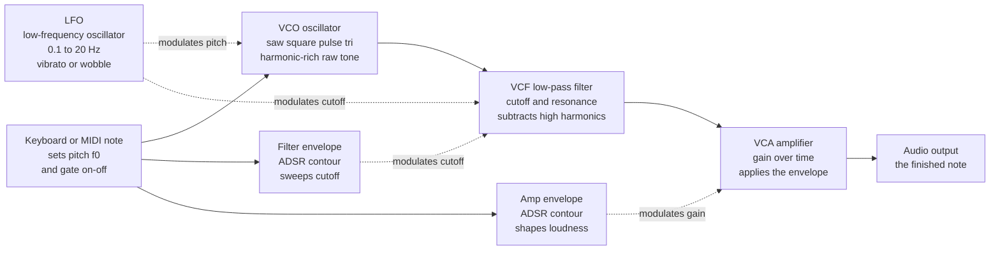

# 🎛️ Synthesis and Sound Design

> [!abstract] TL;DR
> **Sound synthesis** builds audio from scratch instead of recording it — you generate a raw electrical or numerical waveform and then sculpt its **spectrum** (which frequencies are present) and its **envelope** (how they evolve in time). The dominant analog paradigm is **subtractive synthesis**: start with a harmonic-rich **oscillator** (sawtooth, square/pulse, triangle, sine), carve it with a **filter** (low-pass cutoff and resonance), and shape its loudness with an **amplifier** driven by an **ADSR envelope**, while **LFOs** and envelopes **modulate** everything. Its complements are **additive** synthesis (sum sinusoidal partials directly — the inverse of Fourier analysis), **FM** synthesis (Chowning/DX7 — modulate one oscillator's frequency with another to spawn rich sidebands), and the sample-driven families **wavetable, granular, physical modeling, and sampling**. Synthesis is applied Fourier theory: every technique is just a different way to specify a spectrum and its motion over time.

## Intuition — analogy FIRST

Think of a **sculptor working in marble** versus a **sculptor working in clay**. The marble sculptor starts with a big rough block that already contains far *too much* material and chisels pieces **away** until the figure emerges — that is **subtractive synthesis**: begin with a buzzy sawtooth crammed with every harmonic, then use a filter to carve away the frequencies you do not want. The clay sculptor does the opposite, adding lumps of material one at a time until the shape is built **up** — that is **additive synthesis**: start from silence and pile on individual pure sine tones until their sum is the timbre you wanted.

Now add the crucial second dimension: **time**. A real note is not static — it is *born* (a pluck or a breath, the attack), *swells or settles* (decay/sustain), and *dies away* (release). The synthesizer models this with an **envelope**, a slow contour that tells the amplifier "get loud fast, then ease back, hold, then fade." And a slow, gentle wobble applied on top — **vibrato** on a violin, the throb of a film-score pad — is a **low-frequency oscillator** nudging the pitch or brightness up and down. So every synth sound is two questions answered together: *which frequencies?* (the sculpted spectrum) and *how do they move?* (the envelopes and modulators). That is exactly the two-part definition of **timbre** — see [[Timbre_and_the_Spectrum]].

---

## How It Works

### Core mechanics

1. **The oscillator is the raw sound source.** A single oscillator outputs a periodic waveform at a chosen fundamental $f_0$. Its *shape* determines its harmonic recipe (its Fourier spectrum), and different shapes are chosen precisely because they contain different overtones:
   - **Sine** — a single frequency, no overtones at all. The thinnest, purest tone; the atomic building block of additive synthesis.
   - **Sawtooth** — **all** integer harmonics, amplitude $\sim 1/n$. The brightest, buzziest wave; the workhorse of subtractive synthesis because there is lots of material to filter.
   - **Square** — **odd** harmonics only, amplitude $\sim 1/n$. Hollow, "woody" (the clarinet's fingerprint). Its width can be swept to a **pulse** wave, whose harmonic mix shifts with the duty cycle — the source of the classic "PWM" string sound.
   - **Triangle** — odd harmonics rolling off fast $\sim 1/n^2$. A soft, flute-like tone, nearly a sine but with a hint of edge.
2. **The filter subtracts frequencies.** A **low-pass filter (VCF)** passes lows and attenuates everything above a **cutoff** frequency; boosting **resonance** emphasizes the frequencies right at the cutoff, producing the vocal "wah" and squelchy acid-bass sounds. High-pass, band-pass, and notch filters carve other regions. Sweeping the cutoff over time — usually with an envelope — is the single most characteristic gesture of subtractive synthesis. This is a real audio filter; see [[Digital_Filter_Design]].
3. **The amplifier shapes loudness over time.** The **VCA (voltage-controlled amplifier)** multiplies the signal by a time-varying gain contour, the **ADSR envelope**: **Attack** (silence to peak), **Decay** (peak to sustain level), **Sustain** (held level while the key is down), **Release** (fade to silence after key-up). A fast attack and instant decay give a plucked/percussive sound; a slow attack and long release give a swelling pad.
4. **Modulators animate the static machine.** Anything that changes a parameter over time is a **modulation source**. **Envelopes** give one-shot contours (great for the filter cutoff, not just amplitude). An **LFO (low-frequency oscillator)**, running below hearing at roughly 0.1 to 20 Hz, gives cyclic motion — routed to pitch it makes **vibrato**, to amplitude **tremolo**, to filter cutoff a rhythmic **wobble**. A **modulation matrix** is just a routing table: "source $\to$ destination $\times$ amount."
5. **The paradigms differ in how they specify the spectrum:**
   - **Subtractive** — start rich, filter away (analog Moog/Minimoog paradigm; VCO $\to$ VCF $\to$ VCA).
   - **Additive** — start empty, sum sinusoids. This is literally the **inverse of Fourier analysis**: analysis decomposes a sound into partials, additive synthesis reassembles a sound *from* partials.
   - **FM (frequency modulation)** — use one oscillator (the *modulator*) to rapidly vary the frequency of another (the *carrier*). This generates **sidebands** at $f_c \pm k f_m$ whose number and strength are set by the **modulation index**, producing bright, metallic, evolving spectra from just two oscillators. John Chowning's 1973 discovery powered the Yamaha DX7, the best-selling synth in history.
   - **Wavetable** — store a table of single-cycle waveforms and sweep (morph) through them for evolving timbre (Serum, PPG).
   - **Granular** — chop audio into tiny "grains" of a few milliseconds and re-spray them into clouds; the basis of time-stretch and lush textures.
   - **Physical modeling** — solve the physics equations of a string, tube, or membrane in real time (Karplus–Strong, digital waveguides) for uncannily realistic plucks and blows.
   - **Sampling** — play back recorded audio, transposed per key; the attack transient must be preserved (loop only the steady sustain), which is the direct engineering consequence of "the onset carries the identity."
6. **It is all Fourier underneath.** Every technique above is a way of specifying a **magnitude spectrum and its time-variation**. Analog/digital differences are about *how faithfully* the spectrum is realized (continuous voltages vs. sampled numbers, aliasing, quantization) — not about the underlying goal, which is always to place energy at chosen frequencies and move it over time. See [[Fourier_Series]], [[Frequency_Spectrum]], and [[DFT_and_FFT]].



---

## Key Concepts

### Secondary

- **A synthesizer makes sound from electricity or numbers**, instead of recording a real instrument. The starting point is an **oscillator** — a circuit or bit of code that produces a repeating wave that you hear as a steady buzzing tone.
- **Waveform = the shape of the wave = its character.** A **sine** is smooth and pure (like a whistle), a **sawtooth** is bright and buzzy (like a brass or string section), a **square** is hollow (like a clarinet or old video-game sound), a **triangle** is soft and mellow.
- **A filter removes part of the sound**, like a tone knob or bass/treble control turned to the extreme. A **low-pass filter** keeps the low rumble and removes the bright fizz; opening and closing it as a note plays is what gives synths their signature "sweep."
- **An envelope controls how the note starts and stops.** Fast start + quick stop = a percussive "pluck"; slow start + long fade = a gentle "swell" or pad. The four stages are **Attack, Decay, Sustain, Release (ADSR)**.
- **Sound design** is the craft of combining these parts to invent a new sound — a spaceship laser, a movie-trailer boom, a dubstep bass, a warm background pad.

### Undergraduate

- **The oscillator's shape is a Fourier recipe.** Each classic waveform has a known harmonic spectrum: sawtooth = all harmonics $\propto 1/n$; square = odd harmonics $\propto 1/n$; triangle = odd harmonics $\propto 1/n^2$; sine = fundamental only. Choosing a waveform is choosing a starting spectrum to sculpt (this is the synthesis side of [[Timbre_and_the_Spectrum]]).
- **Subtractive signal chain: VCO $\to$ VCF $\to$ VCA.** Oscillator supplies harmonics; the **voltage-controlled filter** removes some (cutoff sets the corner, **resonance** peaks the frequencies at the corner); the **voltage-controlled amplifier** applies the amplitude envelope. This is the Moog/Minimoog architecture and still the mental model for most hardware and software synths.
- **Filter types.** **Low-pass** (keep lows), **high-pass** (keep highs), **band-pass** (keep a band), **notch/band-reject** (remove a band). Slope is measured in dB/octave (12 or 24 dB/oct are common). **Resonance (Q)** boosts energy at the cutoff and, pushed far, can self-oscillate into a sine.
- **ADSR in detail.** Attack/Decay/Release are *times*; Sustain is a *level*. A piano-like sound: fast attack, medium decay, low sustain, medium release. A string-pad: slow attack, high sustain, long release. Envelopes are routed to *any* parameter, most famously the **filter cutoff** for the classic "filter-envelope" pluck.
- **Modulation vocabulary.** **LFO** = cyclic modulator below the audible range (vibrato/tremolo/wobble). **Envelope** = one-shot modulator triggered by a key press. **Modulation matrix** = the routing of sources to destinations with per-route depth. Depth and rate are the two knobs that matter.
- **Additive synthesis = inverse Fourier.** Build a timbre by summing sinusoids $\sum_n a_n \sin(2\pi n f_0 t + \phi_n)$. Give each partial its **own** amplitude envelope and you can reproduce the way real instruments' overtones fade at different rates. The Hammond organ's drawbars are additive synthesis in hardware.
- **FM synthesis basics.** A carrier at $f_c$ whose frequency is modulated by a sinusoid at $f_m$ produces sidebands at $f_c \pm k\,f_m$ for $k = 0, 1, 2, \dots$, with amplitudes given by **Bessel functions** of the **modulation index** $I = \Delta f / f_m$. Larger $I$ $\Rightarrow$ more/brighter sidebands. When $f_c$ and $f_m$ are in a simple integer ratio the sidebands land on a harmonic series (pitched, "instrument-like"); irrational ratios give **inharmonic**, bell- and metal-like tones.
- **Analog vs digital.** Analog synths (continuous voltages) are prized for warm filter saturation and drift; digital synths offer FM/wavetable/granular precision, total recall, and polyphony, but must fight **aliasing** — harmonics generated above the Nyquist frequency fold back as inharmonic garbage unless the oscillators are band-limited. See [[Digital_Audio_Fundamentals]] for sampling and Nyquist.

### Graduate

- **FM spectrum, precisely.** For a carrier modulated by a single sinusoid, the output is $\sin\!\big(2\pi f_c t + I\sin(2\pi f_m t)\big) = \sum_{k=-\infty}^{\infty} J_k(I)\,\sin\!\big(2\pi (f_c + k f_m) t\big)$, where $J_k$ is the Bessel function of the first kind. The modulation index $I$ therefore directly controls spectral bandwidth (Carson's rule: significant bandwidth $\approx 2(\Delta f + f_m)$). Chaining/stacking operators into **algorithms** (the DX7 had 6 operators, 32 routing algorithms) yields spectra that continuously evolve as the modulator's own envelope changes $I$ over time — cheap, rich, animated timbre from a handful of sine oscillators.
- **Band-limited oscillators.** Naive digital saw/square waves have infinite harmonics and alias badly. Practical synths use **BLIT/BLEP** (band-limited impulse train / band-limited step) or additive/wavetable oscillators to synthesize only harmonics below Nyquist, replacing the discontinuity with a band-limited correction. The alternative is heavy oversampling.
- **The filter as a resonant system.** An analog VCF is a state-variable or ladder (Moog transistor-ladder) filter — a low-order continuous-time system whose cutoff maps to a pole frequency and whose resonance maps to pole $Q$. Digital emulations discretize it (bilinear transform, zero-delay-feedback topologies) and often add nonlinearity to reproduce the ladder's characteristic saturation. The maths lives in [[Digital_Filter_Design]] and the frequency-domain view in [[Frequency_Spectrum]].
- **Additive with time-varying partials.** Sinusoidal modeling (McAulay–Quatieri, spectral modeling synthesis / SMS by Serra & Smith) analyzes a recording into tracked partials **plus** a stochastic (noise) residual, then re-synthesizes and transforms it. This unifies analysis and synthesis: the STFT ([[STFT_and_Windowing]]) yields partial trajectories that additive synthesis plays back, enabling pitch/time transformations impossible with plain sampling.
- **Physical modeling.** **Karplus–Strong** plucked string = a short noise burst circulating through a delay line with a low-pass feedback filter; the delay length sets pitch, the filter sets decay and brightness. Generalized to **digital waveguides** (Julius Smith), this models tubes, strings, and bores as bidirectional delay lines with scattering junctions — the basis of realistic virtual guitars, pianos, and winds.
- **Granular synthesis.** Sound is a cloud of thousands of windowed grains (1 to 50 ms) with controllable density, position, pitch, and spread. It decouples **time** from **pitch** (independent time-stretch and transposition) and creates textures impossible acoustically; it is also the engine behind many convolution/texture tools and modern glitch/ambient design.
- **The source–filter unification.** Subtractive synthesis is an engineering instance of the **source–filter model** of acoustics: an excitation (oscillator, glottal pulse, reed buzz) with a rich spectrum passed through a resonant filter (VCF, vocal tract, instrument body) that imposes formants. **Vocoders** and formant filters make this explicit — see [[FastSpeech_and_Vocoders]] — and it connects directly to why timbre analysis uses a spectral-envelope model.
- **Perceptual matching.** Because the ear is largely phase-deaf for steady tones (Ohm's law) but phase-sensitive in transients, additive/FM engines can ignore steady-state phase yet must respect attack-time behavior — the same asymmetry that makes the **attack transient** decisive for identity in [[Psychoacoustics_and_Pitch_Perception]].

---

## Python Demo

```python
# Synthesis from first principles, numpy + matplotlib only.
# 1) Generate the classic oscillator waveforms (sine, square, sawtooth,
#    triangle) and plot each waveform AND its FFT magnitude spectrum to
#    reveal its harmonic content.
# 2) Build and apply an ADSR amplitude envelope.
# 3) Additive synthesis: build a square-like tone by summing odd harmonics.
# 4) Subtractive step: low-pass a sawtooth by zeroing high-frequency FFT
#    bins, and plot the spectrum + waveform before and after.

import numpy as np
import matplotlib.pyplot as plt

# --- Global parameters ---
fs  = 44100          # sample rate in Hz
f0  = 220.0          # fundamental in Hz (A3)
dur = 1.0            # seconds
t   = np.arange(int(fs * dur)) / fs

# --- 1. Classic waveforms, all built from one phase ramp (0..1 per period) ---
phase    = np.mod(f0 * t, 1.0)
sine     = np.sin(2 * np.pi * f0 * t)
square   = np.where(phase < 0.5, 1.0, -1.0)
saw      = 2.0 * phase - 1.0                      # rising ramp, -1..1
triangle = 2.0 * np.abs(2.0 * phase - 1.0) - 1.0  # folded saw

waves = [("Sine", sine), ("Square", square),
         ("Sawtooth", saw), ("Triangle", triangle)]

def mag_spectrum(sig):
    """Hann-windowed FFT magnitude spectrum, peak-normalized."""
    w = np.hanning(len(sig))
    X = np.abs(np.fft.rfft(sig * w))
    X = X / X.max()
    freqs = np.fft.rfftfreq(len(sig), 1.0 / fs)
    return freqs, X

# Figure 1: waveform (left) + harmonic spectrum (right) for each wave
fig1, ax = plt.subplots(4, 2, figsize=(12, 10))
n_show = int(fs * 0.01)             # 10 ms window ~ two periods of 220 Hz
for i, (name, sig) in enumerate(waves):
    f, X = mag_spectrum(sig)
    ax[i, 0].plot(t[:n_show] * 1000, sig[:n_show], color="navy")
    ax[i, 0].set_title(f"{name} waveform")
    ax[i, 0].set_ylabel("amp")
    ax[i, 0].grid(alpha=0.3)
    m = f <= 4000
    ax[i, 1].plot(f[m], X[m], color="crimson")
    ax[i, 1].set_title(f"{name} spectrum")
    ax[i, 1].set_ylabel("mag")
    ax[i, 1].grid(alpha=0.3)
ax[-1, 0].set_xlabel("time in ms")
ax[-1, 1].set_xlabel("frequency in Hz")
fig1.suptitle("Classic oscillators: same pitch, different harmonic content",
              fontsize=13)
fig1.tight_layout(rect=[0, 0, 1, 0.97])

# --- 2. ADSR envelope applied to the sawtooth ---
def adsr(fs, attack, decay, sustain_level, sustain_time, release):
    A = np.linspace(0.0, 1.0, int(fs * attack), endpoint=False)
    D = np.linspace(1.0, sustain_level, int(fs * decay), endpoint=False)
    S = np.full(int(fs * sustain_time), sustain_level)
    R = np.linspace(sustain_level, 0.0, int(fs * release))
    return np.concatenate([A, D, S, R])

env  = adsr(fs, attack=0.02, decay=0.06, sustain_level=0.7,
            sustain_time=0.4, release=0.30)
te   = np.arange(len(env)) / fs
note = saw[:len(env)] * env                # spectrum x envelope = a note

fig2, (a1, a2) = plt.subplots(2, 1, figsize=(12, 6))
a1.plot(te, env, color="darkgreen", lw=2)
a1.set_title("ADSR amplitude envelope: Attack Decay Sustain Release")
a1.set_ylabel("gain")
a1.grid(alpha=0.3)
a2.plot(te, note, color="purple", lw=0.5)
a2.set_title("Sawtooth oscillator multiplied by ADSR = a shaped note")
a2.set_xlabel("time in seconds")
a2.set_ylabel("amp")
a2.grid(alpha=0.3)
fig2.tight_layout()

# --- 3. Additive synthesis: build a square-like tone from odd harmonics ---
tt = t
fig3, ax3 = plt.subplots(figsize=(12, 5))
for n_harm in [1, 3, 7, 25]:
    approx = np.zeros_like(tt)
    for n in range(1, n_harm + 1, 2):          # odd harmonics only
        approx += (1.0 / n) * np.sin(2 * np.pi * n * f0 * tt)
    ax3.plot(tt[:n_show] * 1000, approx[:n_show],
             label=f"{(n_harm + 1) // 2} odd partials")
ax3.set_title("Additive synthesis: summing odd harmonics converges to a square")
ax3.set_xlabel("time in ms")
ax3.set_ylabel("amp")
ax3.legend()
ax3.grid(alpha=0.3)
fig3.tight_layout()

# --- 4. Subtractive step: low-pass a sawtooth by zeroing high FFT bins ---
cutoff = 1500.0                                 # brick-wall cutoff in Hz
freqs  = np.fft.rfftfreq(len(saw), 1.0 / fs)
Xsaw   = np.fft.rfft(saw)
Xlp    = Xsaw.copy()
Xlp[freqs > cutoff] = 0.0                        # remove harmonics above cutoff
saw_lp = np.fft.irfft(Xlp, n=len(saw))

def norm_mag(X):
    m = np.abs(X)
    return m / m.max()

fig4, ax4 = plt.subplots(2, 2, figsize=(12, 8))
mask = freqs <= 4000
ax4[0, 0].plot(freqs[mask], norm_mag(Xsaw)[mask], color="crimson")
ax4[0, 0].axvline(cutoff, color="black", ls="--", label="cutoff")
ax4[0, 0].set_title("Sawtooth spectrum BEFORE filtering")
ax4[0, 0].set_ylabel("mag"); ax4[0, 0].legend(); ax4[0, 0].grid(alpha=0.3)
ax4[0, 1].plot(freqs[mask], norm_mag(Xlp)[mask], color="teal")
ax4[0, 1].axvline(cutoff, color="black", ls="--")
ax4[0, 1].set_title("Spectrum AFTER low-pass (high harmonics removed)")
ax4[0, 1].grid(alpha=0.3)
ax4[1, 0].plot(t[:n_show] * 1000, saw[:n_show], color="navy")
ax4[1, 0].set_title("Sawtooth waveform BEFORE")
ax4[1, 0].set_xlabel("time in ms"); ax4[1, 0].set_ylabel("amp")
ax4[1, 0].grid(alpha=0.3)
ax4[1, 1].plot(t[:n_show] * 1000, saw_lp[:n_show], color="darkorange")
ax4[1, 1].set_title("Waveform AFTER (smoother, fewer overtones)")
ax4[1, 1].set_xlabel("time in ms")
ax4[1, 1].grid(alpha=0.3)
fig4.suptitle(f"Subtractive synthesis: low-pass a sawtooth at {cutoff:.0f} Hz",
              fontsize=13)
fig4.tight_layout(rect=[0, 0, 1, 0.96])

plt.show()
```

Running it shows the four oscillators with their tell-tale spectra (sine = one line; sawtooth = every harmonic; square/triangle = odd harmonics only, triangle rolling off much faster), an ADSR contour shaping a sawtooth into a musical note, odd-harmonic partial sums visibly converging toward a square wave (additive), and a sawtooth losing its bright upper harmonics after the high FFT bins are zeroed — the smoother post-filter waveform is exactly what a low-pass VCF does in a subtractive synth.

---

## Real-World Applications

- **Music production.** The Minimoog and its descendants (subtractive) define analog bass and lead sounds across funk, rock, and electronic music; the Yamaha DX7 (FM) supplied the glassy electric pianos, bells, and slap-bass of countless 1980s records; wavetable synths (Serum, Massive) drive modern EDM and hip-hop. Nearly every pop record uses a synthesized pad, bass, or lead.
- **Film and trailer scoring.** Sound designers build risers, "braaam" impacts, and drones by layering oscillators, heavy filtering, and slow envelopes; granular and physical-modeling tools generate otherworldly textures for sci-fi and horror. Zimmer-style hybrid scores blend synths with orchestra.
- **Game audio.** Real-time synthesis saves memory and enables **procedural** sound — engine notes that track RPM, footsteps varying with surface, weapon layers — where a fixed sample library would be too large or too repetitive. Chip-tune (NES/Game Boy) is literally square and triangle oscillators.
- **Sound effects and UI.** Lasers, power-ups, notification chimes, and alarms are synthesized: an FM tone with a fast pitch envelope makes a "pew"; a filtered noise burst makes an explosion.
- **Speech and vocal processing.** The source–filter model underlies **vocoders** (carrier oscillator shaped by the formant envelope of speech), talk-box effects, and formant synthesizers — see [[FastSpeech_and_Vocoders]]. Auto-Tune's formant-preserving pitch shift is the same filter-vs-source split.
- **Accessibility and assistive tech.** Formant and concatenative synthesizers power screen readers and communication aids, historically driving text-to-speech before neural vocoders.

---

## Common Pitfalls

- **Choosing a sine to then "filter for brightness."** A sine has no overtones, so a low-pass filter has nothing to remove and cannot make it brighter. Subtractive synthesis needs a **harmonic-rich** source (saw or square) — you can only subtract what is there.
- **Confusing the LFO with an audio oscillator.** An LFO runs *below* hearing (roughly 0.1 to 20 Hz) and is a **modulator**, not a sound source. Route it to pitch for vibrato, to amplitude for tremolo, to cutoff for a wobble — but you do not hear the LFO itself.
- **Ignoring aliasing in digital oscillators.** A naive digital sawtooth has infinite harmonics; any above the **Nyquist** frequency fold back as inharmonic, detuned tones, especially in high notes. Use band-limited (BLEP/BLIT/wavetable) oscillators or oversample. See [[Digital_Audio_Fundamentals]].
- **Treating ADSR times and levels interchangeably.** Attack, Decay, and Release are **durations**; Sustain is a **level**. Setting "sustain" as a time (or expecting release to fire while the key is still held) produces envelopes that behave nothing like intended.
- **Cranking resonance without watching gain.** High filter resonance boosts energy at the cutoff and can self-oscillate or clip painfully, especially as the cutoff sweeps through strong harmonics. Compensate level and mind your ears/monitors.
- **Assuming FM ratios are arbitrary.** Carrier-to-modulator ratio decides everything: simple integer ratios give pitched, harmonic tones; non-integer ratios give **inharmonic**, bell/metal tones. Detuning a ratio slightly is how you get "wrong," clangorous timbres.
- **Looping over the attack of a sample.** Samplers must preserve the **attack transient** — it carries the instrument's identity. Loop only the steady sustain; crop or loop the onset and a piano turns into an organ (the timbre lesson from [[Timbre_and_the_Spectrum]]).
- **Believing "analog is always warmer/better."** Warmth is specific behaviors — filter saturation, oscillator drift, gentle nonlinearity — that digital models now emulate well. The real trade-offs are recall, polyphony, and precision (digital) vs. tactile immediacy and analog character (analog).

---

## Related Concepts

- [[Timbre_and_the_Spectrum]] — synthesis is the *construction* side of timbre: you specify a spectrum plus an ADSR envelope, exactly the two ingredients timbre is made of.
- [[Fourier_Series]] — additive synthesis is the inverse of the Fourier series; the harmonic amplitudes you sum are the Fourier coefficients of the target waveform.
- [[Frequency_Spectrum]] — every oscillator waveform and every filter setting is read off as a magnitude spectrum; sound design is spectral shaping.
- [[DFT_and_FFT]] — the FFT reveals an oscillator's harmonic content and (by zeroing bins) demonstrates the low-pass step in the Python demo.
- [[Digital_Filter_Design]] — the VCF's low/high/band-pass behavior, cutoff, and resonance are ordinary audio filters with poles and zeros.
- [[Digital_Audio_Fundamentals]] — sampling, Nyquist, and quantization underlie every digital synth and explain aliasing and the analog-vs-digital debate.
- [[STFT_and_Windowing]] — analysis/resynthesis (sinusoidal and spectral modeling) uses short-time Fourier frames to track partials over time.
- [[FastSpeech_and_Vocoders]] — vocoders apply the source–filter model of subtractive synthesis to the human voice.
- [[Psychoacoustics_and_Pitch_Perception]] — why the attack transient, missing fundamental, and phase-deafness shape what a synthesizer must and need not model.
- [[Resonance_and_Instruments]] — physical-modeling synthesis solves the same resonant-system physics that real instrument bodies obey.

---

## Review Questions

1. **(Secondary)** You want to design a bright, buzzy synth-brass lead and then make it sound "duller" as the note is held. Which oscillator **waveform** would you start with and why, and which module — filter or amplifier — would you sweep to darken the sound over time? Explain in one sentence what an ADSR envelope controls.
2. **(Undergraduate)** Describe the subtractive signal chain VCO $\to$ VCF $\to$ VCA and state what each stage does to the spectrum or envelope. Then explain why a **sawtooth** is a better starting oscillator for subtractive synthesis than a **sine**, referencing each wave's harmonic content. Finally, contrast **additive** synthesis with subtractive synthesis in terms of Fourier analysis.
3. **(Graduate)** In FM synthesis a carrier $f_c$ is modulated by $f_m$ with modulation index $I$. (a) Write the sideband frequencies and state qualitatively how $I$ affects the spectrum. (b) Explain why an integer $f_c{:}f_m$ ratio yields a harmonic (pitched) tone while an irrational ratio yields an inharmonic (bell-like) tone. (c) A colleague's naive digital sawtooth sounds fine at low notes but gritty and detuned at high notes. Diagnose the cause and name two engineering fixes.

---

## Sources

- Chowning, J. M. (1973). "The Synthesis of Complex Audio Spectra by Means of Frequency Modulation." *Journal of the Audio Engineering Society*, 21(7), 526–534.
- Roads, C. (1996). *The Computer Music Tutorial*. MIT Press.
- Smith, J. O. (2010). *Physical Audio Signal Processing* and *Spectral Audio Signal Processing*. W3K Publishing (online at CCRMA, Stanford).
- Russ, M. (2012). *Sound Synthesis and Sampling* (3rd ed.). Focal Press.
- Puckette, M. (2007). *The Theory and Technique of Electronic Music*. World Scientific.
- Pinch, T., & Trocco, F. (2002). *Analog Days: The Invention and Impact of the Moog Synthesizer*. Harvard University Press.

---

#music-theory #synthesis #sound-design #subtractive #fm-synthesis
