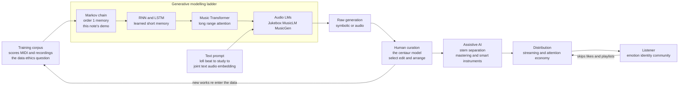

# 🎛️ The Future of Music and AI

> [!abstract] TL;DR
> Every layer of music — **creation, distribution, consumption** — is being rewritten by machine learning at once. The generative core is old and simple: model the probability of *the next musical event given what came before*, then sample. The **Markov chain** in this note's demo does exactly that with a memory of one chord; a **Music Transformer** does the same with a memory of thousands of tokens and billions of learned weights; **audio models** (Jukebox, MusicLM, MusicGen, Suno, Udio) push it all the way to raw waveforms conditioned on a **text prompt**. The honest questions are no longer "can a machine make music" — it can — but *who owns it, what it was trained on, whether it homogenizes or democratizes, and what music was ever actually for*. The most likely near future is not replacement but the **centaur**: a human curating, editing, and giving meaning to machine-generated material, aided by stem-separation, AI mastering, and smart instruments. What survives untouched is the part that was never about the notes — **live presence, emotional connection, identity, and cultural meaning** — which is exactly why music remains the vault's clearest nexus of **math, physics, cognition, culture, and technology**.

---

## Intuition

**Analogy first — AI music is autocomplete for sound.** When your phone finishes "see you" with "later," it is not *thinking*; it read an enormous amount of text and learned which word tends to follow which. A music model plays the identical game with musical events instead of words: given the notes, chords, or sound so far, predict what plausibly comes next, and sample one. The tiny **Markov chain** below is the crudest possible version — it remembers only the *current* chord and reaches for the most common next one. A **Transformer** is the *same idea* scaled monstrously: instead of a 7×7 table of chord counts it has billions of weights, and instead of remembering one chord it *attends* over thousands of past events, learning which distant moments matter. Text-to-music systems bolt a second autocomplete on the front — they read your words *and* the sound, so "lofi beat to study to" steers the prediction.

**Second analogy — every new music technology was first called the death of music.** The player piano, the microphone, the electric guitar, the synthesizer, the drum machine, the sampler, the DAW, Auto-Tune, streaming — each arrived to cries that it would end "real" musicianship, and each instead became an *instrument* and a *genre engine* (hip-hop is built on the sampler; techno on the drum machine). The useful prior for reasoning about AI is therefore not "is this the end" but "which existing skills does it cheapen, which new ones does it create, and where does the irreducibly human part relocate to?" History says the human part never disappears — it *moves*.

---

## How It Works

### The single idea underneath all of it

Every generative music system, from a 1950s rule engine to Suno, is trying to model one distribution: **P(next event | everything so far)**, then draw samples from it. What changes across the decades is (1) how much context "so far" spans, (2) how the probabilities are stored, and (3) what an "event" even is.

- **Rule systems (1950s–80s).** No learning: hand-coded music theory. The *Illiac Suite* (1957) generated counterpoint by rejecting any note that violated species-counterpoint rules — literally the theory in [[Voice_Leading_and_Counterpoint]] as a constraint solver. Brittle, but interpretable.
- **Markov chains.** Learn transition *counts* from a corpus — the demo below. Memory of order-1 or order-2; the whole "model" is a small table. Captures local grammar (which chord follows which) but has no long-range structure, so it wanders and never returns to a theme.
- **RNNs / LSTMs (2000s–2016).** A learned hidden state carries a *compressed* memory forward, so phrases hang together better — but the memory decays and long-range form still collapses.
- **Transformers.** The breakthrough is **self-attention**: every event can look directly at every earlier event, so a model can remember a motif from 30 seconds ago and bring it back. Google's **Music Transformer** (2018) used *relative* attention to generate minute-long piano pieces with genuine repetition and phrase structure — the first symbolic model that felt *composed* rather than improvised-then-forgotten (see [[LLM_Architecture_Deep_Dive]]).
- **Audio language models.** Instead of symbols, tokenize the *waveform* itself with a neural audio codec, then run a Transformer over those tokens. OpenAI's **Jukebox** (2020) sang in recognizable artist styles; **MusicLM**, **AudioLM**, and Meta's **MusicGen** (2023) generate high-fidelity, controllable audio; **Suno** and **Udio** (2024) put full vocal songs behind a text box for the public. See [[AudioCraft_MusicGen]] and [[AudioLM]].

### Symbolic vs audio generation

There are two fundamentally different targets, and the choice cascades through everything:

| | **Symbolic** | **Audio** |
|---|---|---|
| Output | notes/MIDI events, a *score* | a *waveform* / spectrogram / codec tokens |
| Analogy | writing the sheet music | recording the performance |
| Pros | editable, exports to a DAW, respects theory | captures timbre, production, *voices* |
| Cons | someone still has to perform/render it | opaque, hard to edit a single note, huge compute |
| Example | Music Transformer, MuseNet | Jukebox, MusicLM, Suno, Udio |

Symbolic generation is what a *composer* wants (you can fix the third bar); audio generation is what a *listener* wants (a finished track). The bridge between them, and the science of extracting one from the other, is **Music Information Retrieval** — see [[Music_Classification_MIR]].

### Text-to-music and multimodal conditioning

The magic of "type words, get music" is a **joint embedding**: a model like CLAP is trained so that a caption and the audio it describes land near each other in the same vector space (see [[CLAP_and_Audio_Language]] and [[Multimodal_AI]]). At generation time the text prompt is embedded and used to *steer* the audio model's predictions toward that region — the same conditioning trick that powers text-to-image [[Diffusion_Models]]. This is why prompts work at the level of *vibe and genre* far better than at the level of *this exact chord in bar 12*: the control surface is semantic, not surgical.

### The three layers being reshaped

1. **Creation.** Generation is only the loud part. The quieter revolution is **assistive AI**: **stem separation** pulls a finished song back into vocals/drums/bass/other (see [[Music_Source_Separation]]); **AI mastering** (LANDR, Ozone) does in seconds what a studio engineer charged for; **smart instruments** and generative plug-ins suggest chords, fills, and basslines. These do not replace the artist — they collapse the cost of the boring middle.
2. **Distribution.** The **DAW plus a laptop** already democratized production — the "bedroom producer" is now the default, and vast sample libraries mean anyone can sound like a studio. AI extends this to people with *no* instrument at all. The dark twin is the **flood**: when supply goes to infinity and marginal cost to zero, discovery — not creation — becomes the scarce resource, and platforms fear a wave of cheap, homogeneous "AI slop" diluting royalty pools.
3. **Consumption.** Streaming and the **attention economy** have already bent song *form*: because skip-rate peaks in the first seconds, intros shrink, hooks arrive within ~15–30 seconds, and songs get shorter and more front-loaded (see [[Song_Structure_and_Popular_Forms]]). AI recommendation curates the listening; AI generation may soon fill "functional" niches — study beats, sleep, ambient — where nobody asks *who* made it.

### Can it be creative? and what music is *for*

AI reliably produces music that is *novel* and *fluent*. Whether that is **creativity** depends on your definition: if creativity is generating valuable, surprising artefacts, models qualify; if it requires *intention*, *lived experience*, or *communicative meaning*, they do not — they have no stake in what they say (the deep version of this argument lives in [[AI_and_the_Future_of_Cognitive_Science]]). The durable answer is that a lot of music was never about the artefact at all. **Live performance, the emotional bond between artist and audience, music as a marker of identity and community, ritual, and shared cultural memory** are functions AI does not touch, because they are about *human presence and meaning* (see [[Emotion_and_Cognition]] and [[Psychoacoustics_and_Pitch_Perception]]). The most grounded forecast: AI eats the *commodity* end of music and enriches the *human* end, exactly as photography did not kill painting but freed it.

### The polymath thread

This is the vault's capstone on music for a reason. A single generated song touches **math** (the transition matrices and attention of the model), **physics** (the acoustics and [[Timbre_and_the_Spectrum]] of its sound), **cognition** (why the result moves us at all), **culture** (the corpus it learned from and the meaning listeners assign), and **technology** (the pipeline that produced it). Music is the clearest place in the whole vault where those five threads are visibly the *same* subject.



---

## Key Concepts

### 🟢 Secondary (foundations)

- **Generation is prediction plus sampling.** A music AI guesses "what comes next" and rolls dice weighted by what it learned — like phone autocomplete, but for notes or sound.
- **Old idea, new scale.** The Markov chain, the Transformer, and Suno are the *same* bet — predict the next event — separated only by memory length and model size.
- **Text-to-music.** You describe music in words; a model that learned to line up captions with audio turns your description into sound.
- **Tool, not just author.** Most working use of AI is *assistive* — separating stems, mastering a mix, suggesting chords — not pressing "make me a hit."
- **The human part moves, it does not vanish.** Every past music technology (synth, sampler, DAW) was called the death of music and instead became an instrument.

### 🟡 Undergraduate (mechanics)

- **Symbolic vs audio generation.** Symbolic = editable notes/MIDI (a score); audio = a finished waveform (a recording). They demand different models and serve different users (composer vs listener).
- **The model ladder:** rule systems → Markov → RNN/LSTM → **Transformer** (self-attention gives long-range memory and returning motifs) → **audio LMs** over neural-codec tokens.
- **Joint embeddings** (CLAP-style) place text and audio in one space so a prompt can *steer* generation; this is why control is *semantic* ("jazzy, sad") rather than *surgical* ("F♯7 in bar 12").
- **The centaur / co-creation model:** highest-quality output today is human-in-the-loop — the model proposes, the human selects, edits, arranges, and supplies intent and taste.
- **Streaming reshapes form:** front-loaded hooks, shorter intros and songs, because the attention economy punishes slow starts — see [[Song_Structure_and_Popular_Forms]].
- **Democratization vs homogenization:** near-zero cost of production empowers bedroom producers *and* threatens a flood of interchangeable output, shifting scarcity from *making* to *discovery*.

### 🔴 Graduate (systems and stakes)

- **Long-range structure is the hard problem.** Local grammar (voice leading, chord flow) is easy; *form* — a motif that returns transformed, a satisfying climax at the final chorus — requires memory and hierarchy that Markov models lack and even large audio models still struggle to sustain over minutes. Structure, not local plausibility, is the frontier.
- **Copyright and training-data ethics.** Three unresolved fronts: (1) **input** — was training on copyrighted recordings without license fair use or infringement? (active litigation against Suno and Udio); (2) **output** — who owns a machine-generated track, and can it even be copyrighted when many jurisdictions require human authorship? (3) **likeness** — **deepfake voices** cloning a named artist without consent (see [[Zero_Shot_Voice_Cloning]]) raise personality-rights and consent questions the law is scrambling to answer.
- **Evaluation is unsolved.** There is no accepted metric for "good music." Fréchet Audio Distance and human MOS studies proxy for quality and diversity, but *meaning*, *originality*, and *cultural fit* resist measurement — the same construct-validity problem that haunts all generative evaluation ([[AI_Bias_and_Fairness]], [[Responsible_AI]]).
- **The creativity question is a definitional fork.** Under a *product* definition (novel + valuable) models are creative now; under a *process* definition (intention, embodiment, communicative stake) they are not. The debate is really about what we think *human* creativity is — the mirror argument in [[AI_and_the_Future_of_Cognitive_Science]].
- **What is music *for*?** Function determines what AI can and cannot displace: as **commodity audio** (background, functional, royalty-free), AI wins on cost; as **live presence, identity, community, and ritual**, it is largely irrelevant, because those functions are constituted by *human* participation. The parallel capstone [[The_Future_of_Literature]] runs the identical argument for text.

---

## Python Demo

The simplest ancestor of every neural music generator: a **first-order Markov chain over chords**. We build a tiny "corpus" of common progressions, "train" by counting chord-to-chord transitions, generate a brand-new progression by walking the chain, and plot both the learned **transition matrix** (which *is* the entire model) and one generated example. The trailing comment block spells out exactly how a Transformer scales this toy. numpy and matplotlib only.

```python
import numpy as np
import matplotlib.pyplot as plt

# ---------------------------------------------------------------
# A first-order Markov chain: the crudest ancestor of neural music
# generation. It learns exactly ONE thing -- given the current chord,
# which chord tends to come next -- the same "next-token" game a
# Transformer plays, but with a memory of length 1 and raw counts
# instead of billions of learned weights.
# ---------------------------------------------------------------

rng = np.random.default_rng(7)

# Vocabulary: the seven diatonic triads of a major key (our "tokens").
chords = ["I", "ii", "iii", "IV", "V", "vi", "vii"]
idx = {c: i for i, c in enumerate(chords)}
n = len(chords)

# Tiny "training corpus": common chord progressions from pop, rock, jazz.
corpus = [
    ["I", "V", "vi", "IV"],        # axis / "four-chord song"
    ["I", "V", "vi", "IV", "I"],
    ["vi", "IV", "I", "V"],        # axis rotation
    ["I", "vi", "IV", "V"],        # 50s doo-wop
    ["ii", "V", "I"],              # jazz cadence
    ["ii", "V", "I", "vi"],
    ["I", "IV", "V", "I"],         # blues-ish
    ["IV", "V", "I"],
    ["I", "IV", "I", "V"],
    ["I", "iii", "IV", "V"],
    ["vi", "V", "IV", "V"],
]

# --- "Training": count chord-to-chord transitions (bigrams) ---
counts = np.zeros((n, n))
for prog in corpus:
    for a, b in zip(prog[:-1], prog[1:]):
        counts[idx[a], idx[b]] += 1

# Row-normalize to a transition matrix P[i, j] = P(next=j | current=i).
# Laplace smoothing keeps every row a valid distribution (no dead ends).
P = counts + 0.01
P = P / P.sum(axis=1, keepdims=True)

# --- "Generation": sample a new progression by walking the chain ---
def generate(P, start="I", length=8):
    seq, cur = [start], idx[start]
    for _ in range(length - 1):
        cur = rng.choice(n, p=P[cur])
        seq.append(chords[cur])
    return seq

new_prog = generate(P, start="I", length=8)
print("Generated progression:", " -> ".join(new_prog))

# --- Plot 1: the learned transition matrix (the whole "model") ---
fig, (ax1, ax2) = plt.subplots(1, 2, figsize=(13, 5.2),
                               gridspec_kw={"width_ratios": [1.1, 1]})

im = ax1.imshow(P, cmap="magma", vmin=0, vmax=1)
ax1.set_xticks(range(n)); ax1.set_xticklabels(chords)
ax1.set_yticks(range(n)); ax1.set_yticklabels(chords)
ax1.set_xlabel("next chord")
ax1.set_ylabel("current chord")
ax1.set_title("Learned transition matrix  P[next | current]\n(the entire 'model' = 49 numbers)",
              fontweight="bold")
for i in range(n):
    for j in range(n):
        if P[i, j] > 0.08:
            ax1.text(j, i, f"{P[i, j]:.2f}", ha="center", va="center",
                     color="white" if P[i, j] < 0.6 else "black", fontsize=7)
fig.colorbar(im, ax=ax1, fraction=0.046, pad=0.04, label="probability")

# --- Plot 2: one generated progression as a walk over chord space ---
y = [idx[c] for c in new_prog]
x = list(range(len(new_prog)))
ax2.plot(x, y, "-o", color="#2563eb", lw=2, markersize=9)
for xi, yi, c in zip(x, y, new_prog):
    ax2.annotate(c, (xi, yi), textcoords="offset points", xytext=(0, 10),
                 ha="center", fontweight="bold", color="#111827")
ax2.set_yticks(range(n)); ax2.set_yticklabels(chords)
ax2.set_xlabel("position in progression")
ax2.set_ylabel("chord")
ax2.set_title("A newly generated progression\n(walking the chain)", fontweight="bold")
ax2.grid(True, ls="--", alpha=0.3)
ax2.set_ylim(-0.5, n - 0.5)

plt.tight_layout()
plt.show()

# ---------------------------------------------------------------
# How a Transformer scales this toy (same bet, vastly bigger):
#   * MEMORY:  order-1 Markov sees only the CURRENT chord. A Transformer
#              attends over THOUSANDS of past tokens (notes, bars, chords)
#              at once, so motifs can return -- real long-range form.
#   * PARAMS:  this model IS the 7x7 table above (49 numbers). A music
#              Transformer learns billions of weights plus a rich learned
#              embedding for every token.
#   * TOKENS:  here a token is a chord symbol. Music Transformer tokenizes
#              MIDI events (note-on, note-off, time-shift, velocity); audio
#              models (Jukebox, MusicLM, MusicGen) tokenize compressed
#              WAVEFORM codes -- so they generate timbre and voices, not
#              just notes.
#   * CONTROL: text-to-music (MusicLM, Suno, Udio) adds a TEXT prompt via a
#              joint text-audio embedding -- steering no fixed table can do.
# The core objective is identical: model P(next | context) and sample it.
# ---------------------------------------------------------------
```

Running it prints a fresh progression such as `I -> V -> vi -> IV -> I -> vi -> IV -> V` and draws two panels: a **magma heatmap** of the 7×7 transition matrix (bright cells mark the common moves the corpus taught — `V → vi`, `IV → V`, `ii → V`) and a **blue path** tracing one sampled progression through chord space. That 49-number table is a complete, if tiny, generative music model; a Transformer is the same object with billions of numbers and a memory long enough to remember a chorus.

---

## Real-World Applications

- **Suno and Udio** — public text-to-song apps: a prompt yields a full track with vocals in seconds. The purest consumer face of audio generation, and the current center of the training-data copyright fight (see [[Zero_Shot_Voice_Cloning]] for the voice-likeness angle).
- **Meta MusicGen / AudioCraft** — open, controllable music generation conditioned on text *and* a melody, widely used for research and prototyping ([[AudioCraft_MusicGen]]).
- **iZotope Ozone / LANDR (AI mastering)** and **Serato / RX / Moises (stem separation)** — the *assistive* mainstream: producers de-mix, clean, and master tracks with models rather than studio time ([[Music_Source_Separation]]).
- **Spotify / Apple Music recommendation** — generative *curation*: the attention-economy layer that reshapes song form (front-loaded hooks, shorter songs) and increasingly seeds "functional" AI-made playlists ([[Song_Structure_and_Popular_Forms]]).
- **Music Transformer / MuseNet (symbolic co-composition)** — DAW plug-ins that suggest chords, harmonize a melody, or extend a phrase, keeping the human as arranger and editor.
- **Automatic transcription and search (MIR)** — turning audio into editable symbols and enabling "hum to search," cover detection, and structural segmentation ([[Music_Classification_MIR]]).

---

## Common Pitfalls

- **Confusing fluency with structure.** Models produce locally gorgeous, plausible sound while lacking a *global* plan — no returning theme, no earned climax. A track can sound great for 8 bars and go nowhere for 3 minutes. Long-range form is the unsolved part.
- **Treating "AI music" as one thing.** Symbolic and audio generation are different technologies with different owners and uses. Reviewing an editable MIDI co-writer and a black-box text-to-song app by the same yardstick misses the point.
- **Assuming replacement.** The evidence says *augmentation*: the commodity/functional end automates, the human/live/identity end does not. Predicting "the end of musicians" repeats the same error made about every prior music technology.
- **Ignoring the training-data provenance.** "It just makes music" hides the central ethical fact that the model *learned from someone's recordings*. Input consent, output ownership, and voice likeness are unresolved and legally live — not footnotes ([[Responsible_AI]]).
- **Mistaking novelty for creativity — or denying it entirely.** Both extremes are lazy. The interesting question is *which* definition of creativity you are using, and models score very differently under "novel-and-valuable" vs "intentional-and-embodied" ([[AI_and_the_Future_of_Cognitive_Science]]).
- **Prompting like a score, not a mood.** Text conditioning steers *semantics* (genre, feel), not surgical detail. Expecting "put a diminished chord in bar 12" to work misunderstands how joint embeddings control generation.

---

## Related Concepts

- [[Song_Structure_and_Popular_Forms]] — The attention economy's pressure on song *form* (shorter intros, front-loaded hooks) is where AI-driven distribution most visibly bends the music itself.
- [[Music_Classification_MIR]] — The retrieval/analysis half of the field: transcription, structural segmentation, and the symbolic-vs-audio bridge that generation depends on.
- [[Music_Source_Separation]] — The flagship *assistive* AI tool (de-mixing a finished song into stems), central to the co-creation workflow.
- [[AudioCraft_MusicGen]] — A concrete, controllable audio-generation system; the modern realization of "predict the next waveform token."
- [[AudioLM]] — Continuation-based audio generation over neural-codec tokens, the architecture family behind MusicLM.
- [[Zero_Shot_Voice_Cloning]] — The technology behind deepfake vocals, and the sharpest consent/likeness ethics problem in AI music.
- [[CLAP_and_Audio_Language]] — The joint text-audio embedding that makes *text-to-music* prompting possible.
- [[Multimodal_AI]] — The general pattern of conditioning one modality (audio) on another (text) via shared representations.
- [[Diffusion_Models]] — The alternative generative backbone (used for several audio and text-to-music systems), sibling to the autoregressive Transformer approach.
- [[LLM_Architecture_Deep_Dive]] — Self-attention is what lifts music models from Markov-style local grammar to real long-range musical memory.
- [[Timbre_and_the_Spectrum]] — Why *audio* generation is hard and valuable: it must synthesize timbre and production, not just notes.
- [[Psychoacoustics_and_Pitch_Perception]] — The perceptual layer that decides whether generated sound is heard as music at all, and what "quality" even means.
- [[AI_and_the_Future_of_Cognitive_Science]] — The deep mirror: whether machine creativity is real is a question about what human minds and creativity actually are.
- [[Emotion_and_Cognition]] — The enduring human core — music's emotional and identity functions — that generation does not touch.
- [[The_Future_of_Literature]] — The parallel capstone: the identical creation/ownership/meaning debate staged for text instead of sound.

---

## Review Questions

**🟢 Secondary.** In one sentence each, explain (a) what a music-generation model is actually predicting, and (b) why the drum machine and the DAW are useful precedents for thinking about AI music. Then name one thing AI music tools do *for* musicians today rather than *instead of* them.

**🟡 Undergraduate.** Distinguish **symbolic** from **audio** generation. For each, give one task it is better suited to, one thing it cannot easily do, and one named system. Why does a **text prompt** control *mood and genre* far more reliably than it controls an individual chord in a specific bar?

**🔴 Graduate.** A collective releases a hit whose backing track was generated by a model trained (without licenses) on thousands of copyrighted recordings, whose lead vocal is an AI clone of a living star's voice, and which was then heavily edited and arranged by human producers. (a) Identify the *three distinct* rights/ethics problems in this scenario and who the stakeholders are in each. (b) Argue whether the track is "creative," being explicit about which definition of creativity you invoke. (c) Given the "commodity vs human-presence" framing, predict which parts of the music economy this technology most and least disrupts, and justify the split.

---

## Sources

- Cheng-Zhi Anna Huang et al., "Music Transformer: Generating Music with Long-Term Structure," ICLR 2019. [arXiv:1809.04281](https://arxiv.org/abs/1809.04281)
- Andrea Agostinelli et al., "MusicLM: Generating Music From Text," 2023. [arXiv:2301.11325](https://arxiv.org/abs/2301.11325)
- Prafulla Dhariwal et al., "Jukebox: A Generative Model for Music," OpenAI, 2020. [arXiv:2005.00341](https://arxiv.org/abs/2005.00341)
- Jade Copet et al., "Simple and Controllable Music Generation" (MusicGen / AudioCraft), NeurIPS 2023. [arXiv:2306.05284](https://arxiv.org/abs/2306.05284)
- Marcus du Sautoy, *The Creativity Code: Art and Innovation in the Age of AI*, Harvard University Press, 2019.

---

#music-theory #ai-music #generative-music #future #creativity
