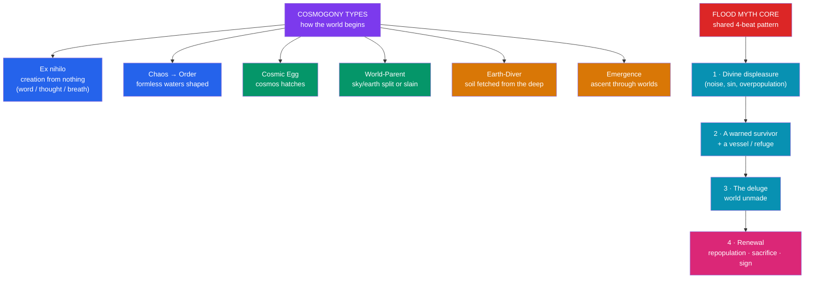

# 🌊 Creation and Flood Myths

> [!abstract] TL;DR
> **Creation myths (cosmogonies)** and **flood (deluge) myths** are two of the most widely distributed motifs on Earth, which makes them the ideal proving ground for [[The_Comparative_Method|the comparative method]]. Cosmogonies fall into recognizable **types**: creation *ex nihilo*, from **chaos to order**, from a **cosmic egg**, by the dismemberment of a **world-parent**, by an **earth-diver** who fetches soil from the deep, and by **emergence** upward through a series of worlds. Flood myths — the Mesopotamian **Utnapishtim** (in *Gilgamesh*) and **Atrahasis**, the biblical **Noah**, the Greek **Deucalion**, the Hindu **Manu**, and the Chinese **Gun-Yu** — share a striking core: divine displeasure, a warned survivor, a vessel or refuge, and a renewed humanity. Explaining the recurrence pits four hypotheses against each other — **shared ancestry**, **diffusion**, **common experience**, and **archetype** — and no single one accounts for every case.

## Intuition — analogy first

Ask people from a dozen unconnected towns to draw "the beginning of everything," and you will get a small, repeating menu of pictures — not infinite variety.

Some will draw a god simply *speaking* things into being (ex nihilo). Some will draw a formless soup that gets *sorted* into sky and sea (chaos to order). Some will draw a single *egg* that cracks open, or a giant *body* carved up into mountains and rivers. The menu is short because the human questions are the same everywhere — *where did order come from? why is there something rather than nothing? why must we die?* — and the available imagery (egg, parent, water, breath) is drawn from a shared stock of universal experience.

Flood stories are similarly convergent: nearly every early civilization grew up beside a **river or sea that periodically drowned the world it knew**, so a catastrophe-and-restart story is close to the surface everywhere. The interesting scholarly work begins exactly where this intuition stops — *which* similarities are too specific to be coincidence, and therefore point to real historical contact? See [[The_Comparative_Method]].

---

## A Typology of Cosmogonies and the Shared Flood Pattern

## Key Concepts

### Types of cosmogony

Folklorists and historians of religion (notably **Charles H. Long** and **Barbara Sproul**) group creation myths into recurring structural types:

| Type | Mechanism | Representative examples |
|---|---|---|
| **Ex nihilo** | Creation from nothing, by word, thought, or breath | Genesis 1 ("Let there be light"); Egyptian Ptah creating by heart and tongue; some Māori accounts |
| **Chaos to order** | A pre-existing formless matter (often water) is separated and ordered | *Enūma Eliš* (Marduk splits Tiamat); Genesis 1's *tehom*; Greek *Chaos* → Gaia/Ouranos in Hesiod |
| **Cosmic egg** | The cosmos hatches from a primordial egg | Hindu *Hiraṇyagarbha* (golden womb); Chinese **Pangu** breaking from the egg; Orphic Greek egg |
| **World-parent** | A primal pair (sky + earth) are separated, or a being is dismembered into the world | Māori **Ranginui & Papatūānuku** forced apart; Norse **Ymir's** body becoming the world; Chinese Pangu's body becoming the landscape |
| **Earth-diver** | An animal or being dives into primal waters to bring up mud that becomes land | Many Native American (e.g., the muskrat/turtle), Siberian, and Finnish traditions |
| **Emergence** | Beings ascend through a series of lower worlds to the present one | Pueblo, Navajo (Diné) *Diné Bahaneʼ*; some Mesoamerican traditions |

Types frequently **combine**: Genesis 1 is both ex nihilo *and* chaos-to-order; *Enūma Eliš* is chaos-to-order *and* world-parent (the cosmos built from Tiamat's slain body).

### The great flood myths

The deluge is among the most globally distributed narrative motifs (catalogued as **motif A1010** in Stith Thompson's *Motif-Index*). The core versions:

| Tradition | Survivor | Cause | Vessel / refuge | Distinctive detail |
|---|---|---|---|---|
| **Mesopotamian — *Atrahasis*** | Atrahasis | Human *noise* disturbs the gods | Boat | Earliest full text; overpopulation motif |
| **Mesopotamian — *Gilgamesh* XI** | **Utnapishtim** | Divine decision (Enlil) | Great cube-boat | Sends out dove, swallow, raven; granted immortality |
| **Hebrew Bible** | **Noah** | Human wickedness / violence | Ark (gopher wood) | Covenant, the rainbow sign, dove & olive branch |
| **Greek** | **Deucalion** & Pyrrha | Zeus's anger at humankind (the Lycaon story) | Chest / ark | Repopulate by throwing "the bones of their mother" (stones) |
| **Hindu** | **Manu** | Cyclic dissolution (*pralaya*) | Boat tied to a horned fish | The fish is **Matsya**, an avatar of Vishnu, who tows him to safety |
| **Chinese** | **Gun & Yu** (Gun-Yu) | Uncontrolled flooding | *Control*, not escape | Yu the Great *tames* the flood by dredging/channeling — a founding-of-order story |

The **Mesopotamian → biblical** relationship is the textbook case of probable **diffusion**: the Utnapishtim episode (Tablet XI, part of the standard *Gilgamesh*) and the earlier *Atrahasis* predate the biblical text, come from the same ancient Near Eastern cultural sphere, and share highly *specific* details (the bird-scouts, the mountain landing, the pleasing sacrifice after) that are hard to attribute to coincidence. See [[The_Epic_of_Gilgamesh]], [[Enuma_Elish]], and [[Mythic_Motifs_in_the_Hebrew_Bible]].

Note the Chinese case is instructive precisely because it **breaks** the pattern: **Yu** does not flee in an ark but *engineers* the waters back, founding good governance — a reminder that "flood myth" is not one thing worldwide and that over-eager comparatists can flatten real differences.

### Weighing the four explanations

Why do these motifs recur? Four hypotheses (drawn from [[The_Comparative_Method]]) compete, and the honest answer is *it depends on the case*:

1. **Shared ancestry / common source** — the motif descends from a single origin (strong for the Mesopotamian–biblical flood cluster within the ancient Near East).
2. **Diffusion** — spread by trade, migration, conquest, missionary contact (plausible across the Near East and Mediterranean; invoked, more speculatively, for wider parallels).
3. **Common experience** — real, recurrent riverine and coastal flooding (the Tigris–Euphrates, the Yellow River, monsoon India) makes a catastrophe-and-restart story independently likely; likewise, universal facts (birth, death, day/night) seed convergent cosmogonies.
4. **Archetype / shared psyche** — a Jungian or structuralist claim that the human mind generates such images independently (see [[Jungian_Archetypes_and_Myth]]). This is the least testable and most contested.

A rigorous comparatist asks how *specific* the shared details are: generic similarity ("a big flood") favors common experience or independent invention; highly specific, arbitrary shared details (the sequence of released birds) favor diffusion or common source.

## Examples Across Cultures

- **Chaos-to-order cosmogony**: In *Enūma Eliš*, Marduk slays the salt-water goddess **Tiamat** and fashions sky and earth from her divided body — order violently imposed on watery chaos, recited to renew cosmic order at the Babylonian New Year. See [[Enuma_Elish]].
- **World-parent separation**: In Māori tradition the sky-father **Ranginui** and earth-mother **Papatūānuku** clasp in darkness until their children force them apart, letting in light — a near-identical "separation of sky and earth" appears in Egyptian (Nut and Geb) myth.
- **Earth-diver**: In many Native North American cosmogonies, a water animal dives to the bottom of the primal sea and brings up a fleck of mud placed on a turtle's back, which grows into the world ("Turtle Island").
- **Flood as founding**: The *Gilgamesh* flood (Utnapishtim releasing dove, swallow, and raven) and the Genesis flood (Noah's dove and olive leaf) run in close parallel, while the Chinese **Yu the Great** tames the deluge and founds the semi-legendary Xia dynasty — flood as the origin of civilization rather than its near-annihilation.

## Common Pitfalls / Misconceptions

- **"Universal flood myths prove a single global flood."** The distribution reflects the ubiquity of local flooding plus diffusion and shared narrative logic, not one worldwide deluge; flood-geology claims are not supported by the geological record.
- **Assuming all parallels mean borrowing.** Some flood stories are almost certainly independent (arising wherever rivers flood); only *specific, arbitrary* shared details point to diffusion or a common source. Weigh disanalogies, not just similarities.
- **Flattening the types.** Not every creation story is "chaos to order," and not every flood story is "ark and survivor" — the Chinese flood-control myth and emergence cosmogonies show the categories have real limits.
- **Reading cosmogony as failed cosmology.** As with myth generally, these narratives do charter, ritual, and orientational work (see [[Functions_of_Myth]]); judging them as bad science misreads their genre.

## Related Concepts

- [[_MOC_Comparative_Mythology|↑ Section MOC]] — creation & flood myths as the method's showcase
- [[The_Comparative_Method]] — the diffusion-vs.-independent-invention framework applied here
- [[What_Is_Myth]] — cosmogony and etiology as core mythic functions
- [[Functions_of_Myth]] — Eliade's "cosmogony as paradigmatic model" and sacred time
- [[The_Epic_of_Gilgamesh]] — the Utnapishtim flood account (Tablet XI) in context
- [[Enuma_Elish]] — the Babylonian chaos-to-order cosmogony
- [[Mythic_Motifs_in_the_Hebrew_Bible]] — Genesis creation and Noah as ancient-Near-Eastern literature

## Review Questions

1. Define four types of cosmogony (e.g., ex nihilo, chaos-to-order, world-parent, earth-diver) and give a specific myth for each. Why do many real creation stories combine more than one type?
2. Lay out the shared four-beat structure of the flood myth and populate it for *both* the Utnapishtim (*Gilgamesh*) and Noah accounts. Which shared details make diffusion or a common source more likely than coincidence?
3. The Chinese Gun-Yu story departs from the "ark-and-survivor" template. What does this departure teach about the risks of the comparative method, and how should a careful scholar weigh similarities against differences?

## Sources

- Sproul, B. C. (1979). *Primal Myths: Creation Myths Around the World*. HarperOne
- Eliade, M. (1963). *Myth and Reality*. Harper & Row
- Dundes, A. (ed.) (1988). *The Flood Myth*. University of California Press
- Leeming, D. A. (2010). *Creation Myths of the World* (2nd ed.). ABC-CLIO

#mythology #comparative-mythology #cosmogony #flood #creation
