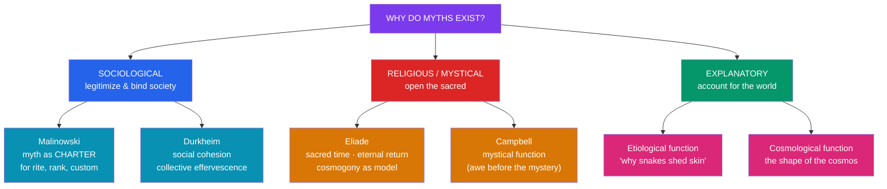

# ⚙️ Functions of Myth

> [!abstract] TL;DR
> If a myth is a sacred narrative, the natural next question is *what work does it do?* Scholars have answered along several axes. **Bronisław Malinowski** argued that myth is a social **charter** — a pragmatic warrant that legitimizes institutions, rites, and rank. **Émile Durkheim** saw myth and rite as the machinery of **social cohesion**, generating "collective effervescence" that binds the group and encodes its moral order. **Mircea Eliade** stressed the religious function: myth establishes **sacred time**, offering paradigmatic models (the *cosmogony* as pattern) that humans ritually re-enact in an *eternal return*. **Joseph Campbell** synthesized these into **four functions** — mystical, cosmological, sociological, and pedagogical. Across all of them runs the **etiological** function: explaining why the world, and this community, is as it is. These accounts are complementary lenses, not rival truths.

## Intuition — analogy first

Think of a myth as doing for a culture what a company's **founding story plus its employee handbook plus its team rituals** do for an organization.

The *founding story* ("two people in a garage") tells everyone where the enterprise came from and why it deserves loyalty — that is the **charter** and **cosmological** work. The *handbook* codifies what is right, forbidden, and expected — the **sociological/moral** work. And the *rituals* — the all-hands, the anniversary, the initiation of new hires — periodically re-fuse the group into a single feeling body; that shared electricity is Durkheim's **collective effervescence**. When employees re-tell the founding story at the anniversary, they are momentarily stepping back into the "sacred time" of the beginning, exactly as Eliade describes ritual re-enactment.

No single one of these captures the whole; a living myth usually does *all* of them at once. That is why the theorists below are best read as complementary flashlights aimed at the same object.

---

## The Functions Mapped to Their Theorists

## Key Concepts

### Malinowski: myth as social charter

Working among the **Trobriand Islanders**, functionalist anthropologist **Bronisław Malinowski** (*Myth in Primitive Psychology*, 1926) rejected the view that myth is failed science or idle symbolism. Myth, he insisted, is a *practical* institution: it "is not an idle tale, but a hard-worked active force," a **charter** that supplies "retrospective moral pattern[s]" and legitimizes present arrangements — which clan may fish where, why chiefs rank as they do, why a rite is performed. Crucially, myth *lives* only in its social context; a myth ripped from its ceremonial and legal function loses its meaning. This is the **charter theory**, and it grounds the sociological reading of myth.

### Durkheim: cohesion and collective effervescence

Sociologist **Émile Durkheim** (*The Elementary Forms of Religious Life*, 1912), studying Australian **totemism**, argued that when a society worships its gods it is, at bottom, worshiping *itself*: the sacred is society represented to itself in symbolic form. Communal ritual generates **collective effervescence** — a heightened, shared emotional energy that dissolves individuals into the group and recharges social bonds and the moral order. Myth supplies the *representations* (the totemic ancestors, the sacred beings) around which this effervescence organizes. For Durkheim, then, the function of myth-and-rite is fundamentally **social solidarity**.

### Eliade: sacred time and the eternal return

Historian of religion **Mircea Eliade** (*The Myth of the Eternal Return*, 1949; *Myth and Reality*, 1963) emphasized the *religious* phenomenology. Myth narrates the deeds of supernatural beings *in illo tempore* ("in that time"), and by ritually reciting or re-enacting the myth, humans **abolish profane time** and re-enter the strong, creative **sacred time** of origins. The **cosmogony** — the creation myth — is the supreme model: any founding (a marriage, a house, a city, a New Year) repeats the primordial creation, giving human acts a divine paradigm. This is the **eternal return**: the refusal of meaningless linear history in favor of cyclic renewal. See [[Creation_and_Flood_Myths]].

### Campbell's four functions

**Joseph Campbell** (esp. *The Masks of God* and *Myths to Live By*) synthesized the above into a much-cited fourfold scheme:

| Function | Question it answers | What it does |
|---|---|---|
| **1. Mystical / Metaphysical** | *How do I stand before the mystery?* | Awakens awe and reconciles consciousness to the ground of being |
| **2. Cosmological** | *What is the shape of the universe?* | Presents an image of the cosmos consonant with the mystical experience |
| **3. Sociological** | *How should we live together?* | Validates and enforces a specific moral and social order |
| **4. Pedagogical / Psychological** | *How do I live a human life, through its stages?* | Guides the individual through birth, initiation, marriage, and death |

Campbell's own interest tilted toward the *first* and *fourth* (the mystical and the psychological), which is why his work pairs naturally with [[Jungian_Archetypes_and_Myth]] and the [[The_Heros_Journey|monomyth]].

### The etiological through-line

Cutting across all schools is the **etiological (aetiological) function** — the myth as explanation of causes and origins: why there is death (Gilgamesh's serpent; the Genesis expulsion), why women labor in childbirth, why a mountain or constellation exists, why a taboo holds. Older "nature-myth" schools (see [[The_Comparative_Method]]) over-reduced *all* myth to etiology; the functionalists corrected this by insisting explanation is one function among several, not the master key.

## Examples Across Cultures

- **Charter in action**: Trobriand *milamala* myths establish which sub-clan holds precedence and rights to land, directly settling real disputes — Malinowski's core evidence. In the Hebrew Bible, the covenant narratives charter Israel's law and priesthood.
- **Cohesion / effervescence**: Australian Aboriginal *corroboree* ceremonies re-enacting Dreaming ancestors renew group identity and law — Durkheim's paradigm case. Comparable dynamics appear in the Athenian *Panathenaia* and the Babylonian *akītu* festival.
- **Sacred time / cosmogony as model**: The Babylonian *Enūma Eliš*, recited at the New Year, ritually re-established cosmic and royal order for the coming year — Eliade's eternal return made concrete. See [[Enuma_Elish]].
- **Etiological**: The Greek myth of **Persephone's** abduction explains the seasons; the Norse binding of **Fenrir** explains why the god Týr is one-handed; the *Epic of Gilgamesh* explains why humans, unlike snakes, cannot renew their youth. See [[The_Epic_of_Gilgamesh]].

## Common Pitfalls / Misconceptions

- **Treating the theories as mutually exclusive.** Malinowski, Durkheim, Eliade, and Campbell illuminate *different facets* of the same phenomenon. A single myth typically performs charter, cohesion, sacred-time, and etiological work simultaneously.
- **Reducing all myth to etiology.** The 19th-century "explains-a-natural-fact" school badly overshot; many myths are not primarily explanatory, and reading them only as proto-science misses their legitimating and religious work.
- **Naïve functionalism ("myth exists *because* it is useful").** Explaining a myth by the social good it does risks circularity and can't easily account for dysfunctional, contested, or vestigial myths. Function is a lens, not a proof of purpose.
- **Assuming the community consciously intends these functions.** The charter or cohesion effect is largely *latent* — it operates whether or not the tellers articulate it, which is why participants experience myth as sacred truth, not as social engineering.

## Related Concepts

- [[_MOC_Comparative_Mythology|↑ Section MOC]] — where functional theory sits in the toolkit
- [[What_Is_Myth]] — defines the sacred narrative whose functions are analyzed here
- [[The_Comparative_Method]] — the scholarly lineage (Frazer, Dumézil, Lévi-Strauss) that debated these functions
- [[Jungian_Archetypes_and_Myth]] — the psychological/mystical function developed in depth
- [[The_Heros_Journey]] — Campbell's own application of his pedagogical function
- [[Creation_and_Flood_Myths]] — cosmogony as Eliade's paradigmatic "model" myth
- Cross-vault: [[_MOC_Psychology_Master|Psychology]] — social cohesion, ritual, and group identity from a psychological angle

## Review Questions

1. Compare Malinowski's charter theory with Durkheim's cohesion theory. What does each say the function of myth *is*, and what evidence (Trobriand vs. Australian totemism) grounded each?
2. Explain Eliade's concepts of *sacred time* and the *eternal return*, and show how a New Year festival re-enacting a creation myth exemplifies them.
3. List Campbell's four functions and give a concrete myth that clearly serves each. Which two did Campbell himself emphasize, and how does that shape his reputation?

## Sources

- Malinowski, B. (1926). *Myth in Primitive Psychology*. W. W. Norton
- Durkheim, É. (1912). *The Elementary Forms of Religious Life*. (trans. K. E. Fields, 1995) Free Press
- Eliade, M. (1954). *The Myth of the Eternal Return*. Princeton University Press
- Campbell, J. (1972). *Myths to Live By*. Viking Press

#mythology #comparative-mythology #theory #functionalism #eliade
