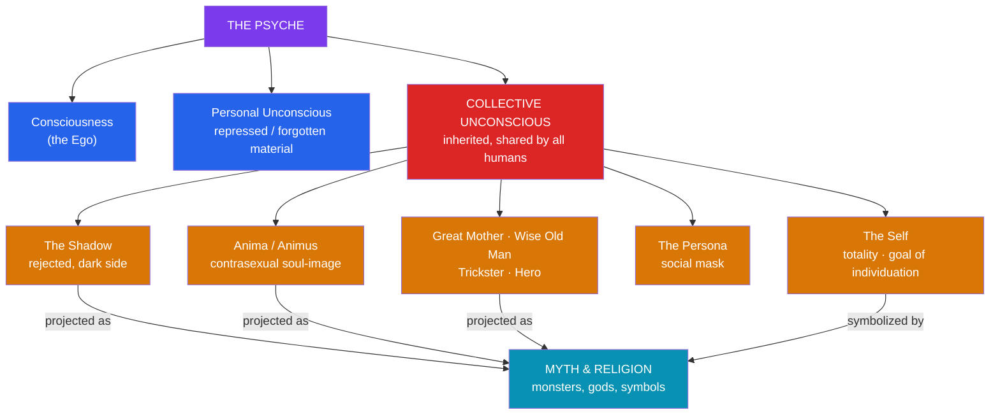

# 🌀 Jungian Archetypes and Myth

> [!abstract] TL;DR
> **Carl Gustav Jung** (1875–1961) proposed that beneath the personal unconscious lies a **collective unconscious** — a stratum of inherited psychic structure shared by all humans — populated by **archetypes**: universal, pre-formed patterns of experience (the Self, Shadow, Anima/Animus, Persona, the Wise Old Man, the Great Mother, the Trickster, the Hero). For Jung, myths, religions, and dreams are the *symbolic self-portraits* of these archetypes; a culture's gods and monsters are the psyche projected outward. The lifelong task of integrating these contents into a balanced whole he called **individuation**. Jung's framework shaped Joseph Campbell, Erich Neumann, and archetypal literary criticism — but it draws serious critique for being **unfalsifiable**, for over-claiming cross-cultural **universality**, and for its shaky evidentiary and quasi-Lamarckian foundations.

## Intuition — analogy first

Think of archetypes as the **operating system your mind ships with**, and myths as the **applications that run on it**.

Every human is born with the same underlying OS — not with pre-installed *content* (you are not born knowing the Greek gods), but with the *forms*, the slots and behaviors, into which experience gets sorted: a slot for "the nurturing/devouring mother," one for "the dark rejected part of myself," one for "the wise guide." What fills those slots is culturally specific — the Wise Old Man appears as Merlin in Britain, Obi-Wan in California, the *rishi* in India — but the slot itself, Jung argued, is universal.

On this analogy, a myth is a program that the whole community can run because it addresses a shared piece of the operating system. That, for Jung, is why the same figures recur across peoples who never met: they are not copying each other; they are all writing software for the same machine.

---

## The Structure of the Psyche and Its Projection into Myth

## Key Concepts

### The collective unconscious

After breaking with **Freud** (who located the unconscious in the individual's repressed personal history), Jung posited a deeper layer common to the species. The **collective unconscious** is not filled with inherited *memories* or images but with inherited *dispositions to form* certain images — Jung compared it to the way the body inherits organs, or the way a crystal's lattice is predetermined though the crystal has not yet formed. Its contents manifest only when activated by life situations, surfacing in dreams, art, symptoms, and — most richly — in myth.

### Archetypes: form vs. image

Jung drew a crucial and often-missed distinction:

- The **archetype-as-such** is an empty, unknowable *structuring principle* — a potential, like a riverbed with no water.
- The **archetypal image** is the culturally clothed, observable manifestation — the actual Zeus, Odin, or Yahweh that flows through that riverbed.

This is his answer to the obvious objection "but the gods are all different": the *images* differ by culture; the *forms* are claimed to be shared.

| Archetype | Core function | Mythic / cultural images |
|---|---|---|
| **The Self** | The organizing center and totality of the psyche | Mandalas; the divine child; Christ as symbol of wholeness |
| **The Shadow** | The disowned, inferior, "dark" side | The devil, the monster, the double, Set, Loki |
| **Anima / Animus** | The contrasexual inner image (feminine in men / masculine in women) | Helen, Beatrice, Sophia; the divine lover or guide |
| **The Persona** | The social mask worn for the world | Masks, roles, the "face" one presents |
| **The Great Mother** | Nurturing *and* devouring feminine | Demeter, Kali, Isis, the Virgin |
| **The Wise Old Man** | Meaning, guidance, spirit | Merlin, Tiresias, the guru, Obi-Wan |
| **The Trickster** | Boundary-crossing chaos and creativity | Hermes, Loki, Coyote, Anansi, Eshu |
| **The Hero** | Ego's struggle to free itself and win the treasure | Heracles, Gilgamesh, the questing knight |

### Individuation and myth as psychic map

For Jung the goal of psychological maturity is **individuation** — the gradual integration of unconscious contents (confronting the Shadow, relating to the Anima/Animus, orienting toward the Self) into a differentiated but unified personality. Myths, he argued, are humanity's collective record of this process: the hero's descent and return, the sacred marriage (*hierogamos*), the death-and-rebirth of the god are all symbolic dramatizations of individuation. This is precisely the reading **Joseph Campbell** adopted — the monomyth as an outward map of an inward journey. See [[The_Heros_Journey]].

### Influence and legacy

- **Joseph Campbell** built the [[The_Heros_Journey|monomyth]] on Jungian foundations.
- **Erich Neumann** (*The Origins and History of Consciousness*, 1949; *The Great Mother*, 1955) systematized archetypal development.
- **Northrop Frye** (*Anatomy of Criticism*, 1957) and later **archetypal / myth criticism** brought the vocabulary into literary studies.
- **James Hillman's** *archetypal psychology* radicalized Jung, and the framework saturates popular self-help, screenwriting, and the "inner child / shadow work" idiom.

## Examples Across Cultures

- **The Trickster** appears with striking consistency as a boundary-crosser and culture-maker: Greek **Hermes**, Norse **Loki**, West African **Anansi** the spider and **Eshu**, and the **Coyote** and **Raven** of North American traditions. Jungians read all as the same archetype in local dress; comparatists caution that their social roles differ sharply.
- **The Great Mother's** dual nature — life-giving and death-dealing — is vivid in Hindu **Kali** (who both destroys and liberates), Egyptian **Isis**, and Greek **Demeter/Persephone**, whose myth maps the descent-and-return pattern onto the agricultural year.
- **The Shadow** as the disowned self: the confrontation of **Gilgamesh with Enkidu** (his wild double), or the hero's battle with a dragon that "guards the treasure," which Jung read as the ego wresting value from the unconscious.
- **The Self / death-and-rebirth**: dying-and-rising figures (Osiris, Dionysus, the dying-and-rising vegetation gods catalogued by Frazer) as symbols of the psyche's renewal. See [[The_Comparative_Method]].

## Common Pitfalls / Misconceptions

- **"Archetypes are inherited images."** Jung explicitly denied this; he claimed to inherit the *form/disposition*, not the *content*. Sloppy popularizations that say we're "born knowing" specific gods misstate the theory (and would imply a discredited Lamarckian inheritance).
- **Unfalsifiability.** Because any myth or dream can be read as expressing *some* archetype, and any counter-example reframed, critics (following Popper's criterion) argue the theory cannot in principle be refuted — it explains everything and therefore predicts nothing.
- **Over-claimed universality / weak evidence.** Cross-cultural "universals" often dissolve under scrutiny (the Trickster's meaning is not constant); and Jung's key evidence, such as the "Solar Phallus Man," has been challenged on grounds of possible prior exposure and cherry-picking.
- **Conflating a myth's meaning with its psychology.** Reducing every deity to an intra-psychic function ignores the historical, ritual, political, and ecological work myths do for real communities — the sociological reading in [[Functions_of_Myth]].

## Related Concepts

- [[_MOC_Comparative_Mythology|↑ Section MOC]] — Jung's place among the great theories of myth
- [[The_Heros_Journey]] — Campbell's monomyth is applied Jungian psychology; the hero and mentor as archetypes
- [[What_Is_Myth]] — the psychological answer to "what is a myth?" (a projection of mind)
- [[Functions_of_Myth]] — the psychological/mystical function vs. the sociological one that Jung under-weights
- [[The_Comparative_Method]] — Jung's universalism as one pole in the diffusion-vs.-independent-invention debate
- Cross-vault: [[_MOC_Psychology_Master|Psychology]] — Jung within analytical psychology, the unconscious, and personality theory

## Review Questions

1. Explain Jung's distinction between the *archetype-as-such* and the *archetypal image*, and show how it lets him claim universality while conceding that every culture's gods look different.
2. Choose one archetype (Shadow, Trickster, or Great Mother) and illustrate it with two figures from *different* cultures. Then state one reason a critical comparatist might resist calling them "the same archetype."
3. Lay out the two strongest objections to Jungian theory (unfalsifiability and universality/evidence). How might a defender of Jung respond to each?

## Sources

- Jung, C. G. (1959). *The Archetypes and the Collective Unconscious* (Collected Works, Vol. 9, Part 1). Princeton University Press
- Jung, C. G. (ed.) (1964). *Man and His Symbols*. Aldus Books
- Neumann, E. (1954). *The Origins and History of Consciousness*. Princeton University Press
- Segal, R. A. (1998). *Jung on Mythology*. Princeton University Press

#mythology #comparative-mythology #theory #jung #archetypes
