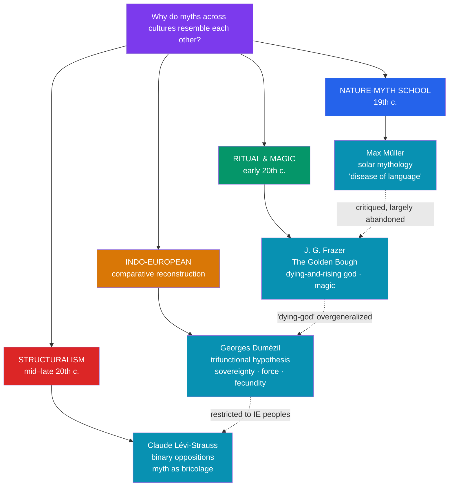

# 🔬 The Comparative Method

> [!abstract] TL;DR
> **Comparative mythology** studies myths across cultures to find shared patterns and, where possible, explain them. Its modern history runs through four landmark programs. **Max Müller** launched "**solar mythology**," reading gods as personified natural phenomena and myth as a "**disease of language**." **J.G. Frazer's** *The Golden Bough* catalogued the **dying-and-rising god** and theorized **sympathetic magic**. **Georges Dumézil** reconstructed a **trifunctional** ideology (sovereignty / force / fecundity) inherited from Proto-Indo-European society. **Claude Lévi-Strauss** brought **structuralism**, reading myth as the mind's attempt to mediate **binary oppositions** through improvisatory *bricolage*. Overarching every comparison is the question of *why* motifs recur: **diffusion** (spread from a source) versus **independent invention / polygenesis** (arising separately from shared psychology or experience). Each program was brilliant, influential, and heavily critiqued.

## Intuition — analogy first

Comparative mythology faces the exact problem a **historical linguist** faces.

When a linguist notices that Latin *pater*, Sanskrit *pitṛ*, and English *father* resemble one another, three explanations compete. Either the languages **inherited** the word from a common ancestor (Proto-Indo-European) — genetic descent; or one **borrowed** it from another — diffusion; or the resemblance is **coincidence / shared cause** (all babies babble "pa"). Deciding which requires rigorous method, because superficial similarity is cheap and misleading.

The mythologist looking at flood stories in Mesopotamia, Israel, Greece, and India confronts the very same trilemma: **common ancestry**, **borrowing/diffusion**, or **independent invention** from shared human experience or psychology. The whole discipline can be read as competing attempts to answer *that* question with discipline rather than with romantic hunches — which is precisely why each school lives or dies on its method, not its charm. See [[Creation_and_Flood_Myths]].

---

## The Lineage of Comparative Mythology

## Key Concepts

### Max Müller and solar mythology

The Oxford Sanskritist **Friedrich Max Müller** (1823–1900), a founder of comparative religion, argued that the Indo-European gods were originally personifications of natural phenomena — above all the **sun and dawn**. Myths, he held, arose from a "**disease of language**": as the old Vedic words for natural events lost their transparent meaning, later speakers misread the metaphors as stories about persons, and gods were born from grammatical confusion. **Solar mythology** could turn nearly every hero into a sun crossing the sky. It was enormously influential — and then demolished. **Andrew Lang** ridiculed it (one could "prove" Müller himself a solar myth by his method), and its reductive, philology-only overreach discredited the whole nature-myth school.

### Frazer and *The Golden Bough*

**Sir James George Frazer** (1854–1941) produced the era's most famous work of comparative anthropology, *The Golden Bough* (1890; expanded to 12 volumes, 1906–15). Two ideas dominate:

- The **dying-and-rising god** (or the slain "priest-king" / vegetation spirit): Frazer wove Osiris, Adonis, Attis, Dionysus, and others into a single pattern of a god who dies and is reborn with the seasonal cycle, tied to fertility and the ritual killing of the king.
- **Sympathetic magic**, split into the **Law of Similarity** ("**homeopathic**" — like produces like, e.g., a rain rite that mimics rain) and the **Law of Contagion** (things once in contact continue to act on each other). Frazer proposed a grand evolutionary sequence, **magic → religion → science**.

Frazer's method — massed examples torn from context — thrilled literary modernism (Eliot's *The Waste Land*, Weston's Grail work) but is now judged empirically loose; scholars such as **Jonathan Z. Smith** argued the tidy "dying-and-rising god" category was overgeneralized and, for several alleged cases, not attested in the sources.

### Dumézil and the trifunctional hypothesis

The French philologist **Georges Dumézil** (1898–1986) reconstructed not motifs but *ideology*. Comparing Indo-European societies (Vedic India, Rome, the Norse, the Celts, Iran), he argued they inherited a **tripartite (trifunctional) structure** from Proto-Indo-European culture:

| Function | Domain | Vedic | Roman | Norse |
|---|---|---|---|---|
| **First** | Sovereignty (sacred + juridical) | Varuṇa & Mitra | Jupiter (+ Dius Fidius) | Óðinn (+ Týr) |
| **Second** | Physical force / war | Indra | Mars | Þórr |
| **Third** | Fertility, production, wealth | the Aśvins | Quirinus | Freyr / Njörðr |

The recurrence of this priest–warrior–producer schema across the pantheons and social ideologies of scattered Indo-European peoples is, for Dumézil, evidence of common descent — a genetic, not universal-psychological, explanation. Critics note the model is **restricted to Indo-European** cultures (it is not a claim about *all* myth) and that its neat triads can be imposed selectively.

### Lévi-Strauss and structuralism

Anthropologist **Claude Lévi-Strauss** (1908–2009), in *The Structural Study of Myth* (1955) and the four-volume *Mythologiques* (1964–71), reframed the whole question. Myth's meaning lies not in its individual images but in its **structure** — the pattern of relations among elements. The human mind, he argued, thinks in **binary oppositions** (raw/cooked, nature/culture, life/death, sky/earth), and a myth's work is to **mediate** irresolvable contradictions by introducing a middle term (e.g., the *trickster* mediates predator vs. herbivore; agriculture mediates nature vs. culture). Myth is built by **bricolage** — a "handyman" recombining whatever cultural odds and ends are at hand. Analysis proceeds by breaking a myth into **mythemes** (minimal units) and reading them in "bundles," synchronically, like a musical score. The critiques: results are hard to falsify or replicate, the analyst's choices drive the "structure" found, and the universal-mind premise is unprovable.

### Diffusion vs. independent invention

The master question behind every comparison:

- **Diffusion / monogenesis** — a motif arose once and *spread* by contact, trade, migration, or borrowing (e.g., the Mesopotamian flood story influencing the biblical one via the ancient Near East).
- **Independent invention / polygenesis** — the motif arose *separately* in multiple places because humans share psychology (a Jungian archetype), face common experiences (real floods along river valleys), or reason similarly (Lévi-Strauss's universal mind).

Rarely is one answer clean. The **historic-geographic ("Finnish") method** and folklore's **Aarne–Thompson–Uther** tale-type and **Thompson Motif-Index** systems were built precisely to trace whether a story's distribution looks like diffusion or independent origin. See [[Creation_and_Flood_Myths]].

## Examples Across Cultures

- **Solar reading (and its limits)**: Müller read the Vedic **Uṣas** (Dawn) and heroes who "rescue" a maiden as solar dramas; the method's inability to *not* find the sun everywhere is what discredited it.
- **Dying-and-rising pattern**: Egyptian **Osiris** (dismembered, reassembled, ruling the dead), Levantine **Adonis** and Phrygian **Attis**, and Greek **Dionysus** — Frazer's cluster, now handled with far more caution about what the primary sources actually claim.
- **Trifunctionality**: The Roman triad *Jupiter–Mars–Quirinus* and the Norse *Óðinn–Þórr–Freyr* line up with the Vedic *Mitra-Varuṇa / Indra / Aśvins*, Dumézil's flagship evidence for a shared Indo-European inheritance.
- **Structural mediation**: Lévi-Strauss's analysis of the **Oedipus** myth (overrating vs. underrating kinship; autochthonous origin vs. birth from two parents) and of Amerindian myths in *The Raw and the Cooked*, showing myth negotiating the nature/culture divide.

## Common Pitfalls / Misconceptions

- **Cherry-picking similarities ("parallelomania").** Massing superficial resemblances while ignoring context and differences can "prove" almost any link. Frazer and the pan-Babylonian school were repeatedly caught doing this; rigorous comparison weighs disanalogies too.
- **Assuming resemblance = borrowing.** Similar myths may reflect common ancestry, diffusion, *or* independent invention. Establishing diffusion requires a plausible historical contact route, not just a shared motif.
- **Over-extending a bounded theory.** Dumézil's trifunctional model is a claim about **Indo-European** peoples, not a universal law; applying it to unrelated cultures is a misuse.
- **Treating structuralist "structures" as objective.** Because the analyst selects the mythemes and oppositions, different readers can extract different structures from the same myth — a core reason structuralism resists falsification.

## Related Concepts

- [[_MOC_Comparative_Mythology|↑ Section MOC]] — this note is the discipline's own history
- [[Creation_and_Flood_Myths]] — the comparative method applied to the deluge and cosmogony motifs
- [[Functions_of_Myth]] — the functionalist alternative (Malinowski, Durkheim) to these comparative programs
- [[What_Is_Myth]] — the objects (myth vs. legend vs. folktale) that the method compares
- [[Jungian_Archetypes_and_Myth]] — the "independent invention via shared psyche" pole of the diffusion debate
- Cross-vault: [[_MOC_Psychology_Master|Psychology]] — the universal-mind premise shared with Jung and cognitive science

## Review Questions

1. State the "diffusion vs. independent invention" problem and explain why it is structurally identical to the problem historical linguists face with cognate words. What kind of evidence would favor diffusion over polygenesis?
2. Contrast Frazer's method (massed motifs, the dying-and-rising god) with Dumézil's (reconstruction of a trifunctional ideology). Why is Dumézil's claim more constrained, and how does that affect its defensibility?
3. Explain Lévi-Strauss's idea that myth mediates binary oppositions, using one worked example. What is the standard objection to structuralist analysis?

## Sources

- Frazer, J. G. (1890/1922). *The Golden Bough: A Study in Magic and Religion*. Macmillan
- Dumézil, G. (1958). *L'idéologie tripartie des Indo-Européens*. Latomus (Eng. trans. as studies of the trifunctional hypothesis)
- Lévi-Strauss, C. (1955). "The Structural Study of Myth." *Journal of American Folklore*, 68(270), 428–444
- Segal, R. A. (2004). *Myth: A Very Short Introduction*. Oxford University Press

#mythology #comparative-mythology #theory #structuralism #frazer
