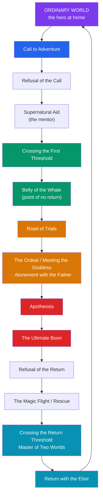

# 🗺️ The Hero's Journey

> [!abstract] TL;DR
> The **Hero's Journey**, or **monomyth**, is Joseph Campbell's claim (in *The Hero with a Thousand Faces*, 1949) that heroic myths worldwide share one deep narrative pattern: a hero ventures from the ordinary world into a region of supernatural wonder, wins a decisive victory, and returns transformed to bestow a boon on their community. Campbell organized it into three acts — **Departure, Initiation, Return** — subdivided into some seventeen stages (Call to Adventure, Refusal, Supernatural Aid, Crossing the Threshold, the Belly of the Whale, the Road of Trials, Apotheosis, the Ultimate Boon, and the Return). Screenwriter **Christopher Vogler** streamlined it into a twelve-stage template that now saturates Hollywood. The pattern illuminates Odysseus, Gilgamesh, the Buddha, and Luke Skywalker alike — but its very flexibility is also its chief scholarly weakness: critics argue it is so elastic that it "fits" almost any story while erasing what makes each tradition distinct.

## Intuition — analogy first

Think of the monomyth as a **rite of passage stretched into a story**.

Anthropologist Arnold van Gennep observed that initiation rituals everywhere follow three beats: **separation** (the initiate is removed from the village), **liminality** (a dangerous, transformative threshold state in the wilderness or the bush), and **reincorporation** (return as a new adult with new status). Campbell — who read van Gennep and the psychology of Freud and Jung — noticed that heroic *stories* trace the same arc: the hero leaves home, endures an ordeal in a strange in-between realm, and comes back changed, carrying something the community needs.

So the "journey" is less a plot checklist than the narrative shape of *transformation itself*: you cannot come home the same person who left. That is why the pattern feels familiar whether you are reading a Sumerian tablet or watching a summer blockbuster — it mirrors the psychological experience of growing up, leaving, and returning altered.

---

## The Three Acts and the Cycle

## Key Concepts

### Campbell and the monomyth

**Joseph Campbell** (1904–1987), a comparative mythologist steeped in Jung, Frazer, and Sanskrit literature, borrowed the word **"monomyth"** from James Joyce's *Finnegans Wake*. His thesis: beneath the surface diversity of the world's hero tales lies a single "nuclear unit," which he summarized as —

> "A hero ventures forth from the world of common day into a region of supernatural wonder: fabulous forces are there encountered and a decisive victory is won: the hero comes back from this mysterious adventure with the power to bestow boons on his fellow man."

Campbell read this pattern through a Jungian lens: the adventure is an *inner* journey of individuation, its monsters and helpers the projected **archetypes** of the psyche. See [[Jungian_Archetypes_and_Myth]].

### The three acts and their stages

| Act | Stage | What happens |
|---|---|---|
| **I. Departure** | Call to Adventure | A herald disrupts the ordinary world; a quest beckons |
| | Refusal of the Call | Fear or duty makes the hero hesitate |
| | Supernatural Aid | A mentor/protector supplies advice or a talisman |
| | Crossing the Threshold | The hero enters the unknown, passing a guardian |
| | Belly of the Whale | Swallowed by the dark; a symbolic death, the point of no return |
| **II. Initiation** | Road of Trials | A series of tests, often failed at least once |
| | Meeting the Goddess / Woman as Temptress | Encounter with unconditional love, or with temptation |
| | Atonement with the Father | Confronting the ultimate power/authority of the hero's life |
| | Apotheosis | A death-and-expansion of consciousness; the hero transcends |
| | The Ultimate Boon | The goal is achieved (elixir, treasure, wisdom) |
| **III. Return** | Refusal of the Return | Reluctance to go back to ordinary life |
| | The Magic Flight / Rescue | A dramatic, often pursued, escape |
| | Crossing the Return Threshold | Reintegrating the wisdom into the mundane world |
| | Master of Two Worlds | Freedom to move between inner and outer realms |
| | Freedom to Live / Return with the Elixir | The boon renews the community |

Not every myth contains every stage, and the order can vary — Campbell treated them as a *repertoire* rather than a fixed sequence.

### Vogler's screenwriting adaptation

In 1985 Disney story analyst **Christopher Vogler** circulated a memo distilling Campbell into a practical **twelve-stage** template, later expanded into *The Writer's Journey* (1992). Vogler renamed and simplified: *Ordinary World → Call to Adventure → Refusal → Meeting the Mentor → Crossing the Threshold → Tests, Allies, Enemies → Approach to the Inmost Cave → The Ordeal → Reward → The Road Back → Resurrection → Return with the Elixir*. This version — alongside the earlier stage structures of Syd Field and Dan Harmon's "Story Circle" — became a fixture of Hollywood development, which is why so many contemporary films feel structurally identical.

### The distinction from Propp

Campbell's monomyth is often confused with **Vladimir Propp's** *Morphology of the Folktale* (1928). They are different projects: Propp empirically catalogued **31 narrative functions** in a bounded corpus of ~100 Russian *wonder tales*, a formalist description with no psychological or universal-mind claim. Campbell made a sweeping cross-cultural and psychological argument about *all* heroic myth. Propp is narrow and rigorous; Campbell is broad and interpretive.

## Examples Across Cultures

- **Odysseus** (Homer's *Odyssey*): the call is the summons to Troy and the long *nostos* home; the Road of Trials is the Cyclops, Circe, the Sirens; the Belly of the Whale is his literal descent to the underworld (*nekyia*); the boon is homecoming and restored kingship.
- **Gilgamesh** (*Epic of Gilgamesh*): the call comes after Enkidu's death; he crosses the threshold past the scorpion-guardians, endures the Road of Trials to reach Utnapishtim, wins and then *loses* the boon (the plant of youth), and returns wiser about mortality — a monomyth with a deliberately failed elixir. See [[The_Epic_of_Gilgamesh]].
- **Siddhārtha Gautama, the Buddha**: departure from the palace (renouncing the ordinary world), the trials of asceticism, the Ordeal beneath the Bodhi tree confronting Māra, Apotheosis as enlightenment, and the Return — the decision to teach (the *dharma* as elixir).
- **Luke Skywalker** (*Star Wars*, 1977): the case that made the theory famous. George Lucas explicitly drew on Campbell — the call (Leia's message), refusal, Obi-Wan as supernatural mentor, crossing into the Death Star, the "trash compactor" belly-of-the-whale, and return as hero. Their filmed conversations became *The Power of Myth* (1988).

| Hero | Call | Ordeal / Abyss | Boon returned |
|---|---|---|---|
| Odysseus | Summons to war | Descent to Hades | Restored home & kingdom |
| Gilgamesh | Death of Enkidu | Journey past death's guardians | Wisdom (boon of youth *lost*) |
| The Buddha | Sight of suffering | Temptation of Māra | The teaching (dharma) |
| Luke Skywalker | Leia's plea | The Death Star | A restored, freed galaxy |

## Common Pitfalls / Misconceptions

- **Treating the 17 stages as a mandatory checklist.** Campbell presented them as a flexible menu; forcing a myth to hit every beat produces distortion. Most myths use only a subset.
- **Assuming it proves a literal universal.** The pattern's breadth is also its weakness: folklorists (e.g., **Alan Dundes**) and classicists argue the monomyth is so elastic it can be imposed on nearly any narrative, making it unfalsifiable and prone to erasing culturally specific meaning.
- **Confusing Campbell with Propp.** Propp's morphology is a narrow, empirical formalism of Russian folktales; Campbell's monomyth is a broad psychological-universalist claim. They answer different questions.
- **Reading it as a male template only.** Campbell's language is androcentric ("atonement with the father," "woman as temptress"). Later writers (e.g., **Maureen Murdock's** *The Heroine's Journey*) argued the schema privileges a masculine arc and needs revision for women's stories.

## Related Concepts

- [[_MOC_Comparative_Mythology|↑ Section MOC]] — where the monomyth sits among the great interpretive frameworks
- [[Jungian_Archetypes_and_Myth]] — the psychological engine Campbell borrowed; the hero, shadow, and mentor as archetypes
- [[What_Is_Myth]] — the definition of the sacred narratives Campbell compares
- [[Functions_of_Myth]] — Campbell's own *four functions* of myth; the monomyth mainly serves the pedagogical/psychological function
- [[The_Comparative_Method]] — the comparative tradition (Frazer especially) Campbell inherited and its critiques
- [[The_Epic_of_Gilgamesh]] — a canonical hero's-journey text analyzed in detail

## Review Questions

1. Lay out Campbell's three acts and name at least two stages within each. Then trace them through *either* the *Odyssey* *or* the *Epic of Gilgamesh*, noting where the myth diverges from the template.
2. How does Vogler's twelve-stage model differ from Campbell's, and why did the film industry find it more usable? What is one artistic risk of every screenwriter using the same template?
3. Summarize the strongest scholarly objection to the monomyth (unfalsifiability / cultural erasure). Do you find the pattern more useful as a description of stories or as a claim about the human mind? Defend your answer.

## Sources

- Campbell, J. (1949). *The Hero with a Thousand Faces*. Pantheon Books
- Vogler, C. (2007). *The Writer's Journey: Mythic Structure for Writers* (3rd ed.). Michael Wiese Productions
- Campbell, J. & Moyers, B. (1988). *The Power of Myth*. Doubleday
- Dundes, A. (2005). "Folkloristics in the Twenty-First Century." *Journal of American Folklore*, 118(470), 385–408

#mythology #comparative-mythology #theory #campbell #monomyth
