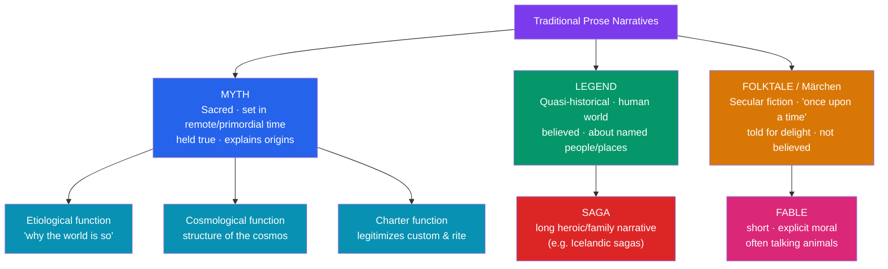

# 📖 What Is Myth?

> [!abstract] TL;DR
> In the academic study of religion and folklore, a **myth** is a traditional sacred narrative that explains the origin of the world, of humanity, of death, or of a people's institutions, and that is held to be true and meaningful — though not necessarily *literal* — by the culture that transmits it. Myth is distinguished from **legend** (set in the historical past, quasi-plausible), **folktale** (fiction told for delight), **fable** (a short moral tale, often with animals), and **saga** (a long prose narrative of families and heroes). Myths perform recognizable work: they are *etiological* (explaining why things are as they are), *cosmological* (mapping the structure of the cosmos), and serve as a *charter* legitimizing customs. Mircea Eliade framed myth as narrating events of *sacred time* that break into ordinary *profane time*. Crucially, the everyday equation "myth = falsehood" inverts the scholarly meaning: for the tradition that tells it, a myth is a "true story" in the deepest sense.

## Intuition — analogy first

Think of a myth as a culture's **founding constitution written as a story**.

A constitution is not a physics textbook, and you do not judge it by asking whether its sentences are literally true. Its job is to say *who we are, where our authority comes from, and how we should live* — and it does that job precisely because a community treats it as binding and sacred. A creation myth works the same way: the Babylonian *Enūma Eliš* is not a failed astronomy lecture that got the cosmos wrong; it is a charter that explains why Babylon and its god Marduk sit at the center of the ordered world, recited at the New Year festival to renew that order.

So when an anthropologist calls a story a "myth," they are making a claim about its *social status and function*, not about its truth or falsity. The same narrative can be sacred scripture in one community, a quaint "legend" to its neighbors, and a "fairy tale" to outsiders — the label tracks who is telling it and how seriously.

---

## How It Works — The Family of Traditional Narratives

## Key Concepts

### The scholarly definition

The word comes from Greek *mŷthos* (μῦθος), originally simply "word, speech, story" — in Homer it carries no sense of falsehood. It was later Greek philosophy, especially the contrast between *mythos* and *logos* (rational, demonstrable account), that seeded the pejorative modern sense. In folklore studies the standard tripartite classification descends from **William Bascom's** influential 1965 essay "The Forms of Folklore: Prose Narratives," which sorts traditional prose into **myth, legend, and folktale** along two axes: the attitude toward truth (believed vs. fiction) and the setting in time and world.

- **Myth** — regarded as *true* and *sacred*, set in a remote primordial epoch or a world other than the present one, featuring gods and culture-heroes; often embedded in ritual.
- **Legend** — regarded as *true* (or plausibly so) but *secular* or semi-sacred, set in the recent historical past and the present world, about humans (King Arthur, Robin Hood, saints' lives).
- **Folktale** (German *Märchen*) — regarded as *fiction*, timeless and placeless ("once upon a time"), told primarily for entertainment or instruction.

### Neighboring genres

| Genre | Truth-status in its culture | Setting | Typical actors | Example |
|---|---|---|---|---|
| **Myth** | Sacred, true | Primordial / other world | Gods, first ancestors | Enūma Eliš; Māori Rangi & Papa |
| **Legend** | Believed, secular | Historical past, this world | Named humans, heroes | King Arthur; the founding of Rome |
| **Folktale** | Fiction | "Once upon a time," nowhere | Types (the youngest son, the witch) | Cinderella / "Cinderella" tale type |
| **Fable** | Fiction with a lesson | Timeless | Talking animals, personifications | Aesop's "Tortoise and the Hare" |
| **Saga** | Semi-historical | Named past, real geography | Families, chieftains | *Njáls saga*, *Egils saga* |

These categories are **analytic ideal types, not airtight boxes**. A single tradition can migrate between them: the Trojan War was legend-with-mythic-gods for the Greeks; the Arthurian material began as legend and accreted the fully mythic Grail cycle. The classification depends on the *community's stance*, which is exactly why an outsider's "myth = false" reading is a category error.

### The three classic functions

1. **Etiological (aetiological)** — explaining the *cause* or origin of an observable feature: why the peacock has eyes on its tail, why snakes shed skin (and so, in Gilgamesh, why humans do not), why there is death, why women bear children in pain. The Greek *Pandora* and the story of Prometheus's fire are etiological.
2. **Cosmological** — mapping the architecture of reality: the three-tiered cosmos (heaven / earth / underworld), the world-tree Yggdrasil linking Norse realms, the cosmic ocean surrounding the ordered world. See [[Creation_and_Flood_Myths]].
3. **Charter** — Bronisław **Malinowski's** term: myth as a "warrant, a charter, and often even a practical guide" that legitimizes present-day institutions, rank, and ritual by rooting them in primordial precedent. See [[Functions_of_Myth]].

### Eliade: sacred vs. profane time

**Mircea Eliade** (*The Sacred and the Profane*, 1957; *Myth and Reality*, 1963) argued that myth narrates a *hierophany* — a breaking-in of the sacred — and always concerns events *in illo tempore* ("in that time"), the strong, creative primordial time of beginnings. To recite or ritually re-enact a myth is to abolish ordinary **profane time** and re-enter **sacred time**, participating in the original creative act (the *eternal return*). For Eliade, "myth narrates a sacred history … a *true story* because it always deals with realities." This is the sharpest possible answer to the pejorative usage: within its own frame, a myth is definitionally *true*.

## Examples Across Cultures

- **Etiological**: In the Mesopotamian *Epic of Gilgamesh*, the serpent steals the plant of rejuvenation and immediately sheds its skin — explaining both why snakes molt and why humans must die. See [[The_Epic_of_Gilgamesh]].
- **Cosmological charter**: The Babylonian *Enūma Eliš* recounts Marduk's defeat of Tiamat and his building of the cosmos from her body; recited at the *akītu* New Year festival, it re-legitimized kingship and cosmic order annually. See [[Enuma_Elish]].
- **Myth vs. legend blur**: For classical Greeks, Heracles and the Trojan War were "true" heroic history (legend) yet fully entangled with Olympian gods (myth) — a reminder that the boundary is culturally drawn.
- **Living myth**: Australian Aboriginal *Dreaming* (the *Altjira* / Tjukurpa) narrates ancestral beings shaping the land in a creative epoch that remains ritually present — an unambiguous case of sacred time still structuring law and landscape today.
- **Folktale contrast**: "Cinderella" (Aarne–Thompson–Uther tale type ATU 510A) exists in hundreds of versions worldwide, told as delightful fiction with no claim to sacred truth — the pole opposite from myth.

## Common Pitfalls / Misconceptions

- **"Myth means a false or naïve belief."** This is the colloquial sense ("the myth of the eight-hour sleep") and is the *opposite* of the scholarly one. Using it flattens a neutral analytic category into a put-down and imports the analyst's own beliefs about truth.
- **Assuming ancient people were "bad scientists."** Myths are not primitive attempts at physics that happened to fail; they operate in a register of meaning, legitimation, and orientation, not empirical prediction. Treating them as failed science is anachronistic.
- **Treating myth/legend/folktale as rigid, universal boxes.** They are ideal types whose boundaries a given culture draws for itself; the same story can shift category across communities and centuries.
- **Equating "myth" with "the supernatural."** The defining feature is *sacred status and origin-explaining function within a community*, not merely the presence of gods or magic — folktales are full of magic yet are not myths.

## Related Concepts

- [[_MOC_Comparative_Mythology|↑ Section MOC]] — the theoretical toolkit this note opens
- [[Functions_of_Myth]] — develops *why* cultures tell myths (charter, cohesion, sacred time), extending the "functions" sketched here
- [[The_Comparative_Method]] — how scholars compare these narratives across cultures once you can identify what a myth is
- [[Creation_and_Flood_Myths]] — the archetypal cosmological/etiological myths in detail
- [[The_Heros_Journey]] — Campbell's claim that heroic myths share a deep structure
- Cross-vault: [[_MOC_Psychology_Master|Psychology]] — myth as a projection of mind (Jung), a different account of what myth "is"

## Review Questions

1. Bascom classifies prose narratives by *belief* and *setting*. Place the Trojan War, "Cinderella," and the Babylonian creation story on those two axes, and explain why the same story can change category depending on who tells it.
2. Explain Eliade's distinction between sacred and profane time, and use it to argue against the popular claim that "myth just means something untrue."
3. Give one clear example each of an etiological, a cosmological, and a charter myth, and state what specific "work" each one does for its community.

## Sources

- Bascom, W. (1965). "The Forms of Folklore: Prose Narratives." *Journal of American Folklore*, 78(307), 3–20
- Eliade, M. (1963). *Myth and Reality*. Harper & Row
- Kirk, G. S. (1970). *Myth: Its Meaning and Functions in Ancient and Other Cultures*. Cambridge University Press
- Doty, W. G. (2000). *Mythography: The Study of Myths and Rituals* (2nd ed.). University of Alabama Press

#mythology #comparative-mythology #theory #definition #eliade
