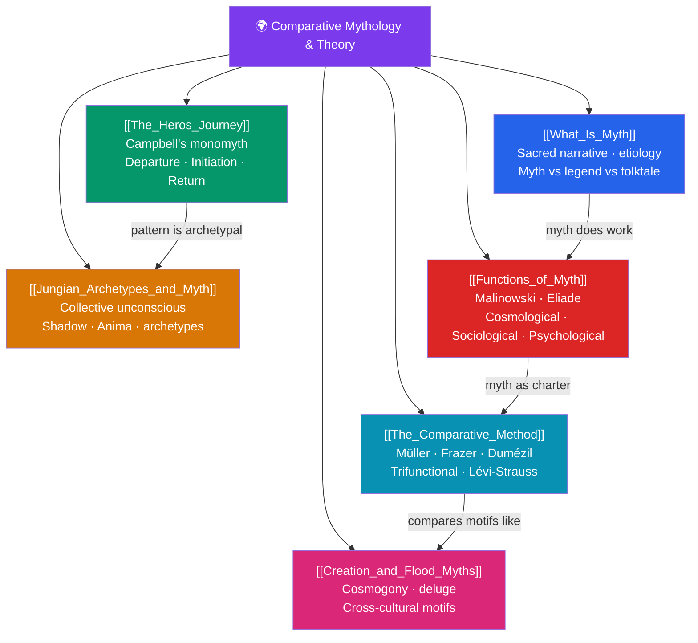

# 🌍 Comparative Mythology & Theory — Map of Content

> [!abstract] What This Section Covers
> This section supplies the theoretical toolkit for the entire vault, asking not *what* a given culture believed but *how* and *why* humans make myth at all. It begins with the definitional groundwork in **What Is Myth** (myth as sacred narrative, distinguished from legend and folktale), then surveys the great interpretive frameworks: Joseph Campbell's **Hero's Journey** monomyth, Carl Jung's **Archetypes** and the collective unconscious, and the **Functions of Myth** as theorized by Malinowski and Mircea Eliade. **The Comparative Method** traces the discipline itself from Max Müller through Frazer, Dumézil's trifunctional hypothesis, and Lévi-Strauss's structuralism, while **Creation and Flood Myths** demonstrate the method in action by mapping recurrent cosmogonic and deluge motifs across traditions. Together these six notes let you read every later section with an analytic rather than merely descriptive eye.

## Concept Map

## Learning Path

1. [[What_Is_Myth]] — Defines myth as sacred narrative and separates it from legend, folktale, and fable; introduces etiology.
2. [[Functions_of_Myth]] — Why cultures tell myths: Malinowski's charter theory, Eliade's sacred time, cosmological/sociological/psychological roles.
3. [[The_Heros_Journey]] — Campbell's monomyth: the departure–initiation–return cycle and its universal stages.
4. [[Jungian_Archetypes_and_Myth]] — The collective unconscious, archetypes, shadow and anima, and myth as psychic map.
5. [[The_Comparative_Method]] — The scholarly lineage: Müller, Frazer, Dumézil's trifunctional hypothesis, Lévi-Strauss's structuralism.
6. [[Creation_and_Flood_Myths]] — Applying the method to recurring cosmogony and deluge motifs worldwide.

## All Notes at a Glance

| Note | Difficulty | What You'll Learn |
|------|------------|-------------------|
| [[What_Is_Myth]] | Beginner | Sacred narrative, etiology, myth vs legend vs folktale, functions of the mythic |
| [[The_Heros_Journey]] | Beginner → Intermediate | Campbell's monomyth, the 17 stages, departure–initiation–return, the call to adventure |
| [[Jungian_Archetypes_and_Myth]] | Intermediate | Collective unconscious, archetypes, shadow, anima/animus, individuation |
| [[Functions_of_Myth]] | Intermediate | Malinowski's charter theory, Eliade's sacred time, cosmological/sociological/psychological functions |
| [[The_Comparative_Method]] | Intermediate → Advanced | Müller's solar mythology, Frazer, Dumézil's trifunctional hypothesis, Lévi-Strauss structuralism |
| [[Creation_and_Flood_Myths]] | Intermediate | Cosmogony types (ex nihilo, world-parent, earth-diver), deluge motif, cross-cultural comparison |

## Key Questions This Section Answers

- What distinguishes a myth from a legend, a folktale, or a mere story?
- Is there a single "hero's journey" underlying stories from every culture, and how far can that claim be pushed?
- Are recurring myths evidence of shared psychology, shared history, or scholarly overreach?
- What social and psychological work does a myth do for the community that tells it?
- Why do flood and creation stories appear on nearly every continent?

## Related Sections

- [[_MOC_Mythology_Master|↑ Mythology Master MOC]]
- [[_MOC_Mesopotamian_Myth|→ Mesopotamian]]
- Cross-vault: [[_MOC_Psychology_Master|Psychology (Jung, archetypes, collective unconscious)]]

#MOC #Mythology #ComparativeMythology
