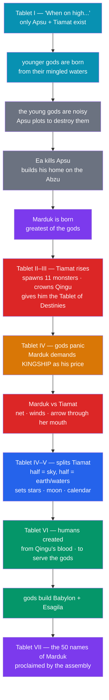

# 🌊 Enuma Elish

> [!abstract] TL;DR
> The ***Enuma Elish*** ("**When on high**," its opening words) is the **Babylonian creation epic**, written across **seven clay tablets** and best known from copies in **Ashurbanipal's library** (7th c. BCE), though the composition is older (likely late 2nd millennium). It begins before the world, when only two primordial waters exist: **Apsu** (the sweet/fresh underground water) and **Tiamat** (the salt sea, a chaos-dragon), whose mingling births the younger gods. When the noisy young gods disturb Apsu, he plots to destroy them; **Ea** kills Apsu first. Tiamat, enraged, raises an army of monsters led by her new consort **Qingu**, whom she gives the **Tablet of Destinies**. The terrified gods can find no champion until young **Marduk** agrees — on the condition that they make him **king**. He defeats Tiamat in single combat, **splits her corpse** to form sky and earth, sets the stars, moon, and calendar in order, and then creates **humankind from the blood of the slain Qingu** to do the gods' labor. The gods build him **Babylon** and its temple **Esagila** and proclaim his **fifty names**. Recited at the **Akitu** New Year festival, the epic is really a work of **political theology**: a cosmogony engineered to justify **Marduk's — and Babylon's — supremacy**.

## Intuition — analogy first

The *Enuma Elish* is best read as a **founding charter dressed as a creation story** — the mythic equivalent of a nation's origin narrative that also happens to explain why *this* capital and *this* ruler deserve to be in charge.

Imagine a confederation of old city-states, each with its own patron, that is suddenly unified under a rising newcomer. To make the new order feel *cosmically inevitable* rather than merely political, you compose a story in which the newcomer's god single-handedly saves all the others from annihilation, and they *freely and gratefully* hand him absolute kingship in return. The universe itself is then said to have been built by his hands, out of the body of the defeated enemy. Now his rule is not a recent power-grab; it is written into the structure of the sky.

That is exactly the move the *Enuma Elish* performs for **Marduk** and **Babylon**. The theme of the **younger generation overthrowing the older** — and order being wrestled out of a watery chaos-monster — is one of the great recurring patterns of ancient Near Eastern and Mediterranean myth; compare the Greek [[Greek_Creation_and_the_Titanomachy]], where Zeus and the young Olympians must defeat the older Titans to establish the reigning cosmic order. See [[Creation_and_Flood_Myths]] for the wider comparative frame.

---

## The Seven Tablets: From Chaos to Cosmos

## Key Concepts

### The primordial waters: Apsu and Tiamat

Creation begins not from nothing but from an undifferentiated **watery chaos**, a pair of personified oceans:

- **Apsu** — the **fresh/sweet water** (the same *Abzu* over which Ea/Enki rules), a masculine principle.
- **Tiamat** — the **salt sea**, feminine, later depicted as a monstrous dragon of chaos. (Her name is linguistically related to Semitic words for "the deep"; scholars note the resonance with Hebrew *təhôm*, "the deep," in Genesis 1:2 — a debated but suggestive parallel.)

Their waters "mingle as a single body," and from this union the first gods are generated: **Lahmu and Lahamu**, then **Anshar and Kishar** ("whole sky" and "whole earth"), then **Anu**, and then **Ea (Nudimmud)**. Creation here is genealogical: the cosmos unfolds as successive generations of gods.

### The generational conflict

The plot engine is a **clash between the older and younger gods** — a theomachy. The young gods are boisterous; the disturbance robs Apsu of rest. Against Tiamat's reluctance, Apsu (advised by his vizier **Mummu**) decides to **destroy his own offspring**. The clever **Ea** learns of the plot, casts a sleep-spell on Apsu, **kills him**, and founds his dwelling upon the subdued Apsu-waters — where his son **Marduk** is then born, endowed with extraordinary power ("four eyes, four ears," clothed in radiance).

### Tiamat's war and the bargain for kingship

Provoked to avenge Apsu, **Tiamat** becomes the epic's chaos-antagonist. She spawns a horde of **eleven monsters** (serpents, the "mushussu" dragon, scorpion-men, and more) and elevates her consort **Qingu** to command them, fastening the **Tablet of Destinies** — the emblem of supreme authority — to his breast. The senior gods **Ea and Anu** each approach Tiamat and turn back in fear. In desperation the divine assembly turns to **Marduk**, who agrees to fight on **one condition**: that they convene, fix destinies, and grant him **permanent, unquestioned kingship** over all the gods. They test his new power (he makes a constellation vanish and reappear by command) and hail him: *"Marduk is king!"*

### The combat and the making of the world

Armed with **bow, mace, lightning, a net, and the winds**, and mounted on his storm-chariot, Marduk confronts Tiamat in single combat. When she opens her mouth to swallow him, he drives the **winds** in to distend her, then looses an **arrow that splits her belly and heart**. Victorious, he performs the decisive cosmogonic act: he **splits Tiamat's carcass "like a dried fish" into two halves**, raising one to form the **sky** (with bar and guards to hold back her waters) and using the other for the **earth**. From her body he shapes geography — her eyes become the sources of the **Tigris and Euphrates**, her breasts the mountains. He then **orders the cosmos**: he fixes the stations of the great gods as **constellations**, establishes the **moon (Nanna/Sin)** to mark months and the calendar, and regulates day and night. Chaos becomes *kosmos* — an ordered, measured universe.

### The creation of humankind and the founding of Babylon

To relieve the gods of manual labor, Marduk (with Ea's help) resolves to create humanity. The assembly judges **Qingu** guilty of instigating the war; he is executed, and **from his blood humankind is fashioned**, expressly to **serve the gods** — to build temples and supply offerings. In gratitude the liberated gods build Marduk his city **Babylon** and its great temple **Esagila** (with the ziggurat **Etemenanki**), establishing it as the earthly seat of the divine assembly.

### The fifty names — theology as encyclopedia

The seventh tablet proclaims the **fifty names of Marduk**, each name assigning him a power, office, or the identity of an older god. This is a deliberate act of **theological absorption**: by naming Marduk as the sum of all divine functions, the poem effectively **subsumes the entire pantheon into him**, making him a near-universal deity. It is one of the ancient world's boldest experiments in concentrating divinity in a single figure.

### Ritual context: the Akitu festival

The epic was not merely read but **recited (or enacted) during the Akitu**, Babylon's **New Year festival** in the spring month of Nisan. Reciting the victory over Tiamat **renewed cosmic order** for the coming year; the king participated in rites (including a famous humiliation-and-reinvestiture before Marduk's statue) that reaffirmed both cosmic and royal legitimacy. Myth and state ritual were fused.

| Element | Enuma Elish | Function in the story |
|---|---|---|
| Primordial state | Apsu (fresh) + Tiamat (salt) waters mingled | Undifferentiated chaos, no sky or earth |
| Conflict | Younger gods vs. Apsu, then vs. Tiamat + Qingu | Justifies a new order by overcoming the old |
| Champion | **Marduk** (son of Ea) | Earns kingship as the price of salvation |
| Cosmogonic act | Tiamat's body split into sky and earth | Order (*kosmos*) built from the defeated chaos |
| Humanity | Made from **Qingu's blood** + clay | Created to labor for the gods |
| Political payload | Babylon + Esagila founded; 50 names | Sacralizes Babylon's and Marduk's supremacy |

## Primary Sources & Examples

- **The tablets themselves**: seven cuneiform tablets, first recovered in the 19th century from the **library of Ashurbanipal at Nineveh** and published by **George Smith** (1876); further copies come from Babylon, Kish, Uruk, and Assur.
- **The Assyrian rewrite**: Assyrian scribes produced a version substituting their national god **Ashur** for Marduk — direct evidence that the epic functioned as adaptable *political* theology rather than fixed dogma. See [[The_Mesopotamian_Pantheon]].
- **Chaoskampf across cultures**: the "combat myth," in which a storm/order god defeats a **sea- or dragon-of-chaos**, recurs widely — the Ugaritic **Baal vs. Yam** ("Sea"), the Hittite storm-god vs. the serpent **Illuyanka**, the Greek **Zeus vs. Typhon**, and echoes in the Hebrew Bible's mentions of **Leviathan/Rahab** and the sea-taming of Genesis 1. See [[Greek_Creation_and_the_Titanomachy]] and [[Creation_and_Flood_Myths]].
- **The "deep" parallel**: the phonetic and thematic link between **Tiamat** and Hebrew *təhôm* ("the deep") in Genesis 1:2 is a classic case study in the diffusion-vs-independent-invention debate.

## Common Pitfalls / Misconceptions

- **"It's just the Babylonian Genesis."** The parallels (a watery deep, order imposed by division, humans made last) are real, but the differences are decisive: *Enuma Elish* is **polytheistic, born of divine combat and generational conflict**, and humans are created to be the gods' **laborers**, not blessed stewards. It is comparative fuel, not a source-text of Genesis.
- **"Marduk was always the chief god."** He was a **minor local god** of Babylon whose promotion tracks Babylon's political rise. The epic is the *instrument* of that promotion, not a record of eternal status.
- **"Tiamat is simply 'the ocean' as scenery."** She is the personified **chaos-antagonist**, and the myth's core is *Chaoskampf* — the making of order by defeating her — not a neutral nature allegory.
- **"Creation from nothing (*creatio ex nihilo*)."** Mesopotamian cosmogony builds the world **from pre-existing matter** (the primordial waters, then Tiamat's body). Creation is **ordering and shaping**, not creation out of nothing.
- **"The seven tablets = seven days."** The tablet division is a **scribal format**, not a calendar of creation; do not map it onto the seven days of Genesis.

## Related Concepts

- [[_MOC_Mesopotamian_Myth|↑ Section MOC]] — situates this epic among the great Mesopotamian texts
- [[The_Mesopotamian_Pantheon]] — Marduk, Ea, Anu, Tiamat: the cast and the politics of Marduk's rise
- [[The_Epic_of_Gilgamesh]] — the other great Babylonian poem; shares the flood motif and the gods' concerns
- [[The_Descent_of_Inanna]] — a contrasting cosmology of death and the underworld rather than creation
- Cross-section: [[Greek_Creation_and_the_Titanomachy]] — the parallel "young gods overthrow the old" succession myth
- Cross-section: [[Creation_and_Flood_Myths]] — the comparative deluge-and-cosmogony frame, including the *təhôm* parallel

## Review Questions

1. Trace the plot from the mingling of Apsu and Tiamat to the proclamation of Marduk's fifty names. At what precise point, and on what condition, does Marduk gain kingship — and why is that condition the ideological heart of the poem?
2. Explain how the *Enuma Elish* functions as **political theology**. What is the role of the Akitu festival and the Assyrian "Ashur" rewrite in showing this?
3. Compare the *Enuma Elish* creation with Genesis 1 on three specific points (the primordial "deep," the method of creation, and the purpose of humanity). Why is it more accurate to call these "parallels within a shared Near Eastern tradition" than to call Genesis a copy?

## Sources

- Lambert, W. G. (2013). *Babylonian Creation Myths*. Eisenbrauns
- Foster, B. R. (2005). *Before the Muses: An Anthology of Akkadian Literature* (3rd ed.). CDL Press
- Dalley, S. (2000). *Myths from Mesopotamia: Creation, the Flood, Gilgamesh, and Others* (rev. ed.). Oxford University Press
- Heidel, A. (1951). *The Babylonian Genesis: The Story of Creation* (2nd ed.). University of Chicago Press

#mythology #mesopotamian-myth #creation-myth #marduk #babylon
