# ⬇️ The Descent of Inanna

> [!abstract] TL;DR
> ***The Descent of Inanna*** is a Sumerian myth (with a later, shorter Akkadian *Descent of Ishtar*) in which the great goddess of love and war **journeys down to the underworld** — the **Kur / Irkalla**, "the land of no return" — ruled by her elder sister **Ereshkigal**. As Inanna passes through **seven gates**, she is stripped at each of one of her **me** — crown, jewels, garments — until she stands **naked and powerless** before the throne. The **seven Anunnaki judges** fix her with "the eye of death," and she is turned into a corpse hung on a hook. Her clever minister **Ninshubur** appeals to the gods; only **Enki** acts, fashioning two sexless creatures who soothe the grieving Ereshkigal and win back Inanna's body, reviving her. But the underworld's law demands a **substitute**: Inanna, escorted by demons (the **galla**), finds her husband **Dumuzi (Tammuz)** enthroned in comfort rather than mourning her, and hands him over. Dumuzi's sister **Geshtinanna** shares his sentence, so that each spends **half the year below** — a **seasonal death-and-return** tied to fertility. The myth is a classic template of the **descent-and-return** and "dying god" pattern, inviting comparison with the Greek [[The_Greek_Underworld|Persephone]].

## Intuition — analogy first

Read *The Descent of Inanna* as a myth about the **one journey from which power cannot protect you** — and about the terrible arithmetic of getting back.

Inanna is the most *ascendant* deity imaginable: goddess of desire and of battle, the planet Venus, mistress of the **me**, queen of "the great above." The myth sends her, of her own will, to the one place her status means nothing: "the great below." The **seven gates** work like a decompression chamber run in reverse — at each threshold the gatekeeper removes a piece of her regalia, and with it a piece of her power, until she arrives **naked**, a person and nothing more, before a sister who has none of her glamour and all of the authority *here*. The underworld is the great leveller.

The second, harsher lesson is the **conservation law of the dead**: the realm below does not give life back for free. To leave, Inanna must supply a **replacement** — a body for a body. Her choice of whom to send, and the compromise that finally splits the sentence across the seasons, turns the myth into an explanation of why the world itself dies back and revives each year. This descent-stripping-death-return-substitution shape is one of the most widely echoed structures in world myth; comparing it with Persephone or with Frazer's "dying-and-rising god" is a model exercise for [[The_Comparative_Method]].

---

## The Seven Gates: Down and Back

```mermaid
graph TD
    Above["Inanna abandons her temples\nsets out for the 'Great Below'"] --> Instr["instructs Ninshubur:\nif I don't return in 3 days,\nplead with the gods"]
    Instr --> Gates["descends through the SEVEN GATES\nat each: one me / garment removed"]
    Gates --> Naked["arrives NAKED & bowed low\nbefore Ereshkigal's throne"]
    Naked --> Judged["the 7 Anunnaki judges\n'fasten the eye of death'"]
    Judged --> Corpse["Inanna = a corpse\nhung on a hook / peg"]

    Corpse --> Rescue["Ninshubur appeals:\nEnlil ✗ · Nanna ✗ · ENKI ✓"]
    Rescue --> Creatures["Enki makes 2 sexless beings\n(kurgarra & galatur)\nempathize with Ereshkigal"]
    Creatures --> Revive["they win the corpse\nsprinkle food & water of life"]
    Revive --> Law["LAW: no one leaves\nwithout a substitute"]
    Law --> Galla["ascends escorted by GALLA demons\nseeking a replacement"]
    Galla --> Dumuzi["finds DUMUZI unmourning\non her throne → handed over"]
    Dumuzi --> Season["Geshtinanna shares the term:\neach spends HALF the year below\n= the seasonal cycle"]

    style Above fill:#dc2626,color:#fff
    style Instr fill:#d97706,color:#fff
    style Gates fill:#7c3aed,color:#fff
    style Naked fill:#6b7280,color:#fff
    style Judged fill:#111827,color:#fff
    style Corpse fill:#111827,color:#fff
    style Rescue fill:#0891b2,color:#fff
    style Creatures fill:#0891b2,color:#fff
    style Revive fill:#059669,color:#fff
    style Law fill:#111827,color:#fff
    style Galla fill:#6b7280,color:#fff
    style Dumuzi fill:#d97706,color:#fff
    style Season fill:#059669,color:#fff
```

## Key Concepts

### The descent and the "ear for the Great Below"

The Sumerian poem opens with a formula of resolve: Inanna "**set her ear/mind to the Great Below**." She abandons her temples across the cities of Sumer, dons the **seven me** as regalia (the *shugurra* crown, lapis beads, a breastplate, the *pala* robe, a rod-and-line of measurement, mascara, a pectoral), and descends — ostensibly to attend the funeral rites of Ereshkigal's husband, **Gugalanna** ("the Great Bull of Heaven"). Crucially, she does **not** tell the truth about wanting the underworld itself, and she prepares for betrayal: she instructs her faithful vizier **Ninshubur** to mourn and lobby the gods if she fails to return in three days.

### The seven gates and the stripping of the me

At the outer gate the gatekeeper **Neti**, on Ereshkigal's orders, admits Inanna through **seven gates**, and at each gate removes **one item of her regalia** despite her protest. The refrain is answered each time: *"Quiet, Inanna, the ways of the underworld are perfect; they may not be questioned."* By the seventh gate she is **naked and bowed low** — the physical enactment of losing the **me**, her stripped-away powers (see [[The_Mesopotamian_Pantheon]] on the *me*). Sovereignty above counts for nothing below.

### Ereshkigal, the judges, and death

Before the throne, Inanna presumptuously moves to seat herself; the **Anunnaki, the seven judges** of the underworld, render their verdict and **Ereshkigal fastens on her the "eye of death."** Inanna is struck dead, her corpse hung on a **hook (or peg)** on the wall. This is a genuine *death* of a great deity — the myth's stark claim that even the goddess of life-force is subject to the underworld's jurisdiction. Ereshkigal, meanwhile, is portrayed not merely as a villain but as a **suffering figure**, groaning as if in the pains of childbirth or mourning.

### The rescue: Enki's empathetic creatures

After three days and nights, **Ninshubur** performs the prescribed lament and petitions the great gods in turn. **Enlil** (Nippur) and **Nanna/Sin** (Ur) refuse — "she wanted the Great Below; the underworld keeps whom it takes." Only **Enki**, god of wisdom, acts. From the **dirt under his fingernails** he fashions two small, **sexless beings** — the **kurgarra** and **galatur** — and sends them down with the **food of life and water of life**. Their strategy is pure empathy: they slip in "like flies," and when the grieving Ereshkigal cries out in her pain, they **echo and commiserate with her groans** rather than dismissing them. Touched, she offers them a gift; they ask only for **the corpse on the hook**, sprinkle it with the life-giving substances, and Inanna **revives**.

### The law of substitution and Dumuzi

But there is no free exit: the **Anunnaki seize Inanna** and impose the underworld's rule — *no one who has entered may leave unless they provide someone to take their place.* Inanna ascends accompanied by a horde of clinging **galla** demons hunting a substitute. She refuses to surrender the loyal **Ninshubur** or her mourning sons. Arriving at Uruk, she finds her husband **Dumuzi** (Akkadian **Tammuz**) — a shepherd-king — **not in mourning** but sitting resplendent on her throne. Enraged, she **fixes on him the eye of death** and hands him to the galla. Dumuzi flees, is transformed with the help of the sun-god **Utu**, and is caught. His devoted sister **Geshtinanna** offers to share his fate, and a compromise is struck: **each spends half the year in the underworld**, the other half above.

### The seasonal / "dying-god" pattern

Dumuzi's cyclical descent and return became the mythic charge behind the **death-and-mourning of Tammuz**, ritually lamented (women "weeping for Tammuz," a rite even referenced disapprovingly in **Ezekiel 8:14**). His half-year below and half-year above map onto the **agricultural year** — the dying-back and greening of the land, the "dying-and-rising god" cluster that **J. G. Frazer** made famous (and that later scholars sharply qualified). The myth thus does double duty: an **etiology of the seasons** and a meditation on death, sacrifice, and the price of return.

| Motif | The Descent of Inanna | The Greek Persephone myth |
|---|---|---|
| Who descends | **Inanna/Ishtar** (voluntarily) | **Persephone** (abducted by Hades) |
| Ruler of the dead | **Ereshkigal** (sister of Inanna) | **Hades** (with Persephone as queen) |
| Cause of return | Enki's creatures + a **substitute** | Demeter's grief + the eaten pomegranate seeds |
| The "seasonal" figure | **Dumuzi/Tammuz** (half-year below) | **Persephone** herself (part-year below) |
| Meaning | Fertility cycle; law of substitution | Fertility cycle; origin of the seasons |

## Primary Sources & Examples

- **Sumerian *Descent of Inanna*** — the fuller, older poem (~410 lines), reconstructed by **Samuel Noah Kramer** and others from Old Babylonian tablets; the primary source for the seven gates, Enki's creatures, and Dumuzi's substitution.
- **Akkadian *Descent of Ishtar*** — a later, shorter version in which **Ishtar** descends and her absence causes **all sexual reproduction on earth to cease** until she is released; it names the vizier **Papsukkal** and the reviver **Asushunamir**, and ends with rites for **Tammuz**.
- **The Dumuzi–Tammuz cult** — seasonal **lamentation for the dying shepherd-god** was widespread; the Hebrew Bible's **Ezekiel 8:14** condemns women "weeping for Tammuz" at the Jerusalem temple gate, evidence of the cult's diffusion.
- **Comparative descents** — the pattern reappears as **Persephone/Kore** and **Orpheus** in Greece (see [[The_Greek_Underworld]]), and resonates with the broader "**dying-and-rising god**" category (Osiris, Adonis, Attis) debated under [[The_Comparative_Method]].

## Common Pitfalls / Misconceptions

- **"Inanna is 'resurrected' like a savior god."** She is **revived** by Enki's magic and, crucially, only at the **cost of a substitute (Dumuzi)**. The myth is about the **conservation of the dead** — a life for a life — not a triumphant resurrection.
- **"Ereshkigal is simply evil."** The text renders her **grieving and in pain**; the rescue succeeds precisely because Enki's creatures **empathize** with her suffering, not because they defeat her. She embodies the underworld's implacable *law*, not malice.
- **"Dumuzi and Tammuz are different gods."** They are the **Sumerian and Akkadian names** for the same dying-and-returning shepherd deity, Inanna/Ishtar's consort.
- **"It's the same as Persephone, so one copied the other."** The parallels are structural and instructive, but establishing borrowing versus independent invention requires more than resemblance — the central lesson of [[The_Comparative_Method]]. Note too the key difference: Inanna descends **willingly**, whereas Persephone is **abducted**.
- **"Frazer's 'dying-and-rising god' settles the meaning."** Scholars such as **Jonathan Z. Smith** argued the category was overextended; Dumuzi's *return* is real in the seasonal sense but the label should be applied with care.

## Related Concepts

- [[_MOC_Mesopotamian_Myth|↑ Section MOC]] — this myth's place in the Mesopotamian corpus
- [[The_Mesopotamian_Pantheon]] — Inanna/Ishtar, Ereshkigal, Enki, and the *me* stripped at the gates
- [[The_Epic_of_Gilgamesh]] — the underworld "house of dust" (Enkidu's dream) and Ishtar's spurned wrath (recall Dumuzi)
- [[Enuma_Elish]] — the creation-and-order counterpart to this myth of death-and-return
- Cross-section: [[The_Greek_Underworld]] — the **Persephone** parallel: descent, seasonal return, the realm of the dead
- Cross-section: [[The_Comparative_Method]] — how to weigh the descent/"dying-god" parallels without overreaching

## Review Questions

1. Walk through the function of the **seven gates**. What is stripped from Inanna at each, and how does this dramatize the relationship between her *me*, her power, and the authority of the underworld?
2. Explain the **law of substitution** and how it leads to Dumuzi's fate and Geshtinanna's sharing of the sentence. How does this turn the myth into an explanation of the seasons?
3. Compare Inanna's descent with the Greek Persephone myth on at least three points, and state one reason (per [[The_Comparative_Method]]) why such parallels do **not** by themselves prove that one culture borrowed from the other.

## Sources

- Wolkstein, D., & Kramer, S. N. (1983). *Inanna, Queen of Heaven and Earth: Her Stories and Hymns from Sumer*. Harper & Row
- Dalley, S. (2000). *Myths from Mesopotamia: Creation, the Flood, Gilgamesh, and Others* (rev. ed.). Oxford University Press
- Katz, D. (2003). *The Image of the Netherworld in the Sumerian Sources*. CDL Press
- Black, J., Cunningham, G., Robson, E., & Zólyomi, G. (2004). *The Literature of Ancient Sumer*. Oxford University Press

#mythology #mesopotamian-myth #underworld #inanna #dying-and-rising
