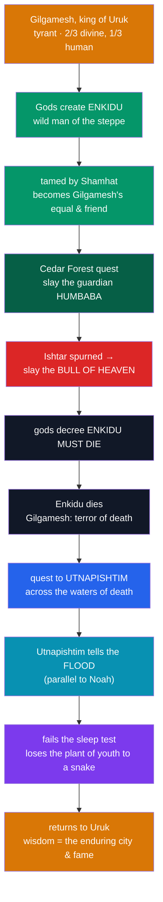

# 𒄑 The Epic of Gilgamesh

> [!abstract] TL;DR
> The ***Epic of Gilgamesh*** is the **oldest surviving great epic** in world literature. Its hero, **Gilgamesh**, is the tyrannical part-divine king of **Uruk**; to check him the gods create his wild double, **Enkidu**, who is tamed from the animals and becomes Gilgamesh's beloved companion. Together they win fame by killing the forest-guardian **Humbaba** in the **Cedar Forest** and by slaying the **Bull of Heaven** sent by the spurned goddess **Ishtar**. As punishment the gods condemn **Enkidu to death** — and his loss shatters Gilgamesh, who is seized by terror of his own **mortality**. He sets out on a desperate quest to find **Utnapishtim**, the one man granted eternal life, who recounts the **Great Flood** (a story strikingly parallel to Noah's) and sets Gilgamesh two tests he fails; a **plant of rejuvenation** he does win is stolen by a snake. Gilgamesh returns to Uruk having learned that **immortality lies not in escaping death but in the enduring city and the fame it preserves**. The best-known text is the **Standard Babylonian version**, attributed to the scholar-priest **Sîn-lēqi-unninni** and recovered from **Ashurbanipal's library** at Nineveh.

## Intuition — analogy first

At its core, *Gilgamesh* is the first great **story about growing up by learning that you will die** — a "buddy road-trip that turns into a confrontation with mortality."

Picture a swaggering young king who has everything — strength, beauty, power — and no limits, so he abuses his own people out of sheer restless energy. The universe answers by sending him the one thing he lacks: a **true friend and equal**. For a while the two are invincible, adventuring, slaying monsters, laughing at the gods' warnings. Then the friend **dies**, and the whole glittering world goes gray. For the first time the hero looks at a corpse and understands, in his body, that this will be *him*. Everything after that — the frantic journey to the edge of the world, the pleading with the flood-survivor, the failed tests, the stolen magic plant — is one long, human attempt to **outrun that knowledge**, and its failure is the point.

What Gilgamesh finally brings home is not a cure for death but **wisdom**: the walls of his city, the works he leaves behind, the story itself. In this the epic sits at the head of a long literary lineage of the **hero's confrontation with the underworld and the limits of life** — and its embedded flood story is one of the most important texts in comparative mythology. See [[Creation_and_Flood_Myths]] and, for the deluge parallels, [[Mythic_Motifs_in_the_Hebrew_Bible]].

---

## The Arc of the Epic

## Key Concepts

### Gilgamesh and Uruk

**Gilgamesh** (Sumerian **Bilgames**) appears in the Sumerian King List as an early king of **Uruk**, and the epic casts him as **"two-thirds god, one-third human"** — child of the goddess **Ninsun** and a mortal father. The poem opens on his **tyranny**: his boundless energy oppresses the young men and women of Uruk, whose complaints reach the gods. His story is thus framed from the start as the problem of a **superhuman ruler who must be humanized**. The epic's frame also praises the **walls of Uruk** — the opening and closing invite the reader to admire the city itself, a hint of the resolution to come.

### Enkidu: the wild double

To match and civilize Gilgamesh, the gods have the mother-goddess **Aruru** create **Enkidu** from clay — a **wild man** who lives among the animals, eats grass, and drinks at the waterhole. He is drawn into humanity by the temple woman **Shamhat**, whose companionship "civilizes" him (after which the animals flee him). Enkidu comes to Uruk, wrestles Gilgamesh to a standstill, and the two become **inseparable friends** — a bond the poem describes in the most intimate terms. Enkidu is Gilgamesh's mirror and conscience: the pairing of **culture and wildness, king and companion** drives the whole narrative.

### The heroic quests: Humbaba and the Bull of Heaven

Seeking lasting fame, Gilgamesh proposes an expedition to the **Cedar Forest** to kill its divine guardian **Humbaba (Huwawa)**, a fearsome monster appointed by Enlil. With the sun-god **Shamash's** aid they overcome him; despite his pleas for mercy, they kill him and fell the sacred cedars. Returning in glory, Gilgamesh rejects the marriage-proposal of the goddess **Ishtar**, insultingly cataloguing the ruin she brought her former lovers (including **Dumuzi/Tammuz**; see [[The_Descent_of_Inanna]]). Enraged, Ishtar demands the **Bull of Heaven** from her father **Anu** and looses it on Uruk; the heroes kill it too, and Enkidu hurls its haunch at the goddess. These twin sacrileges — killing Enlil's guardian and Ishtar's bull — seal Enkidu's fate.

### Enkidu's death and the fear of mortality

The divine assembly decrees that **one of the pair must die**, and the lot falls on **Enkidu**. He sickens, curses and then blesses those who civilized him, recounts a bleak dream of the **"house of dust"** (the underworld), and dies. Gilgamesh's grief is total: he will not let the body be buried until "a maggot fell from his nose." For the first time the hero grasps that **he too will die** — and this terror, not glory, now drives him. The epic pivots from a tale of heroic exploits into a **meditation on death**.

### The quest for immortality and Utnapishtim

Gilgamesh sets out to find **Utnapishtim** (Sumerian **Ziusudra**; Akkadian also **Atra-hasis**), the flood-survivor granted eternal life. He crosses the mountain **Mashu** guarded by scorpion-beings, traverses a tunnel of darkness, meets the ale-wife **Siduri** (who in the older version urges him to enjoy the sweetness of ordinary life), and is ferried by **Urshanabi** across the **Waters of Death** to Utnapishtim's shore at the edge of the world.

### The Flood account (Tablet XI)

Utnapishtim explains that his immortality was a **one-time divine gift** and cannot be repeated, then tells **how he earned it**. The gods, led by **Enlil**, resolved to destroy humanity with a **flood**; the god **Ea** secretly warned Utnapishtim to build a great **boat** and load it with "the seed of all living things." The deluge raged so violently that "the gods themselves cowered like dogs." When the waters receded, the boat grounded on **Mount Nimush (Nisir)**; Utnapishtim released a **dove, a swallow, and a raven** to test for dry land, then offered a sacrifice around which "the gods gathered like flies." The parallels to the biblical Noah (Genesis 6–9) — the divine decision, the ark, the mountain landing, the bird reconnaissance, the sacrifice — are close and famous, and were the sensation of George Smith's 1872 decipherment. This flood is a fuller cousin of the tale in the separate poem **Atra-hasis**. See [[Creation_and_Flood_Myths]] and [[Mythic_Motifs_in_the_Hebrew_Bible]].

### The two failures and the return home

Utnapishtim sets Gilgamesh a test: **stay awake for six days and seven nights**. He fails almost at once, sleeping while loaves baked daily beside him rot to mark the days — proof that a man who cannot conquer sleep cannot conquer death. As a parting gift, Utnapishtim reveals a **plant of rejuvenation** ("the old man becomes young") at the bottom of the sea. Gilgamesh retrieves it — but while he bathes, a **snake** eats it and sloughs its skin, carrying off renewal (a mythic etiology for why snakes shed and seem "reborn"). Empty-handed, Gilgamesh returns to **Uruk** and shows Urshanabi its walls: the epic ends where it began, its wisdom now clear — **lasting life is not personal immortality but the enduring works, city, and remembered name one leaves behind.**

| Feature | Gilgamesh flood (Tablet XI) | Genesis flood (Noah) |
|---|---|---|
| Cause | Enlil's decision (in Atra-hasis: human "noise"/overpopulation) | Human wickedness |
| Warned survivor | **Utnapishtim** (warned by Ea) | **Noah** (warned by God) |
| Vessel | A great cube-like boat sealed with pitch | An ark of gopher wood, sealed with pitch |
| Duration/landing | Storm ~7 days; grounds on **Mt. Nimush** | 40 days rain; grounds on **Ararat** |
| Birds | Dove, swallow, **raven** | Raven, then **dove** (three times) |
| Aftermath | Sacrifice; gods "gather like flies"; survivor made immortal | Sacrifice; God smells it; covenant of the rainbow |

## Primary Sources & Examples

- **The Standard Babylonian version** — the ~11-tablet integrated poem titled from its incipit *Sha naqba īmuru* ("He who saw the Deep"), traditionally credited to the scholar **Sîn-lēqi-unninni** (late 2nd millennium BCE), recovered chiefly from the **library of Ashurbanipal** at Nineveh. A **twelfth tablet** (a partial translation of a Sumerian poem) is appended in some copies but stands apart from the main narrative.
- **Older Sumerian poems** — five independent Sumerian tales of **Bilgames** (e.g., *Bilgames and Huwawa*, *Bilgames and the Bull of Heaven*, *Bilgames and the Netherworld*, *The Death of Bilgames*) predate and feed the Akkadian epic.
- **The rediscovery** — **George Smith** of the British Museum announced the flood tablet in **1872**, causing a public sensation for its resemblance to Genesis and helping launch the modern study of the ancient Near East.
- **Comparative reach** — the flood links to **Atra-hasis** and **Ziusudra** in Mesopotamia and, more distantly, to the Greek **Deucalion** and the Indian **Manu** flood traditions — a textbook case for the diffusion-vs-independent-invention question (see [[Creation_and_Flood_Myths]]).

## Common Pitfalls / Misconceptions

- **"Gilgamesh copied the Bible" (or vice versa).** The epic is **far older** than the Hebrew Bible. Most scholars see a **shared ancient Near Eastern flood tradition** that both drew on, not a simple copy in either direction. The parallels invite comparison, not a plagiarism verdict.
- **"Gilgamesh finds immortality."** He explicitly **fails**: he cannot stay awake, and a snake steals the rejuvenation plant. The epic's whole point is the **acceptance** of mortality.
- **"It's a single ancient book."** *Gilgamesh* is a **composite tradition** — Sumerian poems, an Old Babylonian epic, and the later Standard Babylonian recension — reconstructed from many fragmentary tablets, still being augmented by new finds (e.g., the 2011 "Cedar Forest" tablet).
- **"Enkidu is a sidekick."** He is Gilgamesh's **equal and double**, and his death is the narrative and emotional hinge of the entire poem.
- **"Humbaba is just a villain."** He is a **divinely appointed guardian**; killing him and felling the sacred cedars is a **transgression** that helps bring on Enkidu's death — the moral texture is more ambiguous than a monster-slaying.

## Related Concepts

- [[_MOC_Mesopotamian_Myth|↑ Section MOC]] — the epic's place among the great Mesopotamian texts
- [[The_Mesopotamian_Pantheon]] — Shamash, Ishtar, Enlil, Ea, Anu: the gods who shape Gilgamesh's fate
- [[Enuma_Elish]] — the companion Babylonian masterwork; both preserved in Ashurbanipal's library
- [[The_Descent_of_Inanna]] — the underworld ("house of dust") Enkidu dreams of; Ishtar and Dumuzi reappear here
- Cross-section: [[Creation_and_Flood_Myths]] — the comparative deluge tradition (Atra-hasis, Ziusudra, Deucalion, Manu)
- Cross-section: [[Mythic_Motifs_in_the_Hebrew_Bible]] — the Noah parallel and the ancient Near Eastern flood background

## Review Questions

1. Explain how the death of Enkidu transforms the epic's central question. How does the framing device of the walls of Uruk (beginning and end) express the epic's final answer about immortality?
2. Summarize the flood account in Tablet XI and list four specific parallels with the Noah story. Why do scholars prefer "a shared Near Eastern tradition" to a claim that one text copied the other?
3. Describe Gilgamesh's two failed attempts at immortality (the sleep test and the plant of rejuvenation). What does each failure — and the snake's role — teach about the Mesopotamian view of the human condition?

## Sources

- George, A. R. (2003). *The Babylonian Gilgamesh Epic: Introduction, Critical Edition and Cuneiform Texts* (2 vols.). Oxford University Press
- George, A. R. (Trans.). (1999). *The Epic of Gilgamesh: A New Translation*. Penguin Classics
- Dalley, S. (2000). *Myths from Mesopotamia: Creation, the Flood, Gilgamesh, and Others* (rev. ed.). Oxford University Press
- Tigay, J. H. (1982). *The Evolution of the Gilgamesh Epic*. University of Pennsylvania Press

#mythology #mesopotamian-myth #epic #gilgamesh #flood
