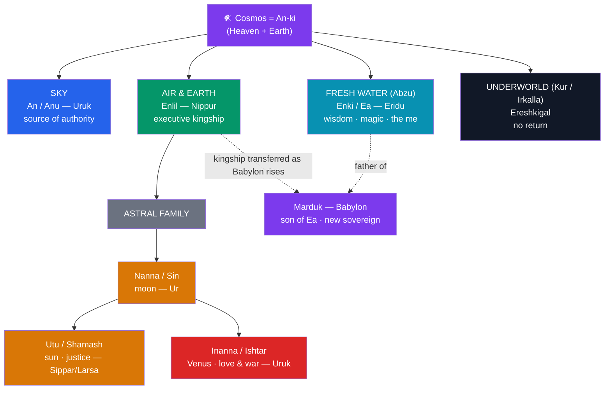

# 🏛️ The Mesopotamian Pantheon

> [!abstract] TL;DR
> The gods of ancient **Mesopotamia** form the oldest documented pantheon on earth, layered across three millennia of **Sumerian**, **Akkadian**, **Babylonian**, and **Assyrian** worship and known to us from cuneiform tablets. At the top sit three cosmic sovereigns: **An/Anu** (the remote sky-father), **Enlil** (lord of the air and executive power, who holds kingship at Nippur), and **Enki/Ea** (god of the freshwater *Abzu*, of wisdom, magic, and craft, and humanity's patron). Around them turn the astral deities — **Nanna/Sin** (moon), his children **Utu/Shamash** (sun and justice) and **Inanna/Ishtar** (Venus, love and war) — while **Ereshkigal** rules the underworld below. As Babylon rose politically, its city-god **Marduk** was promoted to head the whole assembly. Two structural ideas organize the system: the **me** (impersonal "divine decrees" that encode every institution of civilization) and the **temple cult**, in which each god literally *lived* in a city as its landlord. Most gods carry a **Sumerian name and an Akkadian equivalent** — one deity, two linguistic skins.

## Intuition — analogy first

Think of the Mesopotamian pantheon less like a family of superheroes and more like the **board and executive of a vast, sacred corporation that owns the country**.

Each great god is the *proprietor* of a specific city: An owns Uruk, Enlil owns Nippur, Enki owns Eridu, Nanna owns Ur. The city's temple is not a place of worship in the modern sense but the god's **residence and estate**, and the priesthood is its permanent staff, feeding, clothing, and administering the divine landlord daily. Above the individual firms sits a **board of directors** — the divine assembly — which meets to "decree destinies," and a shifting **CEO**: originally Enlil holds the executive portfolio (symbolized by the *Tablet of Destinies*), but when Babylon's political fortunes rise, its local god **Marduk** is voted into the top chair, inheriting the powers of the older executives.

And just as a corporation runs on **standardized operating procedures**, Mesopotamian civilization runs on the **me** — a fixed set of divine "decrees" or blueprints for everything from kingship and priesthood to sex, warfare, music, and even "the descent into the underworld." The gods do not *invent* culture freely; they hold, guard, transfer, and occasionally steal these pre-existing decrees. Understanding the pantheon means learning who holds which portfolio, in which city, under which name. See [[Enuma_Elish]] for the boardroom coup that made Marduk chairman.

---

## How the Cosmos Is Organized

The Sumerians pictured the universe as **An-ki**, "heaven-and-earth," a single compound later split. **An** (heaven) presides above; **Enlil** occupies the air-space between heaven and earth; **Enki** rules the sweet groundwater of the **Abzu** beneath; and the **Kur** — the underworld — lies below everything. The collective divine population is called the **Anunna(ki)** (the great gods "of princely seed"), sometimes distinguished from the **Igigi** (a class of younger, laboring gods). The cosmos is administered, not merely inhabited.

## Key Concepts

### The ruling triad: An, Enlil, Enki

The three highest gods divide the cosmos among themselves and together form the executive core of every early god-list.

- **An / Anu** ("sky") is the primordial sky-father and nominal head of the pantheon, whose city is **Uruk** (shared with Inanna). He is the ultimate *source* of authority and legitimacy — kingship "descends from An" — yet he is remote and rarely acts directly. His name is written with the star-sign 𒀭, the cuneiform determinative placed before *every* divine name (*DINGIR*, "god").
- **Enlil** ("Lord Wind/Air") is the *working* sovereign of the Sumerian world, enthroned in the **Ekur** temple at **Nippur**, Sumer's spiritual capital. He grants and revokes kingship, holds the **Tablet of Destinies**, and can be terrifyingly destructive — in the flood tradition it is Enlil, annoyed by humanity's noise, who resolves to wipe them out.
- **Enki / Ea** ("Lord Earth," but master of the freshwater **Abzu**) rules from **Eridu**, the city Mesopotamians regarded as the oldest of all. He is the god of **wisdom, incantation, magic, crafts, and cunning** — the divine problem-solver who repeatedly rescues both gods and humans, and the keeper and dispenser of the **me**. His trickster streak makes him the pantheon's diplomat and engineer.

### Inanna/Ishtar and the astral deities

A second cluster is astral — the visible lights of the sky worshipped as gods.

- **Nanna / Sin** (also **Suen**) is the **moon god**, seated at **Ur**; his crescent is his emblem and he fathers the sun and Venus.
- **Utu / Shamash** is the **sun god** and, crucially, the god of **justice, law, and truth** — the sun "sees everything," so he judges. His cities are **Sippar** and **Larsa**; Hammurabi's law-code stele shows the king receiving authority from him.
- **Inanna / Ishtar** is the most vivid deity of all: goddess of **sexual love and of war**, identified with the planet **Venus** (morning and evening star). Ambitious, boundary-crossing, and dangerous, she is the protagonist of [[The_Descent_of_Inanna]] and the spurned suitor whose wrath drives a central episode of [[The_Epic_of_Gilgamesh]].

### Marduk, Ashur, and the politics of promotion

The pantheon is **not static**: a god's rank tracks his city's power. When **Babylon** became the dominant power under Hammurabi (18th c. BCE) and again in the Neo-Babylonian period, its previously minor city-god **Marduk** (son of Ea) was elevated to **king of the gods**, absorbing Enlil's executive functions. The epic [[Enuma_Elish]] is precisely the *theological charter* for this promotion. In **Assyria**, the same slot is filled by the national god **Ashur**, and Assyrian scribes even rewrote the *Enuma Elish* to put Ashur in Marduk's place — a vivid demonstration that Mesopotamian theology was also statecraft.

### Ereshkigal and the underworld

Below sits **Ereshkigal**, "Queen of the Great Earth," ruler of the underworld (**Kur** / **Irkalla**), the "land of no return," a grim dusty realm where the dead eat clay. She is Inanna's elder sister and, in the myth *Nergal and Ereshkigal*, takes the war-god **Nergal** as consort. The underworld is a full administrative kingdom with its own gates, gatekeeper (**Neti**), and laws.

### The *me* — divine decrees

The **me** (Sumerian, roughly "the way things are decreed to be") are the **impersonal, transferable blueprints of civilization**: kingship, priestly offices, truth, the arts of war and of peace, music, sexual intercourse, scribal craft, even "the plundering of cities" and "the descent to the underworld." They are held, above all, by **Enki at Eridu**. In the myth *Inanna and Enki*, Inanna gets Enki drunk, wheedles the entire set of *me* out of him, and ships them by boat to **Uruk** — a mythic explanation of how the arts of civilization moved from the oldest city to hers. The *me* express a deep Mesopotamian intuition: culture is not invented but **allotted** by the divine order.

### The temple cult

Religion centered on the **é** ("house") — the **temple**, understood as the god's literal dwelling, often crowned by a stepped tower, the **ziggurat** (e.g., the Etemenanki at Babylon, the Great Ziggurat of Ur). At its heart stood the **cult statue**, which *was* the god's presence once ritually animated (the *mīs pî*, "washing/opening of the mouth" ceremony). Priests **fed, washed, clothed, and entertained** the god daily; festivals such as the **Akitu** New Year re-enacted cosmic order. Kings ruled as the gods' stewards (the title *ensi*, "governor for the god"), and the temple was simultaneously shrine, granary, bank, and workshop — the god as economic landlord of the city.

| Sumerian name | Akkadian/Babylonian | Domain | Cult city | Emblem |
|---|---|---|---|---|
| **An** | **Anu** | Sky, supreme authority | Uruk | Horned crown / star |
| **Enlil** | **Ellil** | Air, wind, kingship | Nippur | Tablet of Destinies |
| **Enki** | **Ea** | Fresh water, wisdom, magic, craft | Eridu | Streams with fish; goat-fish |
| **Inanna** | **Ishtar** | Love, sex, war; Venus | Uruk | Eight-pointed star; reed-bundle |
| **Utu** | **Shamash** | Sun, justice, law | Sippar, Larsa | Solar disk; saw |
| **Nanna / Suen** | **Sin** | Moon | Ur | Crescent |
| **Ereshkigal** | **Ereshkigal** | Underworld | (Kur / Irkalla) | — |
| **(Amar-utu)** | **Marduk** | Babylon's patron; kingship | Babylon | Spade (*marru*); *mušḫuššu* dragon |
| **Ninhursag** | **Ninmah / Belet-ili** | Mother goddess, birth | Kesh | Omega-shaped symbol |

## Examples Across Cultures

- **The Sumerian–Akkadian double naming** is the single most important key: **Inanna = Ishtar**, **Utu = Shamash**, **Nanna = Sin**, **Enki = Ea**, **An = Anu**. These are not different gods but the same deity in two languages — Sumerian (a language isolate) and Akkadian (Semitic) — reflecting Mesopotamia's long bilingual culture rather than distinct religions.
- **Comparative sovereignty**: An's remote, "do-nothing" kingship over an active executive (Enlil, then Marduk) parallels the Greek pattern where the primordial **Ouranos** is displaced by **Kronos** and then the reigning **Zeus** — an old sky-father superseded by a working storm/sky king. See [[Enuma_Elish]].
- **Astral religion**: the moon–sun–Venus triad (Sin, Shamash, Ishtar) anticipates the systematic god–planet identifications that later feed **Greco-Roman astrology** and the naming of the planets.
- **Divine justice through the sun**: Shamash as all-seeing judge resembles the Egyptian solar theology of **Ra** and the later idea of the sun as the eye that witnesses human deeds.

## Common Pitfalls / Misconceptions

- **"Sumerian and Babylonian gods are different pantheons."** For the most part they are the *same* gods under Sumerian and Akkadian names. The genuine changes are in *rank and emphasis* (Marduk's rise, Ishtar absorbing other goddesses), not wholesale replacement.
- **"There was one fixed pantheon."** The system evolved over ~3,000 years and varied by city and period; god-lists (like *An = Anum*) were scholarly attempts to *organize* a sprawling, changing reality. Rankings shifted with politics.
- **"The gods are just personified nature."** Müller-style solar reductionism is outdated (see [[The_Comparative_Method]]). Enki is "water," yes, but also wisdom, craft, and civic order; the gods are civic institutions and moral agents, not weather reports.
- **"The me are objects/tablets."** They are better understood as *abstract decrees or offices* — the ordained functions of civilization — even though myth can treat them as things that can be carried on a boat.
- **"Anunnaki were ancient astronauts."** The term simply means the great gods collectively; the modern "alien" mythology has no basis in the cuneiform sources.

## Related Concepts

- [[_MOC_Mesopotamian_Myth|↑ Section MOC]] — the hub for this whole pantheon and its texts
- [[Enuma_Elish]] — the epic that promotes Marduk to head of this pantheon and narrates the cosmos's formation
- [[The_Epic_of_Gilgamesh]] — shows the gods (Shamash, Ishtar, Enlil, Ea) intervening in human affairs
- [[The_Descent_of_Inanna]] — Inanna/Ishtar and Ereshkigal, the pantheon's underworld branch
- [[The_Comparative_Method]] — cross-section: why "the gods are personified nature" (Müller) was abandoned
- Cross-section: [[_MOC_Egyptian_Myth|Egyptian pantheon]] — a contemporary river-valley polytheism for comparison

## Review Questions

1. Explain the "double naming" of Mesopotamian gods with three examples. What historical fact about Mesopotamian language and culture does it reflect, and why is it wrong to treat the Sumerian and Akkadian sets as separate pantheons?
2. Describe the roles of An, Enlil, and Enki, and explain how Marduk came to occupy the top of the pantheon. What does his rise reveal about the relationship between myth and politics in Mesopotamia?
3. Define the *me* and the temple cult. How does each express the Mesopotamian conviction that civilization and its institutions are divinely ordered rather than humanly invented?

## Sources

- Black, J., & Green, A. (1992). *Gods, Demons and Symbols of Ancient Mesopotamia*. British Museum Press
- Jacobsen, T. (1976). *The Treasures of Darkness: A History of Mesopotamian Religion*. Yale University Press
- Bottéro, J. (2001). *Religion in Ancient Mesopotamia* (T. L. Fagan, Trans.). University of Chicago Press
- Kramer, S. N. (1963). *The Sumerians: Their History, Culture, and Character*. University of Chicago Press

#mythology #mesopotamian-myth #pantheon #sumer #babylon
