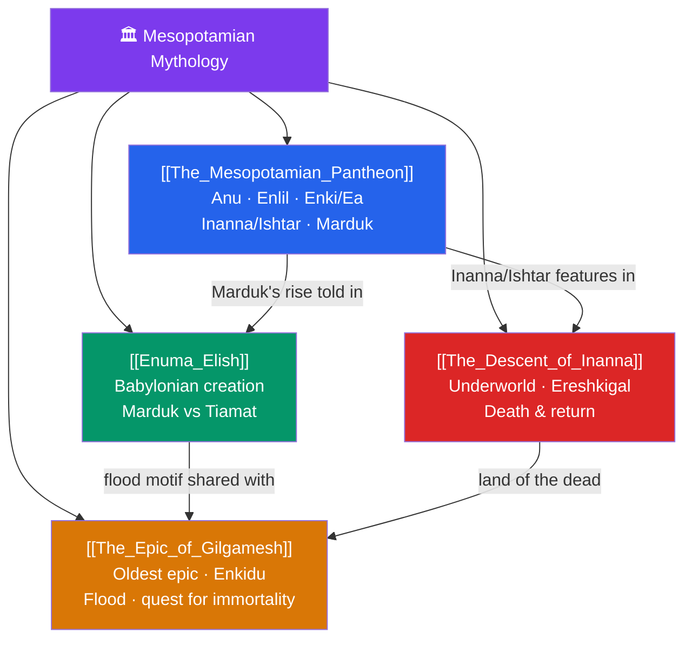

# 🏛️ Mesopotamian Mythology — Map of Content

> [!abstract] What This Section Covers
> Mesopotamia — Sumer, Akkad, Babylon, and Assyria — produced humanity's oldest recorded literature, preserved in cuneiform on clay tablets. This section opens with **The Mesopotamian Pantheon**, the layered Sumerian-Akkadian gods (sky-father Anu, air-lord Enlil, wise Enki/Ea, the fierce Inanna/Ishtar, and Babylon's champion Marduk), then turns to the great texts: the **Enuma Elish**, Babylon's creation epic in which Marduk slays the primordial sea-mother Tiamat and forms the cosmos from her body; the **Epic of Gilgamesh**, the world's oldest long poem, whose flood account and futile quest for immortality echo through later literature; and **The Descent of Inanna**, a stark underworld myth of death, judgment before Ereshkigal, and return. Together they establish the templates — divine kingship, cosmic combat, the flood, and the journey to the land of the dead — that ripple across the whole vault.

## Concept Map

## Learning Path

1. [[The_Mesopotamian_Pantheon]] — Meet the gods first: the Sumerian triad (Anu, Enlil, Enki) and their Akkadian-Babylonian successors.
2. [[Enuma_Elish]] — Babylon's creation epic and the theological rise of Marduk over the older gods.
3. [[The_Epic_of_Gilgamesh]] — The oldest surviving epic: friendship with Enkidu, the flood of Utnapishtim, and the search for eternal life.
4. [[The_Descent_of_Inanna]] — The goddess's journey through the seven gates of the underworld and the price of return.

## All Notes at a Glance

| Note | Difficulty | What You'll Learn |
|------|------------|-------------------|
| [[The_Mesopotamian_Pantheon]] | Beginner | Sumerian vs Akkadian names, Anu, Enlil, Enki/Ea, Inanna/Ishtar, Marduk, the me and divine order |
| [[Enuma_Elish]] | Intermediate | Apsu and Tiamat, the theomachy, Marduk's kingship, creation from Tiamat's body, Babylon's supremacy |
| [[The_Epic_of_Gilgamesh]] | Intermediate | Gilgamesh and Enkidu, Humbaba, the Bull of Heaven, Utnapishtim's flood, mortality and legacy |
| [[The_Descent_of_Inanna]] | Intermediate | The seven gates, Ereshkigal, the galla, Dumuzi's substitution, dying-and-rising themes |

## Key Questions This Section Answers

- Why is Mesopotamian myth the oldest we can read, and how did cuneiform preserve it?
- How does the *Enuma Elish* use cosmic combat to justify Babylon's political rise?
- How does the flood story in *Gilgamesh* relate to the biblical flood?
- What does *Inanna's Descent* reveal about Mesopotamian ideas of death and the underworld?
- Why do the same gods appear under both Sumerian and Akkadian names?

## Related Sections

- [[_MOC_Mythology_Master|↑ Mythology Master MOC]]
- [[_MOC_Comparative_Mythology|← Comparative Mythology & Theory]]
- [[_MOC_Egyptian_Myth|→ Egyptian]]
- Cross-vault: [[Creation_and_Flood_Myths]] (deluge parallels), [[_MOC_Abrahamic_Myth|Abrahamic Narratives (flood, Near Eastern parallels)]]

#MOC #Mythology #MesopotamianMyth
