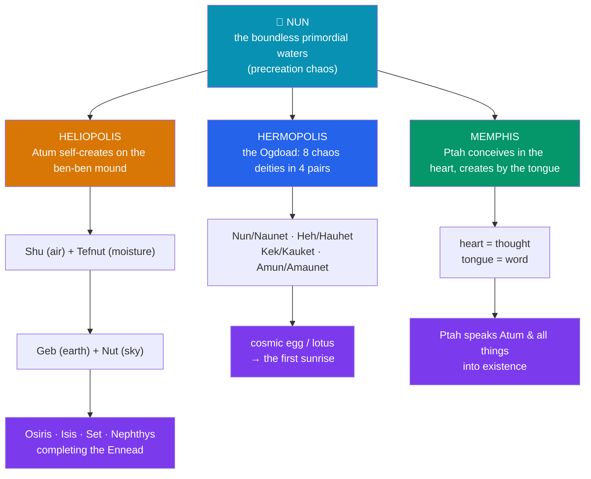

# 🌊 Egyptian Creation Myths

> [!abstract] TL;DR
> Egypt did not have *one* creation story; it held several **competing cosmogonies** simultaneously, each developed by the priesthood of a major cult center and each promoting that center's god as creator. The **Heliopolitan** account has the self-created **Atum** rise on the primeval mound (the **ben-ben**) out of the boundless waters of **Nun**, then bring forth **Shu** and **Tefnut** and, through them, the whole **Ennead**. The **Hermopolitan** account posits the **Ogdoad**, eight primordial deities in four pairs personifying the qualities of chaos, from whom the sun emerges via a cosmic egg or lotus. The **Memphite** account, preserved in the **Memphite Theology** on the **Shabaka Stone**, has **Ptah** create everything intellectually — conceiving it in his **heart** (mind) and calling it into being with his **tongue** (word). Across all three run shared motifs: **Nun** the precreation waters, the **primeval mound**, the **first sunrise** at "**the first time**" (*zep tepi*). The Egyptians felt no need to reconcile these — they were complementary approaches to a mystery, not rival theories to be adjudicated.

## Intuition — analogy first

Imagine several **maps of the same city drawn at different scales** — a street map, a transit map, a topographic map. Each is "true," none is complete, and no cartographer thinks they contradict one another; you simply pick the map that suits your purpose.

Egyptian cosmogonies work the same way. Heliopolis, Hermopolis, and Memphis each drew their own "map" of how existence began, foregrounding their own god, and Egyptian thought was perfectly comfortable holding all of them at once. The Egyptologist **Erik Hornung** called this the "**logic of complementarity**" or a **multiplicity of approaches**: the divine is too large for a single description, so multiple, even incompatible, images are laid side by side.

This is genuinely alien to the modern habit of asking "**but which one is right?**" The right question is instead "**what does each account emphasize?**" — self-generation at Heliopolis, the qualities of chaos at Hermopolis, the primacy of mind and word at Memphis. Hold that pluralism in mind and the "contradictions" become a deliberate theological method.

---

## Three Cosmogonies from One Chaos

## Key Concepts

### The shared substrate: Nun, the mound, and the first sunrise

Every Egyptian cosmogony begins not with nothing but with **Nun** (Nu) — the dark, boundless, inert **primordial waters** that precede and surround creation. Creation is the emergence of order, light, and dry land *out of* this watery chaos. Two images recur across all traditions:

- The **primeval mound** — the first patch of dry earth to rise from Nun, mythologically echoed each year when the Nile flood recedes and leaves fertile hillocks. At Heliopolis this is the **ben-ben** stone, prototype of the obelisk and pyramidion.
- The **first sunrise** at "**the first time**" (**zep tepi**) — the sun-god's initial appearance, often as the **Bennu** bird (a heron, later linked to the Greek phoenix) alighting on the mound, or the sun rising from a **lotus** on the waters. Creation is thus modelled on the daily and annual rhythms Egyptians actually observed.

### Heliopolis: Atum and the Ennead

The priests of **Heliopolis** (*Iunu*) made the sun-creator **Atum** ("the complete/finished one," later fused as **Ra-Atum**) self-generate on the mound. Alone, Atum produces the first pair *from his own body* — the texts state without euphemism that he does so by **masturbation** (or, in a variant, by spitting/sneezing) — yielding **Shu** (air) and **Tefnut** (moisture). Shu and Tefnut beget **Geb** (earth) and **Nut** (sky); Shu then **separates** sky from earth by holding Nut aloft above the reclining Geb. Geb and Nut produce **Osiris, Isis, Set, and Nephthys**, completing the **Ennead** and setting up the Osirian drama (see [[The_Osiris_Myth]]). This is the cosmogony embedded in the **Pyramid Texts**.

### Hermopolis: the Ogdoad

At **Hermopolis** (*Khmun*, "Eight-Town"), the priests described the precreation state itself as populated by the **Ogdoad** — eight deities in four **male–female pairs**, the males frog-headed and the females serpent-headed, each pair personifying an aspect of chaos:

| Pair | Personified quality |
|---|---|
| **Nun / Naunet** | the primordial waters |
| **Heh / Hauhet** | infinity / boundlessness |
| **Kek / Kauket** | darkness |
| **Amun / Amaunet** | hiddenness (or air) |

From the interaction of these qualities emerged the **cosmic egg** (or a lotus) on the primeval mound, from which the **sun-god** hatched to begin ordered creation. The Ogdoad are abstractions of chaos, not characters with stories.

### Memphis: Ptah, and creation by heart and word

The most philosophically sophisticated account comes from **Memphis**, preserved as the **Memphite Theology** on the **Shabaka Stone** (a 25th-Dynasty copy, c. 700 BCE, claiming to reproduce a much older, worm-eaten papyrus). Here the craftsman-god **Ptah** is the true source of all things, *including Atum himself*. Ptah creates not by bodily act but by **intellect and speech**: he **conceives** each thing in his **heart** (which the Egyptians regarded as the seat of thought) and brings it into being by **naming** it with his **tongue**. Every other god, and all creation, is the realization of Ptah's thought spoken aloud. This "**creation by the word**" is frequently compared with the divine *fiat* of Genesis ("God said…") and the *Logos* of John's Gospel — a genuinely striking parallel, though the direction and even the existence of any influence are debated.

### The competing centers, compared

| Cult center | Creator | Mechanism | Chief source | Emphasis |
|---|---|---|---|---|
| **Heliopolis** | Atum (Ra-Atum) | self-generation on the mound; the Ennead by descent | Pyramid Texts | the sun and the divine family |
| **Hermopolis** | the Ogdoad | qualities of chaos → cosmic egg/lotus → sun | Coffin Texts, later temple texts | the nature of precreation chaos |
| **Memphis** | Ptah | thought (heart) + word (tongue) | the Shabaka Stone | intellect and language |

## Examples Across Cultures

- **Creation from watery chaos**: Egypt's **Nun** parallels the Mesopotamian **Apsu/Tiamat** of the *Enuma Elish* and the **tehom** ("the deep") over which the spirit hovers in **Genesis 1** — the widespread motif of order emerging from a primordial ocean. See [[Egyptian_Creation_Myths|this note]] alongside [[The_Comparative_Method]].
- **Creation by the word**: Ptah's tongue speaking the world into being sits beside the Genesis *fiat* and the Johannine *Logos*, a classic case study for diffusion-versus-independent-invention debates.
- **The cosmic egg**: the Hermopolitan egg on the primeval waters echoes the **Orphic egg** of Greek cosmogony and the **Hiraṇyagarbha** ("golden womb/egg") of Vedic tradition.
- **Separation of earth and sky**: Shu parting Nut from Geb parallels the Greek separation of **Ouranos** and **Gaia** and the Māori sundering of **Rangi** and **Papa** — a recurrent "cosmic parents pushed apart" motif.

## Common Pitfalls / Misconceptions

- **"Egyptians had one creation myth."** They maintained several, keyed to cult centers, and never treated the extra accounts as heresy. Expecting a single canonical cosmogony imposes a modern, monotheistic assumption.
- **"The contradictions were a problem the Egyptians tried to fix."** Following Hornung, the multiplicity was deliberate — complementary approaches to an unrepresentable mystery, not competing hypotheses awaiting adjudication.
- **"The Ptah–Logos parallel proves borrowing."** The resemblance to Genesis and John is real and important, but shared motifs can arise independently; the Memphite Theology's own dating is disputed, so it cannot simply be read as a source for later texts.
- **"Atum's self-generation is a crude joke."** The image of the creator generating the first gods from his own body is a serious theological statement of **self-sufficiency** — creation needs no partner because the creator contains both principles.
- **"The Ogdoad are gods with myths."** They are personified *qualities* of the primordial chaos, not narrative characters; conflating them with the story-telling gods of the Ennead misreads their function.

## Related Concepts

- [[_MOC_Egyptian_Myth|↑ Section MOC]] — the map of the Egyptian section
- [[The_Egyptian_Pantheon]] — the Ennead and the gods that these cosmogonies bring into being
- [[The_Osiris_Myth]] — the Osirian family that the Heliopolitan account generates
- [[The_Egyptian_Afterlife]] — *ma'at*, the order first established at creation, as the standard for judgment
- Cross-vault: [[Creation_and_Flood_Myths]] — the comparative cosmogony motifs (watery chaos, cosmic egg, creation by word)
- Cross-vault: [[The_Comparative_Method]] — diffusion vs. independent invention, tested on creation-by-word

## Review Questions

1. Contrast the creative mechanisms of Heliopolis, Hermopolis, and Memphis. What does each cosmogony foreground, and how does the identity of the creator god reflect the politics of its cult center?
2. Explain Hornung's "multiplicity of approaches." Why is "which creation myth did the Egyptians actually believe?" the wrong question?
3. Describe the Memphite Theology's account of creation by heart and tongue. What comparative parallels does it invite, and what are the dangers of inferring direct influence from them?

## Sources

- Allen, J. P. (1988). *Genesis in Egypt: The Philosophy of Ancient Egyptian Creation Accounts*. Yale Egyptological Seminar
- Hornung, E. (1982). *Conceptions of God in Ancient Egypt: The One and the Many*. Cornell University Press
- Pinch, G. (2002). *Egyptian Mythology: A Guide to the Gods, Goddesses, and Traditions of Ancient Egypt*. Oxford University Press
- Lesko, L. H. (1991). "Ancient Egyptian Cosmogonies and Cosmology." In *Religion in Ancient Egypt* (ed. B. E. Shafer). Cornell University Press

#mythology #egyptian-mythology #creation #cosmogony #ptah
