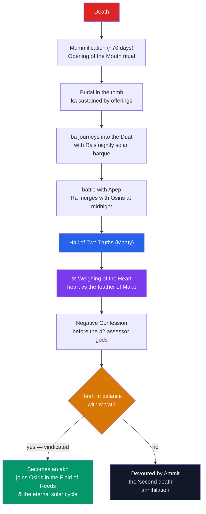

# ⚖️ The Egyptian Afterlife

> [!abstract] TL;DR
> The Egyptian afterlife is a perilous journey through the **Duat** (the netherworld) toward rebirth, modelled on the sun-god's nightly voyage. Each night **Ra** sails his barque through the twelve hours of darkness, defeats the chaos-serpent **Apep**, and at midnight **merges with Osiris** to be regenerated for dawn — and the dead hope to share that renewal. A person was not a single soul but a bundle of components: the **ka** (life-force), the **ba** (mobile personality), the **akh** (transfigured spirit — the goal), the **ren** (name), the **shut** (shadow), and the **ib** (heart), all anchored to the preserved **body**. The climactic ordeal is the **Weighing of the Heart** in the Hall of Two Truths: the heart is balanced against the **feather of Ma'at**, **Anubis** tending the scales, **Thoth** recording the verdict, **Osiris** presiding, and the monster **Ammit** waiting to devour the unjust. The dead recite the **Negative Confession** before 42 assessor gods. The guiding texts evolved from the royal **Pyramid Texts** to the **Coffin Texts** to the **Book of the Dead** ("Book of Coming Forth by Day"). **Mummification** preserved the body precisely so the ka and ba would have a home to return to.

## Intuition — analogy first

Think of dying, in the Egyptian imagination, as setting out on a **hazardous border-crossing** that requires the right **documents, passwords, and a clean audit** before you are admitted.

The **Book of the Dead** is essentially the traveller's kit: a customizable bundle of maps, phrasebooks, and legal defenses — spells to know the names of the gatekeepers, to keep your heart from betraying you, to breathe and eat in the beyond. The **Weighing of the Heart** is the border audit: your entire moral life, condensed into your heart, is placed on a scale against the standard of **ma'at** (truth and order). Pass, and you are naturalized as an eternal citizen of the realm of Osiris; fail, and you are annihilated — the dreaded "**second death**."

Two features fall out of this analogy. First, the journey is **practical**, not merely spiritual — hence the obsessive supplying of tombs with texts, food, and equipment. Second, access **democratized** over time: what began as a royal privilege (the Pyramid Texts) trickled down to nobles (Coffin Texts) and eventually to anyone who could afford a papyrus (Book of the Dead). Eternity went from a royal monopoly to a purchasable service.

---

## The Journey and the Judgment

## Key Concepts

### The Duat and the solar night journey

The **Duat** is the netherworld through which both the dead and the sun-god pass. Egyptian "underworld books" — the **Amduat** ("That Which Is in the Netherworld") and the **Book of Gates**, inscribed in New Kingdom royal tombs — chart **Ra**'s barque through the **twelve hours of the night**, past gates, demons, and the coils of the chaos-serpent **Apep** (Apophis), who must be defeated each night. At the deepest hour the sun-god **unites with the corpse of Osiris** — the merging of *ba* and body, of solar energy and inert matter — and from that union is regenerated to rise at dawn as **Khepri**. The dead person hopes to be swept up in this same nightly cycle of death and renewal, linking the afterlife directly to [[The_Egyptian_Pantheon|solar theology]].

### The components of the person

The Egyptians analyzed a human being into several distinct parts, each with its own fate at death. Reassembling and sustaining them is the whole aim of the funerary cult.

| Component | Meaning | Fate / need at death |
|---|---|---|
| **ka** | life-force / "double" | remains with the body/tomb; sustained by food offerings |
| **ba** | personality, mobility (human-headed bird) | leaves and returns to the body by night; can travel the Duat |
| **akh** | the transfigured, effective spirit | the *goal* — achieved when ka and ba unite successfully |
| **ren** | the name | must be preserved and spoken to keep one in existence |
| **shut** | the shadow | a protective aspect of the person |
| **ib** | the heart | seat of thought and character; judged at the weighing |
| **khat** | the physical body | must be preserved (mummified) as the anchor for ka and ba |

### The Weighing of the Heart

The judgment takes place in the **Hall of Two Truths** (*Maaty*). The deceased's **heart** (*ib*) is set on a great balance opposite the **feather of Ma'at**, symbol of truth and cosmic order. **Anubis** tends the scales; **Thoth**, the divine scribe, records the result; **Osiris** presides enthroned; and the composite monster **Ammit** — "**Devourer of the Dead**," part lioness, part hippopotamus, part crocodile — crouches ready to eat the heart of anyone who fails. To pass, the heart must **balance evenly** against the feather. A special **heart scarab** amulet, inscribed with **Spell 30B** of the Book of the Dead, was placed on the mummy to command the heart *not* to testify against its owner.

### Ma'at, and the Negative Confession

**Ma'at** is the central Egyptian concept of **truth, justice, cosmic order, and balance**, personified as a goddess wearing an ostrich feather. It is the order established at creation, upheld by the king, and the very standard against which the dead are measured. In the judgment scene the deceased recites the **Negative Confession** (the "**Declaration of Innocence**") of **Spell 125** — addressing 42 **assessor gods**, each governing one sin, and denying each wrong in turn ("I have not stolen… I have not killed… I have not caused pain…"). Note that it is a declaration of *innocence*, not a confession of guilt.

### Funerary texts: Pyramid Texts → Coffin Texts → Book of the Dead

The corpus of afterlife guidance evolved and steadily **democratized**:

| Text | Period | Medium | Access |
|---|---|---|---|
| **Pyramid Texts** | Old Kingdom (from the pyramid of Unas) | carved on tomb-chamber walls | king only |
| **Coffin Texts** | Middle Kingdom | painted on coffins | nobles and officials |
| **Book of the Dead** ("Book of Coming Forth by Day") | New Kingdom onward | papyrus scrolls | anyone who could pay |

The **Book of the Dead** is a collection of some 200 numbered **spells** (not a fixed book), chosen and customized per person. Famous examples include **Spell 125** (the judgment and Negative Confession), **Spell 30B** (the heart scarab), **Spell 6** (the **shabti** figurine that does the deceased's labour in the beyond), and **Spell 1** (for the funeral procession). The exquisitely illustrated **Papyrus of Ani** (c. 1250 BCE) is the best-known copy.

### Mummification and its purpose

Mummification existed to **preserve the body (khat)** as a permanent home to which the *ka* and *ba* could return — without it, the person's components would disperse and the "second death" follow. The process took about **70 days**: the internal organs were removed and stored in **four canopic jars** protected by the **Four Sons of Horus**, the body was desiccated in **natron** salt, then wrapped with protective amulets under the patronage of **Anubis**, god of embalming. Notably, the **brain was discarded** while the **heart was left in place**, because the heart — not the brain — was believed to hold intellect and character and was needed for the weighing. The **Opening of the Mouth** ritual, performed on the mummy or its coffin, magically restored the senses so the deceased could breathe, eat, speak, and act in the afterlife.

## Examples Across Cultures

- **Judgment / weighing of the dead**: The Egyptian *psychostasia* invites comparison with the **Zoroastrian** crossing of the **Chinvat Bridge**, the **Christian** Last Judgment, and the Greek judges **Minos, Rhadamanthus, and Aeacus** — though Egypt's moral audit is unusually itemized in the 42-fold confession. See [[The_Comparative_Method]].
- **The guidebook for the dead**: The Book of the Dead is often set beside the Tibetan **Bardo Thödol** (the so-called "Tibetan Book of the Dead") and the Orphic **gold tablets** buried with Greek initiates — all texts meant to instruct and protect the traveller in the beyond.
- **Solar death-and-rebirth**: The nightly union of Ra and Osiris parallels other traditions where the sun "dies" and is reborn, and connects the afterlife to the dying-and-rising pattern of [[The_Osiris_Myth]].
- **The blessed land**: The **Field of Reeds** (*Aaru*), an idealized mirror-Egypt of abundant harvests, compares with the Greek **Elysian Fields** and other paradises of ease — but it is an idealized *earth*, not a transcendent heaven.

## Common Pitfalls / Misconceptions

- **"The Book of the Dead is a single sacred book."** Its Egyptian title is the "**Book of Coming Forth by Day**," and it is a *customizable anthology* of spells that varied from copy to copy — not a fixed scripture like a Bible.
- **"Mummification aimed to preserve the body as the final destination."** The body was an **anchor**, not the goal; the aim was to give the *ka* and *ba* a home so the person could be reborn as an *akh*.
- **"The Egyptians thought with their brains."** They regarded the **heart** as the seat of mind, emotion, and morality; the brain was discarded in mummification, and it is the heart that is weighed.
- **"The Negative Confession lists the deceased's sins."** It is a **declaration of innocence** — a denial of 42 specific wrongs — not an admission of guilt.
- **"Ba and ka are just the 'soul.'"** They are distinct components with different functions; mapping them onto a single Western "soul" collapses a deliberately plural anthropology.
- **"The Field of Reeds is 'heaven.'"** It is an idealized version of the Nile valley — eternal, abundant farmland — not a non-physical paradise.

## Related Concepts

- [[_MOC_Egyptian_Myth|↑ Section MOC]] — the map of the Egyptian section
- [[The_Osiris_Myth]] — Osiris as king and judge of the dead, and the resurrection the afterlife extends to all
- [[The_Egyptian_Pantheon]] — Ra's solar voyage, Anubis, Thoth, and the gods who staff the judgment
- [[Egyptian_Creation_Myths]] — *ma'at*, the order established at creation, as the standard weighed against the heart
- Cross-vault: [[The_Comparative_Method]] — comparing judgment-of-the-dead and "guidebook" traditions
- Cross-vault: [[The_Greek_Underworld]] — a comparative afterlife with its own judges and geography

## Review Questions

1. Walk through the Weighing of the Heart: who are the divine participants, what is weighed against what, and what are the two possible outcomes? Why is the heart, specifically, the organ on the scale?
2. Distinguish the **ka**, the **ba**, and the **akh**, and explain how mummification and the funerary cult are designed to serve them. Why is calling any one of them "the soul" misleading?
3. Trace the development from the Pyramid Texts to the Book of the Dead. What does the phrase "democratization of the afterlife" mean, and what evidence supports it?

## Sources

- Taylor, J. H. (2001). *Death and the Afterlife in Ancient Egypt*. British Museum Press
- Assmann, J. (2005). *Death and Salvation in Ancient Egypt*. Cornell University Press
- Faulkner, R. O. (trans.) (1994). *The Egyptian Book of the Dead: The Book of Going Forth by Day*. Chronicle Books
- Hornung, E. (1999). *The Ancient Egyptian Books of the Afterlife*. Cornell University Press

#mythology #egyptian-mythology #afterlife #maat #book-of-the-dead
