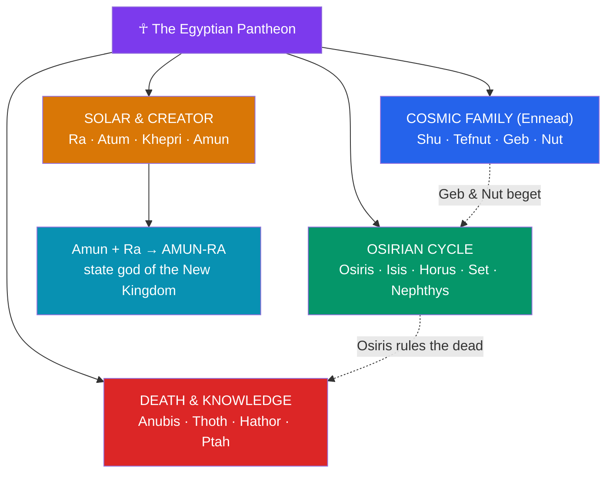

# 🌞 The Egyptian Pantheon

> [!abstract] TL;DR
> The Egyptian pantheon is not a fixed cast list but a fluid, layered, and unusually stable theological system that endured for over three millennia. At its center stands the sun-god **Ra** (Re), whose daily voyage across the sky and nightly passage through the underworld dramatize the cosmic order, **ma'at**. Around him cluster the **Heliopolitan Ennead** — the nine gods descending from the self-created **Atum** through **Shu** and **Tefnut**, **Geb** and **Nut**, to **Osiris**, **Isis**, **Set**, and **Nephthys** — plus the funerary jackal **Anubis**, the falcon kingship-god **Horus**, the ibis-headed scribe **Thoth**, the cow-goddess **Hathor**, the Memphite craftsman **Ptah**, and the "hidden" Theban god **Amun**. Egyptian theology worked by **syncretism**: gods fused their names and aspects (**Amun-Ra**, **Ptah-Sokar-Osiris**) without erasing one another. Cults were both **local** (each city's patron) and **state**-level (whichever god the reigning dynasty elevated). The famous **animal-headed** images are not literal zoomorphism but a visual shorthand for a deity's powers.

## Intuition — analogy first

Do not picture the Egyptian gods as a fixed pantheon in the Greek mould — a defined roster with stable biographies. Picture instead a **language of overlapping roles**.

One and the same sun is called **Khepri** ("the becoming one," a scarab) at dawn, **Ra** at noon, and **Atum** ("the complete one") at dusk — three names for three phases of a single reality, the way one person is "parent," "employee," and "citizen" depending on the moment. And when the god of a rising city needed to share in the sun's supremacy, Egyptian theology did not choose between them; it **merged** them into **Amun-Ra**, the way two firms form a coalition while both brand names survive. Nothing is deleted; aspects are layered.

This is why counting the "number of Egyptian gods" is the wrong question, just as counting the fixed meanings of a rich word is. The pantheon is a **combinatorial** system for expressing power, place, and phase — a point the physicist-turned-Egyptologist would recognize as complementary models of one phenomenon. Hold that flexibility in mind and the seeming contradictions of Egyptian religion resolve into method.

---

## How the Pantheon Is Organized

## Key Concepts

### Ra and the solar theology

**Ra** (or **Re**) is the sun-god and, for much of Egyptian history, the head of the pantheon and the model for kingship — pharaohs styled themselves "**Son of Ra**." Solar theology is fundamentally about **cycle**: each day the sun is born, matures, ages, and dies, only to be reborn. The Egyptians expressed this as three names — **Khepri** the scarab at sunrise, **Ra** at midday, **Atum** at sunset — and depicted the sun travelling in the **solar barque** (the *mandjet* by day, the *mesektet* by night). By night Ra sails through the **Duat**, the underworld, where he must nightly defeat the chaos-serpent **Apep** (Apophis) and, at the midnight hour, merges with the mummified **Osiris** to be regenerated. This daily victory of light over chaos is the visible guarantee of **ma'at**, the cosmic order.

### The Heliopolitan Ennead

The priests of **Heliopolis** (Egyptian *Iunu*, "the pillar") systematized the major gods into the **Ennead** — the group of nine descending from the creator by successive generations. It is the genealogical spine of the pantheon.

| Generation | Deity | Element / domain |
|---|---|---|
| Creator | **Atum** (later **Ra-Atum**) | the self-created sun; the primeval "all" |
| 1st | **Shu** & **Tefnut** | air/dryness & moisture |
| 2nd | **Geb** & **Nut** | earth & sky |
| 3rd | **Osiris**, **Isis**, **Set**, **Nephthys** | kingship/death, magic, chaos, mourning |

The son of Osiris and Isis, **Horus**, completes the drama as the tenth figure and the archetype of the living king. Because the Ennead was a Heliopolitan construct, other cities offered rival counts and members — the system was authoritative but never exclusive.

### The Osirian family and the funerary gods

The second-generation quartet drives Egypt's central narrative (see [[The_Osiris_Myth]]). **Osiris** is the murdered king who becomes lord of the dead; **Isis**, his sister-wife, is the "great of magic" (*weret-hekau*) who revives him and protects their son; **Set** is his fratricidal brother, god of the desert, storms, and disorder — but *not* a simple devil, for he also stands in Ra's barque to spear Apep each night; **Nephthys** is the sister who mourns and protects the dead. To this family attaches **Anubis** (Egyptian *Inpu*), the jackal-headed god of embalming and the necropolis, and **Thoth**, who often adjudicates their disputes.

### Thoth, Hathor, Ptah — wisdom, love, and craft

- **Thoth** (Egyptian *Djehuty*), ibis-headed or baboon-formed, is the god of **writing, wisdom, mathematics, and time**, scribe and arbiter of the gods, and recorder at the judgment of the dead. The Greeks equated him with **Hermes**, later producing the mystical figure of **Hermes Trismegistus**.
- **Hathor**, depicted as a cow or a woman with cow's horns and sun-disc, is goddess of **love, music, joy, motherhood, and the sky**; she is also a nurse to the king and can turn ferocious as the "Eye of Ra."
- **Ptah** of **Memphis** is the patron of **craftsmen and creation-by-word** (see [[Egyptian_Creation_Myths]]); his high priest bore the title "Greatest of Directors of Craftsmen."

### Amun, syncretism, and the politics of cult

Egyptian theology's signature move is **syncretism** — the fusion of two deities into a compound god that retains both. When **Thebes** rose to national power in the Middle and New Kingdoms, its once-local "hidden one," **Amun**, fused with the old sun-god to become **Amun-Ra**, "King of the Gods," whose vast temple at Karnak dominated state religion. Other fusions include **Ptah-Sokar-Osiris** (craft + necropolis + resurrection) and **Ra-Horakhty** ("Ra-Horus of the Two Horizons"). This is layering, not monotheism.

The brief exception proves the rule: under **Akhenaten** (18th Dynasty), the king suppressed the pantheon in favour of the sole solar disc, the **Aten** — a radical, unpopular experiment that was reversed after his death, restoring Amun and the traditional gods. Egyptian religion was thus normally **local *and* state**: every town kept its patron (Sobek at Kom Ombo, Khnum at Elephantine, Neith at Sais) even as the crown promoted a national head-god.

### Animal-headed iconography and what it means

The **hybrid** human-animal image is a hieroglyph in paint and stone: the animal signals the god's essential power, not a belief that the god *is* an animal.

| Deity | Iconographic animal | What it signals | Chief cult center |
|---|---|---|---|
| **Ra** | falcon / sun-disc | the blazing, far-seeing sun | Heliopolis |
| **Anubis** | jackal | scavenger of the desert edge → guardian of tombs | Cynopolis |
| **Thoth** | ibis / baboon | the moon's crescent bill; keen intelligence | Hermopolis |
| **Horus** | falcon | the soaring sky-king; sun and moon as his eyes | Edfu, Nekhen |
| **Hathor** | cow | nurturing fertility and motherhood | Dendera |
| **Sekhmet** | lioness | the scorching, plague-bringing fury of the sun | Memphis |
| **Sobek** | crocodile | the fearsome power of the Nile | Crocodilopolis, Kom Ombo |

## Examples Across Cultures

- **Solar high-gods**: Egypt's Ra invites comparison with Greek **Helios**/**Apollo**, Vedic **Sūrya**, and Mesopotamian **Shamash** — but Egypt is unusual in making the *cyclical death and rebirth* of the sun, not merely its brilliance, the theological centrepiece.
- **Interpretatio graeca**: Greek and Roman visitors mapped Egyptian gods onto their own — **Thoth → Hermes**, **Amun → Zeus** (worshipped at the oracle of **Siwa**, which Alexander consulted), **Hathor/Isis → Aphrodite/Demeter**, **Horus → Apollo**. This cross-identification is itself a case study for [[The_Comparative_Method]].
- **Anthropomorphic contrast**: where the Egyptians used animal-headed hybrids to *encode* divine function, the Greeks preferred fully human gods, a difference ancient authors like Herodotus already remarked upon.
- **Aten and later monotheisms**: Akhenaten's short-lived exclusive sun-cult is often discussed comparatively with the emergence of monotheism, though direct historical influence remains speculative and contested.

## Common Pitfalls / Misconceptions

- **"The pantheon is a fixed list."** It is a fluid, combinatorial system; the same god has many names, forms, and fusions, and local rosters differ. Trying to draw one definitive family tree misrepresents the theology.
- **"Syncretism means monotheism."** Amun-Ra is not a step toward one God; it is two gods layered while both persist. Only Akhenaten's Atenism approached genuine exclusivity, and it failed.
- **"Egyptians worshipped animals."** The animal head is symbolic shorthand for a deity's powers; the god is not the beast. Sacred animals could *represent* a god, but the theology is not literal zoolatry.
- **"Set is the Egyptian devil."** Set is the god of disorder and Osiris's murderer, yet he is also a necessary defender of Ra against the true enemy, Apep. His demonization hardened only in later periods.
- **"Ra was always supreme."** Headship shifted with politics — Ra at Heliopolis, Ptah at Memphis, Amun-Ra at Thebes, the Aten under Akhenaten. Supremacy tracked which city held power.

## Related Concepts

- [[_MOC_Egyptian_Myth|↑ Section MOC]] — the map of the Egyptian section
- [[The_Osiris_Myth]] — the divine family of the Ennead in narrative action
- [[Egyptian_Creation_Myths]] — how Atum, the Ogdoad, and Ptah each generate the gods
- [[The_Egyptian_Afterlife]] — where Ra, Osiris, Anubis, and Thoth reappear as powers over the dead
- Cross-vault: [[The_Comparative_Method]] — syncretism and *interpretatio graeca* as test cases for comparing pantheons

## Review Questions

1. Explain how the three names Khepri, Ra, and Atum express a single theology of the sun. Why does this make "how many Egyptian gods are there?" a misleading question?
2. Define syncretism using **Amun-Ra** as your worked example. Why is it a mistake to read syncretism as a move toward monotheism, and how does Akhenaten's Atenism sharpen the contrast?
3. What is the difference between a *local* cult and a *state* cult in ancient Egypt, and how did the political rise of Thebes reshape the pantheon's hierarchy?

## Sources

- Wilkinson, R. H. (2003). *The Complete Gods and Goddesses of Ancient Egypt*. Thames & Hudson
- Hornung, E. (1982). *Conceptions of God in Ancient Egypt: The One and the Many*. Cornell University Press
- Pinch, G. (2002). *Egyptian Mythology: A Guide to the Gods, Goddesses, and Traditions of Ancient Egypt*. Oxford University Press
- Assmann, J. (2001). *The Search for God in Ancient Egypt*. Cornell University Press

#mythology #egyptian-mythology #pantheon #ra #syncretism
