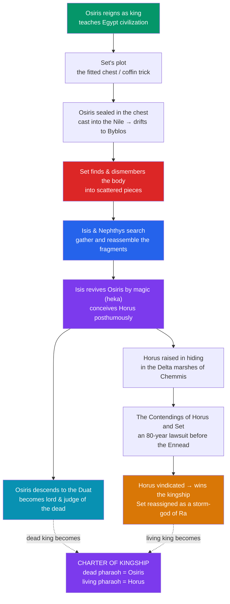

# 👑 The Osiris Myth

> [!abstract] TL;DR
> The Osiris myth is the central narrative of Egyptian religion and the charter for both **divine kingship** and **personal resurrection**. **Osiris**, a wise king, is murdered by his jealous brother **Set**, who seals him in a fitted chest and later dismembers the body into pieces scattered across Egypt. His sister-wife **Isis**, aided by **Nephthys**, gathers the fragments, reassembles him, and by her magic (*heka*) revives him just enough to conceive their son **Horus**. Osiris does not return to earthly life; instead he descends to the **Duat** to become lord and judge of the dead. Horus, raised in hiding, grows up to challenge Set for the throne in a long lawsuit before the divine tribunal — **the Contendings of Horus and Set** — and is finally vindicated as rightful king. The living pharaoh is therefore **Horus**; the dead pharaoh becomes **Osiris**. No single ancient Egyptian text tells the whole story; our fullest connected narrative is the Greek treatise **Plutarch's *De Iside et Osiride*** (1st–2nd c. CE), supplemented by the Pyramid Texts and the New Kingdom papyrus of the *Contendings*.

## Intuition — analogy first

Think of the Osiris myth as Egypt's **constitutional founding story** — a narrative doing two jobs at once, the way a nation's origin myth both legitimizes the government *and* consoles the citizen.

Politically, it answers "**why does the king rule, and how does power pass legitimately?**" The rightful heir Horus wins the throne from the usurper Set by legal vindication, so every reigning pharaoh *is* Horus, the living son who has inherited his father's kingdom. Existentially, it answers "**what happens when I die?**" Osiris is killed yet made whole and enthroned over eternity, so every dead person hopes to "become an Osiris," reassembled and reborn.

That double duty is why one story could anchor an entire civilization for three thousand years. It is also why the myth is best read not as a single tale but as a **legal-theological machine**: a murder mystery whose resolution is a courtroom verdict, and a death whose sequel is a coronation in the world beyond.

---

## The Arc of the Myth

## Key Concepts

### The murder and the dismemberment

In Plutarch's connected account, **Set** (whom he calls **Typhon**) plots against his brother by having a beautiful chest built to Osiris's exact measurements, then promising it at a banquet to whoever fits it perfectly. When Osiris lies down inside, the conspirators slam and seal the lid and cast the chest into the **Nile**, where it drifts out to sea and lodges in a tamarisk tree at **Byblos** on the Levantine coast. Isis recovers it, but Set discovers the body, cuts it into pieces (Plutarch says **fourteen**), and scatters them throughout Egypt. Egyptian sources emphasize the *scattering* and the many local shrines that each claimed to hold a relic of the god — a mythic charter for a nationwide cult.

### Isis, magic, and the posthumous conception

**Isis**, "great of magic" (*weret-hekau*), with her sister **Nephthys**, searches out the fragments and reassembles the body — the mythic prototype of **mummification**. Famously, the one part she cannot recover is the phallus, eaten by a Nile fish, so she fashions a replacement. Using her spells she revives Osiris just enough to conceive a son. She then hides in the papyrus marshes of **Chemmis** in the Delta to bear and protect the infant **Horus** (as a child, "**Harpocrates**," Horus-the-child) from Set. The image of Isis nursing the infant Horus (*Isis lactans*) became one of the most enduring in the ancient world.

### Osiris, lord of the Duat

Crucially, the revived Osiris does **not** resume his reign among the living. He passes into the **Duat** to rule as king and judge of the dead, presiding over the [[The_Egyptian_Afterlife|weighing of the heart]]. This is the point most often flattened in retellings: Osiris's "resurrection" is a transfiguration into ruler of the *other* world, not a return to this one — a distinction that matters greatly for comparison with other traditions.

### The Contendings of Horus and Set

Once grown, **Horus** claims his father's throne, and the dispute becomes a protracted lawsuit before the **Ennead** presided over by **Ra**, adjudicated by **Thoth**. The New Kingdom *Contendings of Horus and Set* (Papyrus Chester Beatty I, ~20th Dynasty) preserves a vivid, sometimes bawdy and comic version: the tribunal drags on **eighty years**; the contestants transform into hippopotami; Set gouges out Horus's eye (the **wedjat**, later a great protective amulet), which is healed by Thoth or Hathor; and a crude contest over sexual dominance is resolved in Horus's favour by a trick of Isis. Finally the gods award the kingship to **Horus** as the legitimate heir, while **Set** is compensated — often reassigned to the sky as a storm-god who accompanies Ra.

### Divine kingship and resurrection: the double charter

| Role | Living king | Dead king / deceased |
|---|---|---|
| Identity | **Horus**, the victorious heir | **Osiris**, the transfigured father |
| Myth-function | legitimizes succession and rule | promises reassembly and rebirth |
| Ritual echo | coronation as Horus | funeral as "becoming an Osiris" |
| Guarantor | vindication before the Ennead | judgment before Osiris in the Duat |

### Where the story comes from

There is **no single continuous Egyptian narrative** of the whole myth. Egyptologists reconstruct it from allusions in the **Pyramid Texts** and **Coffin Texts**, hymns such as the **Great Hymn to Osiris** (the stela of Amenmose, 18th Dynasty), the **Contendings** papyrus, and ritual laments. The one full, connected story is **Plutarch's** Greek essay *De Iside et Osiride*, which is late, interpretive, and Hellenized — invaluable but not a transparent window onto pharaonic belief.

## Primary Sources & Examples

- **Plutarch, *De Iside et Osiride*** (c. 100 CE): the fullest narrative, but written for a Greek philosophical audience; it Hellenizes names (Typhon for Set, Aroueris for Horus the Elder) and moralizes the tale allegorically.
- **Pyramid Texts** (Old Kingdom): the oldest allusions, already assuming Osiris's murder and Horus's avenging role; here the *dead king* is explicitly identified with Osiris.
- **The Contendings of Horus and Set** (Papyrus Chester Beatty I, New Kingdom): the courtroom drama, comic and detailed, showing the myth as a live literary tradition.
- **Comparative — the dying-and-rising motif**: J. G. Frazer grouped Osiris with **Adonis**, **Attis**, **Tammuz/Dumuzi**, and **Dionysus** as "dying-and-rising gods." Later scholars (notably Jonathan Z. Smith) caution that Osiris "rises" only to rule the dead, not to walk the earth again — a warning against loose parallels. See [[The_Comparative_Method]].
- **Comparative — the fratricide/succession motif**: Set's murder of his brother invites comparison with **Cain and Abel** and other fraternal-conflict myths, though the Egyptian version is fundamentally about *kingship*, not moral origin.

## Common Pitfalls / Misconceptions

- **"Osiris comes back to life like a returning hero."** He is revived only enough to conceive Horus and is then enthroned in the underworld; he does not resume earthly life. Equating this with bodily resurrection in later religions ignores the crucial difference.
- **"Plutarch = the Egyptian myth."** Plutarch is a late Greek source, philosophically reworked. Treating his tidy narrative as *the* Egyptian version conflates Roman-era interpretation with pharaonic belief.
- **"Set is simply evil."** In the Osiris cycle Set is the murderer and usurper, yet elsewhere he is the necessary defender of Ra's barque against Apep. His character darkened over time; it was not fixed from the start.
- **"The fourteen pieces are canonical."** The number and details of the dismemberment vary by source; Plutarch's figure is one tradition, and Egyptian texts stress the *scattering* and the many relic-shrines more than a fixed count.
- **"It's a single ancient story."** No continuous Egyptian text tells it whole; the "myth" is a modern synthesis of scattered allusions plus Plutarch.

## Related Concepts

- [[_MOC_Egyptian_Myth|↑ Section MOC]] — the map of the Egyptian section
- [[The_Egyptian_Pantheon]] — Osiris, Isis, Set, Horus, and Nephthys within the wider family of gods
- [[The_Egyptian_Afterlife]] — Osiris as judge of the dead and the resurrection the myth promises
- [[Egyptian_Creation_Myths]] — how the Ennead that judges the Contendings is itself generated
- Cross-vault: [[The_Comparative_Method]] — the "dying-and-rising god" category and the caution against overgeneralizing it

## Review Questions

1. Explain the sense in which the Osiris myth is simultaneously a charter for kingship *and* a charter for resurrection. Who is Horus in this scheme, and who is Osiris?
2. In what specific ways does Osiris's "resurrection" differ from a return to earthly life, and why does this matter for placing Osiris in Frazer's "dying-and-rising god" category?
3. Describe the source problem for the Osiris myth. Why must we rely on Plutarch for the connected narrative, and what are the risks of doing so?

## Sources

- Griffiths, J. G. (1970). *Plutarch's De Iside et Osiride* (edition, translation, commentary). University of Wales Press
- Pinch, G. (2002). *Egyptian Mythology: A Guide to the Gods, Goddesses, and Traditions of Ancient Egypt*. Oxford University Press
- te Velde, H. (1977). *Seth, God of Confusion*. Brill
- Assmann, J. (2005). *Death and Salvation in Ancient Egypt*. Cornell University Press

#mythology #egyptian-mythology #osiris #kingship #resurrection
