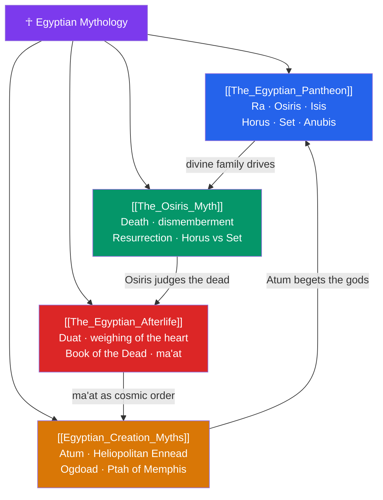

# ☥ Egyptian Mythology — Map of Content

> [!abstract] What This Section Covers
> Ancient Egyptian religion sustained a remarkably stable mythic world for over three thousand years, organized around cosmic order (*ma'at*), divine kingship, and an elaborate hope for life beyond death. This section introduces **The Egyptian Pantheon** — the sun-god Ra, the divine family of Osiris, Isis, Horus, and Set, and the jackal-headed Anubis — then centers on **The Osiris Myth**, the story of the murdered and resurrected king whose son Horus battles Set for the throne, a narrative that underwrote both kingship and the promise of rebirth. **Egyptian Creation Myths** survey the competing cosmogonies of Heliopolis (Atum and the Ennead), Hermopolis (the Ogdoad), and Memphis (Ptah), while **The Egyptian Afterlife** follows the soul through the Duat, the weighing of the heart against the feather of ma'at, and the guidance of the Book of the Dead. Together they show a mythology obsessed with order, resurrection, and eternity.

## Concept Map

## Learning Path

1. [[The_Egyptian_Pantheon]] — The major gods and their roles: solar Ra, the Osirian family, and the guardians of the dead.
2. [[Egyptian_Creation_Myths]] — Three cosmogonies (Heliopolis, Hermopolis, Memphis) and how Egypt held them side by side.
3. [[The_Osiris_Myth]] — Murder by Set, Isis's search, resurrection, and the contendings of Horus and Set.
4. [[The_Egyptian_Afterlife]] — The journey through the Duat, the judgment hall, and the funerary texts that guided it.

## All Notes at a Glance

| Note | Difficulty | What You'll Learn |
|------|------------|-------------------|
| [[The_Egyptian_Pantheon]] | Beginner | Ra, Osiris, Isis, Horus, Set, Anubis, Thoth, Hathor; syncretism and local cults |
| [[The_Osiris_Myth]] | Intermediate | Set's murder of Osiris, Isis and the dismembered body, Horus's conception, the contendings for the throne |
| [[Egyptian_Creation_Myths]] | Intermediate | Atum and the Ennead, Nun the primordial waters, the Ogdoad, Ptah's creative word |
| [[The_Egyptian_Afterlife]] | Intermediate | The Duat, weighing of the heart, Ammit, ma'at, mummification, Book of the Dead spells |

## Key Questions This Section Answers

- How did the Osiris myth make Egyptian kingship and personal resurrection two sides of one story?
- Why did Egypt tolerate several contradictory creation accounts at once?
- What was "ma'at," and why was it weighed against the heart at death?
- What roles did Isis, Set, and Anubis play in the drama of death and rebirth?
- How did the Book of the Dead function as a practical guide for the deceased?

## Related Sections

- [[_MOC_Mythology_Master|↑ Mythology Master MOC]]
- [[_MOC_Mesopotamian_Myth|← Mesopotamian]]
- [[_MOC_Greek_Myth|→ Greek]]
- Cross-vault: [[Creation_and_Flood_Myths]], [[The_Greek_Underworld]] (comparative afterlife)

#MOC #Mythology #EgyptianMyth
