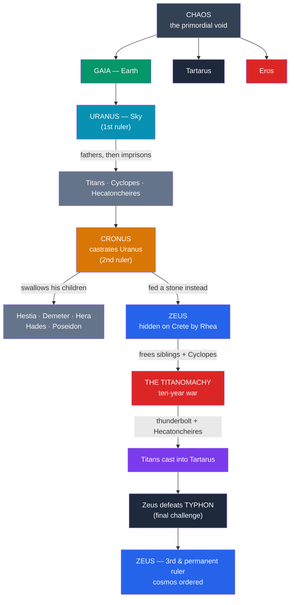

# 🌌 Greek Creation and the Titanomachy

> [!abstract] TL;DR
> The Greek origin story is told above all in **Hesiod's *Theogony*** (c. 700 BCE). First comes **Chaos** (a yawning void), then **Gaia** (Earth), **Tartarus** (the abyss), and **Eros** (desire). Gaia bears **Uranus** (Sky), who lies upon her and fathers the **Titans**, the **Cyclopes**, and the **Hecatoncheires** — but Uranus imprisons his monstrous children inside Gaia. At her prompting, the Titan **Cronus castrates Uranus** with an adamantine sickle, taking power. Warned that his own child will overthrow him, Cronus **swallows each of his children** at birth; his wife **Rhea hides the infant Zeus** on Crete and gives Cronus a **stone** to swallow instead. Grown, **Zeus forces Cronus to disgorge** his siblings and leads the **Titanomachy**, a **ten-year war** of Olympians against Titans, won with the freed Cyclopes' **thunderbolt** and the hundred-handed Hecatoncheires. Zeus then defeats the monster **Typhon** and (in later art) the giants in the **Gigantomachy**, securing the cosmos. The three-generation pattern — Uranus → Cronus → Zeus, each son deposing his father — is the **succession myth**, closely paralleled in the Near East (the Babylonian [[The_Comparative_Method|Enuma Elish]] and the Hittite *Kingship in Heaven*).

## Intuition — analogy first

Greek cosmogony is not a single act of creation but a **series of coups** — a dynasty in which each generation of rulers is violently replaced by its own children.

Imagine a monarchy where every king knows a prophecy: *your child will destroy you.* The first king (Uranus) responds by locking his children away; he is castrated and toppled. The second king (Cronus) responds by swallowing his children whole; he is tricked and toppled. Only the third king (Zeus) breaks the cycle — not by suppressing the next generation, but by **defeating the previous one so completely** that his order becomes permanent. Read this way, the *Theogony* is a story about how the universe moved from raw, formless force toward **stable, articulated order** — from a castrating sky-god to a king who parcels out honors, offices, and law. The violence is the point: cosmos (order) is wrung out of chaos through conflict, and Zeus's reign is legitimate precisely because it *ended* the succession of coups. See [[The_Comparative_Method]] for why this same plot recurs across the ancient Near East.

---

## The Succession of Divine Kings

## Key Concepts

### From Chaos to the first gods

Hesiod's cosmos begins not with nothing but with **Chaos** — from the Greek *kháos*, a "gap" or "yawning void," not our modern sense of disorder. Then arise, apparently spontaneously, **Gaia** (Earth, the stable seat of all things), **Tartarus** (the deep abyss beneath the earth), and **Eros** (Desire, the force that will drive all subsequent begetting). Gaia produces **Uranus** (Sky) as her equal and covering, along with the Mountains and **Pontus** (Sea). These are not persons with biographies so much as **cosmic regions personified** — the poem is simultaneously a genealogy and a map of the universe's structure.

### Uranus, the Titans, and the sickle

Gaia and Uranus mate and produce three sets of children:

| Offspring | Number / Nature | Fate under Uranus |
|---|---|---|
| **The Titans** | Twelve elder gods (incl. **Cronus**, **Rhea**, **Oceanus**, **Tethys**, **Hyperion**, **Iapetus**, **Themis**, **Mnemosyne**) | Free, but their siblings are suppressed |
| **The Cyclopes** | Three one-eyed smiths (Brontes, Steropes, Arges) | Imprisoned inside Gaia |
| **The Hecatoncheires** | Three hundred-handed, fifty-headed giants | Imprisoned inside Gaia |

Uranus hates and hides his monstrous children back inside Gaia's body, causing her agony. She fashions a great **adamantine sickle** and asks her sons to act; only the youngest Titan, **Cronus**, dares. As Uranus descends to lie with Gaia, Cronus **castrates his father** and throws the genitals into the sea — from the bloody foam (*aphros*) rises **Aphrodite**, and from the drops of blood on the earth spring the **Erinyes** (Furies), the **Giants**, and the ash-tree nymphs. Cronus becomes the second ruler of the cosmos.

### Cronus, Rhea, and the swallowed children

Cronus marries his sister **Rhea** and fathers the first Olympians: **Hestia, Demeter, Hera, Hades, Poseidon**, and finally **Zeus**. But Gaia and Uranus have prophesied that Cronus, too, is fated to be overthrown by his own son. He therefore **swallows each child** as it is born. Desperate, Rhea appeals to Gaia and Uranus, and when Zeus is born she hides him in a cave on **Mount Ida (or Dikte) in Crete**, giving Cronus a **stone wrapped in swaddling clothes** to swallow in the baby's place. The infant Zeus is nursed in secret (later tradition adds the goat **Amalthea** and the noise-making **Kouretes** who drown out his cries).

### The Titanomachy — the ten-year war

Grown to strength, Zeus forces Cronus to **vomit up** the swallowed children (and the stone, later set at Delphi as the *omphalos*). Zeus then leads the young gods in the **Titanomachy**, a war fought from **Mount Olympus** against the Titans entrenched on **Mount Othrys**. On Gaia's advice Zeus frees the imprisoned **Cyclopes**, who forge his signature weapon — the **thunderbolt** — and the **Hecatoncheires**, whose hundred hands hurl three hundred boulders at once. After **ten years**, the Titans are crushed and **cast down into Tartarus**, guarded by the hundred-handers, as far below earth as earth is below the sky. Not all Titans opposed Zeus: **Themis** and **Prometheus** (a second-generation Titan) side with the Olympians, and figures like **Oceanus** stay neutral.

### Typhon and the Gigantomachy

Zeus's rule faces two further challenges that finalize the cosmic order:

- **Typhon (Typhoeus)** — Gaia's last and most terrible child by Tartarus, a hundred-headed storm-monster who nearly unseats Zeus. In Hesiod, Zeus blasts him with thunderbolts and buries him under **Mount Etna**, whose eruptions are Typhon's fury. This is the true climax of the *Theogony*: the final defeat of chaos.
- **The Gigantomachy** — a separate battle (prominent in later poetry and art, e.g., the **Pergamon Altar**) in which the **Giants**, born from Uranus's blood, storm Olympus and are defeated by the gods with the decisive help of a **mortal**, **Heracles** — establishing that heroes are needed to complete the divine victory. See [[Greek_Heroes_and_Their_Quests]].

### The succession myth and Near Eastern parallels

The plot's spine — **three generations of sky/storm kings, each son violently supplanting his father** (Uranus → Cronus → Zeus) — is the **succession myth**, and it is not uniquely Greek:

- **Babylonian *Enuma Elish***: the young storm-god **Marduk** defeats the primordial sea-goddess **Tiamat** and organizes the cosmos, winning kingship over the older gods — a parallel to Zeus's rise. See [[The_Comparative_Method|Enuma_Elish]].
- **Hittite *Kingship in Heaven***: a strikingly close analogue in which **Anu** (Sky) is castrated by **Kumarbi**, who swallows something and is in turn displaced by the storm-god **Teshub** — the same castration-and-swallowing motifs as in Hesiod.

The tightness of these parallels (castration of the sky-god, swallowing of offspring, a storm-god's final victory) is a classic case study in **diffusion versus independent invention**: most scholars now accept significant Near Eastern influence on Hesiod, transmitted through the eastern Mediterranean. See [[The_Comparative_Method]].

## Primary Sources & Examples

- **Hesiod, *Theogony***: the master text — Chaos and Gaia (116–138), the castration of Uranus and birth of Aphrodite (154–206), the swallowing of the children and the Cretan stone (453–500), the Titanomachy (617–735), and the Typhon battle (820–880).
- **The stone at Delphi**: Pausanias (*Description of Greece* 10.24) reports that visitors were shown the very **stone** Cronus swallowed and disgorged, kept at Delphi and anointed daily — myth made tangible.
- **The Pergamon Altar** (2nd century BCE): its great frieze depicts the **Gigantomachy** in high relief, the most famous visual rendering of gods versus giants.
- **The Hittite *Song of Kumarbi***: cuneiform tablets recovered at Hattusa preserve the castration-and-succession sequence that most closely mirrors Hesiod.

## Common Pitfalls / Misconceptions

- **"Chaos means disorder."** In Hesiod, *kháos* is a **gap or void** — the primordial opening — not a swirling mess. The modern meaning is a later development.
- **"Titans and Giants are the same thing."** They are **distinct** races with distinct wars: the **Titanomachy** (Olympians vs. Titans) and the **Gigantomachy** (gods vs. Giants) are different conflicts, often confused because both pit the Olympians against an older, monstrous power.
- **"Cronus is the same as Chronos (Time)."** The Titan **Cronus** (*Krónos*) and the personification of time **Chronos** (*Chrónos*) are different figures whose names were later conflated, giving us the anachronistic image of Cronus/Saturn as "Father Time."
- **"All Titans opposed Zeus."** Several did not: **Themis**, **Prometheus**, and others aided or stayed neutral toward the Olympians, and Zeus later honored them.
- **"The Greeks invented the whole story from scratch."** The succession pattern has strong **Near Eastern antecedents** (Hittite, Babylonian); the *Theogony* participates in a shared eastern-Mediterranean tradition rather than existing in isolation.

## Related Concepts

- [[_MOC_Greek_Myth|↑ Section MOC]] — the map of the whole Greek section
- [[The_Twelve_Olympians]] — the victorious gods whose reign the Titanomachy establishes
- [[Greek_Heroes_and_Their_Quests]] — the age of heroes that follows the ordering of the cosmos; Heracles is decisive in the Gigantomachy
- [[The_Greek_Underworld]] — **Tartarus**, the prison of the Titans, lies at the base of this cosmos
- [[The_Comparative_Method]] — the diffusion-vs-invention question raised by the Near Eastern parallels
- Cross-vault: [[Enuma_Elish]] — the Babylonian succession/combat myth; [[_MOC_Mesopotamian_Myth|Mesopotamian]] — the wider Near Eastern context

## Review Questions

1. Trace the three-generation succession from Uranus to Zeus. What does each ruler do to try to prevent being overthrown, and why does only Zeus succeed in ending the cycle?
2. Distinguish the **Titanomachy** from the **Gigantomachy** and from the **Typhon** episode. What role do the Cyclopes, the Hecatoncheires, and (later) Heracles play in securing Zeus's order?
3. Summarize the parallels between Hesiod's succession myth and the Hittite *Kingship in Heaven* / Babylonian *Enuma Elish*. Why do scholars treat this as evidence for diffusion rather than coincidence? (See [[The_Comparative_Method]].)

## Sources

- Hesiod. *Theogony* (trans. M. L. West, 1988; Greek ed. West, 1966). Oxford University Press
- West, M. L. (1997). *The East Face of Helicon: West Asiatic Elements in Greek Poetry and Myth*. Oxford University Press
- Caldwell, R. (1987). *Hesiod's Theogony* (translation and commentary). Focus Classical Library
- Gantz, T. (1993). *Early Greek Myth: A Guide to Literary and Artistic Sources*. Johns Hopkins University Press

#mythology #greek-mythology #cosmogony #titanomachy #succession-myth
