# ⚔️ Greek Heroes and Their Quests

> [!abstract] TL;DR
> Between the age of the gods and the age of ordinary mortals, Greek myth places the **age of heroes** — the *hēmítheoi* ("**demigods**"), usually the offspring of a god and a mortal, who perform monster-slaying **quests** at the edges of the civilized world. The paradigm is **Heracles** (Roman **Hercules**), son of Zeus and Alcmene, whose **Twelve Labors** — imposed as penance and set by **King Eurystheus** — carry him from the Nemean Lion to the theft of Cerberus from the underworld. Other great quest-heroes are **Perseus**, who beheads the Gorgon **Medusa** with gifts from the gods and rescues **Andromeda**; **Theseus**, who slays the **Minotaur** in the Cretan Labyrinth with **Ariadne's** thread; **Jason**, who leads the **Argonauts** to win the **Golden Fleece** with the sorceress **Medea's** help; and **Bellerophon**, who tames the winged horse **Pegasus** and kills the **Chimera**. Their careers share a recurring arc — divine birth, a call to a seemingly impossible task, supernatural aid, a threshold trial, and a costly return — the pattern later abstracted by Joseph Campbell as the **[[The_Heros_Journey|hero's journey]]**. Heroes received **cult worship** at their tombs and were the raw material of Greek tragedy and epic.

## Intuition — analogy first

A Greek hero is best understood as a **bridge figure** standing between two worlds that ordinarily cannot touch: the divine and the human.

Think of the demigod as a **prototype run at superhuman scale** — a being with one foot in each realm, sent to do the work neither pure gods nor ordinary mortals can. Gods are immortal and cannot truly risk anything; ordinary humans are too weak to face a Hydra or a Gorgon. The hero, born of both, is strong enough to attempt the impossible yet mortal enough for it to *cost* something — and it always does. Heracles gains immortality only after a life of servitude, murder, and agony; Theseus wins the labyrinth but loses Ariadne and, through carelessness, his father; Bellerophon's triumphs curdle into fatal arrogance. The quest is the mechanism that tests this bridge: a monster or a treasure at the world's edge, a set of tasks, and a return that transforms (or destroys) the hero. This is why Greek heroes are not simply "strong men" but **religious and tragic figures** — their stories map the narrow, dangerous space between mortality and the gods. The abstract shape of that space is the subject of [[The_Heros_Journey]].

---

## The Anatomy of a Heroic Quest

```mermaid
graph LR
    Birth["DIVINE / NOBLE BIRTH\ngod + mortal parent\noften a threatened infant"] --> Call["THE CALL\nimpossible task imposed\n(Eurystheus, an oracle, a king)"]
    Call --> Aid["SUPERNATURAL AID\ngifts & guides\n(Athena, Hermes, Ariadne, Medea)"]
    Aid --> Trial["THE TRIAL\nmonster / labyrinth / far frontier\n(Hydra, Medusa, Minotaur, Fleece)"]
    Trial --> Return["THE RETURN\nprize won, order restored"]
    Return --> Cost["THE COST\ndeath, exile, madness, or hubris\n(Heracles' pyre · Bellerophon's fall)"]

    Cost -.->|"honored after death"| Cult["HERO CULT\nworship at the tomb"]

    style Birth fill:#2563eb,color:#fff
    style Call fill:#d97706,color:#fff
    style Aid fill:#059669,color:#fff
    style Trial fill:#dc2626,color:#fff
    style Return fill:#7c3aed,color:#fff
    style Cost fill:#1e293b,color:#fff
    style Cult fill:#0891b2,color:#fff
```

## Key Concepts

### The demigod and the age of heroes

Hesiod's *Works and Days* places a **race of heroes** — "a godly race of hero-men who are called demigods" — between the Bronze and Iron ages of humanity, nobler and more just than the men who followed. Most heroes have a **divine parent** (Zeus fathers Heracles and Perseus; Poseidon and Aegeus both claim Theseus) and are marked from birth by **danger and prophecy**: the infant is exposed, hunted, or born to a mother imprisoned to thwart an oracle. They are **mortal** — a crucial limit — though a few (Heracles, and by some accounts Dionysus's mother Semele) are exceptionally deified. After death, heroes were the objects of **hero cult** (*hērōon*): local worship at a tomb, where the powerful dead were thought to protect their city.

### Heracles and the Twelve Labors

**Heracles**, son of **Zeus** and **Alcmene**, is the pan-Hellenic hero — worshipped everywhere, claimed by many cities. Persecuted from birth by a jealous **Hera** (who sends serpents to his cradle), he is later driven **mad by Hera** and kills his own wife **Megara** and their children. As penance, the **Delphic oracle** orders him to serve his cousin **King Eurystheus** of Tiryns/Mycenae and perform a set of labors — canonically **twelve**:

| # | Labor | Location | Notable detail |
|---|---|---|---|
| 1 | Slay the **Nemean Lion** | Nemea | Impervious hide; he wears its pelt thereafter |
| 2 | Slay the **Lernaean Hydra** | Lerna | Two heads regrow for one; cauterized by Iolaus |
| 3 | Capture the **Ceryneian Hind** | Arcadia | Sacred to Artemis; caught alive |
| 4 | Capture the **Erymanthian Boar** | Mt. Erymanthos | Brought alive to a terrified Eurystheus |
| 5 | Clean the **Augean Stables** | Elis | Rerouted the rivers Alpheus and Peneus |
| 6 | Drive off the **Stymphalian Birds** | Lake Stymphalia | Startled with Athena's bronze rattle |
| 7 | Capture the **Cretan Bull** | Crete | Father of the Minotaur |
| 8 | Steal the **Mares of Diomedes** | Thrace | Man-eating horses |
| 9 | Fetch the **Girdle of Hippolyta** | Land of the Amazons | Queen of the Amazons |
| 10 | Rustle the **Cattle of Geryon** | Erytheia (far west) | Set up the "Pillars of Heracles" |
| 11 | Fetch the **Apples of the Hesperides** | Far west | Holds up the sky for Atlas |
| 12 | Fetch **Cerberus** from Hades | The underworld | A **katabasis** — descent to the dead |

The number and order are a later systematization (fixed in art and in the mythographer **Apollodorus**); the sequence culminates in a symbolic conquest of **death itself** (Labor 12). Heracles dies mortally poisoned by the centaur **Nessus's** blood, immolates himself on Mount Oeta, and is **apotheosized** — taken up to Olympus and reconciled with Hera.

### Perseus and Medusa

**Perseus**, son of **Zeus** (in a shower of gold) and **Danaë**, is sent by King **Polydectes** to fetch the head of the Gorgon **Medusa**, whose gaze turns onlookers to stone. Equipped by the gods — **Hermes's** winged sandals, **Athena's** polished shield, **Hades's** cap of invisibility, and a special sickle — he beheads Medusa by looking only at her **reflection**. From her severed neck spring the winged horse **Pegasus** and the giant **Chrysaor**. Returning, he rescues the princess **Andromeda** from a sea-monster, turns Polydectes to stone with the head, and later gives the Gorgoneion to Athena, who bears it on her aegis. Perseus is the mythical founder of **Mycenae**.

### Theseus and the Minotaur

**Theseus**, son of **Aegeus** of Athens (and/or **Poseidon**), volunteers among the youths sent as tribute to Crete to be fed to the **Minotaur** — a bull-headed man kept in the **Labyrinth** built by **Daedalus** for King **Minos**. The king's daughter **Ariadne**, in love with Theseus, gives him a **ball of thread** to retrace his path. He slays the Minotaur and escapes, but **abandons Ariadne** on Naxos and forgets to change his black sails for white — the sight of which drives his father **Aegeus** to leap to his death (giving the **Aegean** Sea its name). Theseus's later career (unifying Attica, the Amazons, the failed abduction of Persephone) makes him Athens's national hero.

### Jason, the Argonauts, and the Golden Fleece

**Jason**, rightful heir of Iolcus, is sent by the usurper **Pelias** to fetch the **Golden Fleece** from distant **Colchis** — a task meant to kill him. He assembles a crew of heroes, the **Argonauts** (sailing the ship *Argo*, including at times Heracles, Orpheus, and the Dioscuri), and survives the **Clashing Rocks** (Symplegades) and other trials. At Colchis, King **Aeëtes'** daughter **Medea**, a sorceress, falls in love with him and enables him to yoke fire-breathing bulls, sow dragon's teeth, and lull the guardian dragon to steal the Fleece. Their return and later marriage end in catastrophe: Jason abandons Medea, who takes a terrible revenge — dramatized in **Euripides' *Medea*** and narrated in **Apollonius of Rhodes' *Argonautica***.

### Bellerophon and Pegasus

**Bellerophon**, aided by **Athena's** golden bridle, tames the winged horse **Pegasus** and, riding him, kills the fire-breathing **Chimera** (lion, goat, and serpent). Falsely accused (the "**Bellerophontic letter**," a message ordering its own bearer's death — the sole reference to writing in Homer), he survives every trap set for him. But success breeds **hubris**: he tries to ride Pegasus up to Olympus itself, is thrown, and ends his life lamed and shunned — the archetype of the hero destroyed by his own overreaching pride.

### The hero's arc

Abstracted, these careers share a repeating shape: **divine birth → a call to an impossible task → supernatural aid → a threshold trial (often a monster or a descent) → a return with a prize → a cost or downfall**. Joseph Campbell generalized this into the **monomyth** or "**hero's journey**" (departure–initiation–return), drawing heavily on Greek examples. Campbell's model is illuminating but also criticized for smoothing over the specific, often *tragic* Greek emphasis on the **cost** of heroism — the madness, exile, and death that dog even the greatest. See [[The_Heros_Journey]].

## Primary Sources & Examples

- **Apollodorus, *Bibliotheca*** (the *Library*): the fullest surviving handbook of the heroic myths, including the canonical list of the Twelve Labors and the sagas of Perseus, Theseus, and Jason.
- **Apollonius of Rhodes, *Argonautica*** (3rd century BCE): the great Hellenistic epic of Jason, the *Argo*, and Medea.
- **Euripides, *Heracles* and *Medea***; **Sophocles, *Women of Trachis*** (Trachiniae): tragedies that dramatize the *cost* of heroism — Heracles' madness and Medea's revenge.
- **Pindar's *Odes***: choral lyric celebrating heroes and their divine ancestry for athletic victors, tying myth to civic pride.
- **Pausanias, *Description of Greece***: records of **hero cults** and tombs across the Greek landscape, showing how heroes were worshipped, not merely narrated.

## Common Pitfalls / Misconceptions

- **"The Twelve Labors were always twelve, in that order."** The count and sequence are a **later canonization** (fixed by art and by Apollodorus). Different sources give different tasks and orders, and additional deeds (*parerga*) accrue around the main list.
- **"Hercules is a separate hero from Heracles."** They are the **same figure**: *Hercules* is simply the Roman form of the Greek *Heracles*.
- **"Pegasus belongs to Perseus."** Pegasus is **born from Medusa's blood** when Perseus beheads her, but the hero who *rides* Pegasus is **Bellerophon**. The popular pairing of Perseus and Pegasus is a modern conflation.
- **"Greek heroes are straightforwardly virtuous."** They are powerful and admired but frequently commit terrible acts — Heracles murders his family, Theseus abandons Ariadne, Jason betrays Medea. Their stories are as much about human failing as glory.
- **"Campbell's monomyth 'is' Greek myth."** The [[The_Heros_Journey|hero's journey]] is a **later comparative abstraction**; it captures a real pattern but can flatten the distinctive tragic and cultic dimensions of the Greek material.

## Related Concepts

- [[_MOC_Greek_Myth|↑ Section MOC]] — the map of the whole Greek section
- [[The_Twelve_Olympians]] — the gods who father the heroes and supply their magical gifts
- [[Greek_Creation_and_the_Titanomachy]] — the ordered cosmos the heroes inhabit; Heracles decides the Gigantomachy
- [[The_Trojan_War]] — the last and greatest gathering of heroes, where the age of heroes ends
- [[The_Greek_Underworld]] — Heracles' twelfth labor and other heroic *katabaseis* (descents to the dead)
- Cross-vault: [[The_Heros_Journey]] — Campbell's monomyth, abstracted largely from Greek heroes

## Review Questions

1. What makes a figure a "hero" (*hēmítheos*) in Greek myth rather than a god or an ordinary mortal? Explain the significance of both the **divine parentage** and the **mortality** of heroes.
2. Map the careers of Heracles, Perseus, Theseus, and Jason onto the shared quest arc (birth → call → aid → trial → return → cost). Give the specific supernatural aid each hero receives and the cost each ultimately pays.
3. Summarize Campbell's "hero's journey" and evaluate one strength and one limitation of applying it to Greek heroes. (See [[The_Heros_Journey]].)

## Sources

- Apollodorus. *The Library of Greek Mythology* (trans. R. Hard, 1997). Oxford University Press
- Apollonius of Rhodes. *The Argonautica* (trans. R. Hunter, 1993)
- Gantz, T. (1993). *Early Greek Myth: A Guide to Literary and Artistic Sources*. Johns Hopkins University Press
- Campbell, J. (1949). *The Hero with a Thousand Faces*. Pantheon Books

#mythology #greek-mythology #heroes #quests #demigods
