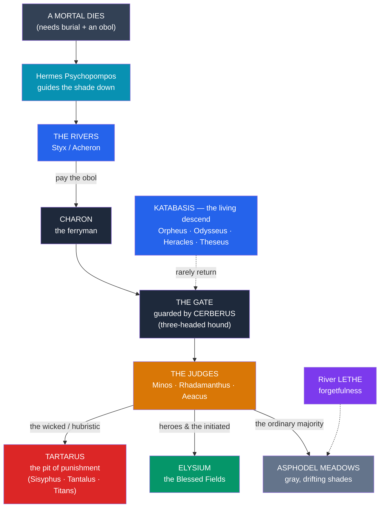

# 💀 The Greek Underworld

> [!abstract] TL;DR
> The Greek land of the dead is **Hades** — a name that denotes both the **realm** and its ruling **god**, brother of Zeus and Poseidon, who won the underworld when the three siblings divided the cosmos. Its queen is **Persephone**, daughter of **Demeter**, whose **abduction** by Hades and part-time return to the surface explain the **seasons** (a Greek parallel to the Mesopotamian [[The_Descent_of_Inanna|descent of Inanna]]). The dead are ferried across the river **Styx** (or Acheron) by the boatman **Charon**, who demands an **obol** (a coin placed in the mouth); the monstrous hound **Cerberus** guards the gate so none may leave. Three judges — **Minos, Rhadamanthus, and Aeacus** — assign the soul its place: the abyss of **Tartarus** for the damned, the blessed fields of **Elysium** for heroes, and the neutral **Asphodel Meadows** for the ordinary majority. The river **Lethe** brings forgetting. A handful of the living make the perilous descent (***katabasis***) and return: **Orpheus** for **Eurydice**, **Odysseus** to consult the dead, **Heracles** to fetch Cerberus, and **Theseus**. The Greek afterlife is, on the whole, **dim and joyless** — a shadow-existence sharply unlike the Egyptian hope of renewal.

## Intuition — analogy first

The Greek underworld is best imagined not as a fiery place of torment but as a vast, gray **holding facility** — a bureaucracy of the dead where almost everyone ends up in the same undifferentiated waiting room.

Where later traditions sort souls sharply into heaven and hell, the classical Greek model is closer to a **records office with three exits**: a bottomless **maximum-security pit** (Tartarus) for a few notorious offenders, a pleasant **retirement estate** (Elysium) for a select few heroes and initiates, and — for the overwhelming majority — a featureless **gray field** (Asphodel) where the shades drift, bloodless and witless, "**strengthless heads**" who barely remember who they were. Getting *in* requires a **fare** (Charon's obol) and proper burial; getting *out* is all but impossible, because a monstrous dog guards the one-way gate. What makes the Greek vision so haunting is precisely its **bleakness**: Achilles' shade tells Odysseus he would rather be a landless serf among the living than king over all the dead. Death is not punishment or reward for most — it is simply a diminished, permanent exile from the light. This is why the rare living visitors, and the rare escapes, carry such mythic weight. Compare the Mesopotamian "land of no return" in [[The_Descent_of_Inanna]].

---

## Geography of the Realm of Hades

## Key Concepts

### Hades — the god and the realm

**Hades** ("the unseen") is the eldest son of **Cronus and Rhea** and brother of Zeus and Poseidon. When the three brothers divided the cosmos by lot after the [[Greek_Creation_and_the_Titanomachy|Titanomachy]], Hades drew the **underworld**. Because Greeks feared to speak his name, he was often called by **euphemisms** — above all **Plouton** ("the wealth-giver," source of Roman **Pluto**), linking the god of the dead to the riches (grain, metals) that come from beneath the earth. Crucially, Hades is **not** one of the [[The_Twelve_Olympians|Twelve Olympians]]: he dwells apart, rarely leaves his realm, and receives a distinct, chthonic form of cult. He is stern and implacable but, notably, **not evil** — he is a just custodian of the dead, not a Greek "devil."

### Persephone, Demeter, and the seasons

The central underworld myth, told in the ***Homeric Hymn to Demeter***, is the **abduction of Persephone (Korē)**. Hades, with Zeus's tacit consent, seizes the maiden as she gathers flowers and carries her below. Her mother **Demeter**, goddess of grain, wanders the earth in grief and finally **withholds all growth**, threatening famine, until Zeus intervenes. A compromise is struck — but because Persephone has eaten a few **pomegranate seeds** in the underworld, she is bound to spend **part of each year** (a third, or half) below as Hades's queen and the rest above with Demeter. Her descent and return dramatize the **seasonal cycle**: the earth's barrenness in Persephone's absence, its flowering at her return. The myth also grounds the **Eleusinian Mysteries**, an initiation cult promising initiates a better afterlife.

> [!note] A comparative dying/rising pattern
> The Persephone myth is the Greek member of a wide **descent-and-return** family. The Sumerian/Akkadian **[[The_Descent_of_Inanna|descent of Inanna/Ishtar]]** to the "land of no return," her death, and her substituted return likewise correlate with seasonal fertility (via **Dumuzi/Tammuz**). Frazer bundled such stories as "**dying-and-rising**" gods; later scholars urge caution about how neatly they actually match. See [[The_Descent_of_Inanna]].

### The rivers and the crossing

The underworld is bounded and crossed by named rivers, each with a resonance:

| River | Meaning | Role |
|---|---|---|
| **Styx** | "Hateful" / abhorrence | Great boundary river; the gods' most **binding oath** is sworn by it |
| **Acheron** | "Woe" | The river of ferrying in many accounts |
| **Cocytus** | "Wailing / lamentation" | River of the unburied and mourning |
| **Phlegethon** (Pyriphlegethon) | "Flaming" | River of fire, near Tartarus |
| **Lethe** | "Forgetfulness / oblivion" | Its water erases the memory of earthly life |

The shade is guided down by **Hermes** in his role as **Psychopompos** ("soul-guide"), then met by **Charon**, the grim ferryman who rows the dead across for the price of an **obol** — a coin placed in the mouth of the corpse at burial. The **unburied** and the **fareless** are left to wander the near bank for a hundred years, which is why proper burial mattered so intensely to the Greeks (a theme central to Sophocles' *Antigone* and to Patroclus's ghost in the *Iliad*). At the gate crouches **Cerberus**, the many-headed hound (usually three), who fawns on those entering but devours any shade attempting to leave.

### The judges and the regions of the dead

Once across, the soul is assigned its place by three former kings turned **judges of the dead** — **Minos** and **Rhadamanthus** (sons of Zeus and Europa) and **Aeacus** — a scheme developed especially in **Plato** (the *Gorgias* and the "Myth of Er" in the *Republic*). The realm has three principal regions:

- **Tartarus** — the deep pit of **punishment**, as far below Hades as earth is below heaven. Here the **Titans** are imprisoned, and here the great sinners suffer eternally: **Sisyphus** (forever rolling his boulder), **Tantalus** (starving amid unreachable food and water), **Ixion** (bound to a spinning wheel), and the **Danaïds** (filling a leaking vessel).
- **Elysium** (the **Elysian Fields** / Isles of the Blessed) — a paradise of ease reserved for **heroes**, the specially favored, and (in mystery cults) the **initiated**.
- **The Asphodel Meadows** — the vast, gray middle ground where the **ordinary dead**, neither notably good nor evil, drift as witless shades. This is the default fate of nearly everyone.

### Katabasis — descents of the living

A **katabasis** (a "going-down") is the rare and dangerous journey of a *living* person into the realm of the dead — a supreme test of the hero. The great instances:

- **Orpheus and Eurydice**: the peerless musician descends to reclaim his dead wife **Eurydice**, charming Hades and Persephone with his song. They grant her return on one condition — that he **not look back** until both reach the light. At the threshold he turns, and she is lost forever: the archetype of love, art, and the fatal backward glance (Virgil's *Georgics* 4; Ovid's *Metamorphoses* 10).
- **Odysseus** (*Odyssey* Book 11, the *Nekyia*): sails to the edge of the world and summons the dead with a blood offering to consult the prophet **Tiresias**; there he meets his mother, Agamemnon, and Achilles, whose bleak verdict on death defines the Greek view (see [[The_Trojan_War]]).
- **Heracles**: his **twelfth labor** is to fetch **Cerberus** itself from Hades — the hero's symbolic conquest of death (see [[Greek_Heroes_and_Their_Quests]]).
- **Theseus and Pirithous**: descend rashly to abduct **Persephone**; they are trapped on the "**Chair of Forgetfulness**," and only Theseus is later rescued by Heracles.

## Primary Sources & Examples

- **Homer, *Odyssey* Book 11** (the *Nekyia*): the foundational literary vision of the shades, including Achilles' declaration that he would rather be a poor man's servant on earth than lord of all the dead.
- **Homeric Hymn to Demeter**: the definitive telling of Persephone's abduction, the pomegranate seeds, and the origin of the seasons and the Eleusinian Mysteries.
- **Hesiod, *Theogony***: the rivers, the imprisonment of the Titans in Tartarus, and the underworld's cosmic geography.
- **Plato, *Gorgias* and *Republic* (Myth of Er)**: the judges of the dead and a moralized, judgment-based afterlife.
- **Virgil, *Aeneid* Book 6**: the fullest guided tour of the underworld (Aeneas, the Sibyl, the golden bough), synthesizing Greek tradition for Rome.
- **Ovid, *Metamorphoses* Book 10** and **Virgil, *Georgics* Book 4**: the canonical tellings of **Orpheus and Eurydice**.

## Common Pitfalls / Misconceptions

- **"Hades is the Greek devil / Hell is torment for everyone."** Hades is a **stern but just** god, not evil, and his realm is not a place of universal punishment. Most of the dead go to the neutral **Asphodel Meadows**; only a few notorious sinners suffer in **Tartarus**.
- **"'Hades' means only the god."** The word names **both** the god *and* the place. Context decides which is meant.
- **"Hades abducted Persephone against Zeus's will."** In the *Hymn to Demeter*, Zeus **assents** to the marriage beforehand; Demeter's protest, not Hades's action, is what is illicit in her eyes.
- **"Pluto and Hades are different gods."** **Plouton** ("wealth-giver") is a **euphemistic title of Hades**; the Roman **Pluto** derives from it. They are the same deity.
- **"The Elysian Fields were open to good people generally."** In the classical scheme, **Elysium** was reserved for **heroes and the specially favored (or initiated)**, not a general reward for virtue — that democratizing shift comes later.
- **"Cerberus keeps the living out."** Its function is the reverse: it primarily keeps the **dead from getting out**.

## Related Concepts

- [[_MOC_Greek_Myth|↑ Section MOC]] — the map of the whole Greek section
- [[The_Twelve_Olympians]] — Hades is the brother of Zeus who is *excluded* from Olympus; Demeter and Hermes figure centrally here
- [[Greek_Creation_and_the_Titanomachy]] — the lot-drawing that gave Hades the underworld, and **Tartarus** as the Titans' prison
- [[Greek_Heroes_and_Their_Quests]] — heroic *katabaseis*, especially Heracles' twelfth labor
- [[The_Trojan_War]] — the *Odyssey*'s underworld episode and the shades of the war's dead
- Cross-vault: [[The_Descent_of_Inanna]] — the Mesopotamian descent-and-return myth; [[The_Egyptian_Afterlife]] — the contrasting Egyptian hope of renewal and judgment

## Review Questions

1. Describe the three principal regions of the Greek underworld (**Tartarus, Elysium, Asphodel**) and who ends up in each. Why is the *ordinary* Greek afterlife often called "dim" or "joyless"?
2. Retell the abduction of **Persephone** and explain how it accounts for the seasons. Compare it, as a descent-and-return myth, with the Mesopotamian [[The_Descent_of_Inanna|descent of Inanna]] — what do they share and where do they differ?
3. Define **katabasis** and analyze **Orpheus and Eurydice** as its most famous instance. What does the "no looking back" condition, and Orpheus's failure, express about the boundary between the living and the dead?

## Sources

- Homer. *The Odyssey*, Book 11 (trans. R. Fagles, 1996; or E. Wilson, 2017)
- *The Homeric Hymns* (Hymn to Demeter) (trans. M. Crudden, 2001). Oxford University Press
- Virgil. *The Aeneid*, Book 6 (trans. R. Fagles, 2006)
- Johnston, S. I. (1999). *Restless Dead: Encounters between the Living and the Dead in Ancient Greece*. University of California Press

#mythology #greek-mythology #underworld #hades #afterlife
