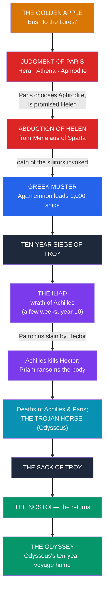

# 🐴 The Trojan War

> [!abstract] TL;DR
> The **Trojan War** is the great narrative hinge of Greek myth — the war in which the age of heroes exhausts itself before the walls of **Troy** (Ilium). Its cause is traced to the **Judgment of Paris**: the goddess **Eris** throws a golden apple "**to the fairest**," and the Trojan prince **Paris**, made judge, awards it to **Aphrodite** in exchange for **Helen**, wife of the Spartan king **Menelaus** — whose abduction launches a thousand ships under Menelaus's brother **Agamemnon**. **Homer's *Iliad*** does not tell the whole war but a few weeks in its tenth year, centered on the **wrath of Achilles**: his quarrel with Agamemnon, his withdrawal, the death of his friend **Patroclus** at the hands of **Hector**, Achilles' revenge, and the moving ransom of Hector's body by King **Priam**. The war ends not in the *Iliad* but in the wider **epic cycle**: the stratagem of the **Trojan Horse**, devised by **Odysseus**, and the sack of Troy. The survivors' voyages home — the ***nostoi*** — culminate in Homer's **_Odyssey_**. Since **Heinrich Schliemann's** 19th-century excavations at **Hisarlik**, the war's possible **historicity** (a real Late Bronze Age conflict?) has been fiercely debated.

## Intuition — analogy first

The Trojan War works like a **controlled demolition of the heroic age** — a single catastrophe engineered to bring the great generation of demigods to an end.

Picture a story-world overpopulated with superhuman heroes (see [[Greek_Heroes_and_Their_Quests]]): sons of gods, invincible warriors, kings descended from Zeus. Such a world cannot simply continue. Later Greek tradition even says Zeus *planned* the war to relieve an overburdened Earth of its surplus of heroes. The war is the great **gathering and consuming** of that generation: nearly every famous hero (or his son) sails to Troy, and almost none comes home unscathed. And Homer's genius is to refuse the panoramic war-movie. Instead of narrating ten years and a thousand duels, the *Iliad* zooms in on **one man's anger** over a few weeks, using it as a lens through which the whole meaning of heroism, mortality, honor, and grief comes into focus. The war is the setting; the *human cost of glory* is the subject. That is why a poem that never even reaches the fall of Troy became the foundational text of Western literature.

---

## From a Golden Apple to the Fall of Troy

## Key Concepts

### The causes: the Judgment of Paris and the abduction of Helen

The war's mythic trigger is a divine beauty contest. At the wedding of **Peleus and Thetis** (Achilles' parents), the uninvited goddess of strife, **Eris**, throws down a golden apple inscribed "**to the fairest**" (*kallistēi*). Three goddesses claim it — **Hera**, **Athena**, and **Aphrodite** — and Zeus wisely refuses to judge, appointing the Trojan prince **Paris** (Alexandros). Each goddess offers a bribe: Hera, kingship; Athena, victory in war and wisdom; Aphrodite, the most beautiful woman in the world. Paris chooses **Aphrodite**, earning the lasting enmity of the other two. His prize is **Helen**, already married to **Menelaus** of Sparta. When Paris takes Helen to Troy, Menelaus invokes the **Oath of Tyndareus** — a pact by which all of Helen's former suitors swore to defend her marriage — and his brother **Agamemnon**, king of Mycenae, assembles the Greek (Achaean) host.

### The *Iliad*: the wrath of Achilles

**Homer's *Iliad*** (c. 8th century BCE) announces its true subject in its first word: ***mēnis***, the **wrath** of **Achilles**. It covers roughly **51 days** in the **tenth year** of the siege, not the war as a whole. Its architecture is a chain of consequences flowing from a quarrel over honor:

- Agamemnon is forced to return a captive, **Chryseis**, to end a plague sent by **Apollo**, and seizes Achilles' war-prize **Briseis** in compensation — a public insult to Achilles' *timē* (honor).
- Achilles **withdraws** from the fighting and has his mother **Thetis** persuade Zeus to let the Trojans prevail, so the Greeks will feel his absence.
- With Achilles gone, **Hector**, Troy's greatest warrior and Priam's son, drives the Greeks back to their ships.
- Achilles' beloved companion **Patroclus** enters battle wearing Achilles' armor, is killed by Hector (with Apollo's help), and stripped.
- Grief transforms Achilles' wrath from Agamemnon to Hector. In new armor forged by **Hephaestus**, he routs the Trojans, kills **Hector**, and defiles his corpse.
- In the sublime final book, King **Priam** comes alone by night to Achilles' tent to **ransom his son's body**; the two enemies weep together, and the poem ends with Hector's funeral — not the fall of Troy.

### The Greek and Trojan casts

The war is a vast ensemble; a few figures recur across the tradition:

| Side | Figure | Role |
|---|---|---|
| **Greek (Achaean)** | **Agamemnon** | King of Mycenae, commander-in-chief |
| | **Achilles** | Greatest warrior; son of Peleus and the goddess Thetis; fated to die young |
| | **Odysseus** | King of Ithaca; the cunning strategist (the "Horse") |
| | **Ajax (the Greater)** | Massive, stalwart bulwark; later suicide over Achilles' armor |
| | **Diomedes**, **Nestor**, **Menelaus** | Champion; aged counsellor; the wronged husband |
| **Trojan** | **Priam** | Aged king of Troy |
| | **Hector** | Priam's heir, Troy's defender; killed by Achilles |
| | **Paris (Alexandros)** | Prince whose choice caused the war; kills Achilles with Apollo's aid |
| | **Aeneas** | Trojan prince (son of Aphrodite) fated to survive and found the Roman line |

The Olympians take sides throughout: **Hera, Athena, and Poseidon** back the Greeks; **Aphrodite, Apollo, and Ares** favor Troy — the human war mirrored by a war among the gods. See [[The_Twelve_Olympians]].

### The Trojan Horse and the fall of Troy

The *Iliad* stops before Troy falls; the ending comes from other poems. After the deaths of **Achilles** (shot in the heel by Paris, guided by Apollo) and **Paris**, the Greeks win by **stratagem**, not force: **Odysseus** devises the **Trojan Horse** — a hollow wooden horse left as a false offering. The Trojans, ignoring the warnings of the priest **Laocoön** ("*I fear the Greeks even bearing gifts*") and the prophetess **Cassandra**, drag it inside their walls. At night the hidden Greeks emerge and open the gates, and Troy is **sacked and burned**. The scene is narrated most memorably in **Virgil's *Aeneid*** Book 2, from the Trojan survivor Aeneas's point of view.

### The *nostoi* and the *Odyssey*

The aftermath is the ***nostoi*** — the "**returns**" of the Greek heroes, most of them disastrous. **Agamemnon** sails home to be murdered by his wife **Clytemnestra** and her lover (dramatized in **Aeschylus's *Oresteia***); **Ajax the Lesser** drowns for his impiety. The greatest of the *nostos* poems is **Homer's *Odyssey***, the ten-year homeward voyage of **Odysseus** — the Cyclops, Circe, the Sirens, the underworld, Calypso — culminating in his return to Ithaca and his wife **Penelope**. The *Odyssey*'s **underworld episode** (Book 11) is a key source for Greek ideas of the afterlife (see [[The_Greek_Underworld]]).

### Homer, the epic cycle, and historicity

Homer's two epics are only the surviving peaks of a much larger **epic cycle** — a set of now-mostly-lost poems (the *Cypria*, *Aethiopis*, *Little Iliad*, *Iliupersis*/"Sack of Troy," *Nostoi*, *Telegony*) that together narrated the war from the golden apple to the last returns. On **historicity**: for centuries the war was read as legend, until **Heinrich Schliemann** (1870s) excavated the mound of **Hisarlik** in northwest Turkey and identified it as Troy. Excavation revealed many superimposed cities; the level **Troy VI/VIIa** (Late Bronze Age, c. 1300–1180 BCE) shows destruction and fits the geography. Hittite texts mention a place **Wilusa** (compare *Ilios*) and a king **Alaksandu** (compare *Alexandros*). Most scholars now accept that **a real Bronze Age city stood and fell** and that some historical conflict may underlie the legend — while treating Homer's version as **poetic myth composed centuries later**, not reportage.

## Primary Sources & Examples

- **Homer, *Iliad***: the wrath of Achilles (Book 1), the death of Patroclus (Book 16), the slaying of Hector (Book 22), and Priam's ransom (Book 24).
- **Homer, *Odyssey***: the returns theme and the *nostos* of Odysseus; the underworld visit (Book 11).
- **The Epic Cycle** (fragments and summaries in Proclus's *Chrestomathy*): the *Cypria* (causes and the apple), the *Little Iliad* and *Iliou Persis* (the Horse and the sack).
- **Virgil, *Aeneid* Book 2**: the fullest surviving narrative of the Trojan Horse and the fall of the city.
- **Aeschylus, *Oresteia***: the catastrophic homecoming of Agamemnon.
- **Archaeology**: Schliemann's and later Manfred Korfmann's excavations at **Hisarlik**, and the Hittite **Wilusa/Alaksandu** correspondences.

## Common Pitfalls / Misconceptions

- **"The *Iliad* tells the whole Trojan War."** It does **not**: it covers only a few weeks in the tenth year and ends with Hector's funeral — *before* the Horse and the fall of Troy. Those events come from other poems.
- **"The Trojan Horse is in the *Iliad*."** It is not; the *Iliad* stops earlier. The Horse is told in the epic cycle and, most fully, in Virgil's *Aeneid*.
- **"Achilles was invincible except for his heel."** The famous **dipping in the Styx** and the vulnerable heel are **later** additions (e.g., Statius); Homer's Achilles is a mortal who can be wounded, simply the greatest of warriors, fated to die young.
- **"Helen was straightforwardly abducted / straightforwardly eloped."** The tradition is **ambivalent** about Helen's agency, and one variant (Stesichorus, Euripides' *Helen*) claims only a **phantom** (*eidōlon*) went to Troy while the real Helen waited in Egypt.
- **"Schliemann proved the *Iliad* is history."** He found **a** Troy and reopened the question, but he did not confirm Homer's narrative. The relationship between the archaeological city and the epic remains **debated**; the poem is myth, not a chronicle.

## Related Concepts

- [[_MOC_Greek_Myth|↑ Section MOC]] — the map of the whole Greek section
- [[Greek_Heroes_and_Their_Quests]] — the age of heroes that the Trojan War gathers and consumes
- [[The_Twelve_Olympians]] — the gods who take sides and intervene throughout the war
- [[The_Greek_Underworld]] — the fate of the war's countless dead; the *Odyssey*'s underworld episode
- [[Greek_Creation_and_the_Titanomachy]] — the ordered cosmos in which Zeus is said to have "planned" the war
- Cross-vault: [[_MOC_Roman_Myth|Roman]] — Virgil's *Aeneid* recasts the fall of Troy as the origin of Rome

## Review Questions

1. Trace the causal chain from the **golden apple** to the mustering of the Greek fleet. What is the Judgment of Paris, and how does the **Oath of Tyndareus** turn a private abduction into a pan-Hellenic war?
2. The *Iliad*'s subject is the "wrath of Achilles," not the war as a whole. Explain how the quarrel over **Briseis**, the death of **Patroclus**, and the ransom of **Hector** structure the poem, and why it ends where it does.
3. What is the difference between the **_Iliad_** and the wider **epic cycle**, and where does the **Trojan Horse** actually come from? Summarize the current scholarly view on the war's **historicity** in light of Schliemann and Hisarlik.

## Sources

- Homer. *The Iliad* (trans. R. Lattimore, 1951; or R. Fagles, 1990). University of Chicago Press
- Homer. *The Odyssey* (trans. R. Fagles, 1996; or E. Wilson, 2017)
- West, M. L. (2003). *Greek Epic Fragments* (the Epic Cycle). Loeb Classical Library, Harvard University Press
- Wood, M. (1985/1996). *In Search of the Trojan War*. BBC Books / University of California Press

#mythology #greek-mythology #trojan-war #homer #epic
