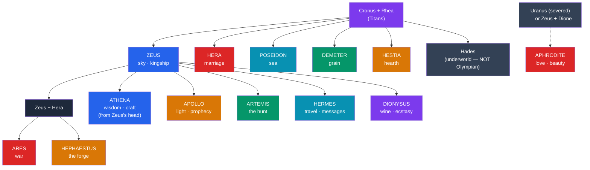

# 🏛️ The Twelve Olympians

> [!abstract] TL;DR
> The **Twelve Olympians** (Greek *Dōdekátheon*) are the principal gods of the Greek pantheon, who ruled the cosmos from **Mount Olympus** after the [[Greek_Creation_and_the_Titanomachy|Olympians overthrew the Titans]]. The canonical roster is **Zeus** (sky, kingship), **Hera** (marriage), **Poseidon** (sea), **Demeter** (grain), **Athena** (wisdom and craft), **Apollo** (light, prophecy, music), **Artemis** (the hunt), **Ares** (war), **Aphrodite** (love), **Hephaestus** (the forge), **Hermes** (travel and messages), and **Dionysus** (wine) — with **Hestia** (the hearth) often occupying the twelfth seat in older lists, since she and Dionysus rarely appear together in the same twelve. Each god owns a *domain* (a sphere of the world), a set of *attributes* (recognizable symbols), and a later **Roman equivalent**. Our earliest sources are **Homer** (*Iliad*, *Odyssey*), **Hesiod** (*Theogony*, *Works and Days*), and the anonymous **Homeric Hymns**. **Hades**, though a brother of Zeus, is *not* counted among the Twelve because he dwells apart in the underworld.

## Intuition — analogy first

Think of the Olympian pantheon less as a random collection of gods and more as a **royal family running a divided kingdom** — a celestial cabinet where every minister holds a portfolio.

After a war of succession, three brothers **drew lots** to partition the universe: Zeus took the **sky**, Poseidon the **sea**, and Hades the **underworld**, while the **earth and Olympus** remained common ground. Zeus rules as a *first among equals* — powerful, but forever negotiating with jealous siblings, headstrong children, and a resentful queen. Each god below him governs a slice of reality (war, love, harvest, craft), and Greek worshippers who wanted rain prayed to one office, safe childbirth to another, a good voyage to a third. The dramas of Greek myth are largely the **office politics of this family**: rivalries, affairs, grudges, and negotiations, projected onto the workings of nature and human life. This is why the gods feel so vividly *personal* — the Greeks imagined divinity in the image of a quarrelsome aristocratic household. See [[Greek_Creation_and_the_Titanomachy]] for how that household came to power.

---

## The Divine Household of Olympus

## Key Concepts

### Why "twelve," and who is in?

The number **twelve** was itself a cult category — the *Dōdekátheon* — honored collectively at sites such as the **Altar of the Twelve Gods** in the Athenian Agora (late 6th century BCE). But no single list is universal. The recurring tension is between **Hestia** and **Dionysus**: the older, Olympian household includes Hestia, goddess of the hearth, while later tradition swaps her out for Dionysus, the newcomer god of wine — a neat mythic image of the modest hearth-goddess yielding her seat to keep the peace. **Hades** is regularly excluded: as lord of the dead he lives in his own realm, not on Olympus, and receives a very different kind of cult. Six of the Twelve are the **children of Cronus and Rhea** (Zeus, Hera, Poseidon, Demeter, Hestia, plus the non-Olympian Hades); the rest are the **children of Zeus** by various mothers.

### Domains, attributes, and Roman equivalents

Greek gods are identified in art and text by their **attributes** — objects, animals, and plants sacred to them — and each was later matched (*interpretatio romana*) to a Roman deity.

| Deity | Domain | Symbols / Attributes | Roman equivalent |
|---|---|---|---|
| **Zeus** | Sky, thunder, kingship, hospitality, oaths | Thunderbolt, eagle, oak, aegis, scepter | **Jupiter** |
| **Hera** | Marriage, women, sovereignty | Peacock, diadem, cow, pomegranate, scepter | **Juno** |
| **Poseidon** | Sea, earthquakes, horses | Trident, horse, dolphin, bull | **Neptune** |
| **Demeter** | Grain, agriculture, the harvest | Sheaf of wheat, torch, cornucopia, poppy | **Ceres** |
| **Athena** | Wisdom, crafts, strategic warfare | Owl, olive tree, aegis, helmet, spear | **Minerva** |
| **Apollo** | Light, prophecy, music, healing, archery | Lyre, bow, laurel, raven, tripod | **Apollo** (name kept) |
| **Artemis** | The hunt, wild animals, the moon, childbirth | Bow and arrows, deer, cypress, crescent | **Diana** |
| **Ares** | War, bloodlust, martial courage | Spear, helmet, shield, dog, vulture | **Mars** |
| **Aphrodite** | Love, beauty, sexual desire | Dove, myrtle, rose, scallop shell, girdle | **Venus** |
| **Hephaestus** | Fire, the forge, metalwork, craftsmanship | Hammer, anvil, tongs, lameness | **Vulcan** |
| **Hermes** | Travel, trade, thieves, messages, boundaries | Caduceus, winged sandals (*talaria*), *petasos* | **Mercury** |
| **Dionysus** | Wine, ecstasy, theater, vegetation | Thyrsus, grapevine, ivy, panther, kantharos | **Bacchus** |
| **Hestia** | The hearth, home, domestic and civic fire | Hearth, kettle, veil | **Vesta** |

> [!note] Roman is not merely Greek renamed
> The Romans identified their own gods with Greek ones, but the equations are approximate. **Mars** was a far more central and dignified state god for Rome than the reckless **Ares** was for the Greeks, and **Venus** carried a foundational, ancestral role (mother of Aeneas) absent from Aphrodite. Identification flattened real differences of cult and character.

### Mount Olympus and the divine order

**Mount Olympus**, Greece's highest massif (nearly 2,918 m, on the Thessaly–Macedonia border), was imagined as the gods' dwelling — sometimes a literal peak, sometimes a celestial realm above it. There the gods live in bronze-floored halls built by Hephaestus, feast on **ambrosia** and **nectar**, and are served by **Hebe** and later **Ganymede**. They are **immortal** and **ageless** but not omnipotent or omniscient: they can be wounded (Aphrodite and Ares are hurt in the *Iliad*), deceived, and constrained by **Fate** (*Moira*), which even Zeus hesitates to overrule. This is a crucial feature of Greek religion — the gods are a limited, personal, quarrelsome community rather than a single transcendent absolute.

### The principal sources

Almost everything systematic we know comes from a small canon of early poetry:

- **Homer**, the *Iliad* and *Odyssey* (c. 8th century BCE), show the gods in action — taking sides, feasting, meddling in the Trojan War.
- **Hesiod**, the *Theogony* (c. 700 BCE), gives the **genealogy**: who begat whom, and how the cosmos was organized.
- The **Homeric Hymns** (archaic–classical) are individual praise-poems to single gods (to Demeter, Apollo, Hermes, Aphrodite, Dionysus) that preserve their signature myths — for example, the *Hymn to Demeter*'s account of Persephone's abduction (see [[The_Greek_Underworld]]).

## Primary Sources & Examples

- **Zeus's supremacy**: In *Iliad* Book 8, Zeus boasts that if all the other gods pulled on a golden chain, they could not drag him from the sky, but he could haul them up — the poetic image of his rank above the pantheon.
- **The lot-drawing of the brothers**: In *Iliad* Book 15, Poseidon recalls that he, Zeus, and Hades divided the world by lot — sea, sky, and underworld — with earth and Olympus held in common, the charter myth of the divided cosmos.
- **The birth of Athena**: The *Theogony* and *Homeric Hymn 28* describe Athena springing fully armed from Zeus's head after he swallowed the pregnant Metis — an image of wisdom born directly from the king of the gods.
- **Hephaestus's revenge**: In the *Odyssey* Book 8, the bard Demodocus sings of Hephaestus trapping the adulterous Ares and Aphrodite in an unbreakable net — a comic scene that shows the gods' all-too-human passions.
- **The reluctant twelfth seat**: Later tradition (e.g., in accounts summarized by mythographers) has **Hestia** yielding her Olympian throne to **Dionysus**, harmonizing the old and new twelve.

## Common Pitfalls / Misconceptions

- **"There is one fixed list of twelve."** There is not. The membership shifts, chiefly over Hestia vs. Dionysus, and local cults honored their own selection. The *number* twelve is more stable than its contents.
- **"Hades is an Olympian."** He is a son of Cronus and a brother of Zeus, but he is **not** one of the Twelve; he rules the underworld and is worshipped separately. See [[The_Greek_Underworld]].
- **"The Roman gods are just the Greek gods with new names."** The Romans *identified* their deities with Greek ones, but the pairings gloss over real differences in cult, personality, and importance (Mars/Ares, Venus/Aphrodite).
- **"The gods are all-powerful and all-good."** Greek gods are immortal and mighty but limited — subject to Fate, capable of error, jealousy, and cruelty. They embody natural and social forces, not moral perfection.
- **"Aphrodite is Zeus's daughter."** The sources disagree: Hesiod's *Theogony* has her born from the sea-foam around the severed genitals of **Uranus** (older and grander), while Homer makes her the daughter of **Zeus and Dione**. Both traditions coexist.

## Related Concepts

- [[_MOC_Greek_Myth|↑ Section MOC]] — the map of the whole Greek section
- [[Greek_Creation_and_the_Titanomachy]] — how the Olympians won power from the Titans, and the genealogy behind this pantheon
- [[Greek_Heroes_and_Their_Quests]] — the Olympians sire and aid the mortal heroes of the next age
- [[The_Greek_Underworld]] — Hades, the brother excluded from Olympus, and the realm of the dead
- [[The_Trojan_War]] — the Olympians choosing sides among mortals
- Cross-vault: [[_MOC_Roman_Myth|Roman]] — the *interpretatio romana* that renamed and re-cast these gods

## Review Questions

1. List the domains of Zeus, Poseidon, and Hades and explain why only two of the three brothers belong to the Twelve Olympians. What "charter myth" explains the division of their realms?
2. Why is there no single fixed list of the Twelve? Use the case of Hestia and Dionysus to explain how the roster changed over time.
3. Name three of our principal sources for the Olympians and state what each contributes (action, genealogy, or single-god myth). Why does it matter that Greek gods are portrayed as limited rather than omnipotent?

## Sources

- Hesiod. *Theogony* and *Works and Days* (trans. M. L. West, 1988). Oxford University Press
- Homer. *Iliad* and *Odyssey* (trans. R. Lattimore / R. Fagles)
- *The Homeric Hymns* (trans. M. Crudden, 2001). Oxford University Press
- Burkert, W. (1985). *Greek Religion*. Harvard University Press

#mythology #greek-mythology #olympians #pantheon #beginner
