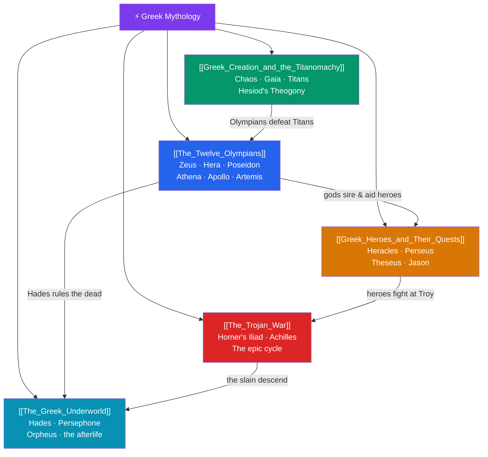

# ⚡ Greek Mythology — Map of Content

> [!abstract] What This Section Covers
> Greek mythology is the West's most literarily elaborated tradition, preserved by Homer, Hesiod, the tragedians, and later mythographers. This section maps its architecture: **The Twelve Olympians** who rule from Olympus (Zeus, Hera, Poseidon, Athena, Apollo, and their kin); the cosmogony of **Greek Creation and the Titanomachy**, from primordial Chaos and Gaia through the Titans to the Olympians' war for supremacy; the **Greek Heroes and Their Quests**, the mortal-divine champions Heracles, Perseus, Theseus, and Jason; **The Trojan War**, the cycle centered on Homer's *Iliad* and the wrath of Achilles; and **The Greek Underworld**, the realm of Hades, the abduction of Persephone, and Orpheus's doomed descent. Together they trace a coherent cosmos from creation through the age of heroes to the boundaries of death.

## Concept Map

## Learning Path

1. [[Greek_Creation_and_the_Titanomachy]] — Hesiod's *Theogony*: Chaos, Gaia, Uranus, Cronus, and the Olympians' war against the Titans.
2. [[The_Twelve_Olympians]] — The ruling gods of Olympus, their domains, symbols, and rivalries.
3. [[Greek_Heroes_and_Their_Quests]] — The age of heroes: Heracles' labors, Perseus and Medusa, Theseus and the Minotaur, Jason and the Argonauts.
4. [[The_Trojan_War]] — Homer's *Iliad*, the wrath of Achilles, and the wider epic cycle from the golden apple to the fall of Troy.
5. [[The_Greek_Underworld]] — Hades' realm, the Persephone myth and the seasons, and Orpheus's descent for Eurydice.

## All Notes at a Glance

| Note | Difficulty | What You'll Learn |
|------|------------|-------------------|
| [[The_Twelve_Olympians]] | Beginner | Zeus, Hera, Poseidon, Demeter, Athena, Apollo, Artemis, Ares, Aphrodite, Hephaestus, Hermes, Dionysus/Hestia |
| [[Greek_Creation_and_the_Titanomachy]] | Intermediate | Chaos, Gaia, Uranus, the Titans, Cronus and the succession myth, the ten-year Titanomachy |
| [[Greek_Heroes_and_Their_Quests]] | Intermediate | Heracles' twelve labors, Perseus, Theseus, Jason and the Golden Fleece, the hero pattern |
| [[The_Trojan_War]] | Intermediate | The judgment of Paris, Achilles and Hector, the *Iliad*, the Trojan Horse, the *nostoi* |
| [[The_Greek_Underworld]] | Intermediate | Hades, Persephone and Demeter, the rivers, Charon, Cerberus, Orpheus and Eurydice |

## Key Questions This Section Answers

- How does Hesiod's succession myth (Uranus → Cronus → Zeus) mirror other Near Eastern cosmogonies?
- What distinguishes a Greek hero from a god, and why are heroes so often part-divine?
- Why is the *Iliad* about a few weeks of Achilles' anger rather than the whole Trojan War?
- What does the Persephone myth explain about the natural world?
- How did Greek conceptions of the underworld differ from Egyptian ones?

## Related Sections

- [[_MOC_Mythology_Master|↑ Mythology Master MOC]]
- [[_MOC_Egyptian_Myth|← Egyptian]]
- [[_MOC_Roman_Myth|→ Roman]]
- Cross-vault: [[The_Heros_Journey]] (Campbell built on Greek heroes), [[The_Egyptian_Afterlife]]

#MOC #Mythology #GreekMyth
