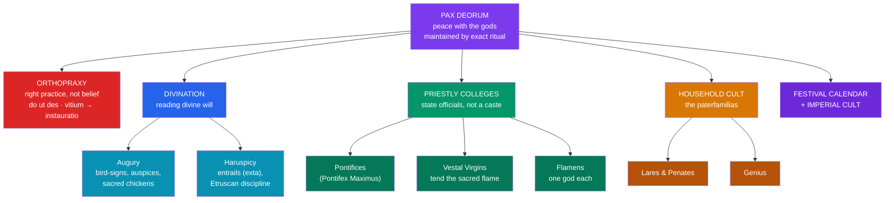

# 🔥 Roman Religion and Ritual

> [!abstract] TL;DR
> Roman religion was a religion of **orthopraxy** (right practice), not **orthodoxy** (right belief): what mattered was performing rites correctly, not holding doctrines or feeling faith. Its governing goal was the **pax deorum**, the "peace of the gods" — a contractual harmony (*do ut des*, "I give that you may give") between the community and its deities, maintained by exact ritual and repaired by expiation when omens (*prodigia*) signaled a breach. Romans read divine will through **divination**: **augury** (interpreting bird-signs and auspices) and the Etruscan art of **haruspicy** (reading the entrails of sacrifices). Religion was run by the state through **priestly colleges** — the **pontiffs** under the *Pontifex Maximus*, the **Vestal Virgins** who tended the sacred flame, and the **flamens** assigned to individual gods. Alongside the state cult ran **household religion**: the **lares** and **penates**, and the **genius** of the paterfamilias. A dense **festival calendar** and, under the empire, the **imperial cult** completed the system. Unlike Greek religion, whose myths are elaborate narratives, Roman religion put its genius into **procedure**.

## Intuition — analogy first

Think of Roman state religion as **contract law between a city and its gods**, administered by public officials.

In a legal contract, what binds the parties is not sincerity or emotion but the **correct execution of the agreed terms**: the right words, in the right order, by the right person, with the right formalities. A clerical slip can void the whole instrument and force you to redo it. Roman religion worked precisely this way. The relationship with the gods — the **pax deorum** — was a standing agreement: the community renders the gods their due (sacrifices, festivals, vows) in exact form, and the gods, in return, uphold the state's safety and success. A botched syllable in a prayer, a stumble in the procession, an ox that flinched wrong — any of these was a **vitium**, a fault that invalidated the rite and required starting over (*instauratio*).

This is why Roman religion feels so different from Greek myth. Greek religion produced Homer, Hesiod, and the tragedians — a literature of divine *personalities and stories*. Rome, by temperament a nation of jurists and administrators, produced **priesthoods, calendars, and manuals of procedure**. The Romans were less interested in what the gods *were like* than in what the gods were *owed*, and how to pay it without error. The gods themselves are catalogued in [[The_Roman_Pantheon]].

---

## The Machinery of Roman Religion

## Key Concepts

### Orthopraxy and the pax deorum

Roman public religion was built on **orthopraxy** — the conviction that the gods required **correct action**, not correct doctrine or inner faith. There was no creed, no revealed scripture of belief, and no expectation of personal conversion. What the gods demanded was their *cultus*: sacrifices, prayers, and festivals rendered in exactly the prescribed form. Prayer used fixed, legalistic formulae, often hedged with qualifiers ("or by whatever name you wish to be called") so that no god was misidentified or slighted. The underlying logic was **do ut des** — "I give so that you may give" — a reciprocal, almost contractual exchange.

The aim of all this was the **pax deorum**, the "peace of the gods": a right relationship between the Roman community and its deities that guaranteed the state's welfare. A **prodigy** (*prodigium*) — a lightning strike, a monstrous birth, blood raining from the sky — signaled that the peace had been ruptured, and the Senate would order **expiation** to restore it. A ritual performed with a flaw (*vitium*) was invalid and had to be repeated in full (*instauratio*). Romans distinguished proper *religio* (scrupulous observance) from *superstitio* (excessive, misdirected fear of the gods).

### Divination: augury and haruspicy

Because the gods' favor had to be confirmed before major undertakings, Romans developed elaborate **divination** — the reading of divine will through signs (*auspicia*).

- **Augury** was the native Roman art, practiced by the college of **augures**. It interpreted the flight, cries, and feeding of **birds** (*auspicium*, from *avis* + *spicere*, "to watch birds"), as well as thunder and lightning. The augur used a curved staff, the **lituus**, to mark out a sacred field of observation (a *templum*) in the sky. On campaign, generals watched the **sacred chickens** (*pulli*): if the birds ate greedily (the *tripudium*), the omen was good. The consul **Publius Claudius Pulcher**, when the chickens refused to eat before the naval battle of **Drepana** (249 BCE), reportedly threw them overboard — "if they won't eat, let them drink" — and then lost the battle, a byword for impiety.
- **Haruspicy** was borrowed from the **Etruscans** (the *disciplina Etrusca*). The **haruspices** inspected the **entrails** (*exta*) of sacrificial animals — above all the **liver** — for marks of divine approval or warning, and also interpreted lightning and prodigies. The bronze **Liver of Piacenza**, its surface divided into named celestial regions, is a surviving training model.
- In grave crises the Senate ordered consultation of the **Sibylline Books** (*libri Sibyllini*), a collection of Greek oracular verses kept by a special college, which typically prescribed new or Greek-style rites.

### The priestly colleges

Roman priests were not a separate sacred caste but **public officials**, and leading senators and politicians typically held priesthoods alongside civil office. Religion was thus an arm of the state.

| Priesthood | Function |
|---|---|
| **Pontifices** (College of Pontiffs) | Oversaw sacred law, the **calendar**, burials, and the other priesthoods; led by the **Pontifex Maximus**, a role later monopolized by the emperors |
| **Vestal Virgins** | Six priestesses who tended Vesta's **undying flame** and the state's sacred objects; sworn to 30 years' chastity, its breach (*incestum*) punished by live burial |
| **Flamines** | Fifteen priests each dedicated to a single god; the three *maiores* served **Jupiter** (the taboo-bound *Flamen Dialis*), **Mars**, and **Quirinus** |
| **Augures** | Interpreted the auspices (see above) |
| **Quindecimviri sacris faciundis** | Guarded and consulted the **Sibylline Books** |
| **Fetiales** | Conducted the rituals of declaring war and concluding treaties (the *ius fetiale*) |
| **Salii, Luperci, Fratres Arvales** | Archaic sodalities: the leaping priests of Mars, the runners of the Lupercalia, the brethren of the field-goddess Dea Dia |

After the monarchy ended, a **rex sacrorum** ("king of sacred rites") inherited the kings' purely religious duties, so that no political office bore the hated title of king.

### Household cult: lares, penates, and the genius

Parallel to the state cult, every Roman home practiced **domestic religion**, led by the **paterfamilias** (head of household) at a shrine called the **lararium**.

- **Lares** — protective spirits of the household and its place (the *Lar familiaris*); also honored at crossroads as *Lares Compitales* and, for the state, as *Lares Praestites*.
- **Penates** — guardians of the household's **storeroom** (*penus*) and provisions; the state had its own **Penates Publici**, which legend said **Aeneas carried from Troy** (see [[The_Founding_of_Rome]]).
- **Genius** — the divine generative spirit of the paterfamilias (a woman's equivalent was her **iuno**); a place had its **genius loci**. Offerings were made to one's genius on birthdays.
- **Di Manes** — the collective spirits of the dead, honored at the **Parentalia** and placated at the **Lemuria**; **Vesta**, the hearth, presided over the household's sacred fire.

### The festival calendar and the imperial cult

Roman time was religious time. The **fasti** (calendar) marked **dies fasti** and **dies nefasti** (days on which public business was or was not permitted) and studded the year with **feriae** (festival days), each tied to a deity: the **Saturnalia** (December, with its role-reversals), the **Lupercalia** (15 February), the **Parilia** (21 April, Rome's birthday), the **Vestalia** (June), the **Cerialia**, and the great public **Ludi** (games). Tradition credited **Numa Pompilius**, the second king, with instituting this calendar.

Under the empire, the **imperial cult** integrated religion with politics on a grand scale. Deceased emperors could be voted **apotheosis** and worshipped as **divi** (the deified) — **Divus Julius** (Caesar, 42 BCE) and **Divus Augustus** (14 CE) first among them. Living emperors in Rome were generally honored more cautiously, through offerings to the emperor's **genius** and **numen** rather than as outright gods; in the provinces and the Greek East, where ruler-cult was traditional, worship of the living emperor was more open. The cult, served by **Augustales** and provincial priesthoods, bound a vast empire together around loyalty expressed in ritual form.

### Contrast with Greek myth's narrative focus

Greek and Roman religion both centered on sacrifice and cult, but their **cultural output diverged sharply**. Greek religion generated a vast **narrative mythology** — Homer, Hesiod, the tragedians, the mythographers — elaborating the gods' genealogies, quarrels, and personalities. Native Roman religion generated comparatively **little narrative**: its energy went into **procedure, priestly law, the calendar, and divinatory technique**. This is why Rome imported Greek stories wholesale (through *interpretatio romana*) to give its gods biographies, while keeping a religion whose true center of gravity was **collective, civic, and contractual**. The Romans, one might say, were less mythographers than **jurists of the sacred** — a temperament visible in Cicero's philosophical treatises **De Natura Deorum** and **De Divinatione**, which examine ritual and omen far more than they retell myth.

## Primary Sources & Examples

- **Cicero, *De Divinatione* (44 BCE):** a dialogue debating whether augury and haruspicy actually reveal the future — invaluable evidence for how educated Romans thought about their own divination.
- **Ovid, *Fasti*:** a month-by-month poetic tour of the festival calendar, explaining the origins of the Parilia, Lupercalia, Vestalia, and more.
- **Livy, *Ab Urbe Condita*:** repeatedly records **prodigies** reported to the Senate and the **expiations** ordered to restore the *pax deorum*, showing the system in operation.
- **The sacred chickens at Drepana (249 BCE):** the story of Claudius Pulcher throwing the *pulli* overboard is the classic Roman cautionary tale about violating the auspices.
- **The Vestal flame:** its extinction was treated as a national emergency requiring investigation and expiation — orthopraxy at its starkest.

## Common Pitfalls / Misconceptions

- **"Romans believed their myths literally / didn't believe at all."** Belief in the Greek sense is the wrong axis. Roman religion asked for **correct practice and civic loyalty**, not assent to doctrines; a Roman could doubt a myth yet scrupulously perform the rite, and be perfectly pious.
- **Confusing augury with haruspicy.** **Augury** (native Roman) reads **birds and the sky**; **haruspicy** (Etruscan) reads **entrails**. They are distinct disciplines run by different specialists.
- **Imagining priests as a clergy apart from society.** Roman priesthoods were **public offices** held by the political elite; the *Pontifex Maximus* was a statesman, and Julius Caesar, Augustus, and later emperors held the post.
- **Assuming living emperors were straightforwardly worshipped as gods in Rome.** In the capital, cult usually targeted the emperor's **genius/numen** or awaited his **posthumous deification** (*divus*); open worship of the living ruler was chiefly a provincial and Eastern phenomenon.
- **Treating Roman religion as a pale copy of Greek.** Its narrative thinness is not a deficiency but a different **design**: Rome invested in ritual precision and civic order where Greece invested in story.

## Related Concepts

- [[The_Roman_Pantheon]] — the gods this ritual system served, and the *numen* intuition underlying it
- [[The_Founding_of_Rome]] — the rites traced to Romulus and Numa: the Vestals, augury, the calendar, the Penates from Troy
- [[_MOC_Roman_Myth|↑ Section MOC]] — the map of the Roman mythology section
- [[The_Comparative_Method]] — functionalist readings of ritual (Durkheim, Malinowski) versus myth-as-story
- Cross-vault: [[The_Twelve_Olympians|Greek Olympians]] — the narrative-rich tradition whose story-focus Roman practice contrasts with

## Review Questions

1. Define **orthopraxy** and the **pax deorum**, and explain how the concepts of *do ut des*, *vitium*, and *instauratio* follow from a contractual understanding of religion.
2. Distinguish **augury** from **haruspicy**: what does each read, and where did each come from? Use the Drepana episode to illustrate the stakes of respecting the auspices.
3. Roman religion produced far less narrative mythology than Greek religion. Explain why, and describe what Rome invested in instead. How does the household cult (lares, penates, genius) mirror the structure of the state cult?

## Sources

- Beard, M., North, J., & Price, S. (1998). *Religions of Rome* (2 vols.). Cambridge University Press
- Scheid, J. (2003). *An Introduction to Roman Religion* (trans. J. Lloyd). Indiana University Press
- Cicero. *The Nature of the Gods* and *On Divination* (trans. P. G. Walsh, Oxford World's Classics)
- Rüpke, J. (2007). *Religion of the Romans* (trans. R. Gordon). Polity Press

#mythology #roman-mythology #ritual #orthopraxy #divination
