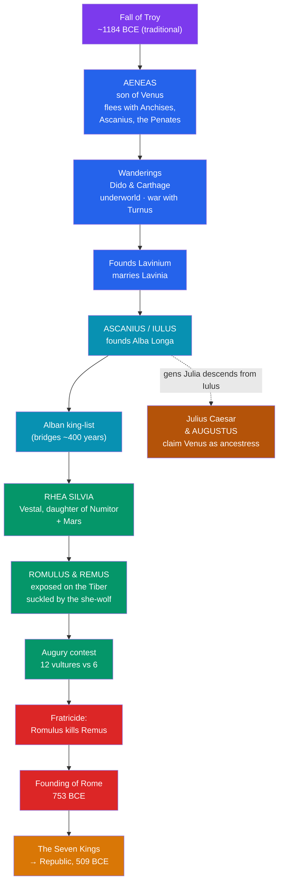

# 🐺 The Founding of Rome

> [!abstract] TL;DR
> Rome told **two** great origin stories and stitched them into one. In the first, the Trojan prince **Aeneas** — son of **Venus** — escapes the sack of Troy, wanders the Mediterranean (including a doomed affair with **Dido** of Carthage), and settles in Latium; **Virgil's *Aeneid*** (composed c. 29–19 BCE) made this the Roman national epic and tied Rome to the Homeric world of [[The_Trojan_War]]. In the second, the twins **Romulus and Remus**, sons of **Mars** and the Vestal **Rhea Silvia**, are exposed on the Tiber, suckled by a **she-wolf**, and grow up to found a city — until Romulus kills Remus and names Rome for himself in the traditional year **753 BCE**. The four-century gap between Troy's fall and Rome's founding was bridged by inserting the **Alban king-list**. Rome then filled its early history with the **rape of the Sabine women** and the **seven kings**, down to the tyrant Tarquin expelled in 509 BCE. Above all, foundation myth was **political**: by tracing the **gens Julia** back through Aeneas to Venus, **Augustus** made his rule the fulfillment of divine destiny.

## Intuition — analogy first

A foundation myth is a nation's **origin story in the comic-book sense** — the version of the past a people tells to explain *who we are and why we are entitled to be here*.

Every enduring community faces the same problem: raw history is messy, contingent, and often embarrassing, but a people wants its beginning to feel **necessary and glorious**. So it edits. Rome's editing was unusually visible because it had to reconcile **two incompatible starting points** it was unwilling to give up. One (Aeneas) plugged Rome into the prestigious Greek epic world and made Rome the heir of Troy — good for competing with Greek culture. The other (Romulus) was the homegrown, local, wolf-and-fratricide story that felt authentically Roman. Rather than choose, Rome **welded them end to end**, using a fabricated dynasty of Alban kings as the solder.

This is exactly the "charter myth" that anthropologists describe: a story whose real job is to **legitimize a present arrangement** by projecting it into a sacred past. When Augustus claimed descent from Venus through Aeneas, he was not doing genealogy; he was doing **politics with mythological instruments** — the same move a founding narrative always makes, studied comparatively in [[The_Comparative_Method]].

---

## How the Two Myths Were Harmonized

## Key Concepts

### Aeneas and the *Aeneid*

**Aeneas**, a Trojan prince, son of the goddess **Venus** and the mortal **Anchises**, appears already in **Homer's *Iliad*** as a warrior fated to survive Troy's fall (Book 20). Roman writers — **Naevius**, **Ennius**, **Fabius Pictor**, **Cato the Elder** — developed him into Rome's ancestor, but it was **Virgil's *Aeneid*** (12 books, composed c. 29–19 BCE and left unrevised at the poet's death) that gave the legend its canonical form.

The epic's arc: Aeneas escapes burning Troy carrying his aged father **Anchises** on his shoulders, leading his son **Ascanius** (also called **Iulus**), and bearing the household gods, the **Penates**. After years of wandering he is shipwrecked at **Carthage**, where his tragic love affair with Queen **Dido** ends in her suicide and curse — a mythic charter for the later Punic Wars. Guided by prophecy, he descends to the **underworld** (Book 6) to meet his father and glimpse the parade of future Roman heroes, then reaches **Latium** in Italy. There he wars against **Turnus** and the Rutulians, wins the hand of **Lavinia**, daughter of King Latinus, and founds **Lavinium**. The poem thus binds Rome to the prestige of [[The_Trojan_War]] and frames Roman destiny — *imperium sine fine*, "empire without end" — as decreed by Jupiter.

### Romulus, Remus, and the she-wolf

The native myth begins with the twins **Romulus and Remus**, sons of the Vestal **Rhea Silvia** (also **Ilia**) — a daughter of the rightful Alban king **Numitor** — and the god **Mars**. Numitor's usurping brother **Amulius** orders the infants exposed on the flooding **Tiber**. Their basket lodges beneath the **Palatine Hill**, where a **she-wolf (*lupa*)** suckles them and a woodpecker (both animals sacred to Mars) helps feed them, until the shepherd **Faustulus** and his wife **Acca Larentia** raise them.

Grown, the twins overthrow Amulius and restore Numitor, then set out to found a city of their own. A dispute over which hill and whose name settles it triggers an **augury contest**: Remus first sees **six vultures**, but Romulus then sees **twelve**. In the ensuing quarrel Romulus marks his walls on the Palatine; **Remus leaps over them in contempt and is killed** — by Romulus himself in the standard version. The **fratricide** stains the founding with kin-blood, and Romulus names the city **Rome** and becomes its first king. The traditional (Varronian) date is **21 April 753 BCE**, the festival of the **Parilia**.

### Harmonizing the two: the Alban king-list

The chronology did not fit: Troy fell (traditionally) around **1184 BCE**, but Rome was founded in **753 BCE** — a gap of roughly **four centuries** that Aeneas could not personally span. Roman antiquarians solved this by making Aeneas's son **Ascanius/Iulus** the founder of **Alba Longa**, followed by a long **dynasty of Alban kings** whose last generation produced Numitor, Amulius, and Rhea Silvia. The twins thus become Aeneas's distant descendants, and the two myths lock into a single continuous line: **Troy → Aeneas → Alba Longa → Romulus → Rome**.

| Element | Aeneas myth | Romulus myth |
|---|---|---|
| **Origin** | Trojan (foreign, Homeric) | Native Latin/Sabine |
| **Divine parent** | Venus (mother) | Mars (father) |
| **Chief source** | Virgil, *Aeneid* | Livy 1; Plutarch, *Life of Romulus* |
| **Founds** | Lavinium | Rome (Palatine) |
| **Dark motif** | Dido's suicide and curse | Fratricide of Remus |
| **Legitimizes** | Rome's Trojan/Julian ancestry | Rome's site, walls, and kingship |

### The rape of the Sabine women and the seven kings

Romulus's new city had men but few women. He staged a religious festival (the **Consualia**, honoring Consus) and invited the neighboring **Sabines**; at a signal the Romans seized the young Sabine women — the "**rape** (*raptio*, abduction) **of the Sabine women**." War followed under the Sabine king **Titus Tatius**, but the abducted women, now wives and mothers, threw themselves between the two armies and forced a peace, merging Romans and Sabines into one people (the origin of the citizen-title *Quirites*) under a brief joint kingship.

Rome's regal period then runs through **seven kings**, each credited with an institution:

| King | Traditional contribution |
|---|---|
| **Romulus** | Founding, the Senate, the army |
| **Numa Pompilius** | Religion — the calendar, priesthoods, Vesta's cult, Janus's shrine |
| **Tullus Hostilius** | War; destruction of Alba Longa (the **Horatii vs. Curiatii**) |
| **Ancus Marcius** | The port of Ostia; expansion of the plebs |
| **Tarquinius Priscus** | Etruscan king; the Circus Maximus, the Capitoline temple begun |
| **Servius Tullius** | The census and centuriate constitution; the city walls |
| **Tarquinius Superbus** | The tyrant "the Proud," expelled in **509 BCE** after the rape of **Lucretia**, founding the Republic |

### Myth as political legitimation

Roman foundation myth was inseparable from **power**. The patrician **gens Julia** (the Julian clan) claimed descent from **Iulus** (Ascanius) and therefore from Aeneas and **Venus** herself. **Julius Caesar** advertised this by dedicating a temple to **Venus Genetrix** ("Ancestress") in 46 BCE. His heir **Augustus** made the claim the ideological spine of his regime: he patronized Virgil's *Aeneid*, whose prophecies (Jupiter's speech in Book 1, the heroes in Book 6, the **Shield of Aeneas** depicting Augustus's victory at **Actium** in Book 8) frame the Augustan peace as the destined climax of Roman history. Augustus also invoked **Romulus** as a model second founder — he reportedly considered adopting the name Romulus, built the **Forum of Augustus** flanked by statues of Aeneas and Romulus, and dedicated a temple to **Mars Ultor** ("the Avenger"). Foundation myth, in short, was the language in which Rome argued about who deserved to rule.

## Primary Sources & Examples

- **Virgil, *Aeneid* (c. 29–19 BCE):** the definitive Aeneas narrative; its closing image — Aeneas killing the suppliant Turnus in rage — leaves the epic's moral cost pointedly unresolved.
- **Livy, *Ab Urbe Condita* Book 1 (c. 27 BCE):** the fullest connected account of Romulus, the Sabine women, and the seven kings, told with open awareness that early "history" is legend.
- **Plutarch, *Life of Romulus* (early 2nd c. CE):** a Greek biographer's version, preserving variant traditions (including that a follower, Celer, not Romulus, struck Remus).
- **Ovid, *Fasti*:** ties the myths to the festival calendar — the Parilia (Rome's birthday), the Lupercalia, and the wolf.
- **Comparative parallel:** the **fratricide** at Rome's founding echoes **Cain and Abel** and other "violence at the origin" motifs, a recurring pattern examined comparatively in [[The_Comparative_Method]].

## Common Pitfalls / Misconceptions

- **Thinking Rome chose one founder.** Rome deliberately kept **both** Aeneas and Romulus and engineered the Alban king-list precisely so it would not have to choose. The "problem" of two founders is really a solved, integrated system.
- **Reading the *Aeneid* as pure propaganda.** Virgil glorifies Rome's destiny yet laces the poem with grief and moral doubt (Dido, the death of Pallas, the final killing of Turnus). Scholars debate this "further voice"; flattening it to Augustan cheerleading misreads the text.
- **Taking 753 BCE and the seven kings as history.** These are **legendary** constructions systematized by late-Republican antiquarians; archaeology shows a gradual growth of settlements on Rome's hills, not a single act of foundation by one man on one day.
- **Confusing Aeneas's Lavinium with Rome.** Aeneas founds **Lavinium**, his son founds **Alba Longa**, and only Romulus founds **Rome**. Collapsing these erases the very bridge that harmonizes the two myths.

## Related Concepts

- [[The_Roman_Pantheon]] — **Venus** (Aeneas's mother) and **Mars** (the twins' father) as the divine anchors of the foundation
- [[Roman_Religion_and_Ritual]] — the rites Numa and Romulus were said to found: the Vestals, augury, the festival calendar
- [[_MOC_Roman_Myth|↑ Section MOC]] — the map of the Roman mythology section
- [[The_Trojan_War]] — the Homeric war Aeneas survives, linking Rome to the Greek epic tradition
- [[The_Comparative_Method]] — foundation/charter myth and the "violence at the origin" motif in comparative perspective
- Cross-vault: [[The_Twelve_Olympians|Greek Olympians]] — Venus/Aphrodite and the divine machinery of the *Aeneid*

## Review Questions

1. Rome had two foundation myths. Summarize each, and explain the specific device (the Alban king-list) that reconciled the four-century chronological gap between them.
2. Trace how the *gens Julia* and Augustus used the Aeneas legend for political legitimation. Name at least two concrete cultural or architectural expressions of that claim.
3. Both foundation myths contain a dark act (Dido's curse; the fratricide of Remus). What might these "shadows" contribute to Rome's self-understanding, and how does the fratricide compare to other origin myths of violence?

## Sources

- Virgil. *Aeneid* (trans. R. Fagles, Penguin, 2006)
- Livy. *The Early History of Rome* (Books 1–5; trans. A. de Sélincourt, Penguin)
- Wiseman, T. P. (1995). *Remus: A Roman Myth*. Cambridge University Press
- Beard, M., North, J., & Price, S. (1998). *Religions of Rome*, Vol. 1. Cambridge University Press

#mythology #roman-mythology #foundation-myth #aeneid #romulus
