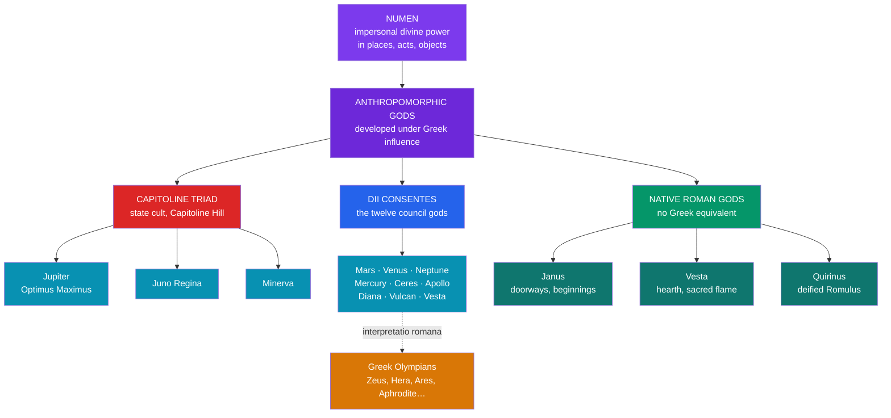

# 🏛️ The Roman Pantheon

> [!abstract] TL;DR
> The Roman state honored twelve chief gods, the **Dii Consentes**, crowned by the **Capitoline Triad** — **Jupiter** (sky-king), **Juno** (queen, marriage), and **Minerva** (wisdom, craft) — worshipped together in the great temple on the Capitoline Hill. From the late Republic onward Rome mapped these gods systematically onto the Greek Olympians through **interpretatio romana**, so that Jupiter = Zeus, Juno = Hera, Venus = Aphrodite, and so on, absorbing Greek narrative wholesale. Yet the pantheon kept a distinctly Roman accent: **Mars** ranks far above the Greek Ares as ancestor and protector of the state; **Venus** is the mother of the Roman people through Aeneas; and several major gods have **no Greek counterpart at all** — two-faced **Janus** of doorways and beginnings, **Vesta** of the sacred hearth, and **Quirinus**, the deified Romulus. Underneath the anthropomorphic gods lay an older, distinctively Roman intuition of the divine as **numen** — impersonal power resident in places, objects, and acts.

## Intuition — analogy first

Think of the Roman pantheon as a **conquered library re-shelved under a native cataloguing system**.

Rome did not invent most of the *stories* its gods tell — it imported them from Greece, where centuries of Homer, Hesiod, and tragedy had already given the Olympians rich biographies. What Rome supplied was the **shelving scheme**: a rule for deciding which foreign volume goes on which native shelf. That rule was **interpretatio romana** — "translating" a foreign god into the Roman one who fills the same functional slot. A Greek Zeus arrives; Rome files him under its own sky-father Jupiter and lets the Greek myths attach. A Gaulish or Germanic war-god arrives; Rome files him under Mars.

But the native shelves were built for Roman priorities, not Greek ones, and a few shelves have no Greek equivalent whatsoever. The god of the doorway (Janus) and the goddess of the hearth-fire that must never go out (Vesta) answer to Roman anxieties about **thresholds, continuity, and the household** that Greek myth never organized around. So the finished pantheon is a hybrid: Greek narrative content poured into a Roman functional frame — and the frame, not the content, is what tells you what Rome actually cared about. Compare the untranslated Greek originals in [[The_Twelve_Olympians]].

---

## How the Pantheon Is Organized

## Key Concepts

### The Dii Consentes and the Capitoline Triad

The **Dii Consentes** ("the gods who act together," or the advising gods) were Rome's canonical twelve great deities, their gilded statues standing in the Forum. The poet **Ennius** (c. 239–169 BCE) fixed the list in a mnemonic couplet: **Juno, Vesta, Minerva, Ceres, Diana, Venus, Mars, Mercury, Jupiter, Neptune, Vulcan, Apollo** — the Roman answer to the Greek council of twelve.

At the summit stood the **Capitoline Triad**: **Jupiter Optimus Maximus** ("Best and Greatest"), **Juno Regina** ("Queen"), and **Minerva**, sharing the vast temple on the Capitoline Hill dedicated by tradition in the Republic's first year (509 BCE). This triad was the religious heart of the Roman state; a victorious general's triumph ended with sacrifice to Capitoline Jupiter.

An **older triad** — **Jupiter, Mars, Quirinus**, served by the three senior priests (*flamines maiores*) — preceded it. **Georges Dumézil** read this archaic triad as a survival of the Indo-European **trifunctional** ideology (sovereignty, war, production), a direct parallel to the Vedic and Norse triads discussed in [[The_Comparative_Method]].

| God | Sphere | Distinctively Roman emphasis |
|---|---|---|
| **Jupiter** | Sky, thunder, sovereignty, oaths | Guarantor of the state, treaties, and the triumph; *Iuppiter Optimus Maximus* |
| **Juno** | Marriage, women, the state's welfare | *Juno Moneta* (of the mint); each woman's protective *iuno* |
| **Minerva** | Wisdom, crafts, strategic war | Patron of guilds and artisans (the *Quinquatrus* festival) |
| **Mars** | War — **and** agriculture, boundaries | Father of Romulus; second only to Jupiter; the month *Martius* |
| **Venus** | Love, beauty, generation | Ancestress of the Roman people via **Aeneas**; *Venus Genetrix* |
| **Vesta** | The hearth, the sacred flame | State cult tended by the **Vestal Virgins**; no myth cycle |

### Interpretatio romana and Greek syncretism

**Interpretatio romana** — the phrase is **Tacitus's**, from the *Germania* — names Rome's habit of identifying the gods of other peoples with its own. Applied to the far richer Greek pantheon, it produced a near one-to-one **syncretism** in which Roman gods inherited the Greeks' names' worth of stories. By the time of **Ennius, Plautus, Virgil, and Ovid**, a Roman audience read Jupiter's love affairs, Juno's jealousy, and Mars's adultery as if they had always been Roman — though these narratives are Greek imports laid over Roman cult.

| Roman | Greek | Core domain |
|---|---|---|
| **Jupiter** | **Zeus** | Sky, king of gods |
| **Juno** | **Hera** | Marriage, queen of gods |
| **Minerva** | **Athena** | Wisdom, craft, war |
| **Mars** | **Ares** | War |
| **Venus** | **Aphrodite** | Love, beauty |
| **Neptune** | **Poseidon** | Sea (and horses) |
| **Mercury** | **Hermes** | Commerce, messenger |
| **Diana** | **Artemis** | Hunt, moon |
| **Ceres** | **Demeter** | Grain, harvest |
| **Vulcan** | **Hephaestus** | Fire, smithing |
| **Bacchus / Liber** | **Dionysus** | Wine, ecstasy |
| **Vesta** | **Hestia** | Hearth |
| **Pluto / Dis Pater** | **Hades** | Underworld |
| **Proserpina** | **Persephone** | Underworld queen |
| **Saturn** | **Cronus** | Agriculture, the Golden Age |

Note that **Apollo** kept his Greek name — Rome imported him wholesale, having no native equivalent — and that the mapping is rarely perfect: Roman **Mercury** derives from *merx* ("merchandise") and leans commercial, while **Neptune** was a god of fresh water and horses (*Neptunus Equester*) before he was assimilated to the sea-god Poseidon.

### The distinctively Roman gods

Some of Rome's most important deities resisted translation because Greece had nothing to file them under:

- **Janus** — god of **doorways, gates, beginnings, and transitions**, depicted with **two faces** looking both ways. He had no Greek counterpart and was invoked *first* in any prayer sequence, before even Jupiter, because he governed openings. The doors of his shrine, the *Ianus geminus* in the Forum, stood **open in wartime and closed in peace** — closed only a handful of times in Rome's history. January (*Ianuarius*) bears his name.
- **Vesta** — goddess of the **hearth** and the undying **sacred flame** of the state, tended by the **Vestal Virgins**. Though nominally equated with Hestia, her cult was central to Roman public religion in a way Hestia's never was in Greece, and she has essentially **no mythological narrative** — she is pure cult.
- **Quirinus** — an archaic (probably Sabine) god of the Roman community, later identified with the **deified Romulus** after his apotheosis. His name gives *Quirites*, a formal term for Roman citizens.
- Others include **Terminus** (boundary stones), **Faunus** (wild countryside), **Fortuna** (chance, fate), **Bellona** (war), and **Portunus** (harbors) — a crowd of gods tied to Roman civic and agricultural life rather than to storytelling.

### Numina and the sense of divine presence

Beneath the imported anthropomorphism lay an older Roman intuition: **numen** (plural *numina*), from *nuere*, "to nod" — the divine will expressed, and by extension the **impersonal power** felt to reside in a place, object, or action. Early Roman religion recognized a swarm of such powers, many barely personified: minor deities of highly specific functions (the *indigitamenta* listed gods of the door-hinge, the threshold, the sowing, the first cry of an infant). The Romans distinguished **di indigetes** (the old native gods) from **di novensides** (newcomers). Whether *numen* historically *preceded* full personhood (the old "dynamism" thesis of H. J. Rose) is now disputed by scholars such as **John Scheid**, but the term captures a real feature of Roman piety: a pervasive sense that divine presence saturated ordinary places and acts, demanding correct acknowledgment — the intuition that flowers into ritual in [[Roman_Religion_and_Ritual]].

## Examples Across Cultures

- **Functional translation (interpretatio):** Julius Caesar, describing Gaulish religion in the *Bellum Gallicum*, names the gods only by their Roman equivalents — "Mercury," "Apollo," "Mars" — because he interprets them through the Roman grid rather than recording native names. The same reflex let Rome later absorb Egyptian **Isis**, Persian **Mithras**, and the Anatolian **Magna Mater (Cybele)**, formally imported in 204 BCE.
- **Greek content, Roman frame:** Ovid's *Metamorphoses* retells Greek myth almost entirely, using Roman names — the clearest proof that by the Augustan age the Greek stories *were* the Roman gods' stories.
- **A god that stayed Roman:** No Greek myth explains **Janus**; his two faces and his festival of beginnings are Rome's own contribution, invoked at the New Year and at the opening of every enterprise.
- **The trifunctional survival:** The archaic *Jupiter–Mars–Quirinus* triad aligns with the Vedic *Mitra-Varuṇa / Indra / Aśvins* and Norse *Óðinn / Þórr / Freyr* — Dumézil's flagship evidence for a shared Indo-European inheritance (see [[The_Comparative_Method]]).

## Common Pitfalls / Misconceptions

- **"Roman gods are just Greek gods renamed."** The syncretism is late and literary; the *cult* underneath is independently Roman. Mars's agrarian and ancestral roles, Vesta's state hearth, and Janus's existence have no Greek source. The names map; the religion does not.
- **"The pantheon was fixed and closed."** Rome's list of gods was famously **open**: it repeatedly imported foreign deities (Cybele, Aesculapius, Isis, Mithras) and could ritually "call out" (*evocatio*) an enemy city's patron god to Rome. The Dii Consentes were the core, not the boundary.
- **Confusing the two triads.** The **Capitoline Triad** (Jupiter–Juno–Minerva) is the classical state cult; the **archaic triad** (Jupiter–Mars–Quirinus) is older and functionally structured. They are not the same three gods.
- **Treating *numen* as "spirit" or "soul."** *Numen* is not a ghost or animating soul but an expression of **divine power/will**; reading it through later spiritualist categories distorts the Roman sense of the sacred as active presence demanding correct response.

## Related Concepts

- [[The_Founding_of_Rome]] — how **Venus** and **Mars** anchor the foundation myths through Aeneas and Romulus
- [[Roman_Religion_and_Ritual]] — how these gods were actually served: the state cult, priesthoods, and household worship
- [[_MOC_Roman_Myth|↑ Section MOC]] — the map of the Roman mythology section
- [[The_Twelve_Olympians]] — the Greek originals that *interpretatio romana* mapped onto the Roman gods
- [[The_Comparative_Method]] — Dumézil's trifunctional reading of the archaic *Jupiter–Mars–Quirinus* triad
- Cross-vault: [[_MOC_Greek_Myth|Greek Mythology]] — the narrative tradition Rome absorbed

## Review Questions

1. Explain *interpretatio romana* and give three Roman↔Greek equivalences. Why does the existence of gods like Janus and Vesta show that the pantheon is not simply "Greek gods renamed"?
2. Distinguish the **Capitoline Triad** from the **archaic triad**. What did Dumézil argue the archaic triad reveals about Rome's Indo-European inheritance?
3. Define *numen* and explain how it differs from the anthropomorphic Olympian model of divinity. What does the abundance of narrowly specialized minor deities tell you about early Roman religious sensibility?

## Sources

- Beard, M., North, J., & Price, S. (1998). *Religions of Rome* (2 vols.). Cambridge University Press
- Dumézil, G. (1970). *Archaic Roman Religion* (trans. P. Krapp). University of Chicago Press
- Ovid. *Fasti* (trans. A. J. Boyle & R. D. Woodard, Penguin, 2000)
- Scheid, J. (2003). *An Introduction to Roman Religion* (trans. J. Lloyd). Indiana University Press

#mythology #roman-mythology #pantheon #interpretatio-romana #jupiter
