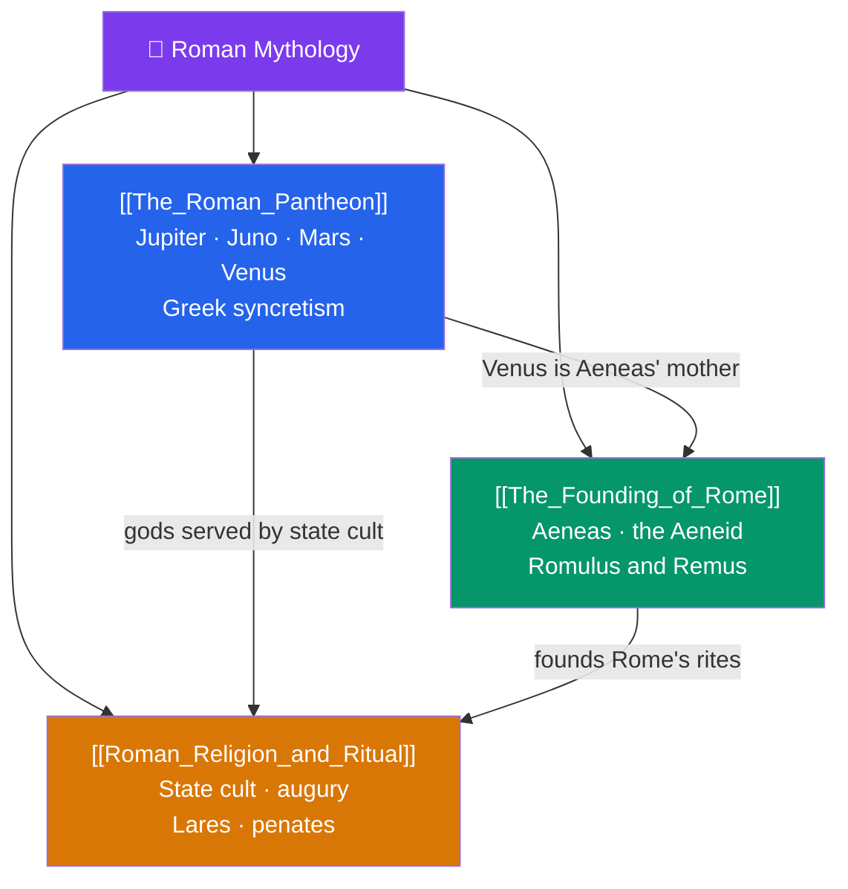

# 🦅 Roman Mythology — Map of Content

> [!abstract] What This Section Covers
> Roman mythology is defined by two forces: a deep, ritual-centered native religion, and a wholesale literary absorption of Greek myth. This section opens with **The Roman Pantheon** — Jupiter, Juno, Mars, Venus, and their kin — and the *interpretatio romana* that fused them with Greek Olympians while preserving distinctly Roman priorities like Mars's martial primacy. **The Founding of Rome** treats the national epic: Virgil's *Aeneid*, in which the Trojan exile Aeneas seeds Rome's destiny, and the twin myth of Romulus and Remus, wolf-suckled founders whose fratricide shadows the city's origins. **Roman Religion and Ritual** turns from story to practice — the state cult, augury and the reading of omens, and the household gods (lares and penates) — showing a mythology whose center of gravity was orthopraxy (right action) rather than narrative. Together they reveal how Rome mythologized its own power.

## Concept Map

## Learning Path

1. [[The_Roman_Pantheon]] — The chief gods and how *interpretatio romana* mapped them onto the Greek Olympians.
2. [[The_Founding_of_Rome]] — The two foundation myths: Aeneas and the *Aeneid*, then Romulus, Remus, and the she-wolf.
3. [[Roman_Religion_and_Ritual]] — How Romans practiced religion: the state cult, augury, priesthoods, and household worship.

## All Notes at a Glance

| Note | Difficulty | What You'll Learn |
|------|------------|-------------------|
| [[The_Roman_Pantheon]] | Beginner | Jupiter, Juno, Minerva (Capitoline Triad), Mars, Venus, Neptune; Greek equivalences and Roman distinctives |
| [[The_Founding_of_Rome]] | Intermediate | Aeneas's flight from Troy, Virgil's *Aeneid*, Romulus and Remus, the fratricide, the Sabine women |
| [[Roman_Religion_and_Ritual]] | Intermediate | State cult, pontiffs, augury and auspices, the Vestals, lares and penates, orthopraxy vs belief |

## Key Questions This Section Answers

- How did Rome absorb Greek mythology while keeping a distinct religious identity?
- Why does Rome have two competing foundation myths, and what does each legitimize?
- What was the political purpose of tracing Rome's origin to Trojan Aeneas?
- Why was Roman religion more about correct ritual than about myth or belief?
- What were the lares and penates, and how did household worship relate to the state cult?

## Related Sections

- [[_MOC_Mythology_Master|↑ Mythology Master MOC]]
- [[_MOC_Greek_Myth|← Greek]]
- [[_MOC_Norse_Myth|→ Norse & Germanic]]
- Cross-vault: [[The_Trojan_War]] (Aeneas as Trojan survivor), [[The_Twelve_Olympians]] (Greek counterparts)

#MOC #Mythology #RomanMyth
