# 🔥 Creation and Ragnarök

> [!abstract] TL;DR
> Norse myth frames time as an arc from a first void to a foretold end. In the beginning there is only **Ginnungagap**, the "yawning void," between fiery **Muspelheim** and icy **Niflheim**. Their meeting melts the ice into the first being — the giant **Ymir** — and the cow **Audhumla**, who licks the first god's ancestor from the salty ice. **Odin** and his brothers **Vili** and **Vé** slay Ymir and build the world from his body: flesh into earth, blood into sea, skull into sky, brains into clouds. They then make the first humans, **Ask and Embla**, from two logs on the shore. The cosmos so made is doomed: **Ragnarök** ("the fate of the gods") brings the **Fimbulwinter**, the loosing of the wolf **Fenrir** and the serpent **Jörmungandr**, and a final battle in which **Odin**, **Thor**, **Freyr**, and **Loki** all fall, the sun blackens, and the world sinks into the sea — only to **rise again, green and renewed**, with survivors to repeople it.

## Intuition — analogy first

Norse cosmology is best understood as a **cycle with a knife in it** — a great wheel that turns from void to world to destruction, but where every actor knows *in advance* that the wheel will break.

Compare two ways a story can handle the end of the world. In one, catastrophe is a surprise, a punishment for sin that the righteous might yet avert. In the other — the Norse one — the end is **prophesied and fixed**: the seeress of *Völuspá* narrates Ragnarök in the past tense, as something that *has already been seen*. The gods know Fenrir will one day swallow Odin, that Thor will kill the serpent and die of its venom, and they act heroically anyway. This is the distinctive Norse ethic: **doom is certain, courage is the response**. Where [[Enuma_Elish|the Babylonian cosmos]] is *made and then ruled forever*, the Norse cosmos is *made, and its unmaking is written into the same prophecy*. That fatalism — creation and apocalypse as two ends of one told story — is what makes Norse eschatology unlike almost any other; see [[Creation_and_Flood_Myths]] for the cross-cultural comparison.

---

## From Void to Doom to Renewal

```mermaid
graph LR
    Void["GINNUNGAGAP\nthe yawning void"] --> Meet["fire ✕ ice\nMuspelheim + Niflheim"]
    Meet --> Ymir["YMIR\nprimal giant\n+ Audhumla (cow)"]
    Ymir --> Slay["Odin · Vili · Vé\nslay Ymir"]
    Slay --> World["WORLD MADE\nflesh→earth · blood→sea\nskull→sky"]
    World --> Humans["ASK & EMBLA\nfirst humans\nfrom two logs"]
    Humans --> Order["the age of gods\n(Yggdrasil, Asgard)"]
    Order --> Fimbul["FIMBULWINTER\nthree winters, no summer"]
    Fimbul --> Loose["Fenrir & Jörmungandr\nloosed · Naglfar sails"]
    Loose --> Battle["RAGNARÖK\nOdin✝ Thor✝ Freyr✝ Loki✝"]
    Battle --> Sink["Surt's fire\nworld sinks into sea"]
    Sink --> Reborn["RENEWAL\ngreen earth rises\nsurvivors repeople"]
    Reborn -.->|"cycle implied"| Order

    style Void fill:#1e293b,color:#fff
    style Meet fill:#7c3aed,color:#fff
    style Ymir fill:#d97706,color:#fff
    style Slay fill:#d97706,color:#fff
    style World fill:#059669,color:#fff
    style Humans fill:#059669,color:#fff
    style Order fill:#2563eb,color:#fff
    style Fimbul fill:#0891b2,color:#fff
    style Loose fill:#dc2626,color:#fff
    style Battle fill:#dc2626,color:#fff
    style Sink fill:#1e293b,color:#fff
    style Reborn fill:#059669,color:#fff
```

## Key Concepts

### Ginnungagap, fire, and ice

Before the world there is **Ginnungagap** (the "yawning / magically-charged void"), flanked by two primordial realms: to the south **Muspelheim**, a region of fire guarded by the giant **Surt** with his flaming sword; to the north **Niflheim**, a realm of ice, mist, and the frozen rivers called **Élivágar** flowing from the spring **Hvergelmir**. Where the sparks of Muspelheim met the rime of Niflheim in the void, the ice **melted into life**. This dualism of **fire and ice** — rather than order versus chaos, or a creator ex nihilo — is the distinctive Norse cosmogonic engine.

### Ymir and Audhumla

From the melting rime emerges **Ymir** (also *Aurgelmir*), the first and greatest of the **frost-giants**; as he sleeps, more giants are born from his sweat and from his legs — a self-generating, unruly proto-life. Alongside him the melting ice forms the primeval cow **Audhumla**, whose milk feeds Ymir. Audhumla licks the salty ice-blocks and over three days uncovers **Búri**, ancestor of the gods; Búri's grandson is **Odin**, born with his brothers **Vili** and **Vé** to Búri's son **Borr** and the giantess **Bestla**. The gods are thus **half-giant** by descent — kin to the very forces they must fight.

### The slaying of Ymir and the world from his body

Odin, Vili, and Vé **kill Ymir**; his blood floods out so violently it drowns nearly all the frost-giants. From his corpse they construct the world — a **cosmogonic dismemberment** motif:

| Ymir's body | Becomes |
|---|---|
| Flesh | the **earth** |
| Blood | the **sea** and lakes |
| Bones | the **mountains** |
| Teeth / broken bones | rocks and scree |
| Skull | the **dome of the sky** (held by four dwarves) |
| Brains | the **clouds** |
| Eyebrows / lashes | **Midgard**'s protective fence |

This closely parallels [[Enuma_Elish|the Babylonian *Enūma Eliš*]], where **Marduk** splits the slain sea-goddess **Tiamat** to form sky and earth — a striking case of the "cosmos built from a slain primordial being" pattern. Whether this reflects diffusion, Indo-European inheritance, or independent invention is exactly the kind of question [[The_Comparative_Method|comparative method]] weighs; see also [[Creation_and_Flood_Myths]].

### Ask and Embla, the first humans

Walking the new shore, three gods (Odin with, in Snorri, **Vili and Vé**; in *Völuspá*, **Hœnir** and **Lóðurr**) find two lifeless logs — an ash, **Ask**, and (probably) an elm or vine, **Embla** — and endow them with the gifts of life: **breath/spirit**, **mind/motion**, and **warmth, form, and speech/senses**. Humanity thus begins as **driftwood quickened by the gods**, a humbler origin than being molded from clay in the divine image.

### Ragnarök: the doom of the gods

**Ragnarök** — Old Norse *Ragnarǫk*, "the fate/doom of the gods" (Snorri's pun *ragnarøkkr*, "twilight of the gods," gave Wagner his *Götterdämmerung*) — is narrated as prophecy. Its sequence:

1. **Moral collapse** among humankind — an "axe-age, sword-age," brothers slaying brothers.
2. The **Fimbulwinter** — three great winters with no summer between.
3. Cosmic signs: the wolves **Sköll** and **Hati** swallow sun and moon; the stars vanish; Yggdrasil trembles.
4. The bonds break: the wolf **Fenrir** is loosed, the world-serpent **Jörmungandr** rises from the sea, the ship **Naglfar** (built of dead men's nails) sails with the giants, and **Loki** and **Hel**'s hosts advance while **Surt** leads the fire-giants over shattered **Bifröst**.
5. **Heimdall** blows **Gjallarhorn**; the Æsir and the *einherjar* (Odin's chosen slain) march from Valhalla to the plain **Vígríðr**.
6. The **fated deaths**: **Odin** is swallowed by **Fenrir** (avenged by his son **Víðarr**); **Thor** kills **Jörmungandr** but falls dead after nine steps from its venom; **Freyr**, having given away his sword, falls to **Surt**; **Týr** and the hound **Garmr** kill each other; **Loki** and **Heimdall** slay each other. Surt's fire then engulfs the world and it **sinks into the sea**.

### Renewal

Ragnarök is **not the absolute end**. *Völuspá* foretells a **green earth rising anew** from the water; a new sun (the old sun's daughter); the survival of a human pair, **Líf and Lífþrasir**, who hid in the wood **Hoddmímis holt**; and the return of younger gods — **Baldr** and **Höðr** reconciled, and **Víðarr** and **Móði/Magni** (Thor's sons) inheriting **Mjölnir**. The cycle of destruction and rebirth is thus closed, giving Norse eschatology its characteristic blend of **fatalism and hope**.

## Primary Sources & Examples

- **Völuspá** (*Poetic Edda*) — the master text: a seeress narrates creation from Ginnungagap through Ragnarök to the renewed world, all in prophetic retrospect.
- **Vafþrúðnismál** & **Grímnismál** (*Poetic Edda*) — Odin's wisdom-contests that supply cosmogonic details (Ymir, Élivágar, Líf and Lífþrasir).
- **Gylfaginning** (*Prose Edda*) — Snorri's ordered narrative of Ginnungagap, Audhumla, the making of the world from Ymir, Ask and Embla, and the full Ragnarök sequence.
- **Comparative**: *Enūma Eliš* (Marduk / Tiamat) for cosmos-from-a-corpse; Zoroastrian **Frashokereti** for a prophesied cosmic renewal — see [[Enuma_Elish]] and [[Creation_and_Flood_Myths]].

## Common Pitfalls / Misconceptions

- **Thinking Ragnarök is a pure apocalypse.** The sources explicitly describe **renewal** after the destruction; it is a cyclical death-and-rebirth, not a one-way end.
- **Assuming a creator god made the world from nothing.** There is no *creatio ex nihilo*: the world is **built from the body** of a pre-existing giant, and the gods themselves descend from giants.
- **Over-reading Christian influence.** Snorri wrote as a 13th-century Christian, and some renewal/"one Baldr-like ruler" imagery may be coloured by it; scholars debate how much of *Völuspá*'s ending is pre-Christian. Treat the sources critically.
- **Confusing Fenrir, Jörmungandr, and Hel.** These are the **three monstrous children of Loki** (see [[Odin_Thor_and_Loki]]): the wolf, the world-serpent, and the death-goddess — each with a distinct role at Ragnarök.

## Related Concepts

- [[_MOC_Norse_Myth|↑ Section MOC]] — the frame narrative of the whole section
- [[Yggdrasil_and_the_Nine_Realms]] — Muspelheim and Niflheim as the primordial realms; the tree that survives the end
- [[Odin_Thor_and_Loki]] — the fated deaths of Odin, Thor, and Loki; Loki's monstrous children
- [[The_Aesir_and_the_Vanir]] — why Freyr is swordless (and doomed) at Ragnarök
- Cross-vault: [[Enuma_Elish]] — the slain-primordial-being cosmogony (Marduk and Tiamat)
- Cross-vault: [[Creation_and_Flood_Myths]] — cosmogony and destruction motifs across cultures

## Review Questions

1. Trace the Norse cosmogony from Ginnungagap to Ask and Embla, naming Ymir, Audhumla, and the gods who shaped the world. What is theologically distinctive about building the world from a slain being rather than creating it from nothing?
2. Compare the making of the world from Ymir's body with the *Enūma Eliš* account of Marduk and Tiamat. What does the parallel illustrate about the comparative method?
3. List the fated deaths of Odin, Thor, and Freyr at Ragnarök, and explain why Norse eschatology is described as combining fatalism with hope.

## Sources

- *The Poetic Edda* (esp. *Völuspá*, *Vafþrúðnismál*), trans. Carolyne Larrington (Oxford World's Classics, rev. 2014)
- Sturluson, Snorri. *The Prose Edda* (*Gylfaginning*), trans. Anthony Faulkes (Everyman, 1987)
- Lindow, John (2001). *Norse Mythology: A Guide to the Gods, Heroes, Rituals, and Beliefs*. Oxford University Press
- Abram, Christopher (2011). *Myths of the Pagan North: The Gods of the Norsemen*. Continuum

#mythology #norse-myth #cosmogony #eschatology #eddas
