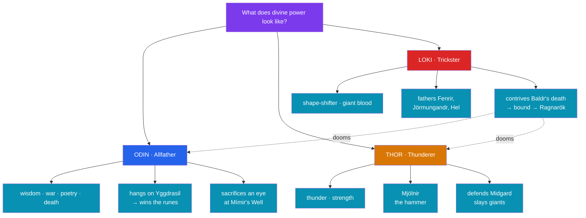

# ⚡ Odin, Thor, and Loki

> [!abstract] TL;DR
> Three figures dominate the Norse imagination. **Odin** (*Óðinn*), the **Allfather**, is the god of wisdom, war, poetry, and death — a restless, ambiguous seeker who **hangs himself on Yggdrasil** for nine nights to win the **runes** and **sacrifices an eye** at Mímir's well for a drink of wisdom. **Thor** (*Þórr*), his son, is the **thunder-god**: straightforward, immensely strong, wielder of the hammer **Mjölnir**, and the tireless **defender of Midgard and Asgard** who slays giants and will die killing the world-serpent. **Loki** is the **trickster** — a shape-shifting being of giant blood counted among the Æsir, alternately the gods' clever helper and their saboteur. He fathers the monsters (Fenrir, Jörmungandr, Hel), engineers the **death of Baldr**, and is bound until he breaks free to lead the forces of destruction at **Ragnarök**. All three are known almost entirely through the **Poetic** and **Prose Eddas**.

## Intuition — analogy first

Read Odin, Thor, and Loki as three **answers to the question "what does power look like?"** — and note that Norse myth refuses to make its chief god the simple one.

Odin is **power through knowledge and sacrifice**: he will trade an eye, hang on a tree, seduce, deceive, and betray to gain wisdom, because he alone knows Ragnarök is coming and is desperate to postpone it. Thor is **power through force and reliability**: no riddles, no bargains — a hammer, a short temper, and a clear job (keep the giants out). Loki is **power through cleverness unbound by loyalty**: the mind that solves the gods' problems is the same mind that destroys them, because a trickster serves no order but the churn itself.

This triad maps loosely onto a recurring cross-cultural pattern — the **wise sovereign, the warrior-protector, and the trickster** — and Loki in particular is the Norse instance of the **Trickster archetype** that Carl Jung and folklorists find worldwide: the boundary-crosser who is creator and destroyer at once. See [[Jungian_Archetypes_and_Myth]]. That the Norse *chief* god is himself a devious, self-sacrificing seeker rather than a serene ruler is one of the mythology's most striking features.

---

## Three Modes of Power

## Key Concepts

### Odin the Allfather — wisdom bought with sacrifice

**Odin** (*Óðinn*; his name relates to *óðr*, "fury, ecstasy, poetic inspiration") is chief of the Æsir and god of a startling range of domains: **wisdom, war, poetry, sovereignty, magic (*seiðr*), and death**. He is not a god of comfort but of **hard-won knowledge**, and his defining acts are **self-sacrifices**:

- **The hanging on Yggdrasil.** In *Hávamál* (138–141), Odin declares he hung "nine long nights" on the windy tree, "wounded with a spear, given to Óðinn, myself to myself," fasting, until he **seized the runes** and fell back screaming with the knowledge. The tree's very name, **Yggdrasil** ("Odin's steed"), memorializes this shamanic self-offering (see [[Yggdrasil_and_the_Nine_Realms]]).
- **The eye at Mímir's Well.** Odin gave one **eye** into the well beneath a root of Yggdrasil for a single drink of its water of wisdom — a permanent trade of sight for insight.
- **The mead of poetry.** Through disguise, seduction, and theft he wins the **mead of poetry** (made from the blood of the slain Kvasir) and brings inspired verse to gods and poets.

Odin gathers the battle-slain **einherjar** into **Valhalla**, aided by the **Valkyries**, not out of mercy but to muster an army for **Ragnarök** — knowing all the while, from prophecy, that he is fated to be swallowed by the wolf **Fenrir**. His attributes include the spear **Gungnir**, the eight-legged horse **Sleipnir** (Loki's offspring), the ravens **Huginn** ("thought") and **Muninn** ("memory"), and countless bynames (**Grímnir**, **Bölverk**, **Wodan/Woden** — whence "Wednesday").

### Thor the Thunderer — the defender

**Thor** (*Þórr*; Old English *Þunor*, whence "Thursday") is Odin's son by the earth-goddess **Jörð**, and by far the most **popular** god in practice — invoked on amulets, oath-rings, and runestones far more than the elite, unpredictable Odin. He is the god of **thunder, storm, and strength**, and the **protector** of the ordered worlds against the **giants** (*jötnar*) of chaos:

- **Mjölnir**, his short-handled hammer forged by dwarves, always returns when thrown and is the supreme giant-slaying weapon; it also **hallows** (blesses weddings, funerals, the reborn world).
- His gear includes the belt **Megingjörð** (doubling his strength) and iron gloves; he rides a chariot drawn by two goats he can slaughter and revive.
- Signature tales: fishing for the **world-serpent Jörmungandr** (*Hymiskviða*); the journey to **Útgarða-Loki**, where giant illusions defeat him (he wrestles "Old Age," drinks at "the sea"); and the theft of Mjölnir by the giant Þrymr, forcing Thor to disguise himself as the bride "Freyja" (*Þrymskviða*).

At **Ragnarök**, Thor and Jörmungandr **kill each other** — he slays the serpent but staggers only nine steps before dying of its venom (see [[Creation_and_Ragnarok]]).

### Loki the trickster — helper and doom

**Loki** is the most **ambivalent** figure in the pantheon: son of the giant **Fárbauti**, counted among the Æsir (a sworn blood-brother of Odin), yet never fully of them. He is a **shape-shifter** (becoming a mare, a salmon, a fly, an old woman) and the archetypal **trickster** — the intelligence that both **solves and creates** the gods' crises:

- As **helper**, his schemes repeatedly rescue the gods: he tricks the giant builder of Asgard's wall out of his payment (bearing **Sleipnir** as a mare in the process), and he recovers stolen treasures, including securing **Mjölnir** itself from the dwarves.
- As **father of monsters**, by the giantess **Angrboða** he sires the three great enemies of the gods: the wolf **Fenrir**, the world-serpent **Jörmungandr**, and **Hel**, ruler of the dead (see [[Creation_and_Ragnarok]]).
- As **destroyer**, he engineers the **death of Baldr**: learning that mistletoe alone was never sworn to spare Baldr, Loki guides the blind god **Höðr** to throw a mistletoe dart that kills the beloved son, then (disguised as the giantess **Þökk**) refuses to weep him out of Hel, sealing the loss. In **Lokasenna** he insults every god at the feast; the gods finally **bind him** with the entrails of his own son beneath a venom-dripping serpent, where he writhes (causing earthquakes) until he **breaks free at Ragnarök** to steer the ship **Naglfar** and lead the dead against the gods, dying in mutual slaughter with **Heimdall**.

### The trickster as archetype

Loki is the Norse case study for the cross-cultural **Trickster**: like the Native American **Coyote/Raven**, the West African **Anansi/Eshu**, or the Greek **Hermes/Prometheus**, he is a **boundary-crosser** — between gods and giants, male and female, order and chaos, benefit and harm. Structurally (in Lévi-Strauss's terms) the trickster **mediates oppositions**; psychologically (in Jung's) he is the **shadow**, the disruptive, amoral creativity a well-ordered psyche or society both needs and fears. See [[Jungian_Archetypes_and_Myth]] and [[The_Comparative_Method]].

| God | Function | Signature object | Defining act | Fate at Ragnarök |
|---|---|---|---|---|
| **Odin** | Sovereignty, wisdom, war | Spear **Gungnir** | Hangs on Yggdrasil for the runes | Swallowed by **Fenrir** |
| **Thor** | Force, protection | Hammer **Mjölnir** | Slays giants, guards Midgard | Kills **Jörmungandr**, dies of venom |
| **Loki** | Trickster, catalyst | (shape-shifting) | Contrives **Baldr's** death | Kills & killed by **Heimdall** |

## Primary Sources & Examples

- **Hávamál** ("Sayings of the High One," *Poetic Edda*) — Odin's self-hanging on the tree and winning of the runes; his hard-edged wisdom.
- **Þrymskviða** & **Hymiskviða** (*Poetic Edda*) — Thor's cross-dressing recovery of Mjölnir, and his fishing for the world-serpent — the tone often comic.
- **Lokasenna** & **Baldrs draumar** (*Poetic Edda*) — Loki's flyting of the gods; the doom hanging over Baldr.
- **Gylfaginning** & **Skáldskaparmál** (*Prose Edda*) — Snorri's connected narratives: Baldr's death, the binding of Loki and Fenrir, the mead of poetry, and the gods' attributes.

## Common Pitfalls / Misconceptions

- **Picturing Odin as a benevolent sky-father.** He is a **devious, ruthless seeker** who breaks oaths and incites wars for wisdom and warriors; his nobility is tragic (fighting a doom he cannot escape), not paternal.
- **Modern "Loki as sympathetic anti-hero."** Popular film has softened Loki; the Eddic Loki grows from mischievous helper into the **agent of the gods' destruction** — a genuine trickster, neither straightforwardly good nor a simple villain.
- **Assuming Thor was a minor "muscle" god.** Archaeologically he was likely the **most widely worshipped** of the three among ordinary Norse people; Mjölnir amulets are the commonest surviving cult objects.
- **Treating Loki as a plain "devil."** He is not a principle of cosmic evil but a **boundary-figure** of giant descent among the gods; his destructiveness is inseparable from his usefulness — the trickster's defining paradox.

## Related Concepts

- [[_MOC_Norse_Myth|↑ Section MOC]] — the central deities of the section
- [[The_Aesir_and_the_Vanir]] — Odin and Thor as leading Æsir; the pantheon they head
- [[Yggdrasil_and_the_Nine_Realms]] — Odin's hanging on the tree and his eye at Mímir's Well
- [[Creation_and_Ragnarok]] — Loki's monstrous children and the fated deaths of all three
- Cross-vault: [[Jungian_Archetypes_and_Myth]] — the Trickster archetype embodied in Loki
- Cross-vault: [[The_Comparative_Method]] — the trickster as mediator of binary oppositions

## Review Questions

1. Describe Odin's two great sacrifices (the hanging on Yggdrasil and the eye at Mímir's Well) and explain what they reveal about the Norse relationship between wisdom, sacrifice, and death.
2. Contrast Thor's mode of power with Odin's, using one representative myth of each. Why was Thor apparently the more popular god in actual Norse worship?
3. Explain why Loki is called an "ambivalent" trickster rather than an evil god, citing both a myth where he helps the gods and one where he destroys them. How does he exemplify the cross-cultural Trickster archetype?

## Sources

- *The Poetic Edda* (esp. *Hávamál*, *Þrymskviða*, *Lokasenna*), trans. Carolyne Larrington (Oxford World's Classics, rev. 2014)
- Sturluson, Snorri. *The Prose Edda* (*Gylfaginning*, *Skáldskaparmál*), trans. Anthony Faulkes (Everyman, 1987)
- Lindow, John (2001). *Norse Mythology: A Guide to the Gods, Heroes, Rituals, and Beliefs*. Oxford University Press
- Turville-Petre, E. O. G. (1964). *Myth and Religion of the North: The Religion of Ancient Scandinavia*. Weidenfeld & Nicolson

#mythology #norse-myth #deities #trickster #eddas
