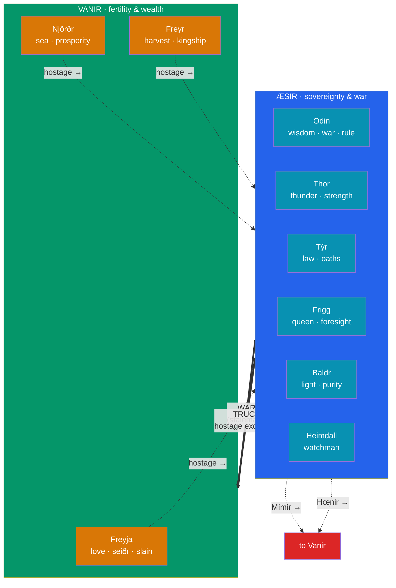

# ⚔️ The Aesir and the Vanir

> [!abstract] TL;DR
> The Norse gods fall into **two tribes**. The **Æsir** are the dominant sky-and-sovereignty gods of Asgard — **Odin** (war, wisdom), **Thor** (thunder, strength), **Týr** (law, war), **Frigg** (queen, foreknowledge), **Baldr** (light, purity), and **Heimdall** (the watchman). The **Vanir** are the older fertility-and-wealth gods of Vanaheim — **Njörðr** (sea, prosperity) and his children **Freyr** (kingship, harvest, virility) and **Freyja** (love, fertility, war-dead, *seiðr* magic). Myth records an inaugural **Æsir–Vanir War** that ended in stalemate and a **truce sealed by an exchange of hostages**: Njörðr, Freyr, and Freyja went to live among the Æsir, while **Mímir** and **Hœnir** went to the Vanir. This war-versus-fertility split, and the merging of the two into one pantheon, is Georges Dumézil's flagship example of the Indo-European **trifunctional** ideology — see [[The_Comparative_Method]].

## Intuition — analogy first

Picture two neighbouring peoples — one a caste of **warrior-priests** who prize sovereignty, sworn oaths, and battle-glory, the other a people of **farmers and traders** who prize fertile fields, calm seas, and wealth. They fight to a bloody draw, realize neither can annihilate the other, and make peace by **swapping high-ranking hostages** so each side has skin in the game. Over generations the two populations intermarry and become a single society — but you can still tell who came from which lineage by what they *care about*.

That is exactly the structure of the Norse pantheon. The gods are not a single family but a **treaty between two divine constituencies**, a mythic memory of political and cultural fusion. This is why a modern historian of religion can read the Æsir–Vanir story as a **charter myth**: a story that explains and legitimizes a present arrangement (why sovereignty-gods and fertility-gods share one heaven) by narrating its origin. The comparative payoff — that the sovereignty/force/fecundity division mirrors other Indo-European pantheons — is the heart of Dumézil's [[The_Comparative_Method|trifunctional hypothesis]].

---

## Two Tribes, One Pantheon

## Key Concepts

### The Æsir

The **Æsir** (singular *Áss*; the feminine collective is **Ásynjur**) are the principal gods of **Asgard**, associated with rulership, war, law, and the sky. The core figures:

- **Odin** (*Óðinn*) — the Allfather; god of wisdom, poetry, battle-fury, and death; chief of the Æsir (detailed in [[Odin_Thor_and_Loki]]).
- **Thor** (*Þórr*) — Odin's son; thunder-god, wielder of **Mjölnir**, defender of Asgard and Midgard against the giants.
- **Týr** (*Týr*) — the one-handed god of law, oaths, and just war; he lost his hand binding the wolf Fenrir. His name is cognate with *Zeus / Jupiter / Dyaus*, a fossil of an older Indo-European sky-father whom Odin displaced.
- **Frigg** — Odin's wife, queen of Asgard, associated with marriage, motherhood, and a foreknowledge of fate she does not speak.
- **Baldr** — the beautiful, beloved son whose death (engineered by Loki) is the first great blow toward Ragnarök.
- **Heimdall** — the ever-wakeful watchman of Bifröst, born of "nine mothers," keeper of the horn **Gjallarhorn**.

### The Vanir

The **Vanir** are a distinct, apparently older group tied to **fertility, prosperity, the sea, and magic**, dwelling in **Vanaheim**:

- **Njörðr** — god of the sea, seafaring, wind, and wealth; father of the twins. His brief, failed marriage to the giantess **Skaði** (she wanted his snowy mountains, he wanted his sunny shore) is a favourite Eddic tale.
- **Freyr** (*Freyr*, "Lord") — god of kingship, peace, good harvests, and male virility; owner of the ship **Skíðblaðnir** and the boar **Gullinbursti**; he gives away his sword for love of the giantess Gerðr — a loss that will cost him at Ragnarök.
- **Freyja** (*Freyja*, "Lady") — goddess of love, fertility, and *seiðr* (a form of prophetic magic she teaches the Æsir); she also claims **half of the battle-slain** (the other half going to Odin) and rides in a chariot drawn by cats. She and Freyr are the archetypal Vanir divine twins.

### The Æsir–Vanir War and the truce

The **Poetic Edda** (*Völuspá* 21–24) and Snorri's **Prose Edda** and **Ynglinga saga** preserve fragments of a primal war between the tribes, often said to be triggered by the Æsir's mistreatment of a Vanir witch, **Gullveig / Heiðr**, whom they burned three times and who three times revived. The war ends not in conquest but in **stalemate and truce**, sealed two ways:

| Peace mechanism | Detail |
|---|---|
| **Hostage exchange** | Æsir receive **Njörðr, Freyr, Freyja**; Vanir receive **Mímir** and **Hœnir** |
| **Communal spitting** | Both tribes spit into a vat; from the saliva they form the wise being **Kvasir**, symbol of the pooled peace |

The exchange integrates the fertility gods permanently into Asgard. It goes sourly for the Vanir: they find **Hœnir** useless without Mímir's prompting, so they behead Mímir and send his head back to Odin — who preserves it to consult as an oracle (see [[Yggdrasil_and_the_Nine_Realms|Mímir's Well]]).

### Dumézil's trifunctional reading

Georges Dumézil interpreted the two tribes as a mythic projection of the **Proto-Indo-European trifunctional ideology**: the Æsir embody the **first function** (sovereignty/sacred: Odin, Týr) and **second function** (force/war: Thor), while the Vanir embody the **third function** (fertility/wealth/production: Njörðr, Freyr, Freyja). The war-and-reconciliation of the tribes mirrors, he argued, the **Roman** absorption of the Sabines and the **Vedic** integration of the fertility Aśvins into a warrior-priest order — the *same* narrative of the first two functions subordinating and incorporating the third.

| Function | Domain | Norse | Roman | Vedic |
|---|---|---|---|---|
| First | Sovereignty | Óðinn / Týr | Jupiter / Dius Fidius | Varuṇa / Mitra |
| Second | Force / war | Þórr | Mars | Indra |
| Third | Fertility / wealth | Njörðr / Freyr / Freyja | Quirinus | the Aśvins |

The reading is elegant but **contested**: critics note the schema can be imposed selectively and that the historical "two peoples fused" theory (an agrarian Vanir cult absorbed by an incoming Æsir cult) is not archaeologically demonstrable. See [[The_Comparative_Method]] for the debate.

## Primary Sources & Examples

- **Völuspá** 21–24 (*Poetic Edda*) — the fullest verse account of the war, Gullveig's burning, and the first "war in the world."
- **Ynglinga saga** ch. 4 (Snorri, *Heimskringla*) — the euhemerized version: the tribes as historical peoples who exchanged hostages; the Mímir-beheading.
- **Skáldskaparmál** (*Prose Edda*) — the making of **Kvasir** from communal spittle and the origin of the mead of poetry.
- **Lokasenna** (*Poetic Edda*) — Loki taunts the assembled Æsir and Vanir, incidentally confirming who belongs to which tribe and their characteristic scandals.

## Common Pitfalls / Misconceptions

- **Assuming all Norse gods are Æsir.** "Æsir" is often used loosely for "the gods" in general, but the Vanir (Njörðr, Freyr, Freyja) are a distinct group; Snorri himself sometimes blurs the line after the truce.
- **Reading the war as good-vs-evil.** It is a conflict between two *legitimate* divine orders that ends in integration, not the defeat of a demonic enemy — closer to a founding treaty than a holy war.
- **Taking Dumézil's trifunctionalism as proven history.** It is an interpretive hypothesis about Indo-European ideology, not documented Norse religion; the "two fused peoples" gloss is speculative.
- **Confusing Freyja with Frigg.** Freyja is Vanir (love, *seiðr*, half the slain); Frigg is Æsir (Odin's queen). Their names are similar and some scholars suspect a common origin, but the Eddas keep them distinct.

## Related Concepts

- [[_MOC_Norse_Myth|↑ Section MOC]] — Dumézil analyzed exactly this Æsir/Vanir divide
- [[Odin_Thor_and_Loki]] — the leading Æsir figures in depth
- [[Yggdrasil_and_the_Nine_Realms]] — Asgard and Vanaheim as two of the Nine Realms; Mímir's Well
- [[Creation_and_Ragnarok]] — how Freyr's lost sword and the tribes' fate play out at the end
- Cross-vault: [[The_Comparative_Method]] — Dumézil's trifunctional hypothesis in full
- Cross-vault: [[_MOC_Psychology_Master|Psychology]] — myth as charter and social projection

## Review Questions

1. Distinguish the Æsir from the Vanir by their characteristic domains, naming two deities of each tribe. What single event permanently merged them into one pantheon?
2. Describe the two mechanisms (hostages and Kvasir) by which the Æsir–Vanir war was resolved, and explain what went wrong for the Vanir in the hostage deal.
3. Set out Dumézil's trifunctional reading of the two tribes and state one serious objection to it.

## Sources

- *The Poetic Edda* (esp. *Völuspá*, *Lokasenna*), trans. Carolyne Larrington (Oxford World's Classics, rev. 2014)
- Sturluson, Snorri. *The Prose Edda* & *Heimskringla* (*Ynglinga saga*), trans. Anthony Faulkes / Lee M. Hollander
- Dumézil, Georges (1973). *Gods of the Ancient Northmen*, ed. Einar Haugen. University of California Press
- Lindow, John (2001). *Norse Mythology: A Guide to the Gods, Heroes, Rituals, and Beliefs*. Oxford University Press

#mythology #norse-myth #pantheon #dumezil #eddas
