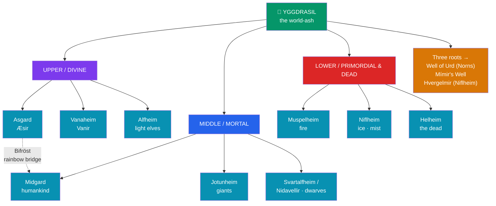

# 🌳 Yggdrasil and the Nine Realms

> [!abstract] TL;DR
> **Yggdrasil** is the immense **world-ash** whose trunk and roots bind the Norse cosmos into a single living structure. Distributed through and around it are the **Nine Realms** — **Asgard** (home of the Æsir), **Vanaheim** (the Vanir), **Alfheim** (light elves), **Midgard** (humankind), **Jotunheim** (giants), **Svartalfheim/Nidavellir** (dwarves), **Muspelheim** (primordial fire), **Niflheim** (primordial ice and mist), and **Helheim** (the dead). Beneath the tree lies the **Well of Urd**, where the three **Norns** — **Urd** ("what became"), **Verdandi** ("what is becoming"), and **Skuld** ("what shall be") — carve fate and tend the roots. The gods reach the mortal world across **Bifröst**, the trembling rainbow bridge. This cosmology is not systematic scripture but a reconstruction from two Icelandic sources — the anonymous verse **Poetic Edda** (esp. *Völuspá* and *Grímnismál*) and Snorri Sturluson's prose handbook, the **Prose Edda** (c. 1220).

## Intuition — analogy first

Think of Yggdrasil less as a map and more as the **trunk of a nervous system** — a single organism whose branches, roots, and inhabitants are all wired together, so that an injury at the roots is felt in the crown.

A modern reader wants the Nine Realms laid out like a floor-plan: Asgard on level 3, Hel in the basement. But the Eddic sources refuse to cooperate. The realms are described relationally — this world is "up," that one "down and north," another "across the sea" — and the numbers and names never fully reconcile between poems. The tree is the **connective tissue** that makes those inconsistencies liveable: everything hangs together *on Yggdrasil* even when it cannot be drawn on a grid. Like the branching diagrams of a family tree or a river system, the point is the **pattern of relations**, not the surveyed coordinates. Reading Norse cosmology is therefore an exercise in the [[The_Comparative_Method|comparative]] and literary caution of treating a poetic image, not a cadastral survey, as our primary evidence.

---

## How the Cosmos Hangs Together

## Key Concepts

### Yggdrasil, the world-ash

**Yggdrasil** is described in *Grímnismál* and Snorri's *Gylfaginning* as an evergreen **ash** (*askr*) whose limbs spread over the whole world and reach above heaven. Its name is usually read as "**Odin's horse**" (*Yggr*, "the Terrible One," a name of Odin, + *drasill*, "steed") — a grim kenning for the **gallows**, because Odin hanged himself upon the tree to win the runes (see [[Odin_Thor_and_Loki]]). The tree is perpetually suffering: a **stag** and goats browse its leaves, the dragon **Níðhöggr** gnaws its roots from below, and the squirrel **Ratatoskr** runs up and down carrying insults between the dragon and an **eagle** perched at the top. The Norns must daily water the tree from the Well of Urd to keep its decay from winning — an image of a cosmos held together only by constant tending against entropy.

### The three roots and the wells

The Eddas give Yggdrasil **three roots**, each reaching a different domain and a different **well or spring**:

| Root reaches | Well / spring | Significance |
|---|---|---|
| The Æsir (heaven) | **Well of Urd** (*Urðarbrunnr*) | Seat of the Norns; the gods hold court here daily |
| The frost-giants | **Mímir's Well** (*Mímisbrunnr*) | Well of wisdom; Odin sacrificed an eye to drink from it |
| Niflheim | **Hvergelmir** | Roaring spring, source of many rivers; Níðhöggr gnaws this root |

(Snorri's own account is slightly inconsistent about which root goes where — a reminder that the "system" is a scholar's synthesis of divergent poems.)

### The Nine Realms

Old Norse sources repeatedly invoke "**nine worlds**" (*níu heimar*, *Völuspá* 2), but never give one clean canonical list; the standard set below is a later harmonization:

| Realm | Inhabitants | Note |
|---|---|---|
| **Asgard** | the Æsir | Odin's stronghold, containing Valhalla |
| **Vanaheim** | the Vanir | home of the fertility gods |
| **Alfheim** | light elves (*ljósálfar*) | given to Freyr |
| **Midgard** | humankind | the "middle enclosure," ringed by the world-sea |
| **Jotunheim** | giants (*jötnar*) | Utgard, the realm of chaos beyond the fence |
| **Svartalfheim / Nidavellir** | dark elves / dwarves | the underground smiths |
| **Muspelheim** | fire-giants (Surt) | primordial heat in the south |
| **Niflheim** | ice and mist | primordial cold in the north |
| **Helheim** | the dishonoured dead | ruled by the goddess **Hel** |

The two **primordial** realms, fiery **Muspelheim** and icy **Niflheim**, precede the gods entirely; their meeting in the void generates creation itself (see [[Creation_and_Ragnarok]]).

### The Norns and the Well of Urd

At the Well of Urd sit the three **Norns**, the Norse embodiments of **fate**: **Urd** (Old Norse *Urðr*, "fate / what has become"), **Verdandi** (*Verðandi*, "becoming / present"), and **Skuld** (*Skuld*, "debt / what shall be / obligation"). Their names read as a rough temporal triad — past, present, future — though *Skuld* also carries the sense of *debt owed*, binding fate to obligation rather than mere chronology. They "**lay down laws**" and "**choose lives**" for the children of men (*Völuspá* 20). Their supremacy over even the gods is central to the Norse worldview: Odin himself will die at Ragnarök because fate is set. They invite comparison with the Greek **Moirai** and Roman **Parcae**, a shared Indo-European image of spinning/weaving fate.

### Bifröst, the rainbow bridge

**Bifröst** (also *Bilröst*) is the burning **rainbow bridge** linking Asgard to Midgard, guarded by the watchman god **Heimdall**, who will sound the horn **Gjallarhorn** at Ragnarök. Snorri explains the red band of the rainbow as fire that keeps the frost-giants from storming heaven. At the end of the world, the bridge **shatters** under the weight of the fire-giants riding to the final battle — its very fragility (the name may mean "the trembling / fleetingly-glimpsed way") foreshadowing the cosmos's doom.

## Primary Sources & Examples

- **Völuspá** ("The Prophecy of the Seeress," *Poetic Edda*) — the völva recalls the "nine worlds" and the world-tree of the beginning, then prophesies its shaking at Ragnarök; our single most important cosmological poem.
- **Grímnismál** ("The Lay of Grímnir," *Poetic Edda*) — Odin in disguise recites the cosmology: Yggdrasil's roots, the creatures gnawing it, the halls of the gods.
- **Gylfaginning** ("The Beguiling of Gylfi," *Prose Edda*) — Snorri's systematic narration, framed as King Gylfi questioning three enthroned figures; the source of most "tidy" summaries, including the wells and Bifröst.
- **Comparative note**: the axis-mundi world-tree recurs widely — the Saxon **Irminsul** pillar, Siberian shamanic world-trees, and Vedic imagery — a candidate for both Indo-European inheritance and independent invention; see [[The_Comparative_Method]].

## Common Pitfalls / Misconceptions

- **Treating the Nine Realms as a fixed, mappable list.** No single medieval source enumerates all nine with these exact names; the canonical roster is a modern synthesis, popularized further by comics and film. The sources emphasize *relations*, not coordinates.
- **Imagining a neat vertical stack (heaven-earth-hell).** The realms mix vertical and horizontal geography — Jotunheim lies "across" as much as "below," and Snorri's own root-assignments conflict. The tree is a poetic organizing image, not an engineered diagram.
- **Confusing Hel (place and goddess) with the Christian Hell.** **Helheim** is the destination of those who die of sickness or age, not primarily a place of punishment; the phonetic resemblance to "Hell" is real (shared Germanic root) but the theology is different.
- **Reading Yggdrasil as merely decorative.** The tree's suffering — gnawed, browsed, rotting, watered daily — encodes the core Norse theme: the cosmos is contingent, decaying, and headed for [[Creation_and_Ragnarok|Ragnarök]].

## Related Concepts

- [[_MOC_Norse_Myth|↑ Section MOC]] — the map of Norse & Germanic mythology
- [[Creation_and_Ragnarok]] — how Muspelheim and Niflheim generate the world, and how the tree survives the end
- [[The_Aesir_and_the_Vanir]] — the gods who dwell in Asgard and Vanaheim, two of the Nine Realms
- [[Odin_Thor_and_Loki]] — Odin's self-hanging on Yggdrasil and his sacrifice at Mímir's Well
- Cross-vault: [[The_Comparative_Method]] — the world-tree and fate-goddesses as Indo-European comparanda
- Cross-vault: [[Creation_and_Flood_Myths]] — cosmogonic structures across cultures

## Review Questions

1. Yggdrasil is described as constantly gnawed, browsed, and rotting, yet daily watered by the Norns. What does this tension express about the Norse conception of the cosmos, and how does it anticipate Ragnarök?
2. Explain why the "Nine Realms" should be treated as a scholarly reconstruction rather than a canonical list. Cite the way the Eddic sources actually describe the worlds.
3. Identify the three Norns and the meaning of their names, and explain why their power over fate extends even to the gods.

## Sources

- *The Poetic Edda* (esp. *Völuspá*, *Grímnismál*), trans. Carolyne Larrington (Oxford World's Classics, rev. 2014)
- Sturluson, Snorri. *The Prose Edda* (*Gylfaginning*), trans. Anthony Faulkes (Everyman, 1987)
- Lindow, John (2001). *Norse Mythology: A Guide to the Gods, Heroes, Rituals, and Beliefs*. Oxford University Press
- Simek, Rudolf (1993). *Dictionary of Northern Mythology*, trans. Angela Hall. D. S. Brewer

#mythology #norse-myth #cosmology #yggdrasil #eddas
