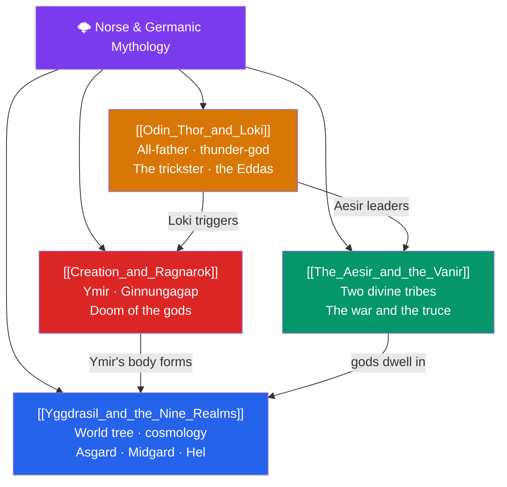

# 🌩️ Norse & Germanic Mythology — Map of Content

> [!abstract] What This Section Covers
> Norse mythology survives chiefly in two Icelandic sources — the *Poetic Edda* and Snorri Sturluson's *Prose Edda* — and portrays a cosmos that is grand, fatalistic, and doomed. This section begins with **Yggdrasil and the Nine Realms**, the world-tree cosmology binding Asgard, Midgard, and the other worlds; then **The Aesir and the Vanir**, the two divine tribes whose war and reconciliation structure the pantheon; **Creation and Ragnarök**, the cosmogony from Ymir's body and the primordial void Ginnungagap through to the prophesied twilight of the gods; and **Odin, Thor, and Loki**, the central figures — the wandering all-father who sacrifices for wisdom, the thunder-god defender of the realms, and the shape-shifting trickster whose mischief hastens the end. Together they present a mythology uniquely centered on fate, sacrifice, and the certainty of cosmic destruction and renewal.

## Concept Map

## Learning Path

1. [[Creation_and_Ragnarok]] — The frame of the cosmos: Ginnungagap, Ymir, the making of the world, and its foretold end.
2. [[Yggdrasil_and_the_Nine_Realms]] — The world-tree and the geography of the Nine Realms it holds together.
3. [[The_Aesir_and_the_Vanir]] — The two tribes of gods, the Aesir–Vanir war, and the hostages exchanged in peace.
4. [[Odin_Thor_and_Loki]] — The key deities and the trickster, drawn from the *Poetic* and *Prose Edda*.

## All Notes at a Glance

| Note | Difficulty | What You'll Learn |
|------|------------|-------------------|
| [[Yggdrasil_and_the_Nine_Realms]] | Beginner → Intermediate | The world ash, Asgard, Midgard, Jotunheim, Niflheim, Muspelheim, Hel; the Norns and Bifröst |
| [[The_Aesir_and_the_Vanir]] | Intermediate | Aesir (Odin, Thor, Tyr) vs Vanir (Njord, Freyr, Freyja), the war, Mimir and Kvasir, the truce |
| [[Creation_and_Ragnarok]] | Intermediate | Ginnungagap, Ymir, Audhumla, Ask and Embla, Fenrir, the Midgard Serpent, the death and rebirth of the world |
| [[Odin_Thor_and_Loki]] | Intermediate | Odin's sacrifice for the runes, Mjölnir and Thor, Loki's shape-shifting, the sources in the Eddas |

## Key Questions This Section Answers

- How does Yggdrasil organize the entire Norse cosmos into Nine Realms?
- What was the Aesir–Vanir war, and how did the two tribes become one pantheon?
- Why is Norse mythology so preoccupied with a predetermined doom (Ragnarök)?
- What did Odin sacrifice, and why, in his pursuit of wisdom?
- Is Loki a god, a giant, or something in between — and why does he end up leading the forces of destruction?

## Related Sections

- [[_MOC_Mythology_Master|↑ Mythology Master MOC]]
- [[_MOC_Roman_Myth|← Roman]]
- [[_MOC_Celtic_Myth|→ Celtic]]
- Cross-vault: [[Creation_and_Flood_Myths]], [[The_Comparative_Method]] (Dumézil analyzed the Aesir/Vanir divide)

#MOC #Mythology #NorseMyth
